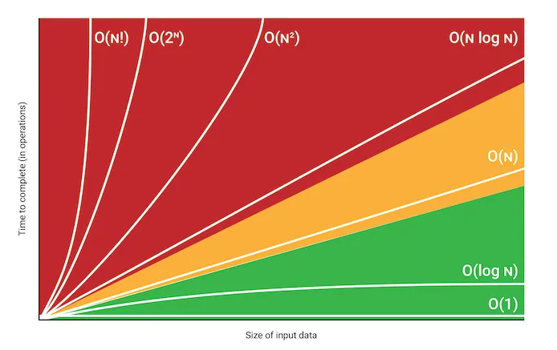

# Time Complexity

Time complexity is the amount of time taken by an algorithm as a function of the input size (n). It helps us understand how the runtime of an algorithm grows as the input size increases.

### Asymptotic Analysis

- Time complexity is the number of operations as a function of inputs.
- It focuses on the growth rate of the algorithm's runtime as the input size increases.



### Big O Notation

Big O Notation gives the worst-case complexity of an algorithm. It describes the upper bound of the growth rate of the algorithm's runtime.

### Time Limit Considerations

- A time limit of 1 second typically allows for about 10^8 operations on modern machines.
- This can vary based on the specific system and programming language used.

### Common Time Complexities

1. **O(1) - Constant Time**

   - Example: `console.log("Hello World")`
   - Operations that always take the same amount of time, regardless of input size.

2. **O(n) - Linear Time**
   - Example:
     ```javascript
     for (i = 1; i <= n; i++) {
       statement1;
       statement2;
     }
     ```
3. **O(n + m) - Linear Time**

   ```javascript
   let n = arr1.length;
   let m = arr2.length;

   for (let i = 0; i < n; i++) {
     statement1;
   }
   for (let i = 0; i < m; i++) {
     statement2;
   }
   ```

4. **O(log n) - Logarithmic Time**

   - Example:(log₂(n))

   ```javascript
   for (i = 1; i <= n; i *= 2) {
     statement1;
     statement2;
   }
   ```

   - Example:logₖ(n)

   ```javascript
   for (i = 1; i <= n; i *= k) {
     statement1;
     statement2;
   }
   ```

   - Example: Common in binary search or balanced binary search trees (BST)

5. **O(n log n) - Time**

   - Example:
     -Merge Sort
     -Quick Sort

   ```javascript
   function mergeSort(arr,begin,end) {
     if (arr.length <= 1) return arr;

     if(begin>=end) return;
   let mid=begin+(end-begin)/2;
   let mergeSort(arr,begin,mid)
   mergeSort(arr,mid+1,end)
   merge(arr,begin,mid,end)
   }
   ```

- Example: Common in binary search or balanced binary search trees (BST)

6. **O(n^2) - Quadratic Time**

- Example:

  ```javascript
  let count = 0;
  for (let i = N; i > 0; i /= 2) {
    for (let j = 0; j < i; j++) {
      statement1;
    }
  }
  ```

7. **O(n^3) - Cubic Time**

   ```javascript
   for (let i = 0; i < n; i++) {
     for (let j = 0; j < n; j++) {
       for (let k = 0; k < n; k++) {
         statement1;
       }
     }
   }
   ```

8. **O(2^n) - Exponential Time**

   ```javascript
   function fibonacci(n) {
     if (n <= 1) return n;
     return fibonacci(n - 1) + fibonacci(n - 2);
   }
   ```

9. **O(n!)**
   -Example

### Simplifying Time Complexity

When analyzing time complexity:

1. Ignore constants
2. Consider only the largest term

For example, if `f(n) = 2n^2 + 5n + 9`, the time complexity is O(n^2).

### Constraints and Acceptable Time Complexities

Based on common constraints in competitive programming:

- n > 10^8: O(log n) is acceptable
- n ≤ 10^8: O(n) is acceptable
- n ≤ 10^6: O(n log n) is acceptable
- n ≤ 10^4: O(n^2) is acceptable
- n ≤ 500: O(n^3) is acceptable

### **Push vs Unshift**

- `push()` is better than `unshift()` in JavaScript in terms of time complexity.

```js
let arr = [1, 2, 3, 4, 5];
arr.push(6); // [1, 2, 3, 4, 5, 6] - No shifting needed (O(1))
arr.unshift(0); // [0, 1, 2, 3, 4, 5, 6] - All elements must shift right (O(n))
```

### **`includes()` vs `Set.has()`**

- `array.includes(value)` on a large array is inefficient because its time complexity is **O(n)** in the worst case.
- `array.includes(value)` checks each element one by one until it finds a match or reaches the end.
- **Alternative:** Use a `Set`, which has **O(1)** average time complexity.

```js
const bigArray = [1, 2, 3, 4, 5, 6, ...];
const bigSet = new Set(bigArray);
console.time("set");
console.log(bigSet.has(1)); // O(1) lookup
console.timeEnd("set");
```

### **Object Operations**

| **Operation**                                    | **Time Complexity** | **Explanation**                               |
| ------------------------------------------------ | ------------------- | --------------------------------------------- |
| **Insertion (`obj[key] = value`)**               | **O(1)**            | Hashing provides constant-time insertion.     |
| **Access (`obj[key]`)**                          | **O(1)**            | Direct key lookup using a hash table.         |
| **Deletion (`delete obj[key]`)**                 | **O(1)**            | Removes the key-value pair efficiently.       |
| **Searching for a key (`key in obj`)**           | **O(1)**            | Direct lookup using hashing.                  |
| **Iterating (`for...in` or `Object.keys(obj)`)** | **O(n)**            | Must check all keys, so it takes linear time. |

### **General Recommendations**

- Use **`push()`** instead of `unshift()` to avoid shifting elements.
- Use **`Set.has()`** instead of `array.includes()` for faster lookups.
- Use **objects `{}`** for key-value storage, but prefer **`Map`** for large datasets and non-string keys.
