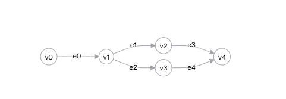
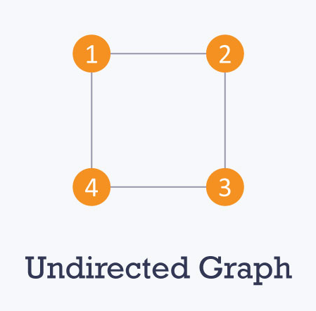
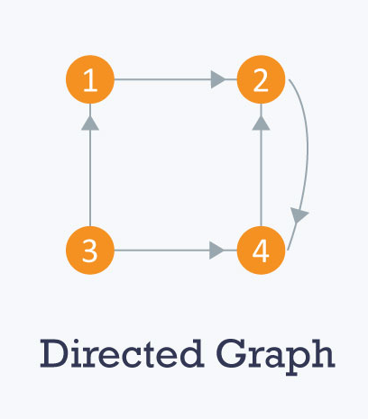
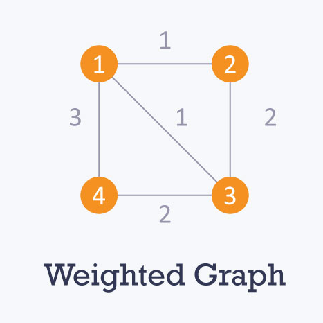
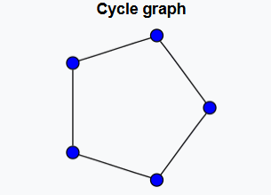
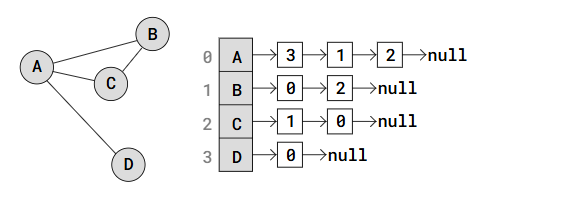
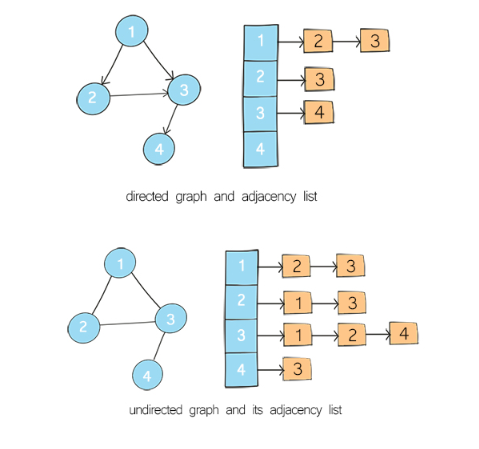

# Graph

A graph is a non-linear data structure consisting of vertices (nodes) and edges (connections). It is commonly used to represent networks like social connections, maps, and web pages.<br>

 <br>

### Tree vs Graph

| **Characteristics** | **Tree**                                          | **Graph**                          |
| ------------------- | ------------------------------------------------- | ---------------------------------- |
| **Definition**      | A set of nodes and edges with a unique root node. | A set of vertices/nodes and edges. |
| **Root Node**       | Has a unique root node.                           | No unique root node.               |
| **Cycles**          | Cannot form cycles.                               | Can form cycles.                   |

### Types of Graphs<br>

1. `undirected graph`<br>
    <br>
   The edges have no direction.
   a-b<br>
2. `directed Graph` (digraph):<br>
    <br>
   The edges have a direction.
   a->b<br>
3. `weighted graph`<br>
    <br>
   The edges have weights (costs)
   4
   a->b<br>
4. `cyclic graph`<br>
    <br>
   A graph that contains at least one cycle.
   a->b->c->d->a<br>
5. `acyclic Graph`:
   A graph with no cycles.
   a → b → c → d.<br>
6. `connected Graph`
   every vertex is reachable from any other vertex.<br>
7. `disconnected Graph`
   some vertices are not reachable from others

### graph properties

    - degree of graph: The degree of a vertex is the number of edges connected to it.
    - indegree:Number of edges coming into a vertex (only for directed graphs)
    - outdegree:Number of edges going out from a vertex (only for directed graphs)

### Graph and its representations

    ```
    function addEdge(adj, i, j) {
        adj[i][j] = 1;
        adj[j][i] = 1; //undirected
    }

    function displayMatrix(adj) {
        for (let i = 0; i < adj.length; i++) {
            let row = `${i}: `;
            for (let j = 0; j < adj[i].length; j++) {
                row += `${adj[i][j]} `;
            }
            console.log(row);
        }
    }

    const V = 4;//number of vertices
    const adj = Array.from({ length: V }, () => Array(V).fill(0));// Initialize the adjacency matrix (4x4, filled with 0)

    // Add edges between vertices
    addEdge(adj, 0, 1);
    addEdge(adj, 0, 2);
    addEdge(adj, 1, 2);
    addEdge(adj, 2, 3);

    displayMatrix(adj);
    ```

### Graph Representation<br>

#### adjacency list:<br>

 <br>
Each node stores a list of its adjacent nodes.its kind a list of lists
Space Complexity: O(V + E),V=total list of vertex and E=number of edges(1,2,3)
1 → [2, 3]<br>
2 → [1, 3]<br>
3 → [1, 2,4]<br>
4 → [3]<br>
adjacency-list


### adjacency matrix(n\*n):<br>

 <br>
here 1 connected with 2 and 2 connected with 3 and 3 to 1
A matrix where a[i][j] = 1 if there is an edge between i and j, otherwise 0
Space Complexity: O(n²).

> here row represent a node and column represent neighbor

|     | 1   | 2   | 3   |
| --- | --- | --- | --- |
| 1   | 0   | 1   | 1   |
| 2   | 1   | 0   | 1   |
| 3   | 1   | 1   | 0   |

### graph traversal

1. **Breadth-First Search (BFS)**
   Uses: Finds the shortest path in an unweighted graph.
   Implementation: Uses a queue (FIFO).
   Steps:
   Start from a node and mark it as visited.
   Visit all its neighbors before going deeper.
   Continue until all nodes are visited.

   ```
   bfsOfGraph(adj) {
        const V = adj.length;               // Number of vertices
        let visited = new Array(V).fill(false); //boolean array to avoid infinite loop
        let res = [];                       // Result array to store BFS traversal
        let q = [];                         // Queue for BFS

        let s = 0; // Start BFS from vertex 0
        visited[s] = true; //mark visited as true
        q.push(s);

        while (q.length > 0) {
            let t = q.shift(); // remove front element from the queue
            res.push(t);       // Add it to the result array

            // Traverse all adjacent vertices of dequeued vertex
            for (let neighbor of adj[t]) {
                if (!visited[neighbor]) { // If not visited, mark visited and enqueue
                    visited[neighbor] = true;
                    q.push(neighbor);
                }
            }
        }

        return res; // Return the BFS traversal result
    }
   ```

2. **Depth-First Search (DFS)**
   Uses: Detects cycles, finds connected components.
   Implementation: Uses a stack (LIFO) or recursion.
   Steps:
   Start from a node and mark it as visited.
   Visit the first unvisited neighbor recursively.
   Backtrack if no unvisited neighbor is found.

   ```
   function dfs(node, callback) {
    if (!node) return; // Base case: If the node is null, return
    callback(node); // Process the current node
    node.children.forEach(child => dfs(child, callback)); // Recursively visit children
   }
   ```

   ```

   function dfs(graph, start, visited = {}) {
   //start is current node,we are use visited node for keep track that graph is not becoming cycle
   //Create a visited object to track visited nodes.If the node is already visited, return
   if (visited[start]) return;
   //else mark it as visited and print it.
   visited[start] = true;
   console.log(start);
   //Recursively visit neighbors,until all neighbor visited backtrack
   for (let neighbor of graph[start]) {
   dfs(graph, neighbor, visited); //visiting neighbor
   }
   }

   const graph = {
   '0': ['1', '2'],
   '1': ['0', '3', '4'],
   '2': ['0'],
   '3': ['1'],
   '4': ['2', '3']
   };

   dfs(graph, '0');

   ```

### spanning tree

in a spaning tree in a graph all the vertices are same as given graph but number of vertices is 1 edge less
spaning tree can not have a cycle and does not disconnected
adding one edge to the spanning tree will create a loop
every connected and undirected graph has atleast one spaning tree

### minimum spanning tree

A Minimum Spanning Tree (MST) is a spanning tree where the sum of edge weights is minimized.<br>

```
  spanningTree(V, adj) {
        // Array to store the minimum weight to include each vertex in the MST
        const key = new Array(V).fill(Infinity);

        // Array to keep track of vertices included in the MST
        const inMST = new Array(V).fill(false);

        // Initialize the first vertex's key to 0 so that it is picked first
        key[0] = 0;

        // Variable to store the total weight of the MST
        let totalWeight = 0;

        // Iterate V times to include all vertices in the MST
        for (let count = 0; count < V; count++) {
            // Pick the minimum key vertex from the set of vertices not yet included in
            // MST
            let u = this.minKey(V, key, inMST);

            // Include the picked vertex in the MST
            inMST[u] = true;

            // Add its key value to the total weight
            totalWeight += key[u];

            // Update the key values of adjacent vertices of the picked vertex
            for (let edge of adj[u]) {
                const [v, weight] = edge;

                // If v is not in MST and weight of (u,v) is smaller than current key of
                // v
                if (!inMST[v] && weight < key[v]) {
                    key[v] = weight;
                }
            }
        }

        return totalWeight;
    }


    minKey(V, key, inMST) {
        let min = Infinity;
        let minIndex = -1;

        for (let v = 0; v < V; v++) {
            if (!inMST[v] && key[v] < min) {
                min = key[v];
                minIndex = v;
            }
        }

        return minIndex;
    }

```

1. Prim's Algorithm (Greedy Approach)
   Start from any node.
   Pick the smallest weighted edge that connects to an unvisited node.
   Repeat until all nodes are connected.
2. Kruskal's Algorithm (Greedy + Sorting)
   Sort all edges by weight.
   Pick the smallest edge that doesn’t create a cycle.
   Repeat until all nodes are connected.

detect cycle in directed graph
Approach: Use DFS with a visited array.
start every node indicate as -1 it mean unvisited
0 means visited and in a stack
1 means visited and pop out from stack,completely processed

detect cycle in undirected graph
Approach: Use DFS with parent tracking.

### Topological sort

Used for: Ordering tasks with dependencies (e.g., course scheduling).
graph should be directed and acyclic graph,if its there then we have atleast one topological ordering
find in-degree of the graph and start with node having 0 in-degree,remove edges and update in-degree,update untill node are processed

```
class Solution {
   topo(adj, u, visited, s) {
      // marking the current vertex as visited.
      visited[u] = true;

      // traversing over the adjacent vertices.
      for (let i = 0; i < adj[u].length; i++) {
            let v = adj[u][i];

            // if any vertex is not visited, we call the function recursively.
            if (!visited[v]) this.topo(adj, v, visited, s);
      }
      // pushing the current vertex into the stack.
      s.push(u);
   }

   // Function to return list containing vertices in Topological order.
   topologicalSort(adj) {
      let V = adj.length;
      // using boolean array to mark visited nodes and currently
      // marking all the nodes as false.
      let visited = new Array(V + 1);
      visited.fill(false);

      let s = new Array();

      // traversing over all the vertices.
      for (let i = 0; i < V; i++) {
            // if the current vertex is not visited, we call the topo function.
            if (!visited[i]) this.topo(adj, i, visited, s);
      }

      let res = new Array();
      let i = -1;
      while (s.length != 0) {
            // pushing elements of stack in list and popping them from stack.
            res.push(s[s.length - 1]);
            s.pop();
      }
      // returning the list.
      return res;
   }
}

```

### Find the shortest path (Dijkstra's Algorithm)

Used for: Finding the shortest path in a graph with non-negative weights.
Set all distances to infinity, except the start node (0)
Use a priority queue to pick the smallest distance node.
Update the distances of its neighbors.
Repeat until all nodes are processed.

Find the shortest path (Bellman Ford algo):
dijkstra algo can not work having negative weight so Bellman ford algo works
Used for: Graphs with negative weights.
Initialize all distances to infinity.
Relax all edges V-1 times
If any distance updates in the V-th iteration, a negative cycle exists.
