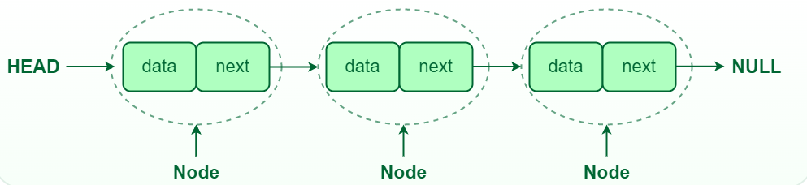
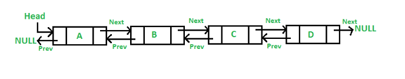
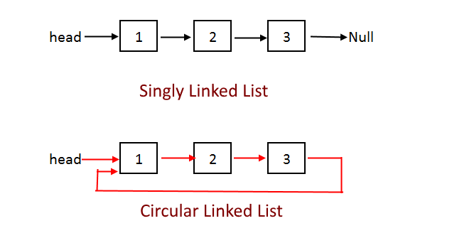

# Linked List

A linked list is a linear data structure where each element (called a node) contains two main parts:
each element (node) contains:

Data (value)
Address/Pointer (next node reference)


`Data`: The value or information stored in the node.<br>
`Next` (in Singly Linked List) or Next and Prev (in Doubly Linked List): Pointers to the next node in the sequence (and previous node for doubly linked list).<br>

### list vs linked list

A list is a linear collection of elements stored in contiguous memory locations (e.g. an array).

A linked list is a linear data structure where elements (nodes) are connected via pointers, allowing dynamic memory allocation

### ArrayList vs LinkedList

| ArrayList                                                           | LinkedList                                                             |
| ------------------------------------------------------------------- | ---------------------------------------------------------------------- |
| ArrayList internally uses a dynamic array to store the elements.    | LinkedList internally uses a doubly linked list to store the elements. |
| Manipulation with ArrayList is slow.                                | Manipulation with LinkedList is faster.                                |
| ArrayList is better for storing and accessing data.                 | LinkedList is better for manipulating data.                            |
| The memory location for the elements of an ArrayList is contiguous. | The location for the elements of a LinkedList is not contiguous.       |

### Limitations of Arrays

#### Fixed Size:

The size of an array is fixed at the time of its creation.

#### Contiguous Memory Allocation:

Arrays store elements in contiguous memory locations, leading to inefficient insertions and deletions (since shifting elements is required).

#### Time Complexity:

Insert and delete operations are costly in terms of time complexity. Insertion or deletion at the beginning or in the middle of the array takes O(n) time.

#### Memory Wastage:

Arrays may also waste memory if allocated space is more than needed, or they may require resizing when they became full.

### Advantages of Linked Lists

Dynamic Size: Linked lists don’t have a fixed size, and memory is allocated dynamically as elements are added.
Efficient Insertions/Deletions: Insertions and deletions can be performed more efficiently in linked lists, especially at the beginning or middle of the list (without needing to shift other elements).

# Singly Linked List

In a singly linked list, each node contains:

`Data`: The value of the node.
`Next`: A pointer to the next node in the list (null for the last node).

<br>


### Null Pointer Dereference in Linked List

A null pointer dereference in a linked list in JavaScript happens when you try to access a property on null or undefined:

```javascript
let current = head;
while (current !== null) {
  current = current.next;
}
console.log(current.data); // Throws error
```

# Doubly Linked List

In a doubly linked list, each node contains:

`Data`: The value of the node.<br>
`Next`: A pointer to the next node.<br>
`Prev`: A pointer to the previous node.<br>

<br>

```
class Node {
    constructor(data) {
        this.data = data;
        this.next = null;
        this.prev = null;
    }
}

```

# Circular Linked list

A circular linked list is a special type of linked list where all the nodes are connected to form a circle. Unlike a regular linked list, which ends with a node pointing to NULL, the last node in a circular linked list points back to the first node<br>
<br>

```js
class Node {
  constructor(data) {
    this.data = data;
    this.next = null;
  }
}
```
