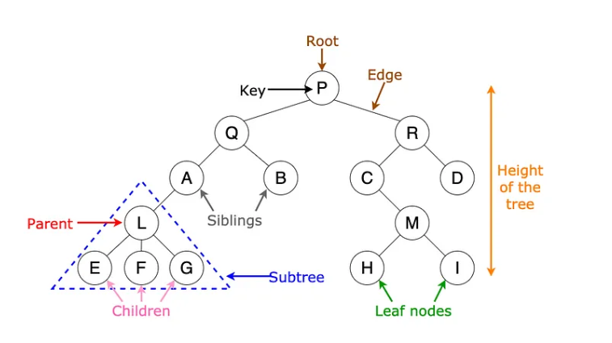
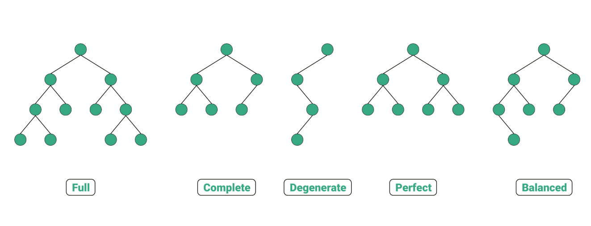
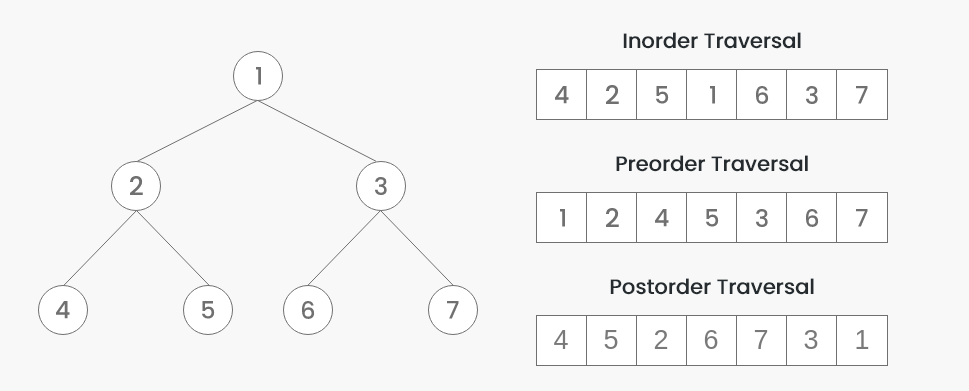
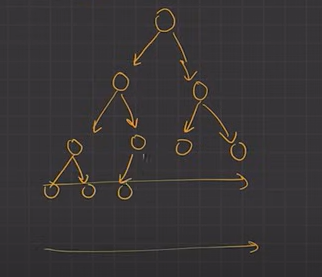
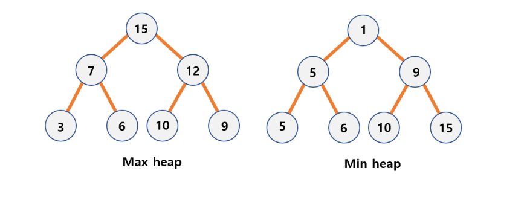
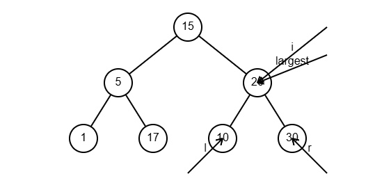

# Tree

 A tree is a non-linear hierarchical data structure consisting of nodes linked together to simulate a hierarchy.<br>
 <br>

> If a tree has N nodes, there are exactly N-1 edges.<br>

### Tree Terminology:<br>

#### Root node:

The topmost node in a tree.<br>

#### Parent node:

The immediate predecessor of a node.<br>

#### Child node:

The immediate successor of a node.<br>

#### Leaf node:

A node that has no child.<br>

#### Non-leaf node:

A node that has at least one child.<br>

#### Sibling:

Nodes that share the same parent.<br>

#### Degree of a node:

The number of children a node has.<br>

#### Depth of a node:

The length of the path from the root to the node.<br>

#### Height of a node:

The number of edges on the longest path from the node to a leaf.<br>

#### Path:

A collection of edges from the source node to the destination node.<br>

#### Subtree:

A portion of a tree consisting of a node and its descendants. A tree can have left and right subtrees.<br>

#### Diameter:

The longest path between any two nodes in the tree, measured in the number of edges.<br>

#### Right view:

Nodes visible when the tree is viewed from the right.<br>

#### Top view:

Nodes visible when the tree is viewed from the top.<br>

### Applications of Trees:<br>

 - Expression evaluation.
 - Directory structure management.
 - Database indexing.

### Binary Tree:<br>

 A binary tree is a tree where each node has at most two children, referred to as the left child and the right child.
 <br>

#### Types:<br>

##### 1. Strict binary tree:

A binary tree where each node has either 0 or 2 children.<br>

##### 2. Complete binary tree:

All levels except possibly the last are completely filled, and the last level has nodes as left as possible.<br>

##### 3. Perfect binary tree:

A binary tree where all internal nodes have two children, and all leaf nodes are on the same level.<br>

##### 4.Full binary tree: 
Every node other than the leaves has two children.<br>

##### 5. Balanced binary tree:

The height difference between the left and right subtrees of every node is at most 1.<br>

 Binary Tree Node Structure in JavaScript:

```
class TreeNode {
constructor(data) {
this.data = data;
this.left = null;
this.right = null;
}
}

let root = new TreeNode(1);
root.left = new TreeNode(2);
root.right = new TreeNode(3);
root.left.left = new TreeNode(4);
root.left.right = new TreeNode(5);

function insert(data) {
root = insertRec(root, data);
}

function insertRec(root, data) {
if (root === null) {
return new TreeNode(data);
}
if (data < root.data) {
root.left = insertRec(root.left, data);
} else if (data > root.data) {
root.right = insertRec(root.right, data);
}
// If data is equal to root.data, we don't insert (assuming no duplicates)
return root;
}
```

`Preorder Traversal`: Root -> Left -> Right (Output: 1, 2, 4, 5, 3)

```
function preorder(root) {
    if (!root) return;
    console.log(root.data);
    preorder(root.left);
    preorder(root.right);
}
```

 `Inorder Traversal`: Left -> Root -> Right (Output: 4, 2, 5, 1, 3)

```
function inorder(root) {
    if (!root) return;
    inorder(root.left);
    console.log(root.data);
    inorder(root.right);
}
```

 `Postorder Traversal`: Left -> Right -> Root (Output: 4, 5, 2, 3, 1)

```
function postorder(root) {
    if (!root) return;
    postorder(root.left);
    postorder(root.right);
    console.log(root.data);
}
```

 <br>

### Binary Search Tree (BST):

 A BST is a binary tree where:
 - The left subtree contains nodes with values less than the parent node.
 - The right subtree contains nodes with values greater than the parent node.

 AVL Tree or self balancing tree:
 A self-balancing binary search tree where the balance factor
 (height of left subtree - height of right subtree) must be in the range {-1, 0, 1}.

### Heap Tree:

A Heap is a complete binary tree(in arrays in between elements there should not be any gap) data structure that satisfies the heap property: for every node, the value of its children is greater than or equal to its own value. Heaps are usually used to implement priority queues<br>
 <br>
Note: The heap tree is a special balanced binary tree data structure where the root node is compared with its children and arrange accordingly.
```js
Note: Node always added from the left
if a Node is at index i,
its left child is at 2*i,
its right child is at 2*i+1,
its parent is at [i/2]
   A
  / \
 B   C
/ \ / \
D E F G
ABCDEFG
```

#### Min-Heap: 
The root node is the smallest element, and every parent is smaller than its children.<br>

#### Max-Heap: 
The root node is the largest element, and every parent is larger than its children.<br>

 <br>
***Insert Operation in Max Heap***
Add the element at the last free space in the heap (i.e., at the end of the array).
Heapify Up: Compare the inserted element with its parent. If the element is larger than its parent, swap them.
Repeat the process until the element is in the correct position to maintain the max-heap property (i.e., every parent node is greater than its children).
T.C in best-case O(1) and in normal O(logn)
 <br>

```
function maxHeapify(arr, i, n) {
    let l = 2 * i + 1; // left child
    let r = 2 * i + 2; // right child
    let largest = i; // assume the current index is the largest

    // If left child is greater than the current largest
    if (l < n && arr[l] > arr[largest]) {
        largest = l;
    }

    // If right child is greater than the current largest
    if (r < n && arr[r] > arr[largest]) {
        largest = r;
    }

    // If largest is not the current element, swap and heapify the affected subtree
    if (largest !== i) {
        // Swap elements
        [arr[i], arr[largest]] = [arr[largest], arr[i]];

        // Recursively heapify the affected subtree
        maxHeapify(arr, largest, n);
    }
}

```

### heap sort

create a max heap then delete all the elements from heap

```
function heapSort(arr) {
    let heapSize = arr.length;

    // Build the max heap
    buildMaxHeap(arr);

    // Perform the sorting
    for (let i = arr.length - 1; i >= 1; i--) {
        // Swap the first element (max) with the current element
        [arr[0], arr[i]] = [arr[i], arr[0]];

        // Reduce the heap size
        heapSize--;

        // Re-heapify the reduced heap
        maxHeapify(arr, 0, heapSize);
    }
}
```
