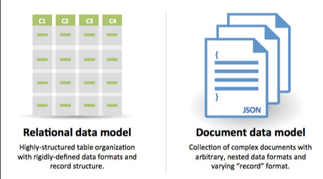
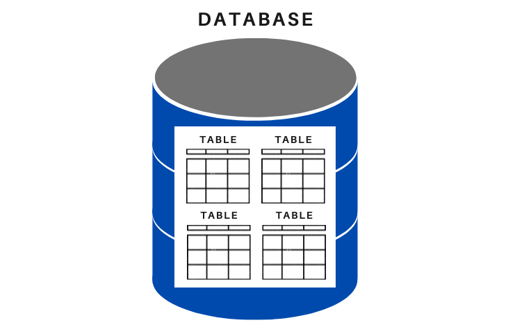
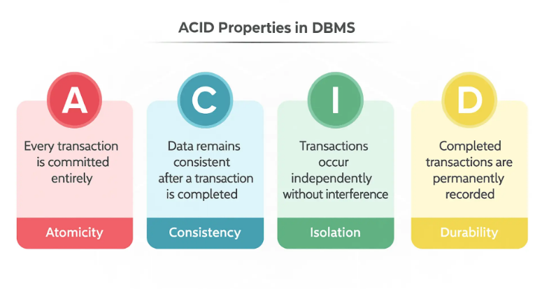
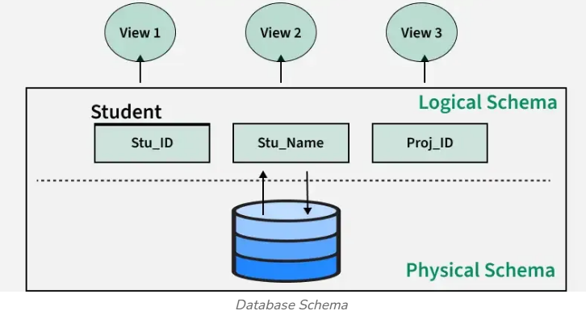
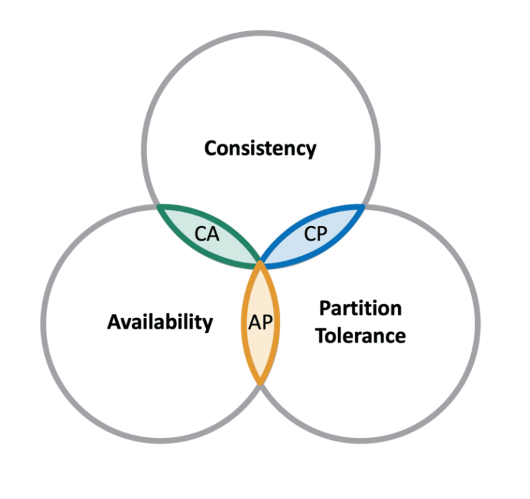
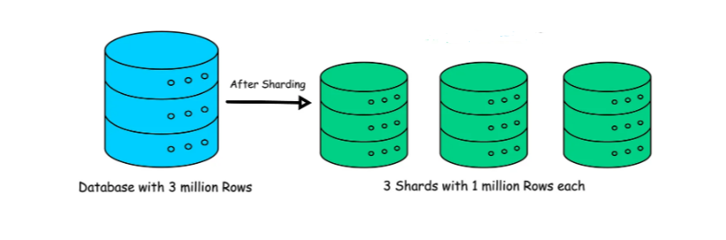
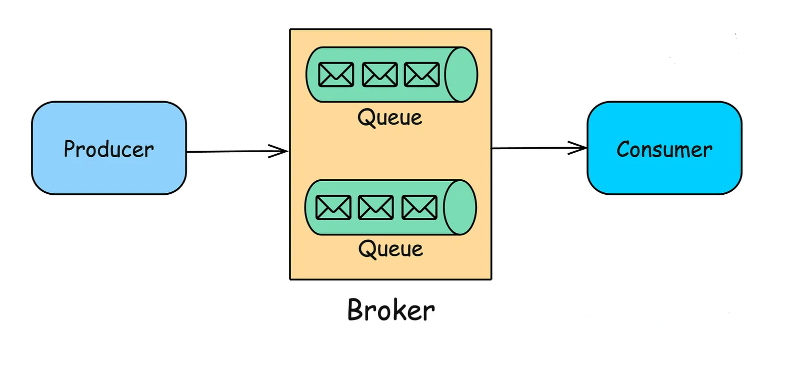
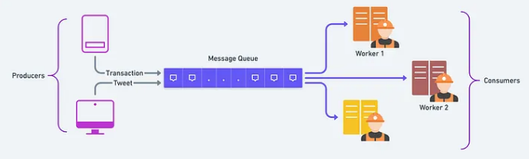
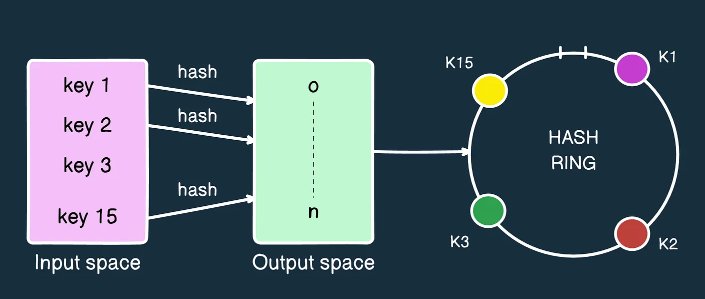

# ✅ Databases
Databases are the backbone of any system
## DBMS vs RDBMS
### DBMS (Database Management System)
- Manages data storage and retrieval
- May not enforce relationships
- Less strict rules

## RDBMS (Relational DBMS)
- Data stored in **tables with relations**
- Enforces schema and constraints
- Uses SQL
- Examples: MySQL, PostgreSQL, Oracle
## SQL vs NoSQL


| Feature      | SQL                   | NoSQL                  |
| ------------ | --------------------- | ---------------------- |
| Schema       | Fixed                 | Flexible               |
| Joins        | Yes                   | No (usually)           |
| Consistency  | Strong                | Eventual               |
| Scaling      | Vertical + Horizontal | Horizontal             |
| Transactions | Yes                   | Limited                |
| Use case     | Banking, Orders       | Feeds, Logs, Analytics |

## Reasons for SQL:

Structured data
Strict schema
Relational data
Need for complex joins
Transactions
Clear patterns for scaling
More established: developers, community, code, tools, etc
Lookups by index are very fast

## Reasons for NoSQL:

Semi-structured data
Dynamic or flexible schema
Non-relational data
No need for complex joins
Store many TB (or PB) of data
Very data intensive workload
Very high throughput for IOPS
## SQL:
SQL databases store data in structured tables with predefined schema and follow ACID properties.
it has Fixed schema (columns & types)
Relationships using joins
Strong consistency
Supports transactions
## Table: 


## NoSQL :
NoSQL databases store data in a flexible, schema‑less format and are designed for horizontal scalability.
it has Schema‑less or flexible schema
High scalability
Eventual consistency
No joins (usually)
```js
User Document
{
  "id": 1,
  "name": "Alex",
  "posts": [ ... ]
}
```

## ACID
`Atomicity` → All or nothing
`Consistency` → Data remains valid
`Isolation` → Transactions don’t interfere
`Durability` → Data persists after commit


## Joins
## Schema:
Schema defines the structure of data—tables, fields, and data types.
Types of Schema
Schema‑on‑write (SQL)
Data must match schema before writing
Schema‑on‑read (NoSQL)
Schema enforced at read time



## Index:
An index is a data structure that improves read performance by avoiding full scans.

Consistency Models
1. Strong Consistency:All reads return the most recent write immediately.
2. Eventual Consistency:System guarantees data will become consistent over time.

## CAP Theorem:
In a distributed system, you can guarantee only two of the following three at the same time:

Consistency: Every read receives the most recent write or an error
Availability: Every request receives a response, without guarantee that it contains the most recent version of the information
Partition Tolerance:The system continues to operate despite arbitrary partitioning due to network failures


## database partition/ sharding
Database sharding is the process of splitting a large database into smaller pieces (shards) and storing them across multiple machines.

Each shard contains a subset of data
Improves scalability and performance
Reduces load on a single database


## event sourcing
Event sourcing stores changes as a sequence of events instead of storing only the latest state.

State is rebuilt by replaying events

Events are immutable

Useful for auditing and history tracking

## messaging queue
A message queue enables asynchronous communication between services.
It serves as a buffer and distributed asynchronous request.
Producer sends message
Queue stores message
Consumer processes message later

Benefits

- Decouples services
- Improves reliability
- Handles traffic spikes


## distributed message queue
A distributed message queue runs across multiple servers for scalability and fault tolerance.

Messages replicated across nodes
High availability
Supports massive throughput
`Examples`
Kafka
AWS SQS


## Kafka
Apache Kafka is a distributed, high-throughput event streaming platform.
Messages stored in topics
Topics split into partitions
Consumers read messages sequentially
Retains messages for a configurable time

Best for

Event streaming

Log processing

Real-time analytics
## hashing & hash key
Hashing converts data into a fixed-size value using a hash function.

Used for fast lookup

Used for data distribution

Hash Key

A specific field used for hashing (e.g. userId)

Determines where data is stored
## hash server
A hash server is a node selected based on hashing logic.

Incoming request is hashed

Hash value maps to a specific server

Common in load balancing & caching
## consistent hashing
Consistent hashing minimizes data movement when servers are added or removed.

Servers placed on a hash ring

Keys map to nearest server clockwise

Only a small portion of data moves

Used in

Distributed caches

Load balancers