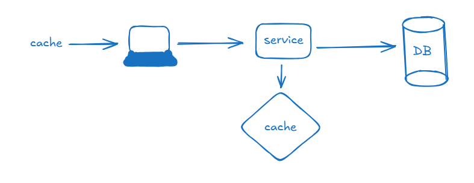
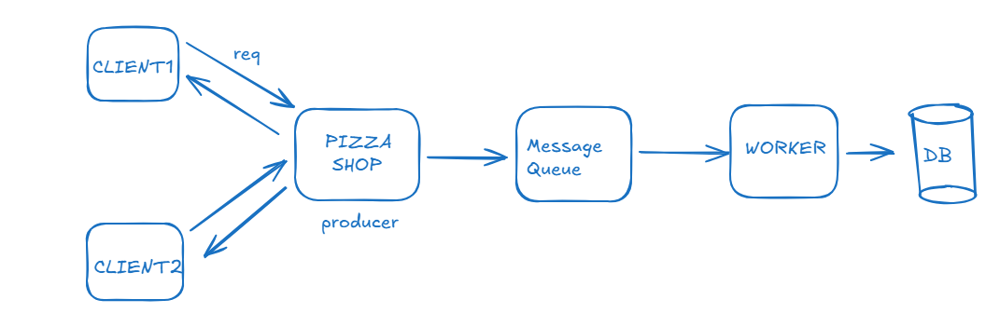
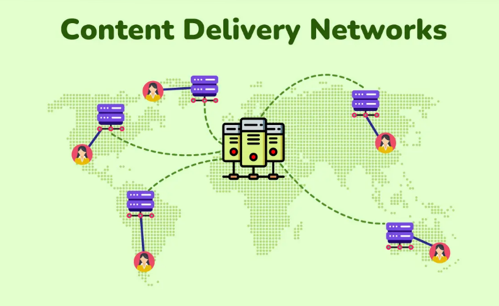
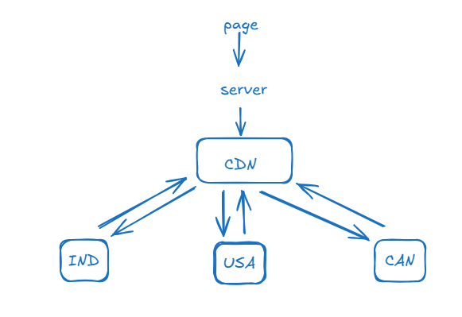

# ✅DIAGRAMS & BUILDING BLOCKS:

## UML (Unified Modeling Language):
UML is a standard way to visualize system design using diagrams.Used to:
Explain architecture
Communicate design
Convert requirements → code structure

## CLASS DIAGRAM :
Shows the static structure of the system:
```js
+ Public
- Private
# Protected
+------------------+
|     ClassName    |
+------------------+
| - attribute      |
| - attribute      |
+------------------+
| + method()       |
| + method()       |
+------------------+
```
Classes
Attributes
Methods
Relationships

## CLASS RELATIONSHIPS
Association:Basic relationship where one class uses or knows another.
User ------ Order
Aggregation:One class contains another, but both can exist independently.
Team ◇----- Player
Composition:Child class cannot exist without parent.
Order ◆----- OrderItem
Inheritance (IS‑A):One class inherits properties from another.
AdminUser
    ▲
    |
   User
Dependency :Class depends on another temporarily (method call).
OrderService ---> PaymentService

## SEQUENCE DIAGRAM:Shows interaction over time between objects.

## COMPONENT DIAGRAM:Shows high‑level system components and their dependencies.
## USE CASE DIAGRAM:Shows user actions and system capabilities.
User
  |
  |--> Login
  |--> Browse Product
  |--> Place Order
## List of Building Blocks
### 1️⃣ Client:
Client is the request initiator that interacts with the system.it sends request and receive response
### 2️⃣ Server / Backend Service:
Server processes client requests and returns responses. Exp:REST API,GraphQL server
### 3️⃣ API (Application Programming Interface):
API is a contract between client and server.
### 4️⃣ Load Balancer:
Distributes incoming traffic across multiple servers.used to prevent overload
### 5️⃣ Cache:
Cache stores frequently accessed data for faster retrieval.Types Browser cache,CDN cache,In‑memory cache (Redis)

### 6️⃣ Database:
Stores persistent system data.
### 7️⃣ Message Queue:
Message queue enables asynchronous communication between components.it improve readability

### 8️⃣ Event Bus / Stream:
Used for event‑driven communication across multiple consumers.
pic need
### 9️⃣ CDN (Content Delivery Network):
A content delivery network (CDN) is a globally distributed network of proxy servers, serving content from locations closer to the user. Generally, static files such as HTML/CSS/JS, photos, and videos are served from CDN, although some CDNs such as Amazon's CloudFront support dynamic content. The site's DNS resolution will tell clients which server to contact.
push vs pull CDN



### 🔟 Authentication Service:
Handles user identity verification.like JWT , OAuth ,session
### 1️⃣1️⃣ Authorization Layer:
Determines what a user can access.
### 1️⃣2️⃣ Configuration & Feature Flags:
Controls system behavior without redeployment.
### 1️⃣3️⃣ Monitoring & Logging:
Tracks system health and behavior. Metrics are Latency,Errors,Throughput
### 1️⃣4️⃣ Rate Limiter:
Limits number of requests per user or IP.

## how to instruct load balancer?

## worker and services

## how queue system work

## video processing and streaming