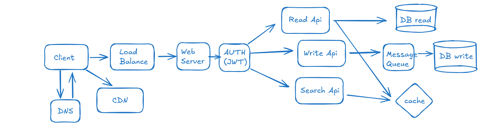
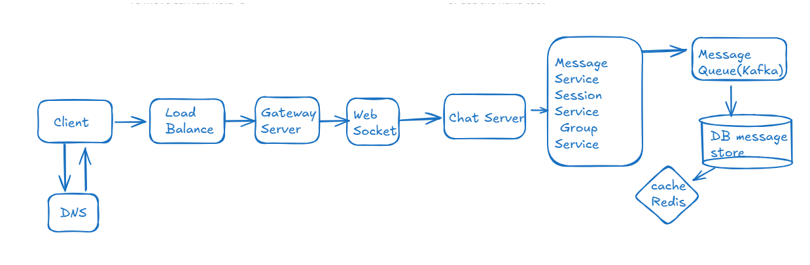

### Twitter/Facebook High level architecture

`Cache Strategy`
Cache-aside
Read API:
Check cache
If miss → DB → update cache
Cached data:
User feed
User profile

Tweet metadata
Write API writes to DB

Publishes event to queue

Background workers handle:
Feed updates
Notifications
Analytics

`Media Strategy`
Upload → Object Storage (S3)
Serve via CDN
DB stores only media URL

## WhatsApp/Slack  High level architecture

## Netflix/Youtube High level architecture
## Swiggy/Zomato High level architecture
## Zoom High level architecture

