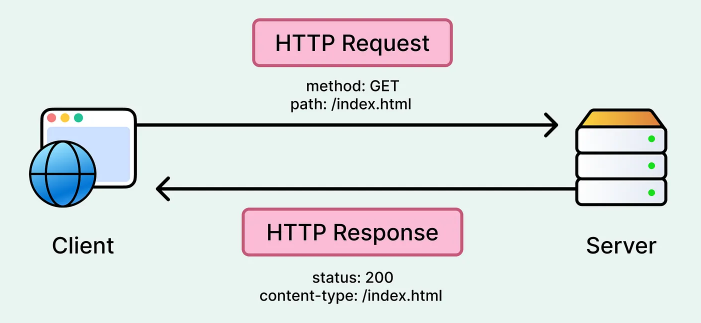
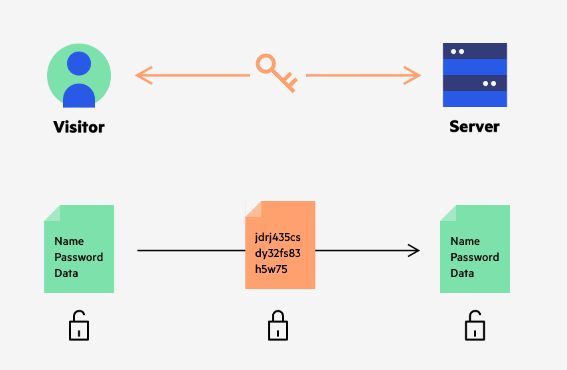
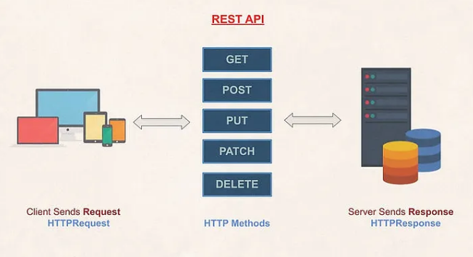
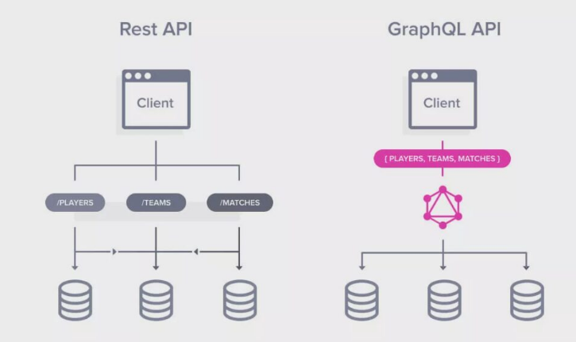
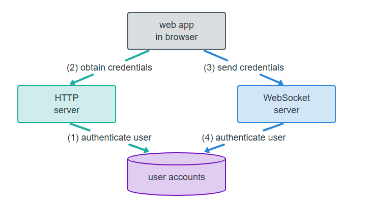
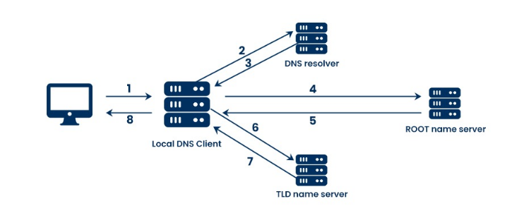
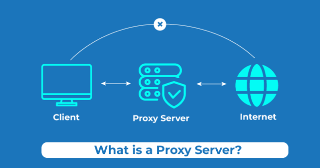
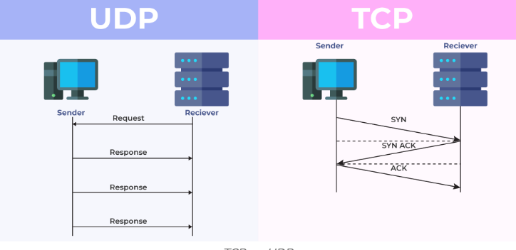
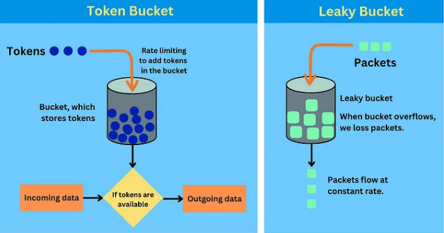

# ✅Network basics
### HTTP:
HTTP is a stateless application‑layer protocol used for communication between a client (browser/app) and a server.

### Stateless protocol:
means Each request is independent server does not remember previous requests
Each request is independent


### HTTPS:
HTTPS is HTTP + TLS (Transport Layer Security) that encrypts data between client and server.Protects data integrity & privacy
Mandatory for: Auth,Payments,APIs


### HTTP method:
HTTP methods define what action the client wants to perform on a resource.
Method  Usage
GET    Fetch data (read-only)
POST   Create new resource
PUT    Replace entire resource
PATCH  Partial update
DELETE Remove resource


### REST vs GraphQL
REST uses multiple endpoints, each returning a fixed data structure.Easy to cache
Problem is if Frontend needs:
User name + profile image
But API returns:
name, email, address, phone, profile

GraphQL uses a single endpoint where the client specifies exactly what data it needs.No over‑fetching,Reduces payload size
```js
query {
  user(id: 1) {
    name
    profileImage
  }
}
```

### websocket:
WebSocket is a persistent, bi-directional connection between client and server.
Used when you need real-time communication.(WhatsApp,Slack)


### pooling:
Client repeatedly asks the server so Connection is created and closed every time.

### Long Polling 

Client sends request → server waits until data is available → responds → client sends next request.

Better than polling, still HTTP-based.


### DNS:
DNS converts human‑readable domain names into IP addresses.

exp- if user type google.com → DNS return 142.250.195.78


### ip address
A unique identifier for a device on a network (like a house address on the internet).Used to identify clients and servers and helps in routing requests across the internet
Example:
192.168.1.1 (IPv4)
2001:db8::1 (IPv6)

### dns resolver
Converts domain name → IP address
Example:
google.com → 142.250.195.14

### proxy server
An intermediate server that sits between client and server.used in Load balancing,caching,security
Types:
1. Forward proxy → client side
2. Reverse proxy → server side (very common)

Example:
Nginx acting as a reverse proxy.

### latency
Time taken for a request to travel from client to server and back.measured in milliseconds,used in CDN,caching
Example:

India → India server: ~30 ms
India → US server: ~250 ms


### TCP UDP
`TCP (Transmission Control Protocol)`

Features:
Reliable
Ordered
Connection-based
Use when:
Data accuracy is critical

`UDP (User Datagram Protocol)`

Features:
Fast
No guarantee
Connectionless
Use when:
Speed > reliability


### bucket (token bucket / leaky bucket – rate limiting)
`Token Bucket`

How it works:
Tokens are added at a fixed rate
Request consumes a token
Allows short bursts

Example:
10 tokens/second

`Leaky Bucket`

How it works:

Requests are processed at a fixed rate
Extra requests are dropped

Example:
Processes 5 requests/sec
