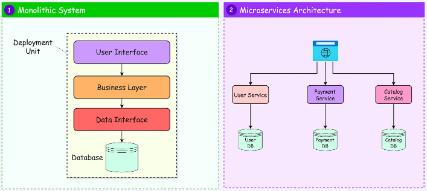

# ✅SYSTEM DESIGN PATTERNS:

1️⃣ Client–Server Pattern:The system is divided into clients (requesters) and servers (providers).
Client requests data
Server processes and responds
Clear separation of responsibility
Client → Server

2️⃣ Monolithic Architecture:All components are built as one single application.
UI
Business logic
Database access
3️⃣ Microservices Architecture:Application is broken into small, independent services
Each service owns its data
Independently deployable
Communicate via APIs/events

4️⃣ MVC (Model–View–Controller):Separates application into three layers:

Model → Data
View → UI
Controller → Logic
User → View → Controller → Model
              ↑             ↓
              └──────────┘
5️⃣ Event‑Driven Architecture:System reacts to events instead of direct requests.

Producer emits events
Consumers react asynchronously
Producer
   |
Event Broker (Kafka / Queue)
   |
Consumers
6️⃣API Gateway Pattern: Single entry point for all client requests.

Routes requests
Handles auth
Rate limiting
Client → API Gateway → Services
7️⃣Cache‑Aside Pattern:Application checks cache before querying database.