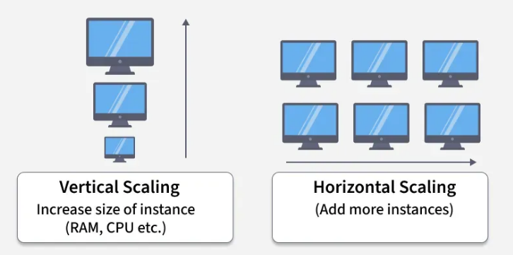
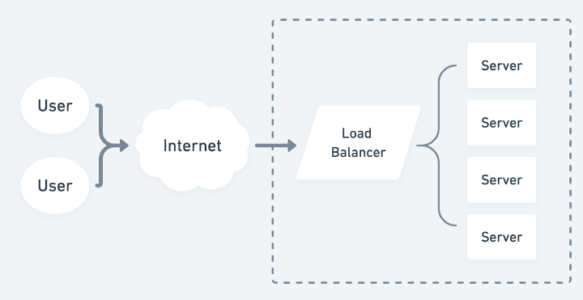
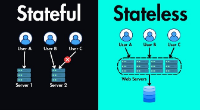
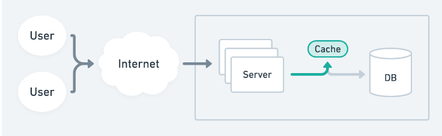
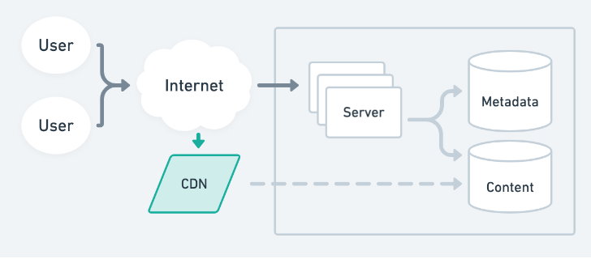
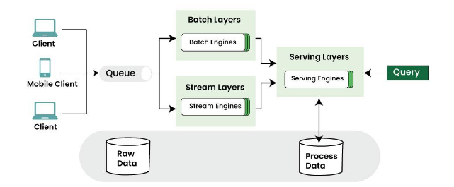
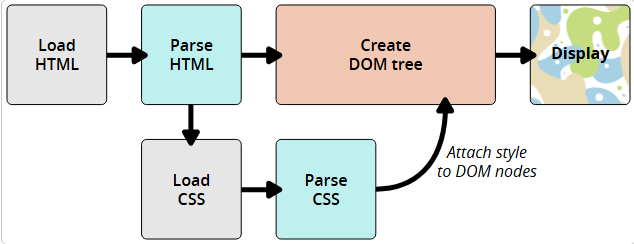
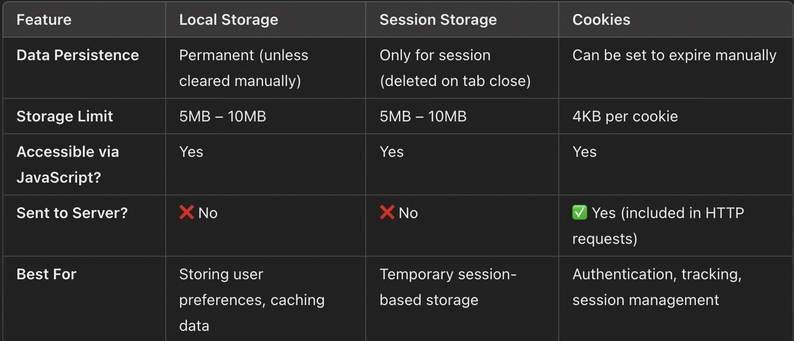
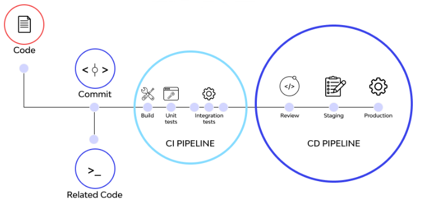

# ✅Scalability

## Vertical Scaling:
Vertical scaling means increasing the power of a single machine.Add more CPU,Add more RAM,Add faster disk
Before:
[ Server: 2 CPU, 4GB RAM ]

After:
[ Server: 8 CPU, 32GB RAM ]

## Horizontal Scaling:
Horizontal scaling means adding more machines instead of increasing power of one.Infinite scalability
Fault tolerant(Fault tolerance is the ability of a system to continue working even when one or more components fail)
Requires coordination
Needs a load balancer

## Load Balancers

Purpose
Distributes traffic evenly
Improves availability

## Types of Load Balancers
`L4 Load Balancer` TCP/UDP (faster)NGINX TCP load balancing
`L7 Load Balancer` HTTP (smarter routing)Can route based on:URL, pathHeaders,Cookies Route /api to backend

## Stateless vs Stateful Services
Stateless means Server does not store user session data between requests.it's characteristics is Any server can handle request,Easily scalable
Client → Server A
Client → Server B
(Works fine)

statefull means Server stores session data in memory or local storage.it's characteristics is Session tied to one server
Harder to scale
Client → Server A ✅
Client → Server B ❌ (session missing)

## Caching:
Caching stores frequently accessed data closer to the user to reduce latency and load.
Where Caching Happens?
Cache stored in the user’s browser.

## CDN cache
Content cached at edge locations near users. like image video

## performance :
using latency and throughput

## state management at scale
Managing application data consistently across many components, users, and services.
create 3 state Client state (UI, filters),Server state (API data, cache) and use state normalization + caching
### Why / When used:
Avoid prop-drilling
Keep UI + backend data in sync
Handle large apps with many interactions
## performance metrics (LCP, CLS)
Core Web Vitals that measure user experience performance.
LCP (Largest Contentful Paint)
Time to render main content
CLS (Cumulative Layout Shift)
Visual stability (layout jumping)
### Why / When used:

SEO ranking
User retention
Performance monitoring
## error boundary and logging
`Error Boundary:` Catches UI crashes
`Logging:` Stores error info for debugging
### Why / When used:
Prevent full app crash
Track production issues

## AWS Lambda
Serverless function that runs code without managing servers.
### Why / When used:
Event-driven systems
Auto-scaling

## how browser renders page

## cookie vs localStorage vs sessionStorage

## CI/CD
Automated pipeline to build, test, and deploy code.
### Why / When used:
Faster releases
Fewer bugs
Reliable deployments

