# AWS Notes — Complete Guide

---

## Table of Contents
1. Why Cloud? Problems with Traditional IT
2. Virtualization & Hypervisors
3. What is Cloud Computing?
4. Cloud Deployment Models
5. The Five Characteristics of Cloud Computing
6. Types of Cloud Computing (IaaS / PaaS / SaaS)
7. Cloud Providers & AWS Overview
8. AWS Regions & Availability Zones
9. Amazon EC2
10. AWS IAM (Identity and Access Management)
11. Networking — VPC
12. Amazon S3
13. AWS Lambda
14. Choosing AWS Services for a Full-Stack Project
15. Important Interview Questions (Question-wise) 🆕

---

## 1. Why Cloud? Problems with Traditional IT

**Problems with the traditional IT approach:**
- Pay for the rent of the data center.
- Pay for power supply, cooling, and maintenance.
- Adding and replacing hardware takes time.
- Scaling is limited.
- Need to hire a 24/7 team to monitor the infrastructure.
- Security is your own responsibility.

**Can we externalize all this?**

✅ Yes — using **cloud computing**.

---

## 2. Virtualization & Hypervisors

### Virtualization
Virtualization is the process of creating multiple **virtual machines** on a single physical server to efficiently use hardware resources (CPU, RAM, Storage, Network).
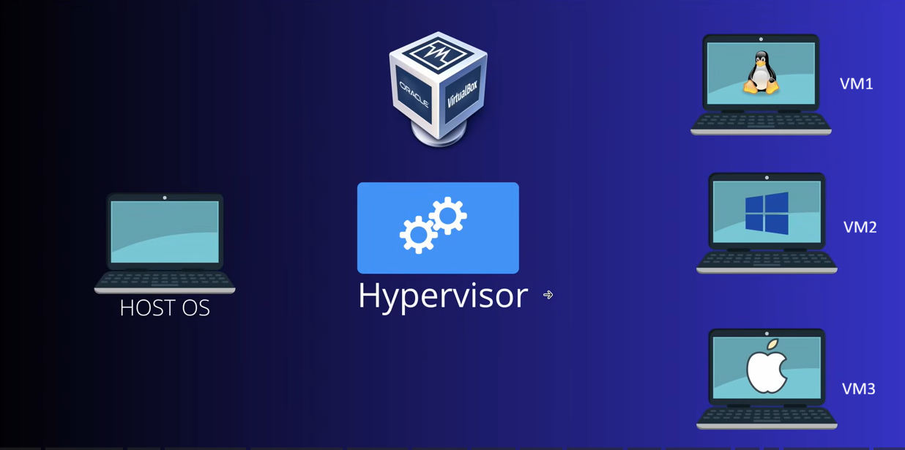

**Advantage:** you don't need new physical resources to run a different OS, and there's no risk of affecting your primary OS.


### Hypervisor
A **Hypervisor** is software that creates and manages virtual machines. It sits between the physical hardware and the virtual machines.

### Types of Hypervisor

**1. Type 1 Hypervisor (Bare Metal Hypervisor)**
Installed directly on physical hardware, without requiring a host operating system. Provides better performance, security, and efficiency. Commonly used in cloud environments and data centers.

**2. Type 2 Hypervisor (Hosted Hypervisor)**
Installed on top of an operating system as a software application. Easy to use — mainly used for development, testing, and learning.

---

## 3. What is Cloud Computing?

Cloud computing is accessing computing resources (compute, storage, network, media services, and databases) **over the internet**, rather than owning and maintaining physical servers.

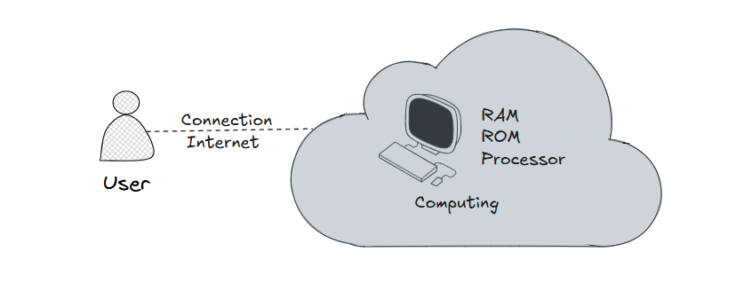

You can access as many resources as you need, almost instantly.

> AWS owns and maintains the network-connected hardware required for these application services, while **you** provision and use what you need via a web application.

### Benefits of Cloud Computing
- If you need any IT resource, you can get it **immediately**.
- What you require, you can get in **minutes**.
- No need to buy any hardware/software (readymade and available).
- Depending on requirements, you can **scale up and scale down** resources.
- You can access the data **from anywhere**.

---

## 4. Cloud Deployment Models

### 1. Private Cloud
Cloud services used by a **single organization**, not exposed to the public.
- Complete control.
- Security for sensitive applications.
- Meets specific business needs.

### 2. Public Cloud
Cloud resources owned and operated by a **third-party** cloud service provider, delivered over the Internet.
- A public cloud makes resources available to the public via the internet.
- Some providers offer resources by subscription or pay-per-usage.
- **Examples:** Microsoft Azure, Google Cloud, AWS.

### 3. Hybrid Cloud
A solution that **combines a private cloud with public cloud services**.
- Keep some servers on-premises, and extend some capabilities to the Cloud.

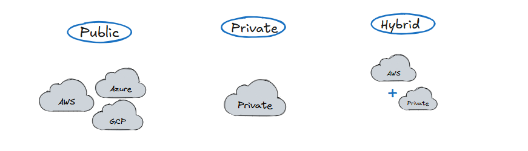

---

## 5. The Five Characteristics of Cloud Computing

1. **On-demand self service** — users can provision resources and use them without human interaction from the service provider.
2. **Broad network access** — resources available over the network, accessible by diverse client platforms.
3. **Multi-tenancy and resource pooling** — multiple customers share the same infrastructure/applications with security and privacy; multiple customers are serviced from the same physical resources.
4. **Rapid elasticity and scalability** — automatically and quickly acquire and dispose of resources when needed; scale easily based on demand.
5. **Measured service** — usage is measured; users pay correctly for what they've used.

---

## 6. Types of Cloud Computing (IaaS / PaaS / SaaS)

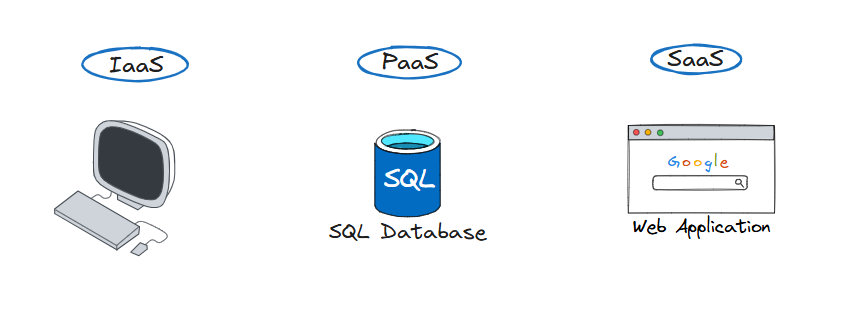

### Infrastructure as a Service (IaaS)
Only AWS provides the machine — everything else needs to be customized and handled by you. You have **flexibility and responsibility**.
- Provides building blocks for cloud IT.
- Provides networking, computers, data storage space.
- Highest level of flexibility.
- Easy parallel with traditional on-premises IT.
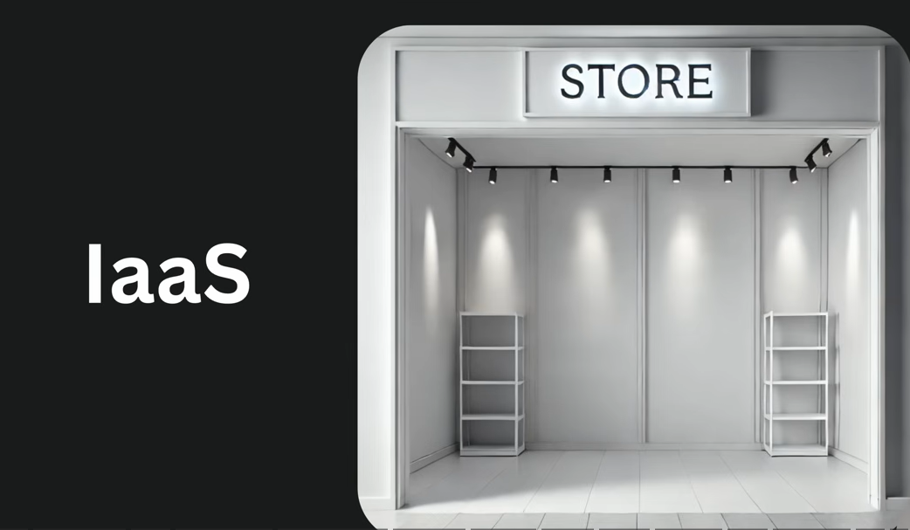

### Platform as a Service (PaaS)
No need to manage the machine — you only manage applications/platform (like a SQL database).
- Removes the need for your organization to manage the underlying infrastructure.
- Focus on deployment and management of your applications.
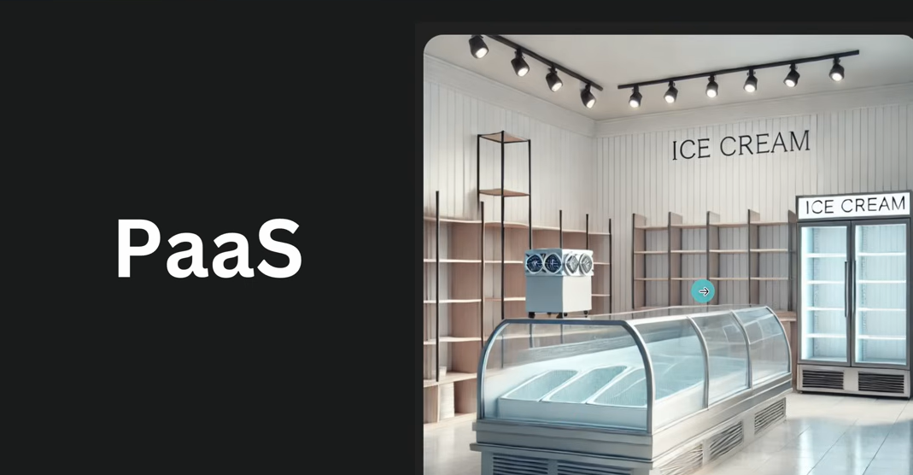

### Software as a Service (SaaS)
No need to manage the platform — only use the end product. No need to scale or download anything (like Amazon.com itself).
- A completed product that is run and managed by the service provider.


### IaaS vs PaaS vs SaaS

| Aspect | IaaS | PaaS | SaaS |
|---|---|---|---|
| **What is it?** | Virtualized infrastructure (servers, storage, networking) | Platform to build, deploy, and manage applications | Ready-to-use software over the internet |
| **You manage** | Application, Data, Runtime, OS | Application, Data | Only software usage/configuration |
| **Provider manages** | Hardware, Networking, Storage, Virtualization | Infrastructure, OS, Runtime, Middleware | Everything |
| **Examples** | AWS EC2, Azure VM, GCP Compute Engine | Azure App Service, Heroku, Google App Engine | Gmail, Microsoft 365, Salesforce |
| **When to use** | Need full server control and custom setup | Focus on coding without managing servers | Need a ready-made application |
| **Advantages** | Full control, flexibility, customization | Faster development, less maintenance, automatic scaling | No installation, easy access, low maintenance |
| **Disadvantages** | More management effort, OS patching, security responsibility | Less control than IaaS, vendor lock-in risk | Least customization and control |
| **Who uses it?** | System Admins, DevOps Engineers | Developers | End Users, Business Users |
| **Cost** | Pay for infrastructure resources | Pay for platform and app hosting | Subscription-based pricing |
| **Example Scenario** | Hosting a custom e-commerce server | Deploying a React/Node app quickly | Using Outlook or Gmail for email |

---

## 7. Cloud Providers & AWS Overview

### What is a Cloud Provider?
A company that offers computing services over the internet, instead of requiring you to buy and maintain your own physical servers and data centers.

Popular providers: **AWS**, **Microsoft Azure**, **Google Cloud Platform (GCP)**.

These services include: Virtual Servers (Compute), Storage, Databases, Networking, Security, AI/ML Services, Monitoring Tools.

### What is AWS?
**AWS (Amazon Web Services)** is a cloud computing platform provided by Amazon. It offers on-demand services such as servers, storage, databases, networking, security, and more, over the internet.

**Uses of AWS:**
- Host Websites and Applications using **EC2**.
- Store Files and Backups using **S3**.
- Run Databases using **RDS**.
- Serverless Computing using **Lambda**.
- Network Management using **VPC**.
- User and Access Management using **IAM**.
- Monitoring Resources using **CloudWatch**.

---

## 8. AWS Regions & Availability Zones

An **AWS Region** is a physical geographic location where AWS operates, such as Mumbai (`ap-south-1`) or North Virginia (`us-east-1`).

Each region contains multiple **Availability Zones (AZs)**, which are isolated data centers connected through low-latency networks.

- **Regions** help deploy applications closer to users.
- **AZs** provide high availability and fault tolerance.

---

## 9. Amazon EC2

### What is EC2 (Elastic Compute Cloud)?
AWS EC2 is an **Infrastructure as a Service (IaaS)** that allows us to launch virtual machines in the cloud.
- AWS manages the underlying **hardware, networking, and virtualization**.
- **You** manage the operating system, software installation, security configurations, and applications.

EC2 is used when you need **complete control** over the server environment.
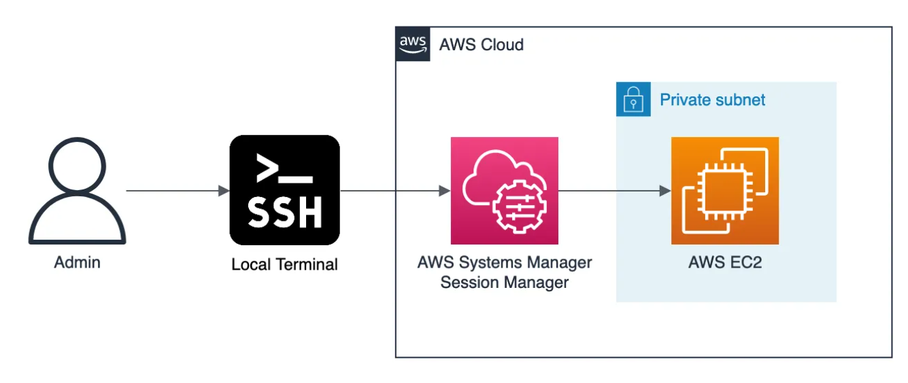

### When do we use EC2?

✅ Need full control over the server

✅ Hosting web applications or APIs

✅ Running custom software that requires OS-level access

✅ Migrating on-premises servers to the cloud

✅ Development, testing, and staging environments

✅ Running databases or enterprise applications

### Advantages of EC2
- Full control of the operating system.
- Highly customizable server configurations.
- Easy to scale resources.
- Pay only for what you use.
- Quick server provisioning in minutes.
- Supports multiple operating systems (Linux, Windows).
- Integrates with other AWS services.

### Disadvantages of EC2
- You must manage OS updates and security patches.
- Requires server administration knowledge.
- More maintenance compared to PaaS or SaaS services.
- Incorrect configuration can lead to security risks.

### EC2 Global View
A feature providing a **centralized view of EC2 resources across multiple AWS Regions** — helps administrators monitor and manage instances from a single interface instead of switching between regions.

### What is a Key Pair in EC2?
A Key Pair is used to securely connect (log in)/authenticate to an EC2 instance.

It consists of:
- **Public Key** → stored by AWS on the EC2 instance.
- **Private Key** (`.pem` file) → downloaded and kept securely by you.

### Top Linux Commands for AWS Beginners

```bash
pwd      # Current directory
ls -la   # List files and folders
cd       # Change directory
mkdir    # Create folder
cat      # Read file / view file content
grep     # Search text in files
ps -ef   # Running processes
df -h    # Disk usage
free -h  # Memory usage
ssh      # Connect to server
mv       # move or rename file
rm       # delete files
touch    # create a file
~        # home directory
sudo     # allows a normal Linux user to run commands with root/administrator privileges
dnf      # package manager used to install, update, search, and remove software packages
systemctl # start, stop, restart, enable, disable, and check status of systemd services
echo     # print/display text or variable values
```

**Linux file permissions:**

| Permission | Value |
|---|---|
| Read (r) | 4 |
| Write (w) | 2 |
| Execute (x) | 1 |

### How do you launch an EC2 instance?
EC2 is an **IaaS**-type service — launched via the AWS Console (or CLI/IaC), where you choose an AMI (OS image), instance type, key pair, network settings (VPC/subnet), storage, and security group, then launch.

### Why can't we rely on the Public IP to access an EC2 instance?
Because it **changes** once the instance is restarted/stopped — you can't rely on that. Instead, use an **Elastic IP address**.

An Elastic IP is a **static public IP** associated with your AWS account, which you can attach to an instance and keep even across restarts.

### Recommended EC2 Instance Types by Use Case

| Use Case | Recommended EC2 Instance | Category |
|---|---|---|
| Small Website / Blog | `t3.micro`, `t3.small` | General Purpose |
| E-Commerce Application | `m5.large`, `m5.xlarge` | General Purpose |
| Real-Time Video Rendering & Streaming | `g5.12xlarge`, `g5.24xlarge` | Accelerated Computing (GPU) |
| In-Memory Database & Real-Time Analytics | `r6g.16xlarge`, `x2idn.32xlarge` | Memory Optimized |

---

## 10. AWS IAM (Identity and Access Management)

**IAM** is an AWS **free global service** used to securely control who can access AWS resources and what actions they can perform within your AWS environment.

> By default, an IAM user has **no permission** to access any resource.

### What Can We Do with IAM?

✅ Create Users

✅ Create Groups

✅ Create Roles

✅ Assign Permissions using Policies

✅ Control Access to AWS Resources

✅ Implement Security Best Practices

### 1. Root User
When an AWS account is created, AWS automatically creates a **Root User**.

**Features:**
- Has complete access to all AWS services and resources.
- Cannot be restricted by IAM policies.
- Used for account-level tasks.

**Examples of Root User Tasks:**
- Change payment methods
- Close AWS account
- Modify account settings
- Recover permissions

**Best Practices:**
- Do not use the Root User for daily work.
- Enable **MFA** (Multi-Factor Authentication).
- Keep credentials secure.

### 2. IAM User
An **IAM User** represents an individual person or application that needs access to AWS.
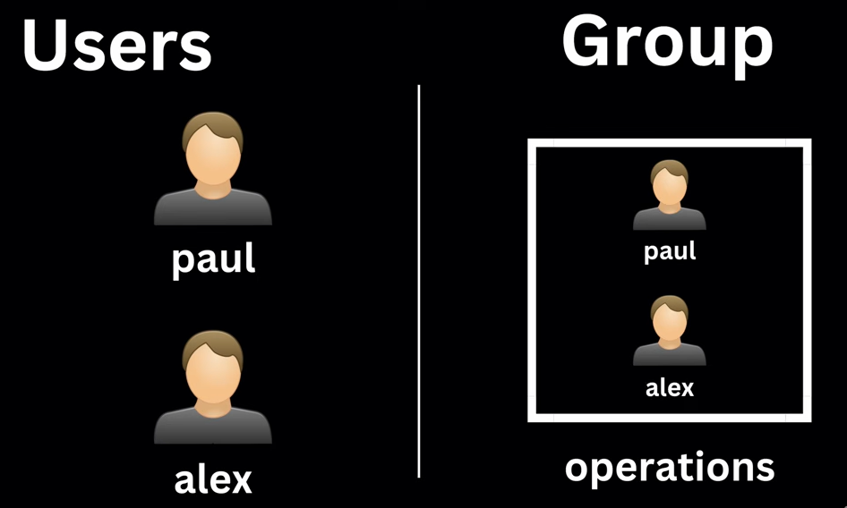

**Features:**
- Has its own username and password.
- Can have Access Keys for CLI/API access.
- Permissions are assigned through policies.

**Example:** Create users — `John`, `Smith`, `Admin` — each user gets only the permissions required for their job.

### 3. IAM Group
An **IAM Group** is a collection of IAM Users.

**Benefit:** instead of assigning permissions to every developer individually, assign permissions to the group.

### 4. IAM Role
An **IAM Role** provides **temporary** permissions to users, applications, or AWS services.
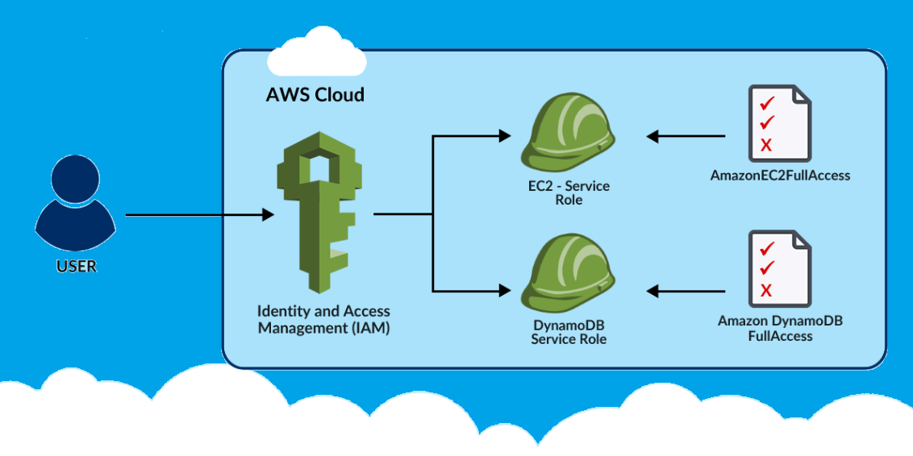

- An IAM role is an IAM entity that defines a set of permissions for making AWS service requests.
- IAM roles are **not** associated with a specific user or group — instead, trusted entities *assume* roles: IAM users, applications, or AWS services (such as EC2).

**Features:**
- No username or password.
- Assumed temporarily when needed.
- Commonly used by AWS services.

### IAM Policies
A **policy** is a JSON document that defines who is **allowed** and **denied** to perform actions in AWS.

**Example — permission object (allows all S3 actions on all resources):**
```json
{
  "Version": "2012-10-17",
  "Statement": [
    {
      "Effect": "Allow",
      "Action": "s3:*",
      "Resource": "*"
    }
  ]
}
```

**Example — allowing a user to assume a role (trust policy):**
```json
{
  "Version": "2012-10-17",
  "Statement": [
    {
      "Effect": "Allow",
      "Principal": {
        "AWS": "arn:aws:iam::256071447525:user/test-user"
      },
      "Action": "sts:AssumeRole"
    }
  ]
}
```

### What is MFA in AWS IAM?
**MFA (Multi-Factor Authentication)** is an additional security layer used with AWS accounts and IAM users.

> MFA = Password + One-Time Code (OTP) for stronger security in AWS IAM.

---

## 11. Networking — VPC

### What are Network Settings in EC2?
Network Settings in an EC2 instance control how the instance communicates with the internet, other AWS resources, and other servers. When launching an EC2 instance, you'll configure these under the **Network Settings** section.
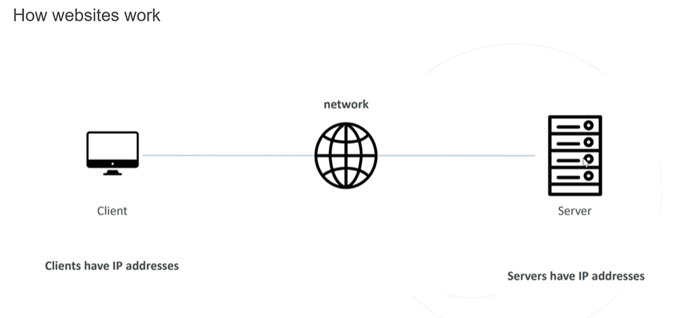

**Main Components:**
1. VPC (Virtual Private Cloud)
2. Subnet
3. Auto-assign Public IP
4. Security Group
5. Route Table

### What is VPC (Virtual Private Cloud)?
A **VPC** is a networking service in AWS that lets you create an **isolated virtual network** for your AWS resources — EC2 instances, databases, applications, etc.
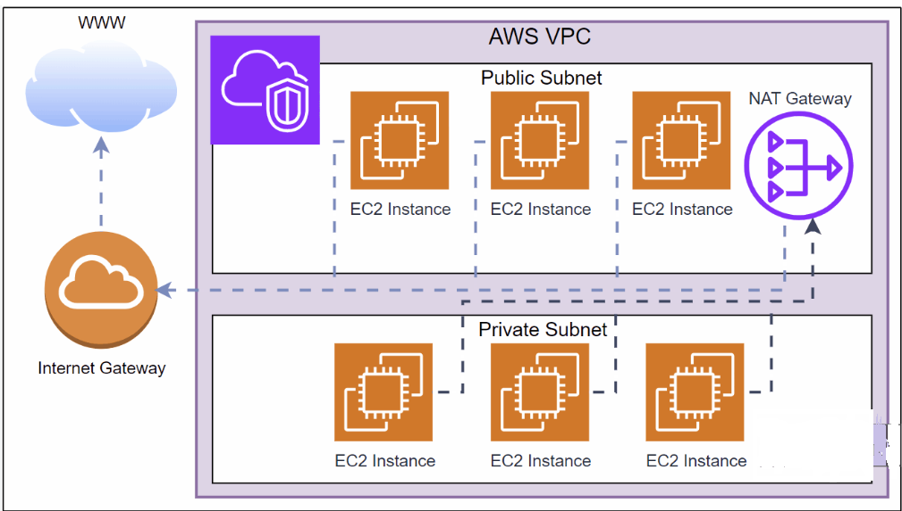

**Hotel Room Analogy:**
- The hotel building = AWS Cloud
- Your private room = VPC
- Your belongings inside the room = AWS resources (EC2, RDS, etc.)
- The room door and lock = Security Groups and Network ACLs

> Just as other hotel guests cannot access your room, resources outside your VPC cannot access your resources unless you explicitly allow them.

### Can an EC2 instance in VPC 1 directly communicate with an EC2 instance in VPC 2?
We **can't** connect directly — but through **VPC Peering**, we can.

### What is VPC Peering?
A networking connection between **two VPCs** that allows resources in those VPCs to communicate using **private IP addresses**.

- It's a **one-to-one** network connection.
- Enables private communication using private IPs.
- Does **not** require the internet.
- Does **not** support **transitive routing**.
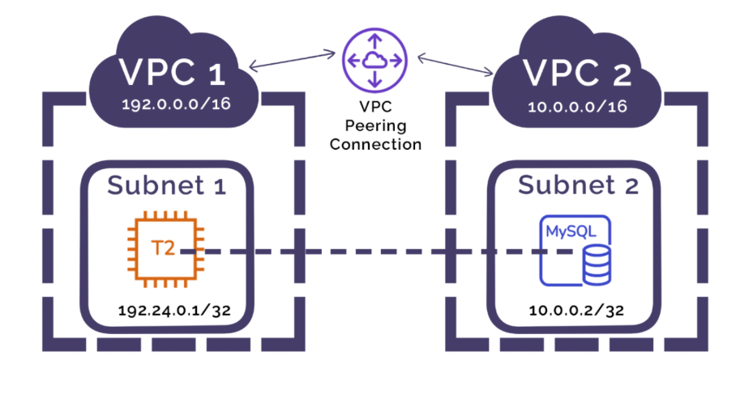

**Q: With 5 VPCs, all needing to communicate with each other via VPC Peering, how many connections are required?**
A: **10** peering connections. Formula: `n(n-1)/2`, because VPC Peering is one-to-one and doesn't support transitive routing.

### What is VPC Flow Logs?
An AWS feature that captures **metadata** about network traffic flowing through a VPC, subnet, or network interface — used for monitoring, troubleshooting, security analysis, and auditing (records whether traffic was accepted or rejected).

### What is a Subnet?
A **logical subdivision of a VPC** — helps divide a VPC into smaller networks so resources can be organized securely. Subnets can be **public** or **private**.

> By default, all subnets are **private** subnets.

**Public vs Private Subnet**

| Public Subnet | Private Subnet |
|---|---|
| Has access to the Internet through an Internet Gateway | No direct internet access |
| Used for Web Servers, Load Balancers | Used for Databases, Backend Servers |

### What is an Internet Gateway (IGW)?
A VPC component that allows resources inside a VPC to communicate with the internet. It is attached to a VPC and works with route tables to provide inbound and outbound internet access for resources in **public** subnets.

### What is a Route Table?
A collection of **routes** that determines how network traffic is directed within a VPC. Contains destination CIDR blocks and their corresponding targets, such as: Local, Internet Gateway, NAT Gateway, or VPC Peering connections.

- Helps control traffic flow between subnets and external networks.
- A **route** is a rule inside a Route Table telling AWS where to send network traffic.
- AWS checks the route table **top to bottom**. If no matching route is found, the traffic is **discarded**.
- Incoming and outgoing traffic permission is checked by the route table, which determines subnet access.

### What is Subnet Association?
**Linking a subnet to a route table.** When a subnet is associated with a route table, it follows the routes defined in that table.

### What is a NAT Gateway?
A **NAT (Network Address Translation) Gateway** allows resources in a **private subnet** to access the internet **outbound**, while preventing the internet from initiating connections to those resources.
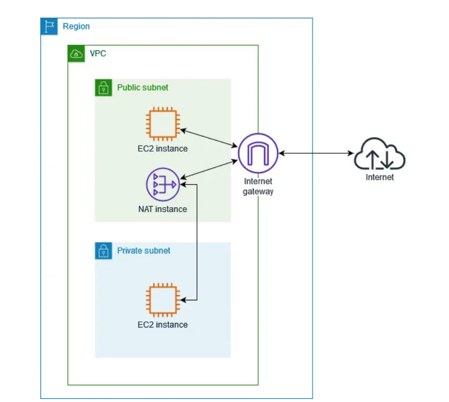

- Allows only **one direction**: outgoing, not incoming.

```txt
Private Subnet → Internet     ✅ Allowed
Internet → Private Subnet     ❌ Not Allowed
```

### What is a Security Group?
A **virtual firewall** that controls network traffic to and from an AWS resource (such as an EC2 instance).
- Defines **inbound** (incoming) and **outbound** (outgoing) traffic rules.
- Only allowed traffic can reach the instance; all other traffic is **blocked by default**.
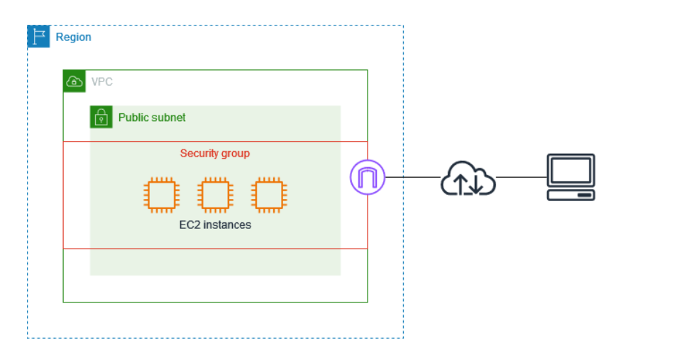

**Example:** Allow HTTP (Port 80) from everyone.

**Inbound vs Outbound rules:**
Inbound rules control incoming traffic to an EC2 instance; outbound rules control outgoing traffic from it. **Security Groups are stateful** — if inbound traffic is allowed, the response traffic is automatically allowed, without needing a separate outbound rule.

### Why does an EC2 instance get both a Public IP and a Private IP?
When you launch an EC2 instance inside a VPC, AWS assigns a **private IP**. A **public IP** is optional, assigned if internet access is needed.

- Every EC2 instance gets a **private IP** for internal communication within the VPC.
- A **public IP** is assigned when internet access is required — allows users to access the instance from the internet.
- Private IPs are used for secure communication between AWS resources (e.g. EC2 and RDS).

---

## 12. Amazon S3

### What is a Bucket in Amazon S3?
A **Bucket** is a container used to store objects (files) in Amazon S3 (**Simple Storage Service**).

- S3 can store virtually any type of data as objects: documents, images, videos, audio files, application files, backups, logs.
- It is an **object storage service** providing scalable, durable, and highly available storage in the cloud.
- Can store any type of file (object) up to **5 TB per object**.
- Provides highly reliable, scalable object storage, making your data accessible from anywhere, anytime, via the internet.
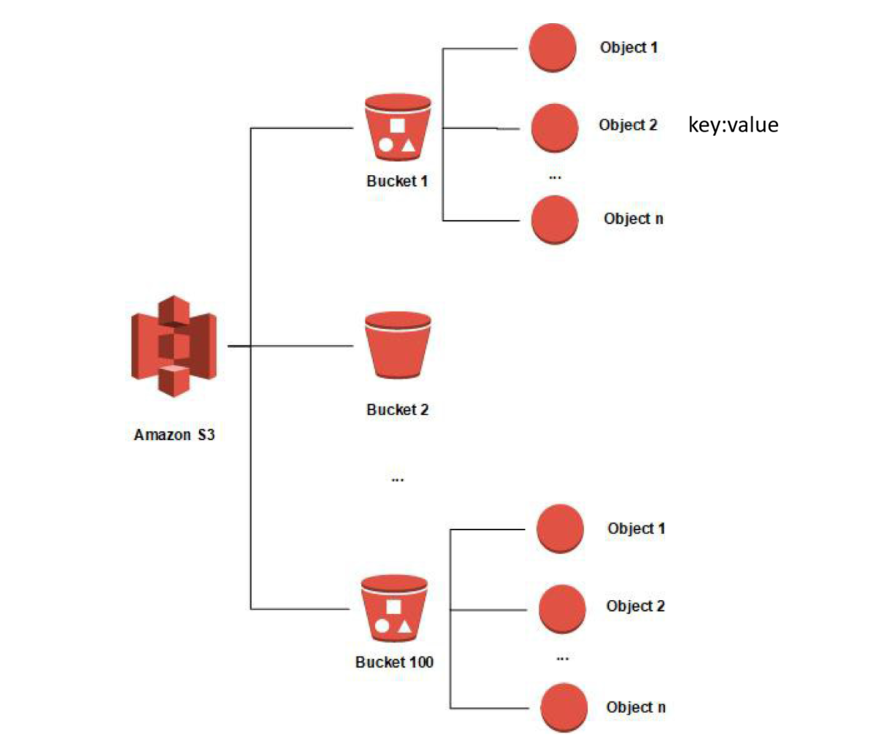

### Most Important S3 Storage Classes

| Storage Class | When to Use | Data Access Frequency | Example Data |
|---|---|---|---|
| **S3 Standard** | Frequently accessed data | High | Website files, images, videos, mobile apps, active business documents |
| **S3 Standard-IA (Infrequent Access)** | Accessed occasionally but needs quick retrieval | Low | Monthly reports, old project files, backup copies |
| **S3 One Zone-IA** | Infrequently accessed data that can be recreated | Low | Secondary backups, temporary data, test environment data |
| **S3 Glacier Flexible Retrieval** | Long-term archive storage | Very Rare | Old records, compliance documents, archived logs |
| **S3 Glacier Deep Archive** | Data rarely accessed, kept for years | Extremely Rare | Legal records, medical records, 7-10 year archives |

### How to Upload a Static Website to an S3 Bucket

**Step 1: Create the S3 Bucket**
- Create a bucket with a unique name.
- Upload `index.html` (and optionally `error.html`).

**Step 2: Enable Static Website Hosting**
`S3 Bucket → Properties → Static Website Hosting → Enable`
- Hosting type: Host a static website
- Index document: `index.html`
- Error document: `error.html` (optional)

**Step 3: Disable Block Public Access**
`S3 Bucket → Permissions → Block Public Access → Edit`
- Uncheck **Block all public access**
- Save changes

**Step 4: Add a Bucket Policy**
`Permissions → Bucket Policy` — for a public website, users only need `GetObject` permission.
```json
{
  "Version": "2012-10-17",
  "Statement": [
    {
      "Sid": "PublicRead",
      "Effect": "Allow",
      "Principal": "*",
      "Action": "s3:GetObject",
      "Resource": "arn:aws:s3:::your-bucket-name/*"
    }
  ]
}
```
> **Note:** `s3:PutObject` is **not** required for website visitors.
> - `GetObject` = Read files from the website
> - `PutObject` = Upload files to the bucket
> For a public static website, only `GetObject` is usually needed.

**Step 5: Access the Website**
`Bucket → Properties → Static Website Hosting` → copy the **Bucket Website Endpoint**, e.g.:
```
http://my-static-site.s3-website-us-east-1.amazonaws.com
```

---

## 13. AWS Lambda

### What is AWS Lambda?
A **serverless computing service** that lets you run code without creating or managing servers.

- Lambda executes code in response to **events**, such as S3 uploads, API requests, or scheduled tasks.
- Automatically scales, and charges only for the **actual execution time** — cost-effective for event-driven applications and automation tasks.
- EC2 and Lambda are similar in one way: both are compute services that run your application code.

**You simply:**
1. Write your code
2. Upload it to Lambda
3. Configure a trigger
4. AWS automatically runs the code when the trigger occurs

**Benefits:**
✅ No server management

✅ Auto scaling

✅ Pay only when code runs

✅ Highly available

✅ Supports multiple languages — JavaScript (Node.js), Python, Java

### EC2 vs Lambda

| Feature | AWS EC2 | AWS Lambda |
|---|---|---|
| **Server Management** | You must create and manage servers (VMs) | No server management (Serverless) |
| **Execution** | Runs continuously until stopped | Runs only when triggered by an event |
| **Scaling** | Manual or Auto Scaling configuration needed | Automatically scales |
| **Pricing** | Pay for server running time | Pay only when code executes |
| **Best Use Case** | Long-running applications, websites, databases | Event-driven tasks, automation, APIs |

---

## 14. Choosing AWS Services for a Full-Stack Project

**For a full-stack Node.js or Java project**, the most common AWS setup is:
- **EC2** for the application
- **RDS** for the database
- **S3** for file storage
- **VPC** for secure networking

### Option 1: EC2
Use when:
- Learning AWS
- Small to medium projects
- You want full server control

### Option 2: Lambda (Serverless)
Use when:
- APIs are small
- Application is event-driven

---

## 15. Important Interview Questions (Question-wise)

A few high-frequency AWS interview topics that weren't in the original notes — added here question-wise so nothing important is missing.

**Q1: What is the AWS Shared Responsibility Model?**

A: AWS is responsible for the **security *of* the cloud** (hardware, networking, data centers, virtualization). The customer is responsible for **security *in* the cloud** (OS patching, data encryption, IAM permissions, application security). What exactly falls to the customer shifts depending on the service model — e.g. you manage more with EC2 (IaaS) than with Lambda (serverless).

**Q2: What is an ARN?**

A: **Amazon Resource Name** — a unique identifier for every AWS resource.
```
arn:aws:s3:::my-bucket-name
arn:aws:iam::123456789012:user/John
```

**Q3: EBS vs Instance Store?**

A:
| EBS (Elastic Block Store) | Instance Store |
|---|---|
| Persistent — survives instance stop/termination | Ephemeral — data lost on stop/termination |
| Network-attached storage, can be detached/reattached | Physically attached to the host machine |
| Can be resized, snapshotted | Cannot be snapshotted the same way |
| Slightly higher latency | Lower latency, higher throughput |

**Q4: What is an Elastic Load Balancer (ELB)?**

A: Automatically distributes incoming application traffic across multiple EC2 instances (or other targets) to improve availability and fault tolerance. Types: **Application Load Balancer (ALB)** — HTTP/HTTPS, layer 7; **Network Load Balancer (NLB)** — TCP/UDP, layer 4, ultra-low latency; **Gateway Load Balancer (GWLB)**.

**Q5: What is Auto Scaling?**

A: Automatically adjusts the number of EC2 instances in a group based on demand (CPU usage, request count, schedule) — scales **out** (add instances) under load and **in** (remove instances) when demand drops, helping both availability and cost.

**Q6: What is Amazon RDS?**

A: **Relational Database Service** — a managed service for relational databases (MySQL, PostgreSQL, MariaDB, SQL Server, Oracle). AWS handles patching, backups, and replication, so you don't manage the underlying database server yourself (unlike running a DB on EC2).

**Q7: RDS Multi-AZ vs Read Replica?**

A:
| Multi-AZ | Read Replica |
|---|---|
| For **high availability** / failover | For **read scaling** / performance |
| Synchronous replication to a standby in another AZ | Asynchronous replication, can be in same/different region |
| Standby is not readable | Replica IS readable |
| Automatic failover on primary failure | Manual promotion needed to become a writer |

**Q8: What is Amazon CloudFront?**

A: AWS's **CDN (Content Delivery Network)** — caches content (static assets, video, API responses) at edge locations worldwide, reducing latency for users far from your origin server.

**Q9: What is Route 53?**

A: AWS's **DNS (Domain Name System)** web service — used for domain registration, DNS routing, and health checking. Supports routing policies like simple, weighted, latency-based, and failover routing.

**Q10: CloudWatch vs CloudTrail?**

A:
| CloudWatch | CloudTrail |
|---|---|
| **Monitoring** — metrics, logs, alarms | **Auditing** — who did what, and when |
| Tracks performance (CPU, memory, request counts) | Tracks API calls/account activity |
| Used for operational visibility | Used for compliance and security investigation |

**Q11: What is a Network ACL (NACL), and how does it differ from a Security Group?**
A:
| Security Group | Network ACL |
|---|---|
| Operates at the **instance** level | Operates at the **subnet** level |
| **Stateful** (return traffic auto-allowed) | **Stateless** (must explicitly allow both directions) |
| Only supports "Allow" rules | Supports both "Allow" and "Deny" rules |
| Evaluates ALL rules before deciding | Evaluates rules in order (by rule number) |

**Q12: What is Horizontal vs Vertical Scaling?**

A: **Vertical scaling** ("scale up") — increasing the size/power of a single instance (more CPU/RAM). **Horizontal scaling** ("scale out") — adding more instances to share the load. Cloud environments favor horizontal scaling since it avoids a single point of failure and works well with Auto Scaling + Load Balancers.

**Q13: What is AWS CloudFormation?**

A: An **Infrastructure as Code (IaC)** service — define AWS resources in a YAML/JSON template, and CloudFormation provisions/manages them automatically, making infrastructure repeatable and version-controlled.

**Q14: What is S3 Versioning?**

A: Keeps multiple versions of an object in the same bucket, protecting against accidental overwrite/deletion — you can restore any previous version.

**Q15: What is an S3 Lifecycle Policy?**

A: A rule set that automatically transitions objects between storage classes (e.g. Standard → IA → Glacier) or deletes them after a set period, to optimize storage cost over time.

**Q16: Availability Zone vs Region — quick recap?**

A: A **Region** is a geographic area (e.g. `ap-south-1` Mumbai) containing multiple **Availability Zones**, which are physically separate, isolated data centers within that region connected by low-latency links. Spreading resources across AZs protects against a single data-center failure; spreading across Regions protects against a whole-region outage and reduces latency for global users.
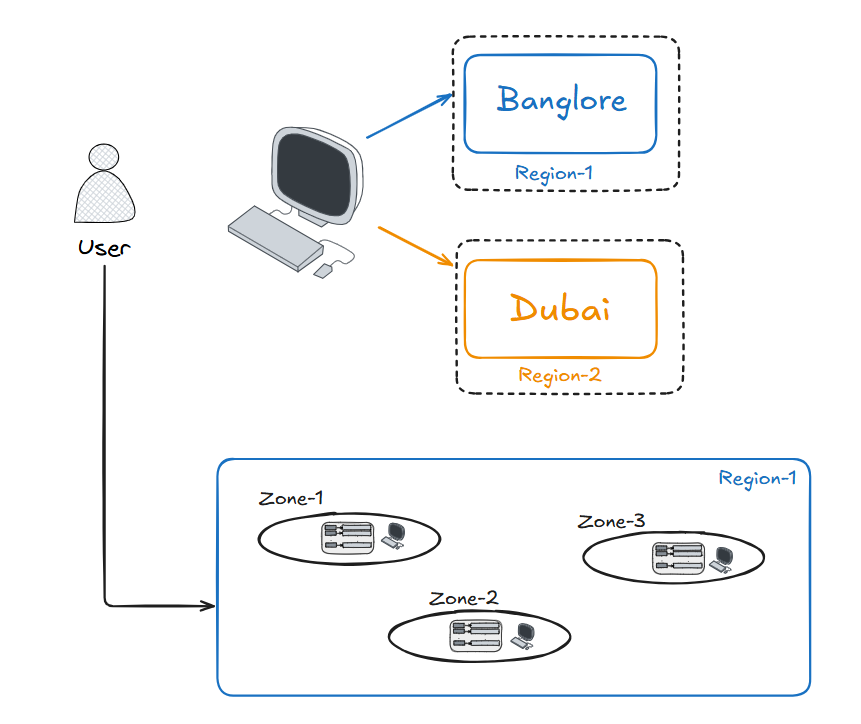


**Q17: What is the AWS Well-Architected Framework?**

A: A set of best-practice guidelines across **6 pillars**: Operational Excellence, Security, Reliability, Performance Efficiency, Cost Optimization, and Sustainability — used to evaluate and improve cloud architecture.

**Q18: What is the AWS Free Tier?**

A: A program offering limited free usage of many AWS services (e.g. 750 hrs/month of `t2.micro`/`t3.micro` EC2, 5GB S3 storage) for 12 months after account creation (plus some "always free" services), intended for learning and light workloads.

**Q19: Access Key vs Secret Key — what are they used for?**

A: Used for **programmatic access** to AWS (CLI/SDK/API) instead of console login. The **Access Key ID** identifies the request; the **Secret Access Key** signs it (like a password) — both together authenticate API calls. Never commit these to source control.

**Q20: What is the difference between stopping and terminating an EC2 instance?**

A: **Stopping** shuts the instance down but keeps its EBS root volume (and, if not using an Elastic IP, its public IP is released) — you can start it again later. **Terminating** permanently deletes the instance (and, by default, its root EBS volume too), and it cannot be restarted.

# AWS Bedrock & Generative AI — Notes

---

## Table of Contents
1. Core GenAI Concepts
2. Amazon Bedrock — Overview
3. RAG (Retrieval-Augmented Generation) with Bedrock Knowledge Base
4. AWS Lambda + Python Fundamentals (Q&A)
5. Boto3 & DynamoDB
6. Full RAG Architecture — Bedrock + Lambda + Boto3
7. Amazon Bedrock + LangChain Agent (Step-by-Step)
8. Additional Concepts 🆕

---

## 1. Core GenAI Concepts

### AI Model
An **AI Model** is a mathematical and computational system trained on data to recognize patterns and make predictions or decisions.

### Base Model
A **Base Model** is an AI model trained on a generic dataset.

### Foundation Model (FM)
A **Foundation Model (FM)** is a large-scale AI model trained on massive and diverse datasets that can be adapted for various tasks — text generation, summarization, translation, question answering, etc.

### Agent
An AI-powered system capable of understanding requests, making decisions, and performing tasks **autonomously**.

> **Agent = LLM + Tools (Actions)**

### Knowledge Base
A **Knowledge Base (KB)** is a centralized collection of information — documents, FAQs, manuals, policies, databases, or business data — that an AI system can search to answer user questions accurately.

### Multi-Agent Architecture
A system where **multiple specialized agents** collaborate to solve complex tasks.

### Agent Orchestration
The coordination and management of multiple agents to ensure tasks are executed in the correct **sequence and workflow**.

---

## 2. Amazon Bedrock — Overview

### What is Amazon Bedrock?
**Amazon Bedrock** is a fully managed AWS service that allows developers to build and scale **Generative AI applications** using foundation models (FMs) from AWS and leading AI providers, **without managing infrastructure**.

> Whenever we use Amazon Bedrock for a GenAI application, we should use **IAM users or IAM roles** to securely control access to Bedrock resources.

### Why Use Amazon Bedrock?
- No need to train your own AI model from scratch.
- No need to manage servers or GPU infrastructure.
- Access multiple AI models from a **single service**.
- Secure integration with AWS services.

### Popular Foundation Models Available
- **Amazon Nova**
- **Anthropic Claude**
- **Meta Llama**
- **Mistral AI**
- **Cohere**
- **Stability AI** (image generation)

### Common Use Cases
- Chatbots & Virtual Assistants
- Content Generation (emails, blogs, product descriptions)
- Document Summarization
- Code Generation
- **RAG Applications** (Retrieval-Augmented Generation)
- Image Generation

---

## 3. RAG (Retrieval-Augmented Generation) with Bedrock Knowledge Base

### RAG Application Flow (Knowledge Base Setup)

```txt
Step 1: Create IAM User
        ↓
Step 2: Create S3 Bucket
        ↓
Upload PDFs/Documents
        ↓
Step 3: Create Bedrock Knowledge Base
        ↓
Select Embedding Model
        ↓
Create Vector Store
(OpenSearch Serverless)
        ↓
Attach S3 Data Source
        ↓
Step 4: Sync Knowledge Base
        ↓
Documents Converted → Chunks → Embeddings
        ↓
Stored in Vector Store
        ↓
User Query
        ↓
Knowledge Base retrieves relevant chunks
        ↓
Bedrock FM generates answer
```

**In short:** documents are uploaded to S3 → the Knowledge Base chunks them and converts each chunk into a numeric **embedding** → embeddings are stored in a **vector database** (OpenSearch Serverless) → at query time, the user's question is embedded and matched against the stored chunks → the most relevant chunks are retrieved and passed to a foundation model, which generates the final answer.

---

## 4. AWS Lambda + Python Fundamentals (Q&A)

### Q1: What is the `event` object in AWS Lambda?
The `event` object is the **input data** that triggers your Lambda function.

> Think of it as a Python dictionary (JSON data) that Lambda receives automatically.

```python
def lambda_handler(event, context):
    question = event["question"]
    print(question)
```

### Q2: What is a Dictionary?
A **dictionary** in Python is a collection of key-value pairs.
```python
{"name": "Sougata", "city": "Asansol"}
```

### Q3: What happens if a key is not available when using `event.get()` in AWS Lambda?
**Answer:** If the specified key is not present in the `event` object, `event.get()` returns `None` by default and does **not** throw an exception.

```python
event = { "name": "Sougata" }

question = event.get("question")
print(question)   # None — no error raised
```

### Q4: How do you use the `RetrieveAndGenerate` API in AWS Lambda?
In AWS Lambda, we use the **Boto3** `bedrock-agent-runtime` client and call the `retrieve_and_generate()` method. The API retrieves relevant document chunks from the Bedrock Knowledge Base and passes them to a foundation model (such as Claude), which generates the final answer and returns it to the Lambda function.

```python
import json
import boto3

client = boto3.client(
    "bedrock-agent-runtime",
    region_name="us-east-1"
)

KB_ID = "KB12345678"

def lambda_handler(event, context):

    question = event.get("question")

    if not question:
        return {
            "statusCode": 400,
            "body": "Question is required"
        }

    response = client.retrieve_and_generate(
        input={
            "text": question
        },
        retrieveAndGenerateConfiguration={
            "type": "KNOWLEDGE_BASE",
            "knowledgeBaseConfiguration": {
                "knowledgeBaseId": KB_ID,
                "modelArn": "arn:aws:bedrock:us-east-1::foundation-model/anthropic.claude-3-sonnet"
            }
        }
    )

    answer = response["output"]["text"]

    return {
        "statusCode": 200,
        "body": json.dumps(answer)
    }
```

---

## 5. Boto3 & DynamoDB

### Q5: What is Boto3?
**Boto3** is the official Python library used to access and manage AWS services **programmatically**.

```python
import boto3

def lambda_handler(event, context):
    s3 = boto3.client("s3")
    buckets = s3.list_buckets()
    return buckets
```

### Q6: What is DynamoDB in AWS?
**Amazon DynamoDB** is a fully managed **NoSQL database** service provided by AWS.

- Designed to store and retrieve data with **single-digit millisecond latency**.
- **Automatically scales** based on traffic.

```python
import json
import boto3

# Connect to DynamoDB using low-level client
client = boto3.client('dynamodb')

def lambda_handler(event, context):
    return {
        'statusCode': 200,
        'body': json.dumps('Hello from Lambda!')
    }
```

---

## 6. Full RAG Architecture — Bedrock + Lambda + Boto3

**RAG application using Amazon Bedrock Knowledge Base + AWS Lambda + Boto3:**

```txt
+-----------+
|   User    |
+-----------+
      |
      v
+-------------+
| API Gateway |
+-------------+
      |
      v
+-------------+
| AWS Lambda  |
| Python      |
| Boto3       |
+-------------+
      |
      v
+----------------------+
| Bedrock KnowledgeBase|
+----------------------+
      |
      +--------Retrieve--------+
      |                         |
      v                         v
+------------+        +------------------+
| OpenSearch |        | S3 Documents     |
| Vector DB  |        | PDF/DOC/TXT      |
+------------+        +------------------+
      |
      v
+------------------+
| Claude Sonnet    |
| Llama            |
+------------------+
      |
      v
  Final Answer
```

**Flow:** the user's request hits **API Gateway**, which triggers a **Lambda** function (using Boto3). Lambda calls the **Bedrock Knowledge Base**, which retrieves relevant chunks from the **OpenSearch vector DB** (originally sourced from S3 documents), passes them to a foundation model (Claude/Llama), and returns the final generated answer back through the chain to the user.

---

## 7. Amazon Bedrock + LangChain Agent (Step-by-Step)

### Step 1: Install Dependencies
```bash
pip install langchain langgraph langchain-aws boto3 langchain-core numpy
```

### Step 2: Create a Basic Agent (`app.py`)

**Create a tool:**
```python
from langchain.tools import tool

@tool
def multiply(a: int, b: int) -> int:
    """Multiplies two numbers"""
    return a * b
```

**Create a Bedrock model:**
```python
from langchain_aws import ChatBedrockConverse

model = ChatBedrockConverse(
    model="amazon.nova-pro-v1:0",
    region_name="us-east-1"
)
```

**Create the agent:**
```python
from langchain.agents import create_agent

agent = create_agent(
    model=model,
    tools=[multiply]
)
```

**Invoke the agent with user input:**
```python
response = agent.invoke(
    {
        "messages": [
            {
                "role": "user",
                "content": "What is 25 multiplied by 4?"
            }
        ]
    }
)

print(response)
```

### Step 3: Configure AWS Credentials

**Step 3.1 — Create an IAM User**
- Go to AWS IAM
- Create a user
- Attach permissions such as:
  - `AmazonBedrockFullAccess` (for learning/testing)
  - Or custom **least-privilege** permissions

**Step 3.2 — Generate Access Keys**
- IAM User → Security Credentials
- Create Access Key
- Copy: **Access Key ID** and **Secret Access Key**

**Step 3.3 — Configure the AWS CLI**
```bash
aws configure
AWS Access Key ID [None]: AKIAxxxxxxxxxxxxxxxx
AWS Secret Access Key [None]: xxxxxxxxxxxxxxxxx
Default region name [None]: us-east-1
Default output format [None]: json
```

### Step 4: Full Working Example — Agent Calling a Lambda Tool

```python
# =====================================================
# REQUIREMENTS
# =====================================================
# pip install langchain langgraph langchain-aws boto3 langchain-core numpy
#
# Configure AWS Credentials
# aws configure
#
# AWS Access Key ID: XXXXX
# AWS Secret Access Key: XXXXX
# Region: us-east-1
# Output: json
#
# Lambda Function Name: multiply-function
# =====================================================

import json
import boto3

from langchain.tools import tool
from langchain.agents import create_agent
from langchain_aws import ChatBedrockConverse


# =====================================================
# Tool: Call AWS Lambda using Boto3
# =====================================================

@tool
def multiply(a: int, b: int) -> int:
    """
    Multiplies two numbers using AWS Lambda
    """

    lambda_client = boto3.client(
        "lambda",
        region_name="us-east-1"
    )

    response = lambda_client.invoke(
        FunctionName="multiply-function",
        InvocationType="RequestResponse",
        Payload=json.dumps(
            {
                "a": a,
                "b": b
            }
        )
    )

    result = json.loads(
        response["Payload"].read()
    )

    return result["result"]


# =====================================================
# Create Amazon Bedrock Model
# =====================================================

model = ChatBedrockConverse(
    model="amazon.nova-pro-v1:0",
    region_name="us-east-1"
)


# =====================================================
# Create Agent
# =====================================================

agent = create_agent(
    model=model,
    tools=[multiply]
)


# =====================================================
# User Input
# =====================================================

user_input = input("Enter your question: ")


# =====================================================
# Invoke Agent
# =====================================================

response = agent.invoke(
    {
        "messages": [
            {
                "role": "user",
                "content": user_input
            }
        ]
    }
)


# =====================================================
# Print Response
# =====================================================

print("\nAgent Response:\n")
print(response)
```

### Multi-Tool Agent Example — Order Management

A more realistic agent with **two tools**, letting the LLM decide which one to call based on the user's request:

```python
import json
import boto3

from langchain.tools import tool
from langchain.agents import create_agent
from langchain_aws import ChatBedrockConverse

# ==================================================
# Lambda Client
# ==================================================

client = boto3.client(
    "lambda",
    region_name="us-east-1"
)

# ==================================================
# Tool 1 : Place Order
# ==================================================

@tool
def place_order(product_id: str, quantity: int) -> dict:
    """
    Place an order for a product with given quantity.
    """

    response = client.invoke(
        FunctionName="place-orders",
        InvocationType="RequestResponse",
        Payload=json.dumps(
            {
                "product_id": product_id,
                "quantity": quantity
            }
        ).encode("utf-8")
    )

    return json.loads(
        response["Payload"].read()
    )

# ==================================================
# Tool 2 : Get Order Status
# ==================================================

@tool
def get_order(order_id: str) -> dict:
    """
    Look up the status of an existing order by its order id.
    """

    response = client.invoke(
        FunctionName="order-status",
        InvocationType="RequestResponse",
        Payload=json.dumps(
            {
                "order_id": order_id
            }
        ).encode("utf-8")
    )

    return json.loads(
        response["Payload"].read()
    )

# ==================================================
# Bedrock Model
# ==================================================

model = ChatBedrockConverse(
    model="amazon.nova-pro-v1:0",
    region_name="us-east-1"
)

# ==================================================
# Create Agent
# ==================================================

agent = create_agent(
    model=model,
    tools=[
        place_order,
        get_order
    ]
)

# ==================================================
# User Input
# ==================================================

user_query = input("Enter Request: ")

# ==================================================
# Invoke Agent
# ==================================================

response = agent.invoke(
    {
        "messages": [
            {
                "role": "user",
                "content": user_query
            }
        ]
    }
)

print("\nAgent Response:\n")
print(response)
```

> 💡 **How this works:** the agent's LLM reads the user's natural-language request, decides *which* tool (if any) is relevant based on each `@tool` function's docstring, extracts the right arguments from the request, calls the corresponding AWS Lambda function via Boto3, and then uses the tool's result to compose its final natural-language answer.

---

## 8. Additional Concepts 🆕

A few Bedrock/GenAI fundamentals not in the original notes, useful for rounding out the picture:

### Bedrock Agents (Native) vs a LangChain Agent
Bedrock also has its **own native "Agents for Amazon Bedrock"** feature (separate from building an agent yourself with LangChain as shown above) — it lets you define **Action Groups** (API calls the agent can make) and a Knowledge Base directly in the AWS console, with Bedrock managing the orchestration loop. LangChain gives more flexibility/control over the agent logic in code; native Bedrock Agents are more managed/low-code.

### Chunking Strategy
How documents are split before embedding matters a lot for RAG quality:
| Strategy | Description |
|---|---|
| Fixed-size chunking | Splits by a fixed token/character count (simple, but can cut sentences awkwardly) |
| Semantic chunking | Splits along natural boundaries (paragraphs, sections) |
| Hierarchical chunking | Keeps parent/child chunk relationships for better context retrieval |

### Embeddings
A numeric vector representation of text that captures semantic meaning — texts with similar meaning have embeddings that are close together in vector space. Bedrock offers embedding models like **Amazon Titan Embeddings** and **Cohere Embed**, used to convert both the stored document chunks and the user's query into comparable vectors.

### On-Demand vs Provisioned Throughput (Bedrock pricing models)
| On-Demand | Provisioned Throughput |
|---|---|
| Pay per token/request, no commitment | Reserve dedicated model capacity for a fixed time |
| Best for variable/unpredictable traffic | Best for high, steady, predictable traffic |
| No throughput guarantee | Guaranteed throughput |

### Key Inference Parameters
| Parameter | Effect |
|---|---|
| `temperature` | Higher = more random/creative output; lower = more deterministic |
| `top_p` | Nucleus sampling — restricts token choices to the smallest set whose cumulative probability exceeds `top_p` |
| `max_tokens` | Caps the length of the generated response |

### Model Customization in Bedrock
- **Fine-tuning** — further train a copy of a base FM on your own labeled dataset for a specific task.
- **Continued pre-training** — further train on unlabeled domain-specific data.
- **RAG** (as covered above) — no model training at all; instead, relevant info is retrieved and injected into the prompt at query time. RAG is usually the first and cheapest approach to try before fine-tuning.

### Amazon Bedrock Guardrails
A safety feature that lets you configure content filters (blocking harmful topics, PII redaction, denied topics, word filters) applied consistently across any FM used through Bedrock — helps enforce responsible-AI policies without building your own filtering layer.

### Bedrock vs SageMaker
| Amazon Bedrock | Amazon SageMaker |
|---|---|
| Access pre-built foundation models via API | Build, train, and deploy **your own** custom ML models |
| No infrastructure/GPU management | You manage training infrastructure (or use managed training jobs) |
| Best for GenAI app development quickly | Best for custom ML/data-science workloads |

### Quick Recap — Agent vs Knowledge Base vs RAG

| Term | What it actually is |
|---|---|
| **Knowledge Base** | The *searchable store* of your documents/data (chunks + embeddings in a vector DB) |
| **RAG** | The *technique* of retrieving relevant chunks from a Knowledge Base and feeding them to an FM before it answers |
| **Agent** | An LLM + tools that can *autonomously decide* which actions/tools to invoke (may or may not use a Knowledge Base/RAG as one of its capabilities) |