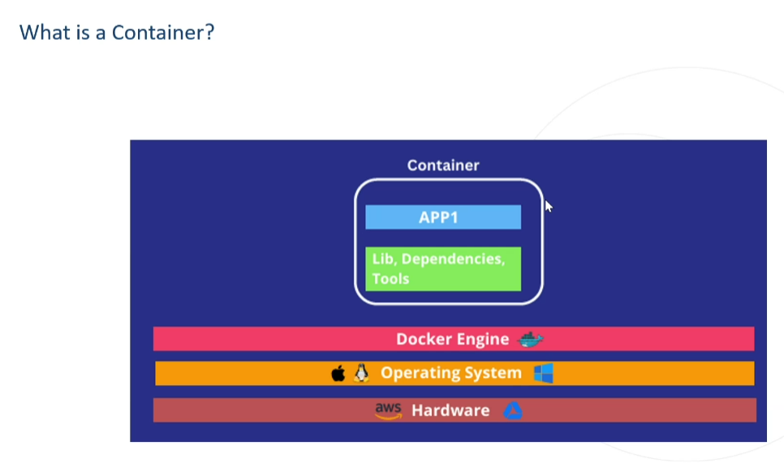
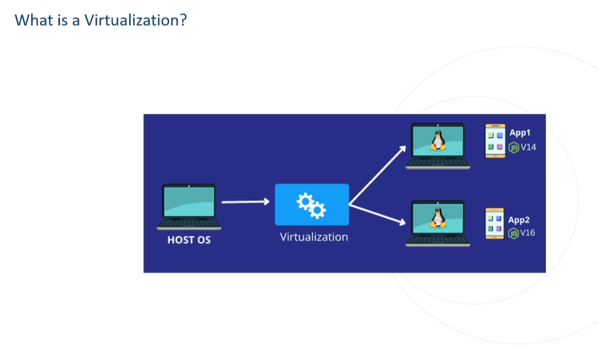
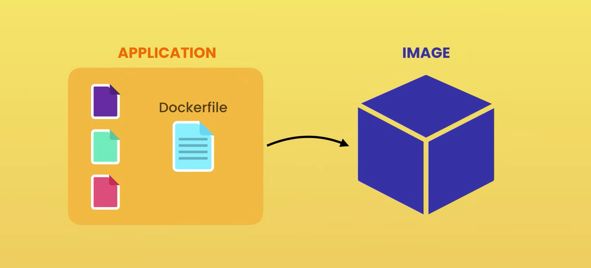
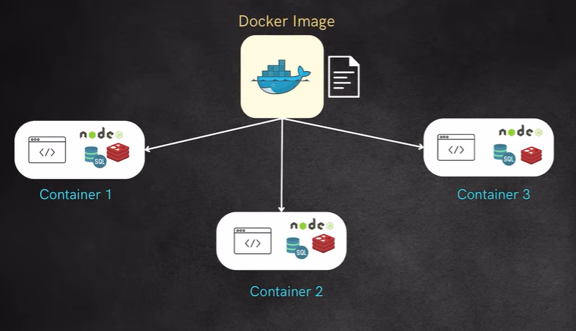
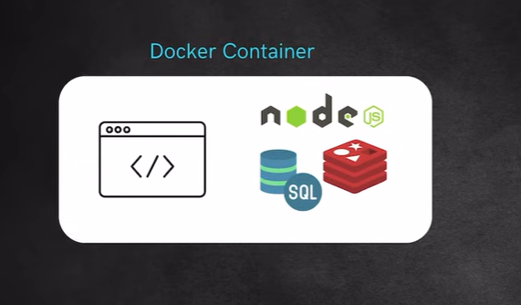
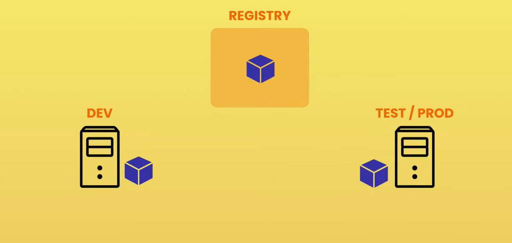

# Docker Complete Guide

## Table of Contents
1. [Introduction to Docker](#introduction-to-docker)
2. [Why Docker?](#why-docker)
3. [What is a Container?](#what-is-a-container)
4. [Docker Architecture](#docker-architecture)
5. [Docker Components](#docker-components)
6. [Docker Registry](#docker-registry)
7. [Dockerfile Instructions](#dockerfile-instructions)
8. [Practical Examples](#practical-examples)
9. [Docker EXPOSE](#docker-expose)
10. [Port Publishing](#port-publishing)
11. [EXPOSE vs Publishing](#expose-vs-publishing)
12. [ENV Keyword](#env-keyword)
14. [Docker Volumes (Mounting)](#docker-volumes-mounting)
15. [Bind Mounts](#bind-mounts)
16. [Working with MySQL Container](#working-with-mysql-container)

---

## Introduction to Docker

### What is Docker?
Docker is a containerization platform that allows you to build, run, and ship applications consistently across different environments.

### Software Project Components
A typical software project contains several components:
1. **Frontend** - User interface
2. **Backend** - Server-side logic
3. **Database** - Data storage

In order to deploy our application on a machine, we need to set up all the required software to run our application.

---

## Why Docker?

### The Problem
In real-time projects, applications should be deployed into multiple environments (Dev, Test, Prod) for testing purposes. Whatever software setup is required needs to be installed manually on each machine.

**Common Issues:**
- When developers deploy code on a dev machine (VM1) and testers check on a testing machine (VM2), the application might not run due to:
  - Setup mismatches
  - Version mismatches
  - Missing files or dependencies

### The Solution
Instead of transferring only code, create a **Docker Image** (a complete package) from the dev side that includes:
- Application code
- Dependencies
- Libraries
- Software configurations

This Docker image can be transferred from one environment to another, ensuring consistency.

---

## What is a Container?

### Definition
A **container** is an isolated environment for running an application.


### Key Features
- **Isolation**: Allows running multiple applications in isolation
- **Lightweight**: Minimal resource overhead
- **Portability**: Package application with all necessary dependencies and configurations
- **Consistency**: Ensures the same behavior across different environments

### Analogy
Think of containers like shipping containers on a ship - each container is isolated and contains everything needed for transport.

### Container vs Virtualization
| Feature | Virtual Machine | Container |
|------|------|------|
| OS | Separate OS | Shared OS |
| Size | Heavy | Lightweight |
| Startup | Slow | Fast |
| Performance | Lower | Higher |


---

## Docker Architecture

### Workflow
```
Dockerfile → Image (Blueprint) → Container (Running Instance)
```

### Components Flow
1. **Dockerfile**: Contains instructions to build an image
2. **Docker Image**: A package containing everything needed to run the application
3. **Docker Container**: A runtime instance of a Docker image with an isolated environment

---

## Docker Components

### 1. Dockerfile
- A simple text file containing instructions required to build an image
- Uses Domain Specific Language (DSL) keywords
- Common keywords: `FROM`, `CMD`, `COPY`, `RUN`, `WORKDIR`, `ADD`, `ENTRYPOINT`


### 2. Docker Image
- A package containing everything needed to run an application
- Immutable blueprint for containers
- Can be versioned and shared


### 3. Docker Container
- A runtime instance of a Docker image
- Isolated environment where the application runs
- Can be started, stopped, and deleted


### 4. Docker Engine
- Software that helps create images from Dockerfiles
- Manages containers and images
- Provides the runtime environment

---

## Docker Registry

### What is Docker Registry?
A central repository for storing and distributing Docker images.


### Docker Hub
- Public registry (like GitHub for code)
- Stores and shares Docker images
- Official images for popular software

### Installation
- **Docker Desktop** for Windows/Mac
- **Docker Engine** for Linux

### Verification Commands
```bash
# Check Docker version
docker -v

# View Docker system information
docker info
```

---

## Dockerfile Instructions

### 1. FROM Keyword

**Description**: Specifies the base image for your application. It must be the first instruction in a Dockerfile.

**Syntax:**
```dockerfile
FROM <IMAGE_NAME>:<tag>
```

**Example:**
```dockerfile
FROM java:1.8.0
FROM mysql:8.0
FROM node:alpine
FROM ubuntu:22.04
```

---

### 2. MAINTAINER Keyword

**Description**: Represents the author/maintainer of the Dockerfile (deprecated, use LABEL instead).

**Syntax:**
```dockerfile
MAINTAINER <name> <email>
```

**Example:**
```dockerfile
MAINTAINER John Doe <john@example.com>

# Modern approach (recommended)
LABEL maintainer="john@example.com"
```

---

### 3. COPY Keyword

**Description**: Copies files/folders from your local machine to the Docker image.

**Syntax:**
```dockerfile
COPY <source> <destination>
```

**Example:**
```dockerfile
COPY . /app
COPY package.json /app/
COPY src/ /app/src/
```

**Note:** COPY does not extract compressed files (zip, tar, etc.)

---

### 4. WORKDIR Keyword

**Description**: Sets the working directory inside the container. All subsequent commands will be executed in this directory.

**Syntax:**
```dockerfile
WORKDIR <path>
```

**Example:**
```dockerfile
WORKDIR /app
WORKDIR /usr/src/app
```

**Benefit:** Avoids using `cd` commands and makes Dockerfile more readable.

---

### 5. ADD Keyword

**Description**: Similar to COPY but with additional features:
1. Automatically extracts compressed files (tar, zip)
2. Can download files from URLs

**Syntax:**
```dockerfile
ADD <source> <destination>
```

**Example:**
```dockerfile
# Download from URL
ADD https://example.com/file.txt /app/

# Auto-extract archive
ADD archive.tar.gz /app/

# Simple copy (use COPY instead for this)
ADD . /app
```

**Best Practice:** Use `COPY` for simple file copying, use `ADD` only when you need auto-extraction or URL downloads.

---

### 6. RUN Command

**Description**: Executes commands while building the image. Used for installing packages, creating directories, etc.

**Syntax:**
```dockerfile
RUN <command>
```

**Example:**
```dockerfile
FROM ubuntu:22.04
RUN apt-get update
RUN apt-get install -y apache2
RUN mkdir /workspace
RUN npm install

# Better approach (fewer layers)
RUN apt-get update && \
    apt-get install -y apache2 && \
    mkdir /workspace
```

---

### 7. CMD Command

**Description**: Executes when a container starts (not during image build). Only the last CMD instruction is used if multiple are specified.

**Syntax:**
```dockerfile
CMD ["executable", "param1", "param2"]
```

**Example:**
```dockerfile
CMD ["node", "app.js"]
CMD ["python", "server.py"]
CMD ["npm", "start"]
```

**Note:** Can be overridden when running the container.

---

### 8. ENTRYPOINT Command

**Description**: Similar to CMD but cannot be easily overridden. Defines the main executable for the container.

**Syntax:**
```dockerfile
ENTRYPOINT ["executable", "param1"]
```

**Example:**
```dockerfile
ENTRYPOINT ["node", "app.js"]
ENTRYPOINT ["python", "script.py"]
```

**Difference between CMD and ENTRYPOINT:**

| Feature | CMD | ENTRYPOINT |
|---------|-----|------------|
| Override | Easy to override | Difficult to override |
| Purpose | Default command | Main executable |
| Usage | Can be replaced by command line args | Args are appended |

**Example:**
```dockerfile
# Dockerfile with ENTRYPOINT
FROM node:alpine
WORKDIR /app
COPY . /app
ENTRYPOINT ["node", "app.js"]
```

**Running:**
```bash
# Run without arguments
docker run entry-app

# Run with arguments (appended to ENTRYPOINT)
docker run entry-app arg1 arg2

# Override ENTRYPOINT
docker run --entrypoint ls entry-app
```

---

### 9. EXPOSE Command

**Description**: Informs Docker that the container listens on specified network ports at runtime.

**Syntax:**
```dockerfile
EXPOSE <port>
```

**Example:**
```dockerfile
EXPOSE 8080
EXPOSE 3000
EXPOSE 80 443
```

---

### 10. ENV Command

**Description**: Sets environment variables in the container.

**Syntax:**
```dockerfile
ENV <key>=<value>
```

**Example:**
```dockerfile
ENV NODE_ENV=production
ENV PORT=8080
ENV DB_HOST=localhost
```

---

### 11. ARG Command

**Description**: Defines build-time variables that users can pass during image build.

**Syntax:**
```dockerfile
ARG <name>[=<default value>]
```

**Example:**
```dockerfile
ARG VERSION=1.0
ARG NODE_VERSION=18

FROM node:${NODE_VERSION}
RUN echo "Building version ${VERSION}"
```

**Usage:**
```bash
docker build --build-arg VERSION=2.0 -t myapp .
```

---

## Practical Examples

### Example 1: Simple Node.js Application

**Step 1: Create Application**

**app.js:**
```javascript
console.log('Hello from Docker!');
```

**Dockerfile:**
```dockerfile
# Start with an OS
FROM node:alpine

# Set working directory
WORKDIR /app

# Copy application files
COPY . /app

# Run app.js when container starts
CMD ["node", "app.js"]
```

**Step 2: Build Docker Image**
```bash
docker build -t my-app .
```

**Step 3: Verify the Image**
```bash
docker images
# OR
docker image ls
```

**Step 4: Run the Docker Container**
```bash
docker run my-app
# OR using image ID
docker run <image-id>
```

**Step 5: List Running Containers**
```bash
# List running containers
docker ps

# List all containers (including stopped)
docker ps -a
```

---

### Example 2: Interactive Application (Sum of Two Numbers)

**Step 1: Create Application**

**app.py:**
```python
num1 = input("Enter first number: ")
num2 = input("Enter second number: ")
sum_result = float(num1) + float(num2)

# Print the result
print(f"Sum: {sum_result}")

```

**Dockerfile:**
```dockerfile
FROM node:alpine
WORKDIR /app
COPY . /app
CMD ["node", "app.py"]
```

**Step 2: Build Docker Image**
```bash
docker build -t sum-of-two .
```

**Step 3: Verify the Docker Image**
```bash
docker images
```

**Step 4: Run the Image in Interactive Mode**
```bash
docker run -it sum-of-two
```

**Interactive Mode Flags:**
- `-i`: Interactive mode (keeps STDIN open)
- `-t`: Allocates a pseudo-TTY (terminal)

**Step 5: Pull and Run Image from Docker Hub**
```bash
# Pull image
docker pull <image-name>

# Run pulled image
docker run <image-name>
```

---

### Example 3: Web Application with Port Mapping

**Description**: Running a web application inside a container and accessing it from the host machine.

**Syntax:**
```bash
docker run -p <host_port>:<container_port> <image-name>
```

**Example:**
```bash
docker run -p 8600:8080 my-web-app
```

**Explanation:**
- `8600`: Port on your local machine (host)
- `8080`: Port inside the container
- Access the app at `http://localhost:8600`

---

### Example 4: Detached Mode

**What is Detached Mode?**
Running a container in the background instead of attaching it to your terminal.

**Syntax:**
```bash
docker run -d <image-name>
```

**Example:**
```bash
# Run in detached mode
docker run -d my-app

# Run with port mapping in detached mode
docker run -d -p 8600:8080 my-web-app
```

**Benefits:**
- Container runs in the background
- Terminal is free for other commands
- Container continues running even if you close the terminal

---

### Example 5: Complete Web Application

**Dockerfile:**
```dockerfile
FROM node:18-alpine

# Set working directory
WORKDIR /usr/src/app

# Copy package files
COPY package*.json ./

# Install dependencies
RUN npm install

# Copy application code
COPY . .

# Expose port
EXPOSE 3000

# Set environment variable
ENV NODE_ENV=production

# Start application
CMD ["npm", "start"]
```

**Build and Run:**
```bash
# Build image
docker build -t web-app:1.0 .

# Run container
docker run -d -p 3000:3000 --name my-web-app web-app:1.0
```
---

## Docker EXPOSE

### What is Docker EXPOSE?

**EXPOSE** is a Dockerfile instruction that informs Docker that the container listens on the specified network port at runtime. However, it does NOT actually publish the port or map it to the host machine.

### Key Points
- Makes ports available for **inter-container communication**
- Acts as **documentation** for which ports the container uses
- Does NOT map client port to container port (use `-p` flag for that)
- Mainly used for communication between developers and Docker tools

### Syntax
```dockerfile
EXPOSE <port>
```

```bash
docker run --expose=<port> <imageName>
```

---

### Example: Flask Application with EXPOSE

**Project Structure:**
```
flask-app/
├── app.py
├── requirements.txt
└── Dockerfile
```

#### Step 1: Create Flask Application

**app.py**
```python
from flask import Flask

app = Flask(__name__)

@app.route('/')
def home():
    return "Hello World"

@app.route('/about')
def about():
    return "About Page"

if __name__ == '__main__':
    app.run(host='0.0.0.0', port=5000, debug=True)
```

#### Step 2: Create Requirements File

**requirements.txt**
```
flask
```

#### Step 3: Create Dockerfile

**Dockerfile**
```dockerfile
FROM python:3.10-slim

WORKDIR /app

COPY requirements.txt .

RUN pip install --no-cache-dir -r requirements.txt

COPY app.py .

# Document that container listens on port 5000
EXPOSE 5000

CMD ["python", "app.py"]
```

#### Step 4: Build Docker Image

```bash
docker build -t flask-app .
```

#### Step 5: Run the Container

```bash
docker run --name flask-container -p 8090:5000 flask-app
```

**Explanation:**
- `EXPOSE 5000` - Documents that container uses port 5000
- `-p 8090:5000` - Maps host port 8090 to container port 5000
- Access application at: `http://localhost:8090`

---

## Port Publishing

### What is Port Publishing?

**Port Publishing** is the mechanism to map a port number from the host machine to a port inside the container, making the containerized service accessible from outside.

### Syntax

```bash
docker run -p <host_port>:<container_port> <image_name>
```

### Examples

```bash
# Map host port 8080 to container port 5000
docker run -p 8080:5000 flask-app

# Map host port 3000 to container port 3000
docker run -p 3000:3000 node-app

# Bind to specific host IP
docker run -p 127.0.0.1:8080:5000 flask-app

# Let Docker assign random host port
docker run -p 5000 flask-app
```

### Verify Port Mapping

```bash
# Check running containers and their ports
docker ps

# Output shows:
# PORTS
# 0.0.0.0:8090->5000/tcp
```

---

## EXPOSE vs Publishing

### Comparison

| Scenario | EXPOSE | -p Flag | Result |
|----------|--------|---------|--------|
| **Neither EXPOSE nor -p** | ❌ No | ❌ No | Service only accessible inside container itself |
| **Only EXPOSE** | ✅ Yes | ❌ No | Service accessible from other containers on same host (inter-container communication) |
| **Only -p flag** | ❌ No | ✅ Yes | Service accessible from outside world |
| **Both EXPOSE and -p** | ✅ Yes | ✅ Yes | Service accessible from outside world + documented |

---

### Scenario 1: Neither EXPOSE nor -p

**Dockerfile**
```dockerfile
FROM python:3.10-slim
WORKDIR /app
COPY app.py .
CMD ["python", "app.py"]
```

**Result:**
- ❌ Service is NOT accessible from outside the container
- ❌ Service is NOT accessible from other containers
- ✅ Service only accessible inside the container itself

---

### Scenario 2: Only EXPOSE (No -p flag)

**Dockerfile**
```dockerfile
FROM python:3.10-slim
WORKDIR /app
COPY app.py .
EXPOSE 5000
CMD ["python", "app.py"]
```

**Run:**
```bash
docker run --name flask-container flask-app
```

**Result:**
- ❌ Service is NOT accessible from outside world (host machine)
- ✅ Service IS accessible from other Docker containers on the same host machine
- ✅ Good for **inter-container communication**

**Example: Two Containers Communicating**
```bash
# Run Flask app (only EXPOSE, no -p)
docker run --name flask-container --network my-network flask-app

# Run another container on same network
docker run --name client-container --network my-network alpine sh -c "wget -O- flask-container:5000"
```

---

### Scenario 3: Both EXPOSE and -p

**Dockerfile**
```dockerfile
FROM python:3.10-slim
WORKDIR /app
COPY app.py .
EXPOSE 5000
CMD ["python", "app.py"]
```

**Run:**
```bash
docker run --name flask-container -p 8090:5000 flask-app
```

**Result:**
- ✅ Service IS accessible from outside world at `http://localhost:8090`
- ✅ Service IS accessible from other containers
- ✅ Port 5000 is documented in Dockerfile
- ✅ **Best Practice** - always use both

---

## ENV Keyword

### What is ENV?

**ENV** is used to set environment variables inside a Docker container. These variables are available during both **build time** and **runtime**.

### Syntax

```dockerfile
ENV <variable_name> <variable_value>
```

---

### Method 1: One ENV per Variable

**Dockerfile**
```dockerfile
FROM python:3.10-slim

ENV var1 var1Value
ENV var2 var2Value
ENV personName "Sam"
ENV fatherName "Sudar"

RUN echo "Person: $personName, Father: $fatherName"
```

---

### Method 2: Multiple Variables in One ENV

**Dockerfile**
```dockerfile
FROM python:3.10-slim

ENV var1=var1Value var2=var2Value var3=var3Value

RUN echo "Var1: $var1, Var2: $var2"
```

---

### Example: Setting Environment Variables

**Dockerfile**
```dockerfile
FROM tomcat:latest

# Update package list
RUN apt-get update

# Set environment variables for static info
ENV path1="c:/data/bin" path2="d:/user"

# Use environment variables in ENTRYPOINT
ENTRYPOINT echo "path1 name: $path1, path2 name: $path2"

# Use environment variables in CMD
CMD echo "$path1 $path2"
```

#### Step 1: Build Image

```bash
docker build -t env-img .
```

#### Step 2: Verify Image

```bash
docker images
```

#### Step 3: Run Container

```bash
docker run -d --name=env-container env-img:latest
```

#### Step 4: Check Logs

```bash
docker logs env-container -f
```

**Output:**
```
path1 name: c:/data/bin, path2 name: d:/user
c:/data/bin d:/user
```

---

### Override ENV at Runtime

You can override environment variables when running the container:

```bash
docker run -d --name=env-container -e path1="/new/path" env-img:latest
```

---

## ARG Keyword

### What is ARG?

**ARG** is used to define **build-time variables**. These variables are:
- ✅ Available **only during image build**
- ❌ **NOT available** when the container is running
- Can be overridden during build using `--build-arg`

### Syntax

```dockerfile
ARG <variable_name>=<default_value>
```

---

### ARG vs ENV

| Feature | ARG | ENV |
|---------|-----|-----|
| **Available During Build** | ✅ Yes | ✅ Yes |
| **Available at Runtime** | ❌ No | ✅ Yes |
| **Override at Build** | ✅ `--build-arg` | ❌ No |
| **Override at Runtime** | ❌ No | ✅ `-e` flag |
| **Use Case** | Build configuration | Runtime configuration |

---

### Example: Using ARG and ENV

**Dockerfile**
```dockerfile
# Define build-time variable
ARG APP_VERSION=1.0

# Use ARG in FROM instruction
FROM python:$APP_VERSION-slim

# Set runtime environment variable
ENV ENV_VERSION=production

# ARG is available during build
RUN echo "Build version: $APP_VERSION"

# ENV is available at runtime
CMD ["sh", "-c", "echo 'Env version: $ENV_VERSION'"]
```

#### Step 1: Build Image with Default ARG

```bash
docker build -t arg-img .
```

#### Step 2: Build Image with Custom ARG

```bash
docker build --build-arg APP_VERSION=3.9 -t arg-img:3.9 .
```

#### Step 3: Verify Images

```bash
docker images
```

#### Step 4: Run Container

```bash
docker run --name=env-con arg-img:latest
```

**Output:**
```
Env version: production
```

#### Step 5: Check if ARG is Available at Runtime

```bash
docker exec -it env-con /bin/bash
echo $APP_VERSION  # Will be empty - ARG not available at runtime
echo $ENV_VERSION  # Will output: production
```

#### Step 6: Check Logs

```bash
docker logs env-con -f
```

---

## Docker Volumes (Mounting)

### What is a Docker Volume?

A **Docker Volume** is a persistent storage mechanism used by Docker containers to store data **outside the container filesystem**.

### Why Use Volumes?

**Problem:** When a container is deleted, all data inside it is lost.

**Solution:** Volumes solve this problem by storing data independently of the container lifecycle.

### Use Cases
- ✅ Persist data after container stops or is removed
- ✅ Share data between multiple containers
- ✅ Back up and restore data
- ✅ Interact with the host file system

---

### Example: Python Application with Volume

**Project Structure:**
```
volume-app/
├── app.py
└── Dockerfile
```

#### Step 1: Create Python Application

**app.py**
```python
import os

# File path inside container
file_path = '/app/data.txt'

# Write data
with open(file_path, 'w') as f:
    f.write('Hello from Docker Volume!\n')
    f.write('This data persists even after container stops.\n')

print('Data written to file.')

# Read data
if os.path.exists(file_path):
    with open(file_path, 'r') as f:
        content = f.read()
    print('File content:')
    print(content)
else:
    print('File not found.')
```

#### Step 2: Create Dockerfile

**Dockerfile**
```dockerfile
FROM python:3.10-slim

WORKDIR /app

COPY app.py .

CMD ["python", "app.py"]
```

#### Step 3: Build Image

```bash
docker build -t vol-img .
```

#### Step 4: Run Container with Volume

```bash
docker run -it --rm -v my-vol:/app/ vol-img:latest
```

**Explanation:**
- `-v my-vol:/app/` - Creates a volume named `my-vol` and mounts it to `/app/` inside container
- `--rm` - Removes container after it stops
- `-it` - Interactive terminal

---

### Volume Commands

#### List All Volumes

```bash
docker volume ls
```

**Output:**
```
DRIVER    VOLUME NAME
local     my-vol
```

#### Inspect Volume

```bash
docker volume inspect my-vol
```

**Output:**
```json
[
    {
        "CreatedAt": "2024-02-10T10:30:00Z",
        "Driver": "local",
        "Mountpoint": "/var/lib/docker/volumes/my-vol/_data",
        "Name": "my-vol",
        "Scope": "local"
    }
]
```

#### Remove Specific Volume

```bash
docker volume rm my-vol
```

#### Remove All Unused Volumes

```bash
docker volume prune
```

**Warning:** This removes all volumes not used by any container!

---

## Bind Mounts

### What is a Bind Mount?

A **Bind Mount** maps a specific directory or file from the **host machine** to a directory inside the container. Changes in either location are reflected in both.

### Bind Mount vs Volume

| Feature | Volume | Bind Mount |
|---------|--------|------------|
| **Managed by** | Docker | User (host filesystem) |
| **Location** | Docker area | Any host path |
| **Portability** | ✅ High | ❌ Low |
| **Use Case** | Persist data | Development, share files |

---

### Example: Bind Mount with Python Application

**Project Structure:**
```
bind-mount-app/
├── app.py
├── servers.txt
└── Dockerfile
```

#### Step 1: Create Application Files

**app.py**
```python
try:
    with open('servers.txt', 'r') as file:
        content = file.readlines()
except Exception as e:
    print(f'Error: {e}, Type: {type(e)}')
else:
    print('Server List:')
    for line in content:
        print(f'{line.rstrip()}')
```

**servers.txt**
```
Server1
Server2
Server3
```

#### Step 2: Create Dockerfile

**Dockerfile**
```dockerfile
FROM python:3.10-slim

WORKDIR /app

COPY app.py .
COPY servers.txt .

CMD ["python", "app.py"]
```

#### Step 3: Build Image

```bash
docker build -t mount-img .
```

#### Step 4: Run Without Bind Mount

```bash
docker run --rm mount-img:latest
```

**Output:**
```
Server List:
Server1
Server2
Server3
```

#### Step 5: Run With Bind Mount

```bash
docker run --rm -v /path/to/host/servers.txt:/app/servers.txt mount-img:latest
```

**Example (Windows):**
```bash
docker run --rm -v C:/Users/YourName/servers.txt:/app/servers.txt mount-img:latest
```

**Example (Linux/Mac):**
```bash
docker run --rm -v $(pwd)/servers.txt:/app/servers.txt mount-img:latest
```

---

## Working with MySQL Container

### Running MySQL Container

```bash
docker run -d --name mysqldb mysql:latest
```

**Explanation:**
- `-d` - Run in detached mode (background)
- `--name mysqldb` - Container name
- `mysql:latest` - MySQL image

---

### Common Issues and Solutions

#### Issue: MySQL Container Exits Immediately

**Problem:** MySQL requires environment variables.

**Solution:**
```bash
docker run -d \
  --name mysqldb \
  -e MYSQL_ROOT_PASSWORD=rootpassword \
  -e MYSQL_DATABASE=mydb \
  -e MYSQL_USER=user \
  -e MYSQL_PASSWORD=userpassword \
  mysql:latest
```

---

### Check MySQL Logs

```bash
docker logs mysqldb
```

**Output:**
```
2024-02-10 10:30:00+00:00 [Note] [Entrypoint]: Entrypoint script for MySQL Server started.
2024-02-10 10:30:01+00:00 [Note] [Entrypoint]: Initializing database files
...
2024-02-10 10:30:10+00:00 [Note] [Server]: ready for connections.
```

---

### Follow Logs in Real-Time

```bash
docker logs mysqldb -f
```

Press `Ctrl+C` to exit log streaming.

---

