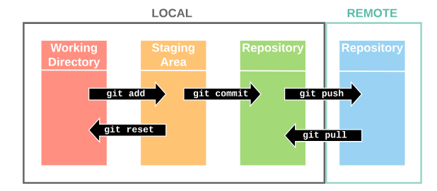
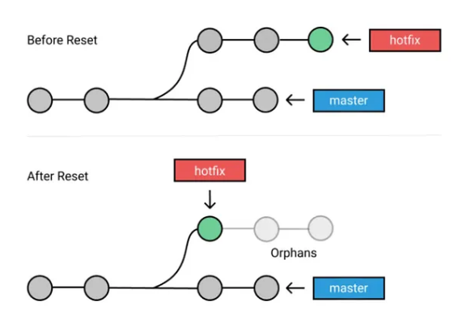

# Git Complete Guide

## Table of Contents
1. [Introduction to Git](#introduction-to-git)
2. [Git Terminology](#git-terminology)
3. [Initial Setup](#initial-setup)
4. [Basic Commands](#basic-commands)
5. [File States](#file-states)
6. [Commit Operations](#commit-operations)
7. [Viewing Changes](#viewing-changes)
8. [Undoing Changes](#undoing-changes)
9. [Branching](#branching)
10. [Merging](#merging)
11. [Remote Repository](#remote-repository)
12. [Advanced Commands](#advanced-commands)
13. [Best Practices](#best-practices)

---

## Introduction to Git

### What is Git?

**Git** is a free and open-source version control system that records changes to a file or set of files over time so that you can recall specific versions later.

### Why Use Git?

- ✅ Track changes in your code
- ✅ Collaborate with team members
- ✅ Revert to previous versions
- ✅ Create branches for features
- ✅ Merge code from multiple developers

---

## Git Terminology

### Working Directory



**Definition:** The directory where developers create and modify files.

```
working-directory/
├── index.html
├── style.css
└── script.js
```

---

### Staging Area (Index)

**Definition:** An intermediate area where files are prepared before committing to the repository.

```
Working Directory → Staging Area → Local Repository
```

---

### Repository

**Definition:** A storage location where Git stores files and metadata.

**Types:**

1. **Local Repository:** Stored on your computer
2. **Remote Repository:** Stored on a server (GitHub, GitLab, Bitbucket)

---

### Commit

**Definition:** The process of saving changes from the staging area to the local repository permanently.

**Each commit has:**
- Unique ID (SHA-1 hash)
- Author information
- Timestamp
- Commit message

---

### Checkout

**Definition:** The process of switching between branches or restoring files from the repository to the working directory.

---

### HEAD

**Definition:** A pointer that always points to the latest commit in the current branch.

```
main branch: C1 → C2 → C3 → HEAD
```

---

## Initial Setup

### Install Git

**Download Git:**
- Windows: https://git-scm.com/download/win
- Mac: `brew install git`
- Linux: `sudo apt-get install git`

---

### Configure Git

```bash
# Set username
git config --global user.name "Your Name"

# Set email
git config --global user.email "your.email@example.com"

# Check configuration
git config --list

# Check specific config
git config user.name
git config user.email
```

---

### Check Git Version

```bash
git --version
# or
git -v
```

**Output:**
```
git version 2.40.0
```

---

## Basic Commands

### Initialize a Git Repository

```bash
# Navigate to your project folder
cd my-project

# Initialize Git repository
git init
```

**Output:**
```
Initialized empty Git repository in /path/to/my-project/.git/
```

**This creates:**
- A hidden `.git` folder
- Tracks all changes in this directory

---

### Check Repository Status

```bash
git status
```

**Output Example:**
```
On branch main
Your branch is up to date with 'origin/main'.

Changes not staged for commit:
  (use "git add <file>..." to update what will be committed)
  (use "git restore <file>..." to discard changes in working directory)
        modified:   index.html

Untracked files:
  (use "git add <file>..." to include in what will be committed)
        script.js

no changes added to commit (use "git add" and/or "git commit -a")
```

---

### Add Files to Staging Area

```bash
# Add a specific file
git add <file-name>
git add index.html

# Add multiple files
git add file1.js file2.css

# Add all files in current directory
git add .

# Add all files with specific extension
git add *.js

# Add all files in the repository
git add -A
```

---

### List Files in Staging Area

```bash
# Show files in staging area
git ls-files

# Show files in working directory
ls
```

---

### Remove Files from Staging Area

```bash
# Remove specific file from staging (unstage)
git reset <file-name>
git reset index.html

# Remove all files from staging
git reset
```

---

## File States

### 1. Untracked Files

**Definition:** Newly created files that Git is not tracking yet.

**Color in git status:** Red

**Example:**
```bash
Untracked files:
  (use "git add <file>..." to include in what will be committed)
        newfile.js
```

---

### 2. Tracked Files

**Definition:** Files that Git is monitoring for changes.

**States of Tracked Files:**

#### a) Unmodified
- File hasn't changed since last commit
- Not shown in `git status`

#### b) Modified
- File has been changed but not staged
- **Color:** Red

**Example:**
```bash
Changes not staged for commit:
        modified:   index.html
```

#### c) Staged
- File is in staging area, ready to commit
- **Color:** Green

**Example:**
```bash
Changes to be committed:
        modified:   index.html
```

---

### File State Flow

```
Untracked → [git add] → Staged → [git commit] → Committed
                ↓
            Modified → [git add] → Staged → [git commit] → Committed
```

---

## Commit Operations

### Create a Commit

```bash
# Commit with message
git commit -m "commit message"

# Commit with detailed message
git commit -m "Title" -m "Description line 1" -m "Description line 2"

# Add and commit in one step (only for tracked files)
git commit -am "commit message"

# Open default editor for commit message
git commit
```

**Best Practice Commit Messages:**
```bash
# Good examples
git commit -m "Add user authentication feature"
git commit -m "Fix login button alignment issue"
git commit -m "Update dependencies to latest versions"

# Bad examples
git commit -m "changes"
git commit -m "update"
git commit -m "fix"
```

---

### View Commit History

```bash
# Full commit log
git log

# One line per commit
git log --oneline

# Show graph with branches
git log --oneline --graph --all

# Show last N commits
git log -n 5

# Show commits by author
git log --author="John Doe"

# Show commits within date range
git log --since="2024-01-01" --until="2024-02-01"

# Show commits affecting specific file
git log -- index.html

# Show detailed changes in each commit
git log -p

# Show statistics
git log --stat
```

**Output Example:**
```bash
git log --oneline

a1b2c3d (HEAD -> main) Add navigation menu
e4f5g6h Fix typo in homepage
i7j8k9l Initial commit
```

---

### Amend Last Commit

```bash
# Change last commit message
git commit --amend -m "New commit message"

# Add forgotten files to last commit
git add forgotten-file.js
git commit --amend --no-edit
```

---

## Viewing Changes

### Git Diff

**Description:** Compare file content between different states.

---

### Compare Working Directory with Staging Area

```bash
# Show all unstaged changes
git diff

# Show changes in specific file
git diff <file-name>
git diff index.html
```

**Output Example:**
```diff
diff --git a/index.html b/index.html
index 1234567..abcdefg 100644
--- a/index.html
+++ b/index.html
@@ -10,7 +10,7 @@
 <body>
-    <h1>Hello World</h1>
+    <h1>Hello Git World</h1>
     <p>Welcome to my website</p>
 </body>
```

**Legend:**
- `-` = Line removed (red)
- `+` = Line added (green)
- `---` = Source file (before changes)
- `+++` = Destination file (after changes)

---

### Compare Staging Area with Last Commit (HEAD)

```bash
# Show staged changes
git diff --staged
# or
git diff --cached

# Show staged changes for specific file
git diff --staged index.html
```

---

### Compare Working Directory with Last Commit

```bash
# Compare with HEAD
git diff HEAD

# Compare specific file with HEAD
git diff HEAD index.html
```

---

### Compare Between Commits

```bash
# Compare two commits
git diff <commit-id1> <commit-id2>
git diff a1b2c3d e4f5g6h

# Compare specific file between commits
git diff <commit-id1> <commit-id2> index.html

# Compare with previous commit
git diff HEAD~1 HEAD
```

---

### View File Content

```bash
# View file content in working directory
cat index.html

# View file content from specific commit
git show <commit-id>:index.html
git show a1b2c3d:index.html

# View file content from HEAD
git show HEAD:index.html
```

---

## Undoing Changes

### Discard Changes in Working Directory (Checkout)

```bash
# Discard changes in specific file (restore from last commit)
git checkout -- <file-name>
git checkout -- index.html

# Discard all changes in working directory
git checkout -- .
```

**⚠️ Note:** 
- Only works on **tracked files**
- Cannot discard changes in **untracked files**
- Changes are permanently lost

**Alternative (Git 2.23+):**
```bash
# Restore file from last commit
git restore <file-name>
git restore index.html

# Restore all files
git restore .
```

---

### Remove Untracked Files

```bash
# Show what will be deleted (dry run)
git clean -n

# Delete untracked files
git clean -f

# Delete untracked files and directories
git clean -fd

# Delete untracked and ignored files
git clean -fdx
```

---

### Git Reset

**Description:** Remove changes from staging area or undo commits.

**Use Cases:**
- Remove files from staging area
- Undo commits
- Move HEAD to a previous commit

---

### Reset from Staging Area

```bash
# Remove specific file from staging
git reset <file-name>
git reset index.html

# Remove all files from staging
git reset
```

---

### Reset Commits (3 Modes)

#### 1. Mixed Mode (Default)

**Description:** 
- Moves HEAD to specified commit
- Removes changes from **staging area**
- Keeps changes in **working directory**

```bash
# Reset to specific commit (mixed mode)
git reset <commit-id>
git reset a1b2c3d

# Reset to HEAD (unstage all changes)
git reset

# Reset to previous commit
git reset HEAD~1
```

**Result:**
- Commits removed ✅
- Staging area cleared ✅
- Working directory unchanged ✅

---

#### 2. Soft Mode

**Description:**
- Moves HEAD to specified commit
- Keeps changes in **staging area**
- Keeps changes in **working directory**

```bash
git reset --soft <commit-id>
git reset --soft a1b2c3d

# Reset to previous commit (keep changes staged)
git reset --soft HEAD~1
```

**Result:**
- Commits removed ✅
- Staging area unchanged ✅
- Working directory unchanged ✅

---

#### 3. Hard Mode

**Description:**
- Moves HEAD to specified commit
- Removes changes from **staging area**
- Removes changes from **working directory**

```bash
git reset --hard <commit-id>
git reset --hard a1b2c3d

# Reset to HEAD (discard all changes)
git reset --hard HEAD

# Reset to previous commit (discard all changes)
git reset --hard HEAD~1
```

**Result:**
- Commits removed ✅
- Staging area cleared ✅
- Working directory cleared ✅

**⚠️ Warning:** Changes are permanently lost!

---

### Reset Comparison Table

| Mode | Commits | Staging Area | Working Directory |
|------|---------|--------------|-------------------|
| **--mixed** | Removed | Cleared | Unchanged |
| **--soft** | Removed | Unchanged | Unchanged |
| **--hard** | Removed | Cleared | Cleared |

---

### Git Revert

**Description:** Create a new commit that undoes changes from a previous commit (safer than reset).

```bash
# Revert specific commit
git revert <commit-id>
git revert a1b2c3d

# Revert without creating commit immediately
git revert -n <commit-id>

# Revert multiple commits
git revert <commit-id1> <commit-id2>
```

**Difference between Reset and Revert:**
- **Reset:** Removes commits from history
- **Revert:** Creates new commit that undoes changes (preserves history)

---

## Branching

### What is a Branch?

**Definition:** A branch is an independent line of development. By default, all code is stored in the **main/master** branch.

**Why Use Branches?**
- Work on features without affecting main branch
- Isolate bug fixes
- Experiment with new ideas
- Collaborate with team members

---

### Branch Visualization

```
main:     C1 ← C2 ← C3 ← C4 (HEAD)
                ↓
         feature: C5 ← C6 (new commits)
```

---

### View Branches

```bash
# List all local branches
git branch

# List all branches (local + remote)
git branch -a

# List remote branches only
git branch -r

# Show current branch
git branch --show-current
```

---

### Create a Branch

```bash
# Create new branch
git branch <branch-name>
git branch feature-login

# Create branch from specific commit
git branch <branch-name> <commit-id>
git branch feature-login a1b2c3d
```

---

### Switch Between Branches

```bash
# Switch to existing branch
git checkout <branch-name>
git checkout feature-login

# Alternative (Git 2.23+)
git switch <branch-name>
git switch feature-login
```

---

### Create and Switch to Branch

```bash
# Create and switch in one command
git checkout -b <branch-name>
git checkout -b feature-login

# Alternative (Git 2.23+)
git switch -c <branch-name>
git switch -c feature-login
```

---

### Rename a Branch

```bash
# Rename current branch
git branch -m <new-name>
git branch -m feature-authentication

# Rename specific branch
git branch -m <old-name> <new-name>
git branch -m feature-login feature-authentication
```

---

### Delete a Branch

```bash
# Delete merged branch
git branch -d <branch-name>
git branch -d feature-login

# Force delete (even if not merged)
git branch -D <branch-name>
git branch -D feature-login

# Delete remote branch
git push origin --delete <branch-name>
git push origin --delete feature-login
```

---

## Merging

### What is Merging?

**Definition:** Combining changes from one branch into another.

---

### Types of Merging

#### 1. Fast-Forward Merge

**When:** No new commits on main branch since feature branch was created.

**Before:**
```
main:    C1 ← C2
               ↓
        feature: C3 ← C4
```

**After:**
```
main:    C1 ← C2 ← C3 ← C4
```

**Command:**
```bash
git checkout main
git merge feature-login
```

---

#### 2. Three-Way Merge (Non-Fast-Forward)

**When:** Both branches have new commits.

**Before:**
```
main:    C1 ← C2 ← C5
               ↓
        feature: C3 ← C4
```

**After:**
```
main:    C1 ← C2 ← C5 ← C6 (merge commit)
                ↓    ↗
        feature: C3 ← C4
```

**Command:**
```bash
git checkout main
git merge feature-login
```

---

### Merge Commands

```bash
# Switch to target branch
git checkout main

# Merge feature branch into main
git merge <branch-name>
git merge feature-login

# Merge with commit message
git merge <branch-name> -m "Merge feature-login into main"

# Merge without fast-forward (create merge commit)
git merge --no-ff <branch-name>

# Abort merge in case of conflicts
git merge --abort
```

---

### Merge Conflicts

**What is a Merge Conflict?**

A conflict occurs when:
- Same file is modified in both branches
- Same line is changed differently
- Git cannot automatically merge

---

### Resolving Merge Conflicts

**Step 1: Attempt Merge**
```bash
git checkout main
git merge feature-login
```

**Output:**
```
Auto-merging index.html
CONFLICT (content): Merge conflict in index.html
Automatic merge failed; fix conflicts and then commit the result.
```

**Step 2: Check Conflicted Files**
```bash
git status
```

**Output:**
```
Unmerged paths:
  (use "git add <file>..." to mark resolution)
        both modified:   index.html
```

**Step 3: Open Conflicted File**

**index.html:**
```html
<body>
<<<<<<< HEAD
    <h1>Welcome to Main Branch</h1>
=======
    <h1>Welcome to Feature Branch</h1>
>>>>>>> feature-login
    <p>Content here</p>
</body>
```

**Conflict Markers:**
- `<<<<<<< HEAD` - Current branch (main) changes
- `=======` - Separator
- `>>>>>>> feature-login` - Incoming branch changes

**Step 4: Resolve Conflict**

Edit the file to keep desired content:

```html
<body>
    <h1>Welcome to Our Website</h1>
    <p>Content here</p>
</body>
```

**Step 5: Mark as Resolved**
```bash
git add index.html
```

**Step 6: Complete Merge**
```bash
git commit -m "Resolve merge conflict in index.html"
```

---

### Alternative Conflict Resolution

```bash
# Use version from current branch (main)
git checkout --ours index.html

# Use version from incoming branch (feature)
git checkout --theirs index.html

# After choosing, complete merge
git add index.html
git commit
```

---

## Remote Repository

### What is a Remote Repository?

**Definition:** A repository hosted on a server (GitHub, GitLab, Bitbucket) that allows collaboration.

---

### Add Remote Repository

```bash
# Add remote repository
git remote add origin <repository-url>
git remote add origin https://github.com/username/repo.git

# View remote repositories
git remote -v

# Show remote details
git remote show origin
```

---

### Clone Repository

```bash
# Clone repository
git clone <repository-url>
git clone https://github.com/username/repo.git

# Clone specific branch
git clone -b <branch-name> <repository-url>
git clone -b develop https://github.com/username/repo.git

# Clone into specific folder
git clone <repository-url> <folder-name>
git clone https://github.com/username/repo.git my-project
```

---

### Push to Remote Repository

```bash
# Push to remote branch
git push <remote> <branch>
git push origin main

# Push all branches
git push --all origin

# Push tags
git push --tags

# Force push (⚠️ use with caution)
git push -f origin main

# Set upstream branch
git push -u origin main
```

---

### Pull from Remote Repository

```bash
# Fetch and merge changes
git pull origin main

# Pull with rebase
git pull --rebase origin main

# Pull all branches
git pull --all
```

---

### Fetch from Remote Repository

```bash
# Fetch changes without merging
git fetch origin

# Fetch specific branch
git fetch origin main

# Fetch all remotes
git fetch --all
```

---

### Remove Remote Repository

```bash
# Remove remote
git remote remove origin

# Rename remote
git remote rename origin upstream
```

---

## Advanced Commands

### Git Stash

**Description:** Temporarily save changes without committing.

```bash
# Stash current changes
git stash

# Stash with message
git stash save "work in progress"

# List all stashes
git stash list

# Apply most recent stash
git stash apply

# Apply specific stash
git stash apply stash@{0}

# Apply and remove stash
git stash pop

# Remove specific stash
git stash drop stash@{0}

# Clear all stashes
git stash clear

# Show stash changes
git stash show
```

---

### Git Tag

**Description:** Mark specific commits (usually for releases).

```bash
# Create lightweight tag
git tag v1.0.0

# Create annotated tag
git tag -a v1.0.0 -m "Release version 1.0.0"

# List all tags
git tag

# Show tag details
git show v1.0.0

# Push tags to remote
git push origin v1.0.0
git push --tags

# Delete tag
git tag -d v1.0.0

# Delete remote tag
git push origin --delete v1.0.0
```

---

### Git Cherry-Pick

**Description:** Apply specific commit from one branch to another.

```bash
# Apply specific commit
git cherry-pick <commit-id>
git cherry-pick a1b2c3d

# Cherry-pick without committing
git cherry-pick -n <commit-id>

# Cherry-pick multiple commits
git cherry-pick <commit-id1> <commit-id2>
```

---

### Git Rebase

**Description:** Reapply commits on top of another base commit.

```bash
# Rebase current branch onto main
git rebase main

# Interactive rebase (last 3 commits)
git rebase -i HEAD~3

# Continue after resolving conflicts
git rebase --continue

# Abort rebase
git rebase --abort
```

---

### Git Blame

**Description:** Show who modified each line of a file.

```bash
# Show line-by-line authorship
git blame <file-name>
git blame index.html

# Show specific line range
git blame -L 10,20 index.html
```

---

### Git Reflog

**Description:** Show history of HEAD movements (useful for recovering lost commits).

```bash
# Show reflog
git reflog

# Recover lost commit
git checkout <commit-id>
```

---

## Best Practices

### 1. Write Meaningful Commit Messages

✅ **Good:**
```bash
git commit -m "Add user authentication with JWT"
git commit -m "Fix navbar alignment on mobile devices"
git commit -m "Update README with installation instructions"
```

❌ **Bad:**
```bash
git commit -m "update"
git commit -m "fix"
git commit -m "changes"
```

---

### 2. Commit Often

- Make small, logical commits
- Each commit should represent one change
- Easier to track and revert

---

### 3. Use Branches for Features

```bash
# Create feature branch
git checkout -b feature-user-profile

# Work on feature
git add .
git commit -m "Add user profile page"

# Merge when ready
git checkout main
git merge feature-user-profile
```

---

### 4. Pull Before Push

```bash
# Always pull latest changes before pushing
git pull origin main
git push origin main
```

---

### 5. Review Changes Before Committing

```bash
# Check what you're committing
git status
git diff
git diff --staged

# Then commit
git commit -m "message"
```

---

### 6. Keep Main Branch Stable

- Never commit directly to main
- Always use feature branches
- Test before merging

---

### 7. Use .gitignore

**Create `.gitignore` file:**

```
# Node modules
node_modules/

# Environment variables
.env

# Build files
dist/
build/

# IDE files
.vscode/
.idea/

# OS files
.DS_Store
Thumbs.db
```

---

### 8. Protect Sensitive Data

- Never commit passwords or API keys
- Use environment variables
- Add sensitive files to `.gitignore`

---

## Git Workflow Example

### Complete Workflow

```bash
# 1. Clone repository
git clone https://github.com/username/repo.git
cd repo

# 2. Create feature branch
git checkout -b feature-navbar

# 3. Make changes
# ... edit files ...

# 4. Check status
git status

# 5. Stage changes
git add .

# 6. Commit changes
git commit -m "Add responsive navbar"

# 7. Push feature branch
git push -u origin feature-navbar

# 8. Create Pull Request on GitHub

# 9. After review, merge to main
git checkout main
git pull origin main
git merge feature-navbar

# 10. Push to main
git push origin main

# 11. Delete feature branch
git branch -d feature-navbar
git push origin --delete feature-navbar
```

---

## Git Practice Resources

### Interactive Learning

- **Git School:** https://git-school.github.io
- **Learn Git Branching:** https://learngitbranching.js.org
- **GitHub Skills:** https://skills.github.com

---

## Common Git Errors and Solutions

### 1. Merge Conflict

**Error:**
```
CONFLICT (content): Merge conflict in file.txt
```

**Solution:**
```bash
# Edit conflicted file
# Remove conflict markers
git add file.txt
git commit
```

---

### 2. Pushed to Wrong Branch

**Solution:**
```bash
# Reset local branch
git reset --hard HEAD~1

# Force push
git push -f origin branch-name
```

---

### 3. Forgot to Add File to Commit

**Solution:**
```bash
# Add forgotten file
git add forgotten-file.js

# Amend last commit
git commit --amend --no-edit
```

---

### 4. Committed to Wrong Branch

**Solution:**
```bash
# Create new branch with current changes
git branch correct-branch

# Reset current branch
git reset --hard HEAD~1

# Switch to correct branch
git checkout correct-branch
```

---

## Git Cheat Sheet

### Setup
```bash
git config --global user.name "Name"
git config --global user.email "email@example.com"
git init
```

### Basic Commands
```bash
git status
git add <file>
git add .
git commit -m "message"
git log
git log --oneline
```

### Branching
```bash
git branch
git branch <name>
git checkout <name>
git checkout -b <name>
git merge <branch>
```

### Remote
```bash
git remote add origin <url>
git push origin <branch>
git pull origin <branch>
git clone <url>
```

### Undo
```bash
git checkout -- <file>
git reset <file>
git reset --hard HEAD
git revert <commit-id>
```

---

