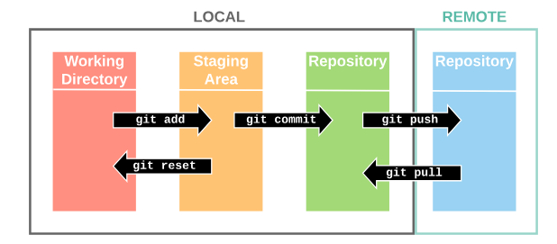
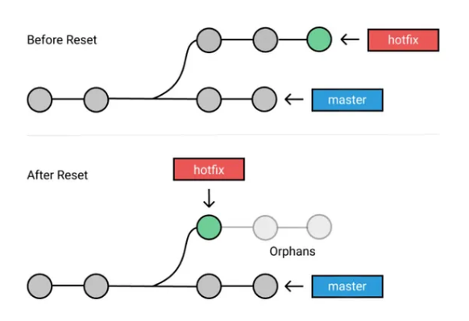

# Git Complete Guide

## Table of Contents
1. [Introduction to Git](#introduction-to-git)
2. [Git Terminology](#git-terminology)
3. [Initial Setup](#initial-setup)
4. [Basic Commands](#basic-commands)
5. [File States](#file-states)
6. [Commit Operations](#commit-operations)
7. [Viewing Changes](#viewing-changes)
8. [Undoing Changes](#undoing-changes)
9. [Branching](#branching)
10. [Merging](#merging)
11. [Remote Repository](#remote-repository)
12. [Advanced Commands](#advanced-commands)
13. [Best Practices](#best-practices)

---

## Introduction to Git

### What is Git?

**Git** is a free and open-source version control system that records changes to a file or set of files over time so that you can recall specific versions later.

### Why Use Git?

- ✅ Track changes in your code
- ✅ Collaborate with team members
- ✅ Revert to previous versions
- ✅ Create branches for features
- ✅ Merge code from multiple developers

---

## Git Terminology

### Working Directory



**Definition:** The directory where developers create and modify files.

```
working-directory/
├── index.html
├── style.css
└── script.js
```

---

### Staging Area (Index)

**Definition:** An intermediate area where files are prepared before committing to the repository.

```
Working Directory → Staging Area → Local Repository
```

---

### Repository

**Definition:** A storage location where Git stores files and metadata.

**Types:**

1. **Local Repository:** Stored on your computer
2. **Remote Repository:** Stored on a server (GitHub, GitLab, Bitbucket)

---

### Commit

**Definition:** The process of saving changes from the staging area to the local repository permanently.

**Each commit has:**
- Unique ID (SHA-1 hash)
- Author information
- Timestamp
- Commit message

---

### Checkout

**Definition:** The process of switching between branches or restoring files from the repository to the working directory.

---

### HEAD

**Definition:** A pointer that always points to the latest commit in the current branch.

```
main branch: C1 → C2 → C3 → HEAD
```

---

## Initial Setup

### Install Git

**Download Git:**
- Windows: https://git-scm.com/download/win
- Mac: `brew install git`
- Linux: `sudo apt-get install git`

---

### Configure Git

```bash
# Set username
git config --global user.name "Your Name"

# Set email
git config --global user.email "your.email@example.com"

# Check configuration
git config --list

# Check specific config
git config user.name
git config user.email
```

---

### Check Git Version

```bash
git --version
# or
git -v
```

**Output:**
```
git version 2.40.0
```

---

## Basic Commands

### Initialize a Git Repository

```bash
# Navigate to your project folder
cd my-project

# Initialize Git repository
git init
```

**Output:**
```
Initialized empty Git repository in /path/to/my-project/.git/
```

**This creates:**
- A hidden `.git` folder
- Tracks all changes in this directory

---

### Check Repository Status

```bash
git status
```

---

### List Files in Staging Area

```bash
# Show files in working directory
ls
```

---

## File States

### 1. Untracked Files

**Definition:** Newly created files that Git is not tracking yet.

**Color in git status:** Red

**Example:**
```bash
Untracked files:
  (use "git add <file>..." to include in what will be committed)
        newfile.js
```

---

### 2. Tracked Files

**Definition:** Files that Git is monitoring for changes.

**States of Tracked Files:**

#### a) Unmodified
- File hasn't changed since last commit
- Not shown in `git status`

#### b) Modified
- File has been changed but not staged
- **Color:** Red

**Example:**
```bash
Changes not staged for commit:
        modified:   index.html
```

#### c) Staged
- File is in staging area, ready to commit
- **Color:** Green

**Example:**
```bash
Changes to be committed:
        modified:   index.html
```

---

### Git Reset

**Description:** Remove changes from staging area or undo commits.

**Use Cases:**
- Remove files from staging area
- Undo commits
- Move HEAD to a previous commit

---

### Reset from Staging Area

```bash
# Remove specific file from staging
git reset <file-name>
git reset index.html

# Remove all files from staging
git reset
```

---

### Reset Commits (3 Modes)

#### 1. Mixed Mode (Default)

**Description:** 
- Moves HEAD to specified commit
- Removes changes from **staging area**
- Keeps changes in **working directory**

```bash
# Reset to specific commit (mixed mode)
git reset <commit-id>
git reset a1b2c3d

# Reset to HEAD (unstage all changes)
git reset

# Reset to previous commit
git reset HEAD~1
```

**Result:**
- Commits removed ✅
- Staging area cleared ✅
- Working directory unchanged ✅

---

#### 2. Soft Mode

**Description:**
- Moves HEAD to specified commit
- Keeps changes in **staging area**
- Keeps changes in **working directory**

```bash
git reset --soft <commit-id>
git reset --soft a1b2c3d

# Reset to previous commit (keep changes staged)
git reset --soft HEAD~1
```

**Result:**
- Commits removed ✅
- Staging area unchanged ✅
- Working directory unchanged ✅

---

#### 3. Hard Mode

**Description:**
- Moves HEAD to specified commit
- Removes changes from **staging area**
- Removes changes from **working directory**

```bash
git reset --hard <commit-id>
git reset --hard a1b2c3d

# Reset to HEAD (discard all changes)
git reset --hard HEAD

# Reset to previous commit (discard all changes)
git reset --hard HEAD~1
```

**Result:**
- Commits removed ✅
- Staging area cleared ✅
- Working directory cleared ✅

**⚠️ Warning:** Changes are permanently lost!

---
🌿 Git Workflow
Branch Naming Conventions

in cmd tyle ls to see folders
and tree for structure

Redux Repository Branches:
# Global labor posted unit
development/mcr-global-posted-attribute-enhance

# Local labor posted unit  
development/mcr-local-posted-attribute-enhance

# General pattern
development/mcr-story-[story-number]-[brief-description]
development/mcr-task-[task-number]-[brief-description]

UX Repository Branches:
# Example
development/mcr-mig-workorder-technician-name-label-v2

# General pattern
development/mcr-[type]-[feature-description]-[version]

Git Commands Workflow

npm login

# Normal start → use plain clone
git clone https://github.com/org/project.git

# When someone shares a specific branch to work on
git clone -b feature/payment https://github.com/org/project.git

# Initial setup
git init
npm i --verbose
git fetch
git fetch origin

git pull origin main

# Create new branch
git checkout -b "development/mcr-task-1234-technician-display"

# Check branch
git branch

# Check difference
git status / git diff
git diff src/file.tsx 

# Compare two commits
git diff <commit-id1> <commit-id2>
git diff a1b2c3d e4f5g6h

# Compare with previous commit
git diff HEAD~1 HEAD

# List all stashes
git stash list

# Stage changes
git add .                    # stages ALL changed files
git add src/file.tsx         # stages ONLY this one file
git add src/components/      # stages all files inside folder
git add file1.js file2.css   # Add multiple files
git add *.js                 # Add all files with specific extension

# Stage Changes with commit
git commit -m "WIP: technician display logic implementation"
Best Practice Commit Messages:
#✅ Good examples
git commit -m "Add user authentication feature"
git commit -m "Fix login button alignment issue"
git commit -m "Update dependencies to latest versions"

# for retriggure jenkins
git commit --allow-empty -m "trigger jenkins" then push

# for Shows commit history in compact single-line format
git log --oneline

# Stash work (with descriptive name)
git stash push -m "WIP: technician display logic implementation"

# Applies most recent stash (stash@{0})
git stash pop   (REMOVES stash from list)
git stash apply (KEEPS stash in list)

# Stash REMAINS in stash list after apply
git stash apply "stash@{1}"

# delete all stashes
git stash clear

# Push branch
git push origin feature/new   //Pushes branch to remote one time Next time you still have to type full command
git push -u origin development/mcr-my-branch  //Pushes branch AND links local branch to remote branch permanently,After this, just typing git push or git pull is enough

# Show last commit with file changes/full difference
git show --stat  or git show

# Show commits with one line each show last 10 commit
git log --oneline -10

# see Last 5 changes (with PR number) to a file
git log --oneline -5 src/components/suppliers/components/SuppliersList.tsx

# discard ALL unstaged changes
git restore .                         

# Bring all changes from a specific commit
git cherry-pick <commit-id>
git cherry-pick <commit-id1> <commit-id2>
git cherry-pick abc1234 def5678

# Push with Skip Hooks
git push origin development/mcr-my-branch --no-verify
git push origin development/mcr-my-branch --no-verify  --force

# Force Push Feature Branch
git push -f origin feature-branch

# Before push - validate
npm run validate-ts

# Install Specific UX Component Version
npm i @mitchell/react.component.ux@2.2.xxxxxx

# Reset to last commit, DESTROYS all uncommitted changes
git reset --soft HEAD~1
git reset --hard
git reset --hard <commit-hash>
git reset <file-name> # Remove specific file from staging (unstage)

# revert last push commit
git revert HEAD
git push

# Revert specific commit
git revert <commit-id>
git revert a1b2c3d

# Revert multiple commits
git revert <commit-id1> <commit-id2>

# Rebase feature branch onto main
git checkout feature-branch
git rebase main

# Abort rebase
git rebase --abort

# Fetches changes from remote and rebases your local commits on top instead of creating a merge commit
git pull --rebase origin main

Handling Merge Conflicts
# In terminal when conflict occurs:
# 1. Press ESC
# 2. Type: :wq
# 3. Press Enter

# Alternative - resolve in VS Code:
# 1. Open conflicted files
# 2. Choose "Accept Current Change" or "Accept Incoming Change"
# 3. Save and commit

# Clears npm's local package cache stored on your machine
npm cache clean --force
#Rebuilds the barrel file (index.ts) transform cache for your monorepo
npm run build-barrel-transform

jenkins Fails check
npm ci && npm run lint && npm run build && npm run test

📝 Git Push Error Fix - Quick Reference Note
🚨 When You See This Error:
To https://github.com/enlyte-apd/monorepo-react-redux-module.git
 ! [rejected]              development/mcr-local-labor-post-screen -> development/mcr-local-labor-post-screen (non-fast-forward)
error: failed to push some refs to 'https://github.com/enlyte-apd/monorepo-react-redux-module.git'      
hint: Updates were rejected because the tip of your current branch is behind
hint: its remote counterpart. If you want to integrate the remote changes,
hint: use 'git pull' before pushing again.
hint: See the 'Note about fast-forwards' in 'git push --help'

🔧 Quick Fix Steps:
Step 1: Pull Remote Changes
git pull origin your-current-branch

Step 2: Exit Merge Editor or merge conflict(resolved)
:wq enter

Step 3: Push Again
git push origin your-current-branch --force


📝 Git Pull Unnecessory commit come Fix - Quick Reference Note

git checkout main
git pull origin main
git checkout origin your-current-branch
git rebase main

if [conflict (Esc → :wq → Enter)]
   resolve commit 
   git rebase --continue
   git push origin feature-branch --no-verify --force

else 
   nothing


