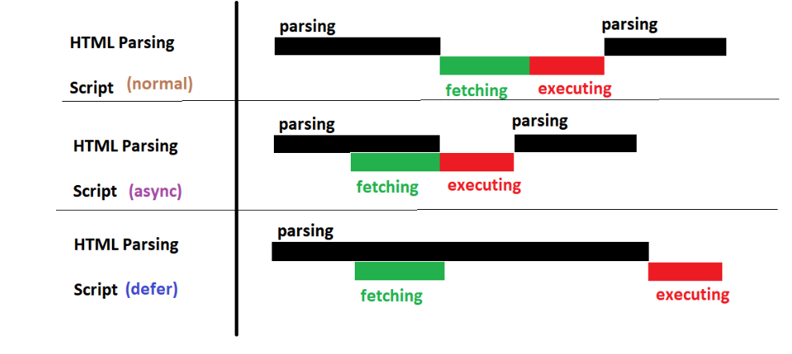

HTML NOTES
====================

**Q1: web browser and how it works?**  

web browser is a s/w application for retrieving presenting info on www e.g google chrome
When a browser loads a webpage, it first downloads the HTML file and starts parsing it to build the DOM tree.
Then it fetches and parses CSS and combines both into a Render Tree.Finally, it executes JavaScript
```txt

   ┌──────────────────────────┐
   │ 1. User enters URL       │
   └───────────────┬──────────┘
                   ↓
   ┌──────────────────────────┐
   │ 2. Browser checks cache  │
   └───────────────┬──────────┘
                   ↓
   ┌──────────────────────────┐
   │ 3. DNS Lookup            │
   │    → Find Server IP      │
   └───────────────┬──────────┘
                   ↓
   ┌──────────────────────────┐
   │ 4. Browser sends request │
   │    (HTTP / HTTPS)        │
   └───────────────┬──────────┘
                   ↓
   ┌──────────────────────────┐
   │ 5. Server responds       │
   │    (HTML / CSS / JS)     │
   └───────────────┬──────────┘
                   ↓
   ┌──────────────────────────┐
   │ 6. Browser Parse HTML    │
   │    and CSS, Render Tree  |
   └───────────────┬──────────┘
                   ↓
   ┌──────────────────────────┐
   │ 7. Layout & Paint        │
   └───────────────┬──────────┘
                   ↓
   ┌──────────────────────────┐
   │ 8. JavaScript runs       │
   └───────────────┬──────────┘
                   ↓
   ┌──────────────────────────┐
   │ 9. web page displayed    │
   └──────────────────────────┘


```
**Q2. How browsers parse HTML and build the DOM tree internally?**  

Browser reads HTML top to bottom, breaks it into tokens, converts tokens into nodes,and links these nodes like a family tree, where html becomes the root, and everything inside becomes its children and connects them into a tree structure called DOM.
```txt
html
└── body
    └── h1
        ├── (attribute) class="heading"
        └── "Hi"

```

**Q3.How are HTML documents tokenized by browsers?**  

Browser reads HTML like a scanner, character by character, and makes tokens
example
```js
<h1 class="heading">Hi</h1> becomes:
  StartTagToken("h1")
  AttributeToken("class", "heading")
  TextToken("Hi")
  EndTagToken("h1")
```

**Q4: What is HTML and why is it important?**  

 HTML (HyperText(text with links that connect one page to another) Markup Language) structures web content. It defines the layout and semantic meaning of elements (headings, paragraphs, links, forms, etc.).  

- version of html are  

html 1.0 html2.0 html 3 html 4 html 5
- HTML5 features  

new element new attribute multimedia 2d 3d drawing support, drag and drop support

**Q5: What are semantic tags? Give examples and benefits**  

 A semantic element clearly describes its meaning to both the browser and the developer.
- Examples of non-semantic elements: div and span - Tells nothing about its content.
- Examples of semantic elements: img, table, header,nav,footer, article - Clearly defines its content.
- benefits:Improves readability & code clarity for developers, improve SEO and Accessibility friendly – screen readers understand sections easily.
```txt
+-------------------------------+
|            <header>           |
+-------------------------------+
|  <nav>      |     <aside>     |
|  <article>  |                 |
| <section>   |   (sidebar)     |
| (content)   |                 |
+-------------------------------+
|             <footer>          |
+-------------------------------+
```

**Q6: What is the difference between div and section?**  

 div is a generic(block-level) container takes full width by default, no semantic meaning.it has no meaning used for layout. 
 ```js
<div  class="card">
  ...
</div>

 ``` 

section groups related content with semantic meaning.represent a standalone section  of content and help in seo and accessibility.
```js
<section aria-label="Testimonials" class="card">
  ...
</section>

```

**Q7: Field set**  

fieldset element is used to group  related control in a single box.It improves accessibility (screen readers) and form structure. in survey / form / payment section you can use 
```js
<fieldset>
  <legend>Payment Method</legend>
  <input type="radio" name="pay"> UPI
  <input type="radio" name="pay"> Card
</fieldset>

```
**Q8: What is the difference between inline, block, and inline-block elements?**
- Inline: does not start on new line (e.g., span, a)
- Block: starts on new line, takes full width (e.g., div, p)
- Inline-block: stays inline but allows setting width/height.(e.g., make 3 div inline using inline-block)

**Q9: What is DOCTYPE and why is it used?**  

 <!DOCTYPE html> tells the browser to render the page in standards mode using HTML5 syntax.

**Q10: What are HTML meta tags?**  

 meta provides metadata about a web page.
Examples:
```js
<meta charset="UTF-8">
<meta name="viewport" content="width=device-width, initial-scale=1.0">
```
- UTF-8 is the most common encoding and supports almost all characters in all languages.
- viewport → Controls layout on mobile devices.
- width=device-width → Sets the viewport width equal to the device width.
initial-scale=1.0 → Sets the initial zoom level when the page loads.

**Q11: What are global attributes in HTML?**  

 Attributes applicable to any element.
Examples: id, class, style, title, data-*.

**Q12: Explain the difference between script async, and defer explain**
- Normal <script>: blocks rendering until script loads.Browser stops building DOM until the script downloads and runs. when your script must run before HTML is fully loaded
```js
<script>
  console.log("Normal script → Runs immediately");
</script>

```
- async: loads in parallel and executes immediately. async doesn’t block parsing but runs as soon as it loads.use for scripts that don't depend on DOM like analytics, ads, trackers
```js
<script async src="ad.js"></script>
<script async src="analytics.js"></script>

``` 
- defer: loads in parallel(non-blocking) but executes after HTML parsing.use for Scripts that need DOM ready like Modern websites
```js
<script defer src="main.js"></script>
```
- type="module":it automatically behaves like defer, and supports import / export and also run in strict mode
```js
<script type="module" src="main.js"></script>
```
 

**Q13: What are forms in HTML? Form Validation Attributes**  

Forms collect user input using form, input, textarea, select, button.  
Form validation attribute are required,min/max,type="email/tel/password" multiple disable autocomplete
Example:

```txt
  <form id="my-form">
    <input type="text" placeholder="Name" />
    <button type="submit">Submit</button>
  </form>
```

**Q14: Difference between GET and POST method?**
- GET: sends data in URL, used for data retrieval.
- POST: sends data in body, used for data creation or sensitive info.

**Q15: What are data- attributes?**  

Used to store custom data in HTML elements.Accessible via JavaScript using dataset.
Example: 
```js
<div data-user="sam" data-id="101">Hello</div>
const div = document.querySelector('div');
console.log(div.dataset.user); // Output: "sam"
console.log(div.dataset.id);   // Output: "101"
```

**Q16: What is the difference between b and strong, i and em?**
- b and strong: b represent bold text(visual only) but strong is a semantic tag and bold by default and accessibility and seo friendly.
- i and em: i represent italic text(visual only) but em is a semantic tag and italic by default and accessibility and seo friendly.

**Q17: What is the purpose of link tag?**  

 Used to link external resources like CSS files or icons.
Example:
```js
 <link rel="stylesheet" href="style.css">
 ```

**Q18: What is accessibility (a11y)?**  

 Making web pages usable for all users including people with disabilities.
Use semantic HTML, ARIA roles, alt attributes, keyboard navigation.
Use semantic HTML, ARIA roles, alt text, keyboard navigation, and proper color contrast

**Q19: What is the difference between  alt and title attributes?**  

- alt: alternative text shown if image fails to load (important for accessibility)
- title: tooltip text shown on hover.

**Q20: What are HTML entities?**  

 Used to display reserved characters.
Example: &lt; for < , &gt; for > , &nbsp; for space.

**Q21: What is lazy loading for images?**  

 Defers image loading until it enters the viewport.
Example:
```js
 
```

**Q22: What are the new features in HTML5?**  

- New semantic elements (header, footer, article, nav)
- Audio and video tags
- Canvas and SVG
- LocalStorage, SessionStorage
- Geolocation API
- Form enhancements (email, date, number)

**Q23: What is the difference between localStorage, sessionStorage, and cookies?**  

- localStorage: persistent key-value storage
- sessionStorage: clears when tab closes
- cookies: small data sent with every HTTP request (used for auth/tracking)

**Q24: What are canvas and svg?**
- canvas: used for drawing via JavaScript (pixel-based)
```js
<canvas id="c" width="100" height="100"></canvas>
```
- svg: scalable vector graphics (markup-based)
```js
<svg width="100" height="100">
  <circle cx="50" cy="50" r="40" stroke="green" stroke-width="4" fill="yellow" />
</svg>

<svg width="400" height="120">
  <rect x="10" y="10" width="200" height="100" stroke="red" stroke-width="6" fill="blue" />
</svg>
```

**Q25: Explain template tag.**  

The template tag is used to store HTML content that is not rendered on the page until you manually insert it using JavaScript.it is hidden by default so it prevents hidden elements from being rendered.It is useful when you need to clone, repeat, or dynamically inject HTML.
Example:
```js
<template id="card-template">
  <div class="card">
    <h3></h3>
    <p></p>
  </div>
</template>
```
**Q26: What is the difference between HTMLCollection and NodeList?**  

- HTMLCollection: live, updates automatically.Returned by methods like document.getElementsByTagName() or getElementsByClassName()
- NodeList: static, doesn't auto-update.Returned by document.querySelectorAll() or childNodes also can use forEach directly for loop

**Q27: What are ARIA roles?**  

ARIA (Accessible Rich Internet Applications) roles provide extra semantic meaning to HTML elements so that screen readers and assistive technologies can understand their purpose.
Example:
```js
 <div role="button" tabindex="0">Open Menu</div>
<button role="switch" aria-checked="false">
  Dark Mode
</button>
```

**Q28: What is Shadow DOM?**  

Shadow DOM is used to encapsulate (protect) a component's HTML, CSS, and behavior so it does not leak out and does not get affected by the external page
 Encapsulates HTML structure and CSS styles, preventing them from affecting the main DOM
```txt
 Main DOM
 ├── <div id="host">
 │     └── Shadow DOM
 │          ├── <style>p { color: red; }</style>
 │          └── <p>Shadow DOM content</p>
 └── <p>Normal DOM content</p>
```

**Q29: Explain difference between relative and absolute paths in HTML.**
- Relative: based on current file location (e.g., ./images/pic.jpg)
- Absolute: full URL (e.g., https://site.com/images/pic.jpg)  
Absolute paths are recommended because they are stable, readable, and less likely to break when the file structure changes so many framework like Nextjs allow aliases like @

**Q30: What is the difference between noscript and script?**  

noscript displays fallback content when JS is disabled.

**Q31: Explain contenteditable attribute.**  

Makes an element editable directly in the browser.
Example: 
```js
<div contenteditable="true"></div>
```

**Q32: What is the purpose of <iframe>?**  

Used to embed another HTML page inside current page.
Example:
```js
 <iframe src="https://example.com"></iframe>
```

**Q33: What is cross-origin resource sharing (CORS)?**  

A security feature that restricts how resources can be fetched from another domain.
it improves Security and avoids browser blocking of cross-domain API requests  

**Q34: How do you optimize HTML for SEO?**  

- Use semantic tags ( header, main, article, nav )
- Proper headings ( H1–H6 )
- Meta tag - title, description, viewport
- Alt attributes for images
- Structured data

**Q35: Difference between article, section, and aside**  

- article → Represents independent, self-contained content (e.g., blog post, news item).
- section → Groups related content within a document (e.g., chapters, tabs).
- aside → Holds secondary content (e.g., sidebar, ads, related links).

**Q36: What are HTML5 APIs (like localStorage, canvas, geolocation)?**  

localStorage / sessionStorage: Store key-value data in browser.
```js
localStorage.setItem('name', 'Sam');
console.log(localStorage.getItem('name'));
```
Canvas API: Draw 2D graphics dynamically using JS.
```js
<canvas id="myCanvas" width="100" height="50"></canvas>
```
Geolocation API: Access user’s location (with permission).
Drag & Drop, Web Storage, Web Workers, Audio/Video are also HTML5 APIs

**Q37: Difference between HTML entities and characters?**  

Entities are used to display reserved or special characters in HTML. such as greater than less than  

Characters are the actual visual symbols, entities are encoded forms.  

Example: &lt; displays <, &nbsp; displays a non-breaking space.
```js
<p>Character: <</p>
<p>Entity: &lt;</p>
```
**Q38:Difference between strong and b tags**  

b → purely visual (bold text).  

strong → semantic; conveys importance (screen readers emphasize it).

**Q39: How to lazy load images in HTML?**  

Use loading="lazy" attribute:
```js

```
transition:
css transition  allow you to change property value smoothly over a given duration 

**Q40:HTML Elements**  

Building blocks of a webpage (e.g., div, p, a).
 Each element has opening tag and closing tag.
Can be nested inside each other.

**Q41:HTML Attributes**  

→ Provide extra info to elements.  

→ Written inside the opening tag.
Example:
```js

```
→ Common ones: id, class, href, src, title, style

**Q42:Blockquote for Quotations and cite tag**  

→ Used for long quoted text.
```js
<blockquote cite="https://example.com">
  This text is quoted from another source.
</blockquote>
```
cite tag represents the title of a work (book, article, song, film, etc.) or the name of a creative work.
```js
<p>My favorite book is <cite>The Hobbit</cite>.</p>
```

**Q43: img vs picture Elements**  

→ img → single image file.  

→ picture → multiple image sources for responsive design so the browser can choose the best image based on screen size, device resolution.To improve performance and image clarity we use
```js
  <picture>
    <source srcset="product-large.webp" type="image/webp" media="(min-width: 1024px)">
    <source srcset="product-medium.jpg" media="(min-width: 600px)">
  </picture>
```
**Q44:HTML Tables**  

→ Used to display data in rows and columns.
Example:
```js
<table>
  <tr>
    <th>Name</th>
    <th>Age</th>
  </tr>
  <tr>
    <td>Sam</td>
    <td>25</td>
  </tr>
</table>
<style>
table, th, td {
  border: 1px solid red;
}
table{
  width: 100%;
  border-collapse: collapse;
  table-layout:fixed;//auto
}
th,td{
  padding:10px;
  text-align:center;
}
</style>
```
**Q45: HTML Forms handle form state and validation**  

→ action defines where data goes.  

→ input collects info, submit sends it.  

Form States:
- Empty: Form fields are untouched or no value entered.
- Valid: Input matches required rules (e.g., correct email or pattern).
- Invalid: Input breaks rules (e.g., wrong format, missing required value).
- Submitted: Form is submitted (can check via :valid and :invalid before/after submit).
Validation:
- Use attributes like required, min, max, minlength, maxlength, pattern
-Use :valid and :invalid pseudo class to style based on validation state
```js
<form action="/submit">
  <input type="email" required placeholder="Enter Email" />
  <button type="submit">Submit</button>
</form>

<style>
  input:invalid { border: 2px solid red; }
  input:valid { border: 2px solid green; }
</style>

```

**Q46:HTML Video and Controls and Audio tag**  

→ Used to embed videos with play/pause buttons.
```js
<video width="300" controls>
  <source src="movie.mp4" type="video/mp4">
</video>

<audio controls>
  <source src="song.mp3" type="audio/mpeg" />
</audio>
```
**Q47: What is a Description List?**  

Used to display terms and descriptions (like glossary, FAQs)
```js
<dl>
  <dt>HTML</dt>
  <dd>Markup language for web pages.</dd>
</dl>

```
**Q48: Ordered & Unordered List**  
Ordered list ol → numbered list  
Unordered list ul → bullet list
```js
  <ol>
    <li>One</li>
  </ol>
  <ul>
    <li>Item</li>
  </ul>
```
order list types Number(1 default),Uppercase and lowercase letters(A B),Uppercase and lowercase Roman(I i),circle,dise,square  

**Q49: What is an Image Map?**  
Clickable areas inside a single image, each linking to different pages.
Use: dashboards, maps, diagrams.
```js

<map name="map">
  <area shape="rect" coords="0,0,50,50" href="asia.html">
</map>
```
**Q50:Marquee Tag**  

<marquee> creates scrolling text/image.
Deprecated in HTML5 (not recommended).
```js
<marquee>Scrolling Text</marquee>
```

**Q51: what is datalist?**  
datalist provides autocomplete suggestions for an input field.
The user can either type freely or pick suggestions from the list
```js
 <input list="fruits">

<datalist id="fruits">
  <option value="Apple">
  <option value="Banana">
  <option value="Cherry">
  <option value="Mango">
  <option value="Orange">
</datalist>
```

**Q52.what is base, code, pre, dialog, details and summary, progress, meter, address tag?**  
base tag: specifies the base URL and target for all relative URLs in a document.
```js
<head>
  <base href="https://example.com/">
</head>
```
code tag: Used to display inline code snippets in a monospace font.
```js
<p>To print something in JS, use <code>console.log()</code>.</p>

```
pre tag: preserve whitespace and line breaks — shows text in a monospace font exactly as typed.
```js
<pre>
function greet() {
  console.log("Hello");
}
</pre>

```
dialog tag:creates a popup dialog / modal, which you can open using JavaScript.
```js
<dialog id="popup">
  <p>This is a dialog box!</p>
  <button onclick="popup.close()">Close</button>
</dialog>

<button onclick="popup.showModal()">Open Dialog</button>

```
details
 and summary: Creates a collapsible section. summary is the title, details contains hidden content
```js
<details>
  <summary>Click to see more</summary>
  <p>This is hidden content!</p>
</details>

```
meter tag:displays a measurement within a known range (ex: battery level, temperature).
```js
<label>Battery Level:</label>
<meter value="0.7" min="0" max="1">70%</meter>

```
address tag:contact information for the nearest article/section/author — usually rendered in italics by browsers.
```js
<address>
  John Doe<br>
  <a href="mailto:john@example.com">john@example.com</a>
</address>

```
**Q53: why br called empty/void element?**  

because it has no content like img, hr, input, meta, link.

**Q54: does hyperlink only apply to text?**  

text and image both
```js
<a href="https://example.com" style="display: inline-block;">
  
  <span>Buy this Product</span>
</a>

```
**Note:** 
- target attribute in a  
1. target="_blank" open link in new tab
2. target="_self" open link in same tab
- download attribute in a
download this resource instead of navigating.
1. download="report.pdf"

**Q55.What are Core Web Vitals?**  
Core Web Vitals are Google’s way of checking if your website feels fast and smooth for real users.
They test three things:

Loading → How fast can they see the main content?
Interactivity → How quickly does your site react when they click?
Visual Stability → Does the layout jump around?

**Q56.List of Core Web Vitals**

LCP – Largest Contentful Paint
FID – First Input Delay
CLS – Cumulative Layout Shift
INP – Interaction to Next Paint (new, replaces FID)

**Q57.LCP (Largest Contentful Paint)**

Imagine a user enters your restaurant — the first thing they notice is the main dish arriving.
LCP measures how fast the largest visible element (banner, hero image, big heading) loads.
💚 How to Improve LCP

Use WebP / AVIF images
Compress images
Preload important hero image
Use a CDN
Reduce render-blocking CSS/JS
Use SSR or Static Rendering

**Q58.CLS (Cumulative Layout Shift)**

This is about shakiness.
If your website jumps around while loading (ads pushing content, images suddenly resizing), users get a bad experience.

🎯 Goal: Keep CLS near 0

✔ Reduce CLS
Always set width + height for images
Reserve space for ads/widgets
Avoid content shifting after load

**Q59.TTFB (Time To First Byte)**

This checks how fast your server sends the first byte.
Imagine ordering food — TTFB is the time the waiter takes to respond with a menu.
✔ Improve TTFB
Use a CDN
Cache responses
Optimize backend queries
Reduce server bottlenecks

**Q60.Tools to Measure Core Web Vitals**

Lighthouse
Google PageSpeed Insights
Chrome DevTools (Performance tab)
Web Vitals JS library
Google Search Console → Core Web Vitals Report

**Q61.Why Web Vitals Fail in Real Projects**

Very large, unoptimized images
Too much JavaScript
No caching
Too many custom fonts
Third-party scripts
Slow backend APIs

**Q62.Service Worker**

Imagine hiring a smart assistant who works in background:
Can serve cached food when kitchen (internet) is offline
Speeds up repeat customers
Can deliver notifications
Works even when restaurant (browser tab) is closed
That’s a Service Worker.

**Q63.Video Performance Optimization**

Videos are like heavy dishes — great but hard to serve fast.
✔ Improve Video Performance
Use WebM, AV1, MP4
Lazy load videos
Use a poster image for loading
Avoid autoplay
Use HLS / DASH for streaming

**Q64.Critical Rendering Path (CRP)**  
```txt
                ┌────────────────────────┐
                │        HTML File        │
                └────────────┬───────────┘
                             │
                             ▼
                     Build the DOM
                             │
                             ▼
                ┌────────────────────────┐
                │       CSS Files         │
                └────────────┬───────────┘
                             │
                             ▼
                     Build the CSSOM
                             │
                             ▼
                  ┌──────────────────┐
                  │   Render Tree    │
                  │  (DOM + CSSOM)   │
                  └─────────┬────────┘
                            │
                            ▼
                         Layout
               (Calculate positions & size)
                            │
                            ▼
                          Paint
                (Draw pixels on layers)
                            │
                            ▼
                       Composite
              (Combine layers on screen)
                            │
                            ▼
                         Display

```
**Q65.Render Blocking vs Parser Blocking**
- for render blocking
Browser cannot show UI until loaded
Examples:
CSS
Blocking JS
- for parser blocking
HTML parser stops to execute script
Examples:
script without defer or async
document.write()