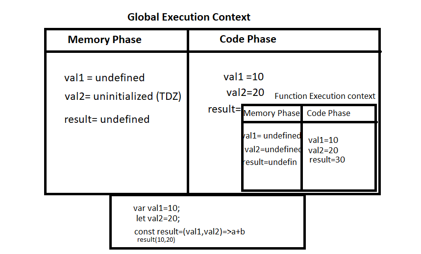
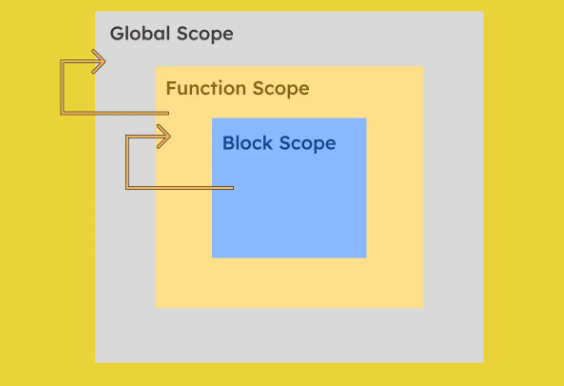
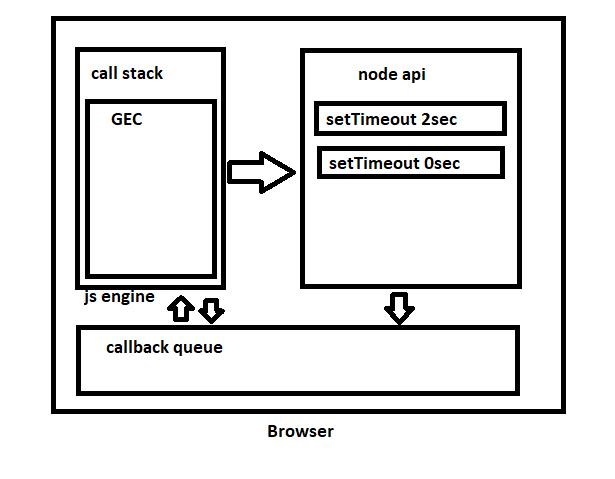
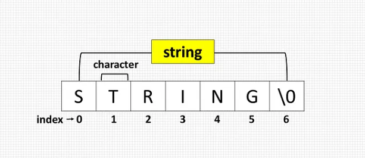
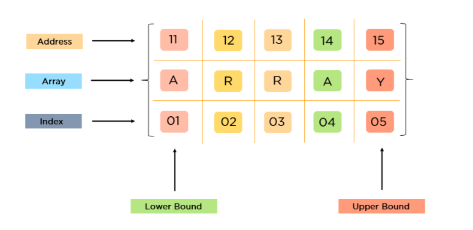
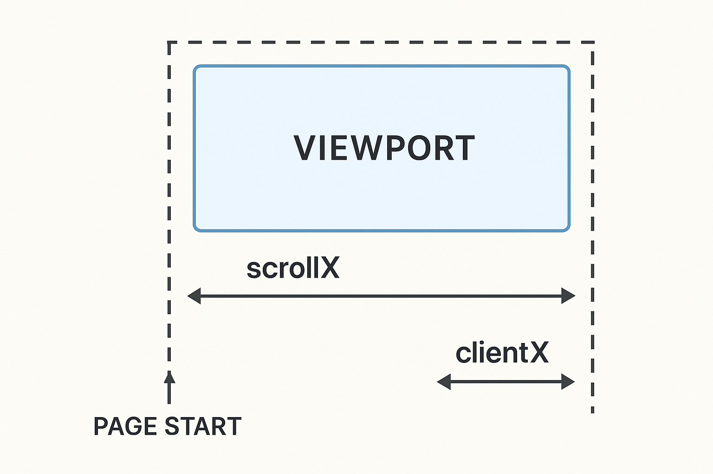

JAVASCRIPT NOTES
================

**Q1: what is JavaScript? why name called JavaScript? Ways to Import JS in HTML?What are render-blocking resources, and how do you avoid them?**  

JS was created by Brendan Eich at Netscape in 1995.  

JavaScript is a lightweight, case sensitive scripting language.
JS was created to add logic to web pages;  initial name was "LiveScript" then marketing—syntax inspired by Java, but not related.  
JavaScript is called a scripting language because it is not compiled beforehand — it runs line by line(single-threaded or synchronous) directly by the browser or runtime  
4 ways to import js file
```js
<script src="app.js"></script>          <!-- normal -->
<script src="app.js" defer></script>    <!-- runs after HTML parsed -->
<script src="app.js" async></script>    <!-- runs asynchronously -->
<script src="app.js" type="module"></script> <!-- ES modules -->

```
***How does JS (single-threaded) handle async operations?***  
JS runs sync tasks on call stack and Async tasks handed by event loop in browser.JS is single-threaded, but browser is multi-threaded.  

***when use async when defer?***  

both load scripts asynchronously.
- defer → loads JS in background, runs after HTML parsing, best for most scripts,Best for scripts that rely on the DOM.
```js
<script defer src="defer.js"></script>
```
- async → runs as soon as loaded, may block DOM. Good for analytics.
```js
<script async src="async.js"></script>
```
**What are render-blocking resources, and how do you avoid them?**  
When the browser starts loading a webpage, it wants to show something to the user as quickly as possible — but some files force it to stop and wait. CSS files and normal script tags block rendering because the browser must fully load them before it can safely continue building the page.To avoid these pauses, we tell the browser to handle scripts differently using async or defer, and we load CSS only when needed. For example, script defer lets HTML parsing continues without waiting, and link rel="preload" helps important CSS load earlier so the page paints faster.
```js
<script src="app.js" defer></script>
<link rel="preload" href="style.css" as="style">
```

**Q2: what are JavaScript engine? how js works internally**  

a javascript engine is a computer programme that execute javascript code developed by web browser vender.  

Example: chrome we have V8 firefox we have SpiderMonkey
```txt
Call Stack (executes code)
               ↓
         Web APIs (async work)
               ↓
      Callback Queue (waiting)
               ↓
         Event Loop (checks & pushes)
               ↓
      Back to Call Stack (runs again)
```
Note:  
**Global Execution Context (GEC)**  
When JavaScript starts running a file, it creates the Global Execution Context.It has 2 phases
1. Memory Phase (Creation / Hoisting Phase):JavaScript scans through the file before executing anything.Variables declared with var are stored as undefined.let and const are put into memory but not initialized.Function expressions & arrow functions behave like variables (undefined or uninitialized)  
2. Code Phase (Execution Phase): JavaScript now runs the code line by line.
there Values are assigned and Functions are executed
***Priority Rules in Memory Phase***
1. Function declarations are hoisted with full function value
2. Variable declarations are hoisted but initialized as undefined
3. If a variable and function share the same name then function wins



**Q3: JavaScript vs ECMAScript**  

JavaScript → language used in browsers.
ECMAScript → standard/spec that JS follows.

**Q4: What is Hoisting?**  

Variables and functions declarations are moved to top of there scope before code execution.hoisting is not working on let and const its throwing reference error  
in parent function anywhere we can use var because var add itself to the window object.  

syntax  
```js
{
  console.log(a); // undefined → var is hoisted
  var a = 5;
}

{
  console.log(b); // ReferenceError → let in TDZ
  let b = 10;
}

```
```js
foo(); // Works → function is fully hoisted
function foo() {
  console.log(a); // undefined → var hoisted inside function
  var a = 10;
}
```
```js
function test() {
  for (var i = 1; i <= 3; i++) {}

  console.log(i); // 4 → var is NOT block scoped
}

test();
```
**Q5: What is Closure? How do closures maintain memory?**  

A closure is a function that giving you to access to outer function scope from inner function.It's like your mother packing your bag in the morning and you going to pg — even though she is no longer there, you still have the tiffin, shirt, and water bottle she packed.
it is used to module design pattern,curring,memorize.  
disadvantage of closure is memory leak and freeze the browser
Example:
```js
function x(b) {
    var a = 5;
    function y() {
        console.log(a,b);//5 10
    }
    return y
}
let clo = x(10);
clo();

//exp2
function outer() {
  let count = 0;
  return function inner() {
    count++;
    console.log(count);
  }
}
const closure = outer();
closure(); //1
closure(); //2
console.dir(closure);// Shows closure with "count" in console
const closure2 = outer();
closure2(); //1

```
  

**Q6: What is an Expression? What is an Identifier? JS Variables? Difference: var, let, const. what is Variable Shadowing**   

An expression is any reference to a variable value or a set of variable values.  
```js
10 + 20
x * 5 
```
An identifier is the name of a variable.  
```js
let name = "Sam"; // name is the identifier

```
JavaScript variables are containers for data.  

var -> the scope of the variable define with the keyword "var". this is global scope.it is store in browser window object.it is limited to the function within which it is defined ,calling function scope. 
```js
var x = 10;
var x = 20;
console.log(x); // 20

function foo(){
  var x='sam'//local scope or function scope
}
but
var x="sam"//global scope
if(true){
  y="sou"//global scope
}
while(){
  var z="sam"//global scope
}
switch(true){
  var test='hello'//global scope
}
```

let, const -> the scope of variable defined with the keyword 'let' or 'const' is limited to the block defined by curly brace called lexical variable scope. it is not store in browser window object  
difference between let and const is const variable can only one time declare and assign a value because it's a constant and const cannot be update or redeclared 
```js
{
  let x='hello'//block scope
}

function demo() {
  if (true) {
    var x = 10;
    let y = 20;
    const z = 30;
  }
  console.log(x); // ✅ works (var → function scope) var will not work outside the function
  console.log(y); // ❌ error (let → block scope)
  console.log(z); // ❌ error (const → block scope)
}
demo();
```
```js
for(let i=0;i<3;i++){
    setTimeout(()=>console.log(i)) //0  1 2
}
for(var i=0;i<3;i++){
    setTimeout(()=>console.log(i)) // 3 3 3
}
```
- Variable Naming Rules
1. Cannot start with a number
2. Must start with a letter, _ or $
3. Don't use reserved keywords and space  
```js
let name, $price, _id;

```
Variable shadowing happens when a variable inside a local scope has the same name as a variable in an outer scope, and the inner one temporarily hides (shadows) the outer variable within that block/function
```js
var a = 10;

{
  var a = 100; // shadows outer 'a'
  console.log(a); // 100
}

console.log(a); // 100 (because var is function-scoped)

```
**Q7: What is Event Loop? Explain event loop phases (macrotasks, microtasks)**  

The Event Loop is the mechanism in JavaScript that allows it to handle asynchronous operations (like setTimeout, promises, APIs) even though JavaScript is single-threaded
1. Call Stack
JS executes code line by line. Synchronous code runs here.
2. Web APIs (Browser APIs)
When you call setTimeout, fetch, event listeners — browser handles them.
3. Callback/Task Queue
Once Web API finishes, it pushes the callback into a queue.
4. Microtask Queue (Higher Priority)
Promises .then(), queueMicrotask(), MutationObserver.
5. Event Loop
Keeps checking and If call stack is empty, push tasks from microtask queue, then callback queue.
```txt
                ┌───────────────────────────────┐
                │           CALL STACK           │
                │  (Runs code line-by-line)      │
                └─────────────▲─────────────────┘
                              │
                              │ (returns callback)
                              │
┌───────────────┐     ┌───────▼────────┐     ┌─────────────────────┐
│   Web APIs     │----▶ Callback Queue  │----▶ Microtask Queue      │
│ (setTimeout,   │     │ (setTimeout)   │     │ (Promises)           │
│  fetch etc.)   │     └──────▲─────────┘     └─────────▲──────────┘
└───────────────┘            │                         │
                             └───────────┬─────────────┘
                                         │
                                         ▼
                                   EVENT LOOP
                             (Moves highest priority)

```
Example 1:
```js
console.log("a");
setTimeout(() => {
  console.log("b");
  setTimeout(() => {
    console.log("c");
  }, 1000);

}, 1000);
console.log("d");

// Output: a d b c
```
Example 2:
```js
console.log("A");

setTimeout(() => console.log("B"), 0);

Promise.resolve().then(() => console.log("C"));

console.log("D");
//A D C B
```



**Q8:Sync vs Async**  

- Sync → one by one
- Async → doesn't block next

**Q9: What is 'this' keyword?**  

Refers to current context.Value of this depends on how function is called.Arrow functions don't define their own this; they inherit it from the parent scope.Constructor bind this to the new instance.
```js
//global scope
var a=10;
function b(){
    var x=10;
}
console.log(window.a); //10
console.log(a); //10
console.log(this.a); //10

//inside object method
const obj = {
  name: "Sam",
  show() { console.log(this.name); } // Sam
};
obj.show();

//inside regular function
function fn() { console.log(this); } 
fn(); // window
const obj={
    a:1,
    b:2,
    sum(){
        return this.a+this.b
    }
}
console.log(obj.sum())//3

//inside arrow function
const obj2 = {
  name: "Sam",
  show: () => console.log(this.name) // undefined (arrow has no this)
};
obj2.show();

//inside constructor
function Person(name) { this.name = name; }
const p = new Person("Sam");
console.log(p.name); // Sam


```


**Q10: Arrow function vs normal function vs IIFE vs Anonymous function**  

Normal Function 
```js
function add(a, b) { // declaration + definition
  return a + b;  // definition (body)
}
```
Arrow Function / Lambda Expression
- ES6 onwards introduce.arrow function does not support function declaration,it support only function expression.  
- arrow function does not have own this binding and not suitable for call apply bind
 ```js 
const arrow = () => { console.log('hi') };
arrow();//hi
const arrows = function() { console.log('hello') };
arrows();//hello
 const foo=name=>name;
 console.log(foo("sam"))//sam
 const fruit=()=>[ 'mango', 'banana' ];
 console.log(fruit());//[ 'mango', 'banana' ]
 const x=(a,b,...c)=>[a,b,c];
 console.log(x('sam','mik','sou','rik'));[ 'sam', 'mik', [ 'sou', 'rik' ] ]
 const add = (a, b) => a + b;
 console.log(add(10,20))//30
 ```
IIFE (Immediately Invoked Function Expression) 
if you want to avoid global scope partition use IIFE
```js
problem
var $='i am sam';
var $='i am sou';
console.log($)

solution
(function f1(){
  var $='i am sam'
  console.log($)
})()
(function f2(){
  var $='i am sou'
  console.log($)
})()
```
```js
(function ask(question = "prompt", yes = alert, no = alert) {
  if (confirm(question)) yes("You agreed.");
  //if we click yes in confirm message then condition will execute true and yes will execute else no()
  else no("You canceled the execution.");
})();
```
Anonymous Function 
it is a function without having a name
```js
let f=function(){
  console.log('javascript')
}
or
(function(){
  console.log('javascript')
})()
```

**Q11: Shallow vs Deep Copy**  

Shallow Copy: Copies only the top-level values.
If the object contains another object, only the reference is copied, not the actual nested data.
So changing nested values affects both copies.  

Deep Copy: Creates a completely independent copy of all levels of the object.
Changing nested values does not affect the original.
Example:
Original Object
```js
a → { x:1, y:{ z:2 } }
```
Shallow Copy:
```js
b = { ...a }
//or
b = Array.from(a)

a.y ───────► { z:2 } ◄────── b.y    (same reference)
```

Deep Copy:
```js
b = JSON.parse(JSON.stringify(a))
a.y ──► { z:2 }     b.y ──► { z:2 }   (separate copies)
```

**Q12. What are Promises? why promise faster than setTimeout? Build Own Promise for Microtask? What happens internally when a Promise resolves?**  

Promise is an object represent the eventual completion or failure of asynchronous operation and resulting value.promise has 3 states pending,rejected,fulfilled, it is introduce es6 onwards.we can make asynchronous task using promise.to execute promise we have prototype method promise.prototype.then() for successful compilation and promise.prototype.catch() for unsuccessful compilation 
Example:
```js
//exp 1 
let promise=new Promise((res,rej)=>{
    let flag=true;
    if(flag){
        res(5)
    }else{
        rej("error")
    }
}).then(console.log).catch(console.log)

//exp 2
function getData() {
    return new Promise((res, rej) => {
        res("✅ Initial Data")
    })
}
getData().then(()=>{
    return "🥭"
}).then().then().catch().then((data)=>{
    console.log(data);//🥭
})

```
Promise is faster than setInterval because Promises run in the microtask queue, which has higher priority than setInterval, which runs in the macrotask queue. Microtasks execute faster and earlier than macrotasks in JavaScript’s event loop  
```js
console.log("Start");//1
setInterval(() => console.log("Interval"), 0);//4
Promise.resolve().then(() => console.log("Promise1")).then(() => console.log("Promise2"));//3 Promise1 Promise2
console.log("End");//2

```
create a interval only two times run  
```js
function setInterVal() {
  let count = 0;

  const id = setInterval(() => {
    console.log("lelay log");
    count++;

    if (count === 2) {
      clearInterval(id);
    }
  }, 2000);
}

setInterVal();
```

build own promise
```js
function girlfriend(){
    return new Promise((propose,reject)=>{
        setTimeout(()=>{
            const iLoveYou=true
            if(iLoveYou){
                console.log('after buying a rose Propose')
                propose()
            }else{
                console.log('she accept your proposal');
                reject('sorry not fullfill')
            }
        },2000)
    })
}
girlfriend().then(()=>{
    console.log('sam propose his gf')
}).catch(()=>{
    console.log('next time good luck')
})

```
When a Promise resolves, it quietly changes its internal state from 'pending' to 'fulfilled,' but nothing runs immediately. Instead, the callback connected using .then() is placed into the microtask queue. JavaScript finishes whatever code is currently running (because the call stack must be empty), and then the event loop picks the microtask and executes the .then() callback

**Q13. Promise.all vs Promise.race**  

Promise.all() → Runs multiple promises in parallel and waits until all are finished.If any one fails, the whole result fails
```txt
Promise.all([P1, P2, P3])
   P1 ----✅
   P2 --------✅
   P3 ------------✅
```
Result → after last one finishes
```js
const p1 = Promise.resolve("🍎 Apple");
const p2 = Promise.resolve("🍌 Banana");
const p3 = Promise.resolve("🍇 Grapes");

Promise.all([p1, p2, p3]).then((result) => {
  console.log(result); 
  // ["🍎 Apple", "🍌 Banana", "🍇 Grapes"]
});

```
Promise.allSettled() → Runs multiple promises in parallel and waits until all are completed, whether they succeed or fail. It never stops on error; instead, it returns the status and value/reason of each promise.
```txt
Promise.allSettled([P1, P2, P3])
   P1 ----✅  (fulfilled)
   P2 --------❌  (rejected)
   P3 ------------✅  (fulfilled)

```
Promise.race() → Runs multiple promises in parallel and returns the result of the first one that finishes (success or fail)
```txt
Promise.race([P1, P2, P3])
   P1 ----✅  ← finishes first → return this one
   P2 --------✅
   P3 ------------✅
```

```js
//exp 1

const sam=new Promise((res,rej)=>{
    setTimeout(()=>{
        res('I am fast')
    },1000)
})
const rik=new Promise((res,rej)=>{
    setTimeout(()=>{
        res('I am second')
    },2000)
})
Promise.race([sam,rik]).then(user=>{
    console.log(user);// i am fast
}).catch(err=>{
    console.log(err);
})

//exp 2
const p1=new Promise(res=>setTimeout(()=>res("p1 done"),1000))
const p2=new Promise(res=>setTimeout(()=>res("p2 done"),500))
Promise.all([p1,p2]).then(res=>console.log("All",res));// 2nd All [ 'p1 done', 'p2 done' ]
Promise.race([p1,p2]).then(res=>console.log("Race",res));// 1st Race p2 done
```
**Q14. How AJAX is used in JS ? How to fetch API using Promise? how to restricting fetch data**  

AJAX = Asynchronous JavaScript and XML
```js
fetch("https://api.example.com/data")
  .then(res => res.json())
  .then(data => console.log(data))
  .catch(err => console.log(err));
  ```

  restricting by authentication token or role you can restrict fetch data to prevents unauthorized users from fetching data
  ```js
  
  useEffect(() => {
  const token = localStorage.getItem("authToken");
  if (!token) return; 
  if (user.role !== "admin") return;

  fetch("/api/data", {
    headers: { Authorization: `Bearer ${token}` }
  })
    .then(res => res.json())
    .then(data => console.log(data));
}, []);

  ```
***Why We Use Authorization Header & Bearer Token?***  

For secure APIs, server must know who is making the request.JWT is sent as "Authorization: Bearer token" and Every request is validated by token signature.  

**Q15. create a Promise and resolve on Button click**  

```js
import { useState } from "react";

export default function App() {
  function createClickPromise() {
    return new Promise((resolve) => {
      resolve("Button clicked!");
    });
  }
  function handleClick() {
    createClickPromise().then((msg) => console.log(msg));
  }
  return (
    <button onClick={handleClick}>
      Click Me
    </button>
  );
}
```
**Q16. using promise fetch a data,if the fetch fails it should automatically retry after the given delay, up to the maximum number of attempts**  

```js
function retryFetch(url, maxSteps, delay) {
  let attempt = 0;

  return new Promise((resolve, reject) => {
    function tryAgain() {
      fetch(url)
        .then(res =>res.json())
        .then(data => resolve(data))
        .catch(err => {
          attempt++;
          if (attempt < maxSteps) {
            console.log(attempt);
            setTimeout(tryAgain, delay);
          } else {
            reject("Failed");
          }
        });
    }
    tryAgain();
  });
}

retryFetch("https://dummyjson.com/posts/1", 3, 1000)
  .then(data => console.log(data))
  .catch(err => console.error(err));
```
- How to handle error in Promise?  

Use .catch() or try...catch inside async/await.
fetch(url).catch(err => console.error(err));


**Q17. Async/Await? why its better than Promise**  

async/await is a cleaner way to work with Promises in JavaScript.
It allows you to write asynchronous code that looks synchronous, making it easier to read and debug.  
```js
async function getSmile(){
    return '😋'
}
const smile1= getSmile();
const smile2= await getSmile();
console.log(smile1,smile2); //Promise { '😋' } 😋
```
What problem it solves:
Avoids callback hell and complex .then() chaining in Promises Used to handle errors gracefully so app doesn't crash.
Makes async code more readable single try..catch, cleaner, and easier to handle errors using try…catch


**Q18: What is Debounce & Throttle?**  

Debounce: delay execution till user stops typing.
Runs after user stops typing or triggering for a certain time
Useful for: Search bars, input validation, API calls
```js
import { useState, useEffect } from "react";

export default function SearchBox() {
  const [text, setText] = useState("");

  useEffect(() => {
    const timer = setTimeout(() => {
      console.log("Searching for:", text);
    }, 500); // wait 0.5s after user stops typing
    return () => clearTimeout(timer);
  }, [text]);

  return <input onChange={(e) => setText(e.target.value)} placeholder="Search..." />;
}
```

Throttle: limit execution in interval.
Runs the function once every fixed time, even if triggered multiple times.
Useful for: Scroll, resize, mouse move events.
```js
import { useState, useRef } from "react";

export default function ThrottleInput() {
  const [text, setText] = useState("");
  const throttleRef = useRef(false);

  function handleChange(e) {
    const value = e.target.value;

    if (throttleRef.current) return; // block if within throttle time

    throttleRef.current = true;
    console.log("Throttled Value:", value);

    setTimeout(() => {
      throttleRef.current = false; // allow next execution after 1s
    }, 2000);

    setText(value);
  }

  return <input onChange={handleChange} placeholder="Type fast to test throttle..." />;
}
```
```txt
Debounce (send last)                     Throttle (send once per interval)
---------------------------------------------------------------
User:   A → A → A → A                     User:   A → A → A → A → A → A
              ↘  ↘  ↘                                      ↓           ↓
Wait:     [reset][reset][wait]            Delay:   |---delay---| |---delay---|

Server:                     A              Server:  A---------------------A
                            ↑                        ↑                     ↑
                     Only last sent            First sent           Next sent after delay
```

**Q19: Polyfill Example (map-filter-flat)**
```js
//map polyfill
Array.prototype.myMap = function(callback) {
  let result = [];
  for (let i = 0; i < this.length; i++) {
    result.push(callback(this[i], i, this));//pushing currentValue, index, array
  }
  return result;
};
let arr = [1, 2, 3];
let doubled = arr.myMap(num => num * 2);
console.log(doubled);

//filter ployfill
Array.prototype.myFilter = function(callback) {
  let result = [];
  for (let i = 0; i < this.length; i++) {
    if (callback(this[i], i, this)) {
        //if(true) push elements to new array
      result.push(this[i]);
    }
  }
  return result;
};
const arr = [1, 2, 3, 4, 5];
const even = arr.myFilter(num => num % 2 === 0);
console.log(even);

//flat()
Array.prototype.myFlat = function (depth = 1) {
  let result = [];

  this.forEach(item => {
    if (Array.isArray(item) && depth > 0) {
      result = result.concat(item.myFlat(depth - 1));
    } else {
      result.push(item);
    }
  });

  return result;
};
let arr = [1, [2, [3], 4]];
console.log(arr.myFlat(2)); // [1, 2, 3, 4]

```
**Q20: Call, Apply, Bind**  

call() invokes a function immediately with a specific this value and individual arguments.  
apply() is the same as call().  
bind() returns a new function with a permanently bound this value.

```js
const person = { name: "Sam", age: 25 };

function intro(greeting, emoji) {
  console.log(`${greeting}, I'm ${this.name} and I'm ${this.age} ${emoji}`);
}

intro.call(person, "Hi", "😊"); //Hi, I'm Sam and I'm 25 😊

intro.apply(person, ["Hello", "👋"]); //Hello, I'm Sam and I'm 25 👋

const introSam = intro.bind(person);
introSam("Hey", "😎");//Hey, I'm Sam and I'm 25 😎
```

**Q21: What is Currying?**  

Currying is the process of transforming a function that takes multiple arguments into a sequence of functions, each taking a single argument.  
Currying is like ordering a pizza step by step: first you choose the size, for example "Large," then you separately choose the crust or toppings such as "Cheese" and "Olives," and finally the last step returns the fully prepared pizza order after all selections are made.
Example:
```js
function add(a) {
  return function(b) {
    return a + b;
  };
}
const add5 = add(5);
console.log(add5(3)); // 8

or 

const add = a => b => a + b;
console.log(add(5)(3)); // 8


```
**Q22: What is Prototype?**  

prototype is an object automatically attached to functions (specifically constructor functions).__proto__ is a reference inside every object that points to the prototype it inherits from.Every JS object inherits from a prototype object.
```js
const obj = { a: 10 };

console.log(obj.__proto__);   // parent object (Object.prototype)

``` 
A property that exists on functions only. It becomes the parent template.
```js
function Person() {
  this.name = "Sam";
}

Person.prototype.sayHello = function () {
  console.log("Hello!");
};

const p = new Person();
p.sayHello(); // Hello!

```

**Q23: Difference: undefined vs null**  

undefined -> declared but not assigned
```js
let a;      
console.log(a);  // undefined
```
null -> intentional empty value.
```js
let b = null;   
console.log(b);  // null
```

**Q24: Event Delegation**  

Event Delegation is used to handle events efficiently by adding a single event listener on a parent element instead of adding multiple listeners to each child element.  

Benefits:Improves performance (fewer listeners in DOM) and Improves performance (fewer listeners in DOM)
Example:
```js
ul.addEventListener('click',(e)=>{ 
  if(e.target.tagName==='LI') 
      console.log(e.target.textContent)
   })
```

**Q25: LocalStorage vs SessionStorage with exp**  

localStorage -> persists after reload and permanent until cleared.we can use in theme and token,and scope is shared
```js
localStorage.setItem("name", "Sam");
console.log(localStorage.getItem("name")); // Sam
```

sessionStorage -> clears when tab closes, we can use in Banking, forms,and scope is per tab
```js
sessionStorage.setItem("sessionName", "SamSession");
console.log(sessionStorage.getItem("sessionName")); // SamSession
```

**Q26: Spread vs Rest**  

Spread -> it is es6 features ,it operation with array and combine the content
```js
//exp1
let x=["java"],y=["js"]
let combine=[...x,...y]
//exp2
const nums = [1, 2, 3];
const newNums = [...nums, 4, 5]; // [1, 2, 3, 4, 5]
```
Rest -> it can hold infinite number of argument value as an array,it is not an array but internally store as an array.always rest should be the last parameter
exp1
```js
function course(a,...rest){
  let a=10;
  return rest
}
console.log(course('js','java','python'));//['js','java','python']
```
exp2
```js
function sum(...numbers) {
  return numbers.map((x) => x + 5);
}
const result = sum(4, 5, 6, 7); // [9, 10, 11, 12]
```
exp3
```js
function foo(x,y,z) {
 console.log( x, y, z );
}
foo(...[1,2,3]); //[1,2,3]
```


**Q27: Deep Clone Object**  
```js
JSON.parse(JSON.stringify(obj)); 
```
NOTE:JSON.stringify() → convert js object to string
     JSON.parse() → convert a string to js object 

NOTE: Javascript Object Notation(JSON) is a data format(key-value pair) storing and transforming data to one device to another

**Q28: Optional Chaining**  

Access nested property safely
```js 
user?.address?.city
user?.getName?.()
users?.[0]?.name
fn?.("props")
document.querySelector(".box")?.textContent

```

**Q29: Difference Between == and ===**  

== Loose Equality Compares value only 
```js
console.log(5 == "5");     // true 
```

=== Strict Equality Compare value and type
```js
console.log(5 === "5");   // false 
```

**Q30: Difference Between slice, splice, split**  

slice -> The slice() method is used to copy a portion of an array and return a new array.doesn’t change original array.It accepts two optional arguments:
- the starting index 
- the ending index
```js
const fruits = ['apple', 'orange', 'lemon'];
const newFruit = fruits.slice(0, 1);
console.log(newFruit); // Output: ['apple']
```
splice -> The splice() method is used to add, remove, or modify elements within an existing array. It modifies the original array.
It typically takes three arguments,  
- Starting Index: The index where changes should begin.
- Number of elements to delete: The count of elements to remove from the starting index.
- Elements to add/modify (optional): The new elements you want to insert or replace.
```js
const fruits = ['apple', 'orange', 'lemon'];
fruits.splice(0, 1, 'banana'); 
console.log(fruits); // Output: ['banana', 'orange', 'lemon']
```

split -> convert string → array
"a,b,c"
split(",")  -> ['a','b','c']

**Q31: Event Bubbling(default) vs Capturing**  

Bubbling: inner → outer (Event moves from child → parent)
Clicking the button → shows "Child clicked" → then "Parent clicked"
```txt
┌───────────────────────────────┐
│           PARENT               │
│   (executes second)            │
│   ▲                            │
│   │  Bubbling ↑                │
│   │                            │
│   ┌─────────────────────────┐  │
│   │         CHILD            │  │
│   │   (clicked first)        │  │
│   └─────────────────────────┘  │
└───────────────────────────────┘
```
```js
<div id="parent">
  <button id="child">Click Me</button>
</div>
<script>
  document.getElementById("parent").addEventListener("click", () => alert("Parent clicked"));
  document.getElementById("child").addEventListener("click", () => alert("Child clicked"));
</script>
```

Capturing: outer/parent → inner/child
```txt
┌───────────────────────────────┐
│           PARENT               │
│   (executes first)             │
│   ▼  Capturing ↓               │
│                                │
│   ┌─────────────────────────┐  │
│   │         CHILD            │  │
│   │   (executes second)      │  │
│   └─────────────────────────┘  │
└───────────────────────────────┘
```
```js
<div id="parent">
  <button id="child">Click Me</button>
</div>
<script>
  document.getElementById("parent").addEventListener(
    "click",
    () => alert("Parent clicked"),
    true // Capturing phase
  );

  document.getElementById("child").addEventListener(
    "click",
    () => alert("Child clicked"),
    true // Capturing phase
  );
</script>
```
***stopPropagation()*** stops event FROM BUBBLING to parent.It prevents the event from moving up to parent elements.
```js
<div onclick="alert('Parent clicked')">
  <button onclick="event.stopPropagation()">Click Me</button>
</div>
```

**Q32: What is Temporal Dead Zone (TDZ)?**  

Zone where variable exists but can’t be accessed before initialization.
```js
console.log(a)
var a='sam'
```

**Q33: Garbage Collection**  

JS automatically removes unused memory (unreferenced objects).

**Q34: Webpack**  

Webpack is a module bundler that combines JavaScript, CSS, images, and other assets into an optimized build.(usually a single bundle.js)
```txt
          React Project Files
       (Components, JS, CSS, Images)
       __________________________________
      |   js     js     js              |
      |                                  |
      |   img    img    img             |
      |__________________________________|

                    |
                 (Babel)
                    |
                    v
               +-----------+
               |  Webpack  |
               +-----------+
                    |
                 (Bundle Output)
                    |
                    v

        ___________ Final Bundle ___________
       |               |                   |
       |     bundle.js |     images        |
       |_______________|___________________|

```

**Q35: What are higher-order functions?**  

A function that takes another function as an argument OR returns a function. (e.g., map, filter, reduce). like Amazon's product system: when you pick a shirt, you’re giving Amazon your 'preference'. Amazon then uses that logic to show similar shirts or recommendations — that’s the HOF running your function. And sometimes Amazon even gives you new personalized suggestions, just like a HOF returning another function.  
why use? Reusability,code modularity.
```js
//exp1
function add(a,b){
  return a+b
}
function multiply(a,b){
  return a*b
}
function calc(n1,n2,op){//HOF
  return op(n1,n2)
}
console.log(calc(10,10,add))
console.log(calc(10,10,multiply))

```

**Q36.how to check Performance**  
```js
console.time('loop');
for (let i = 0; i < 10; i++) {
  console.log(i);
}
console.timeEnd('loop');

```

**Q37: What are modules in JavaScript?**  

Break code into reusable files using export and import.in js two types of modules are there 1. common js module for node js 2. es6 module for modern application
Types:  
1. Named export: you can not rename it
2. Default export you can rename it
Example 1:
```js
export const x = 1; 
import { x } from './file.js';
```
Example 2:
```js
export const add = (a,b)=>a+b;
import { add } from "./util.js";
```

**Q38:Use of Content-Type**  

Tells the browser what type of data is being sent.  

Examples:
- application/json → JSON data
- text/html → HTML
- multipart/form-data → File uploads

**Q39: What is destructuring?**  

Extract/unpacking values from arrays or objects into separate cleaner and more readable code:
```js
//exp 1
const [a, b] = [1, 2];
const {name, age} = person;
//exp 2
let x=["java","js","node"]
let [ ,y ,z]=x
console.log(y,z)//js node
//exp 3
let x, y
[x=10,y=20]=[,200]
console.log(x,y) //10 200


//exp 4
let user={
    userId:'101',
    userName:'sam',
    pass:'123'
}
function details({userId,userName,pass}){
    return userId + userName + pass
}
console.log(details(user))//101sam123

//exp 5
const user={
    name:"Sam",
    age:30,
    address:{
        location:{
            state:'bengal',
            landmarks:[
                {title:'Burnpur'},
                {title:'Asansol'}
            ]
        }
    }
}
const {name,age,address:{location:{state,landmarks: [ , { title: a } ]}}}=user;
console.log(name,a);// Sam Asansol
```

**Q40: What is a generator function?**  

A generator function can pause and resume execution using yield.
Defined with function* syntax.
Useful for lazy evaluation or async flows.
```js
function* gen() {
  yield 1;
  yield 2;
  yield 3;
}
const g = gen();
console.log(g.next().value); // 1
console.log(g.next().value); // 2
console.log(g.next().value); // 3
```

**Q41: Explain the concept of immutability.**  

Data shouldn’t be modified directly; instead, create new copies.
Important for React state and predictable behavior.

**Q42: All attributes of script tag**  

use script tag to include js in html
<script scr="index.js"></script>
src, type, async, defer, crossorigin

**Q43.what is first class function?**  
first class function you can store as a value
```js
let a=function(){}
```

**Q44:Use of "use strict"**  

Makes JS more secure: prevents undeclared variables, silent errors.
```js
//exp 1
"use strict"; 
x = 5;//error

//exp 2
function sum(n1,n2){
    'use strict'
    n1=20;
    n2=20
    return arguments[0]+arguments[1]
}
console.log(sum(10,10))// 20 but without 'use strict' it 40
``` 

**Q45:Data Types in JS (Primitive vs Non-Primitive)**  

data types are describe the type of data  

- Primitive: data types that store single values (immutable)(String, Number, boolean, null, undefined, symbol, bigint).
```js
Boolean(undefined) → false
Boolean(null) → false
Boolean('') → false
Boolean(0) → false
Boolean(-1) → true

```
- Non-Primitive:data structures that store multiple values (mutable) Object, Array, function,Date,Math.when we copy those its reference is copy but not having real copy  ((),{},[])
```js
let a =[1,2,3]
let b=a
a.pop()
console.log(a,b)//[ 1, 2 ] [ 1, 2 ]
```

Note: primitive are pass by value, object are pass by reference

**Q46:Null vs Undefined**  

- null → empty value set by user.it represent absence of object value.null is not global property of global object
```js
var x=null
console.log(typeof x)//object
let person = { name: "Alice", age: null };
console.log(person.age); // null
```
- undefined → declared but not assigned.undefined is global property of global objet
```js
var x
console.log(typeof x)//undefined
function test() {}
console.log(test()); // undefined
let obj = {};
console.log(obj.property); // undefined
```

**Q47: types of operator give associativity**  

Arithmetic:+,-,*,/,%,++,--  

Assignment: =,+=,-=,*=,/=  

Comparison:==,===,!=,!==,>,<,>=,<=  

Logical: &&,||,!  

Bitwise: 
Ternary:variable=(condition)?value1:value2

```txt
| Category                  | Associativity |  
| ------------------------- | ------------- | 
| Arithmetic (+ - * / %)    | Left → Right  |  
| ++ -- (prefix)            | Right → Left  |   
| Assignment (= += *= etc.) | Right → Left  | 
| Comparison (== >= etc.)   | Left → Right  |  
| Logical (&&)              | Right → Left  |
| Logical NOT (!)           | Right → Left  |  

```
***post and pre increment**  
Post increment return the old value, then increase the variable.
```js
let num = 10;
const increaseNumber = () => num++;
console.log(increaseNumber());//10
```
Pre increment increase the variable first, then return the new value.
```js
let num = 10;
const increaseNumber = () => ++num;
console.log(increaseNumber());//11
```

**Q48:Parameter vs Argument**  

Parameter = variable in function definition.  

Argument = actual value passed.
```js
function add(a,b){//parameter

 } 
 add(2,3);//argument
```
```js
function check(){
  throw new Error("Param required")
}
function show(name=check()){
  console.log(name)
}
show()
```
**Q49:Callback Function**  

Function passed into another function to run after a task completes.
```js
setTimeout(()=>console.log("Arrow function"),1000);
setTimeout(function() {
  console.log("Anonymous function");
  }, 1000);
function greet() { 
  console.log("Name function");
  }
setTimeout(greet, 500);
document.getElementById("btnClick").addEventListener("click", () => {
  console.log("Button clicked");
});

```

**Q50:Pyramid of Doom (Callback Hell)**  

When many callbacks are nested inside each other — code becomes deep, messy, and hard to read.
```js
getData(() => {
  processData(() => {
    saveData(() => {
      sendEmail(() => {
        console.log("Done");
      });
    });
  });
});
```
**Q51:call back hell solved by Promise Chain**  

its readable and handle error easily
```js
getData()
  .then(processData)
  .then(saveData)
  .then(sendEmail)
  .then(() => console.log("Done"))
  .catch(err => console.log("Error:", err));

```
**Q52: Constructor**  

Used to create multiple similar objects.
```js
function User(n){
  this.name=n;
  }
let u=new User("Sam");
let v=User("jake");
console.log(u?.name,v?.name);//Sam undefined
```

**Q53: why Constructor Function? what is Prototype Inheritance?**  

To create multiple objects with the same structure and properties without manually writing each object.
```js

function User(name,age) {
  this.name = name;
  this.age=age;
}
let u = new User('Sam',30);
console.log(u.name,u.age); // Sam 30
const u2 = new User("Alex", 25);
console.log(u2.name, u2.age); // Alex 25
const u3 = User("Jose", 30);
console.log(u3?.name, u3?.age); //undefined undefined
```

Prototype Inheritance is a feature in JavaScript where objects can inherit properties and methods from another object through the prototype chain.
```js
function User(name) {
  this.name = name; 
}

User.prototype.sayHello = function () {
  console.log("Hello, " + this.name);
};
let u1 = new User("Sam");
let u2 = new User("John");

u1.sayHello(); // Hello, Sam
u2.sayHello(); // Hello, John
```

**Q54: Strings are Immutable**  

A string is a sequence of characters.once created, can't be changed—new copy made on edit.

```js
const s = "A string primitive";
const s2 = new String("A String object");
```
**Q55:new Array() vs []**  

new Array(3) creates empty slots, [] creates actual array.
Prefer [].
Example:
```js 
const fruits=['Apple','Banana','Orange']
        const fruits=new Array('Apple','Banana','Orange')
```
**Q56: create object without using new**
```js
const obj1 = {}; 
const obj2 = Object.create(null);
const obj3 = {name:"Sam"};
const obj4 = Object.assign({}, {a:1});
function makeObj(){return {id:1}}
const obj5 = makeObj();
```

**Q57: Web APIs (browser features)**  

fetch(), setTimeout(), setInterval(), localStorage, sessionStorage,
document, navigator, geolocation, history, console, alert()

**Q58: for of vs for in  and if-else vs switch**
| Loop Type    | Best For             | Works On                                  | What It Returns                          | When To Use                         |
| ------------ | -------------------- | ----------------------------------------- | ---------------------------------------- | ----------------------------------- |
| **for**      | General-purpose loop | Arrays, Strings                           | Index-based iteration                    | When you need index or full control |
| **for...of** | Iterating values     | Arrays, Strings, Maps, Sets               | Values of iterable objects               | When you only need values           |
| **for...in** | Iterating properties | Objects (also Arrays but not recommended) | Keys (object properties / array indexes) | When looping object properties      |
 

1. if-else for range or complex conditions
```js
let age = 20;

if (age < 18) {
  console.log("Minor");
} else if (age >= 18 && age < 60) {
  console.log("Adult");
} else {
  console.log("Senior Citizen");
}

```
2. switch for multiple matches of same value

```js
let day = 6;

switch (day) {
  case 1:
  case 2:
  case 3:
  case 4:
  case 5:
    console.log("Weekday");
    break;
  case 6:
  case 7:
    console.log("Weekend");
    break;
  default:
    console.log("Invalid day");
}

```

**Q59:map vs forEach**  

forEach() just loops and forEach does not have return type,it support return type but it return undefined and it is not support method chaining
```js
let a=["a","b","c"]
let b=a.forEach((val)=>{
  return val
})
console.log(b);//undefined
``` 
map() returns new array instance,if you want to create new instance or any modification use map,it is iterate over the array and return new array;
```js
let a=["a","b","c"]
let b=a.map((val)=>{
  return val
})
console.log(b);//["a","b","c"]
``` 
**Q60: instanceof**  

Checks if object created from class.
```js
obj instanceof MyClass;
```

**Q61: Tree Shaking**  

Removes unused JS code during bundling.

**Q62: what is DOM and BOM and its advantage**  

DOM(Document Object Model): when a web page loads the browser construct the DOM which is tree like structure of HTML.  

Document is the root object that represents the entire HTML page.  
A node is any item in the DOM (element, text, comment, attribute).  
Element is a specific type of node that represents HTML tags (div, p, h1, etc.)  
A NodeList is a collection of nodes (like an array, but not exactly an array).  

```txt
                🏛️ Document (root)
                       │
                       ▼
                  <html> Element
                       │
          ┌────────────┴────────────┐
          ▼                         ▼
       <head>                    <body>
          │                         │
 ┌────────┴────────┐       ┌────────┴───────────┐
 ▼                 ▼       ▼                    ▼
<title>       <meta>   <header>              <div>
                              │                 │
                              ▼                 ▼
                          <nav>             <ul>
                              │                 │
                              ▼                 ▼
                          <a> link          <li> item
                                                 │
                                                 ▼
                                             <span> text

```
BOM(Browser Object Model): controls browser features( window, navigator, location, history, screen )

Advantage: JS can dynamically change HTML/CSS  
***Where do we use BOM in React?***  
use it inside useEffect for  

1. Redirect using window.location
2. Local/session storage
3. Window size listener
4. Scroll position


**Q63:Useful DOM Properties**  

.innerHTML:Used when you need to insert HTML (e.g., cards list, table rows)
.innerText:when you want to add text only,it ignore html tags
```js
<div id="box"></div>
<script>
  document.getElementById("box").innerHTML = "<b>Hello</b>"; //bold Hello
  document.getElementById("box").innerText = "<b>Hello</b>"; //<b>Hello</b>
</script>

```
.textContent
```js
document.getElementById("box").textContent = "<b>Hello</b>";

```
.style
```js
const box = document.getElementById("box");
box.style.background = "yellow";
box.style.padding = "10px";

```
.classList(Add/Remove/Toggle a single class safely.) Button active state, dark mode toggle, adding animations
```js
box.classList.add("active");
box.classList.remove("error");
box.classList.toggle("dark-mode");
div.classList.replace("active", "error");

```
.value Getting user input from forms, search box
```js
<input id="name" type="text">

<script>
  document.getElementById("name").value = "Sam";
</script>

```

.children:Count number of list items, remove last child
```js
<ul id="list">
  <li class="item red">Apple</li>
  <li class="item red">Mango</li>
  <li class="item red">Banana</li>
</ul>

const items = document.getElementById("list");
// children list
const children = items.children;
// first and last elements
const first = items.firstElementChild;
const last = items.lastElementChild;
// parent element of the UL
const parent = items.parentElement;
console.log(children.length, first, last, parent);


```
.appendChild : Adds an element inside another element.
```js
const li = document.createElement("li");
li.innerText = "Apple";
document.querySelector("ul").appendChild(li);


```
.disabled
```js
<input type="checkbox" id="hide" />
document.getElementById('hide').disabled=true
```
.remove() Removes the element from DOM.
```js
document.getElementById("box").remove();
```
.setAttribute,.removeAttribute,.hasAttribute
```js
div.setAttribute("id", "hero");
div.removeAttribute("id");
div.hasAttribute("id"); // true / false

```
**Q64:DOMContentLoaded**  
DOMContentLoaded fires when the HTML is fully loaded and parsed, before images, CSS, and other assets finish loading, it helps to run js early
```js
document.addEventListener("DOMContentLoaded", function () {
  console.log("DOM is ready!");
});
```

**Q65:Access DOM (5 ways)**  

- getElementById() Selects a single element by its id.You need one specific element with a unique ID (fastest and most direct)
```js
const title = document.getElementById("mainTitle");

```
- getElementsByClassName() You need multiple elements that share the same class, Good for bulk styling or looping through repeated elements
```js
const items = document.getElementsByClassName("menu-item");
console.log(items);
[...items].forEach((elem)=>console.log(elem))
```
- getElementsByTagName() it return html collection as return value
```js
const li=document.getElementsByTagName("li")
[...li].forEach(x=>console.log(x))
```
- querySelector() Selects the first element matching a CSS selector.Supports complex selectors (.class, #id, div > p, [type="text"])
```js
const cardTitle = document.querySelector(".card > h3");
cardTitle.forEach((element)=>{
  cardTitle.style.backgroundColor="yellow"
})
const thirdItem = document.querySelector("ul li:nth-child(3)");

```
- querySelectorAll() Selects all elements matching a CSS selector. Returns NodeList
```js
const allLinks = document.querySelectorAll("nav a");
[...document.querySelectorAll("button")].forEach(btn => {
  btn.style.background = "blue";
});

const items=document.querySelectorAll("ul#itemList li");
items.forEach((item)=>{
  item.style.display=item.innerText.toLowerCase().inCludes(input.toLowerCase())?"green":""
})

```
🎯 Note: if you want to target one elements use querySelector(), if you want to target multiple elements, always use querySelectorAll() and then loop using forEach
```js
const allBoxes = document.querySelectorAll('.box');
allBoxes.forEach(el => el.style.color = 'red');

```
**Q66: Optimize DOM Traversal**   
 use documentFragment, DocumentFragments are lightweight DOM Node objects which are never part of the main DOM tree. 
 ```js
 <div id="box"></div>

const box = document.getElementById("box");
const fragment = document.createDocumentFragment();
// Create 2 elements
const p = document.createElement("p");
p.textContent = "Hello";
const btn = document.createElement("button");
btn.textContent = "Click Me";
// Add both to fragment instead of DOM
fragment.appendChild(p);
fragment.appendChild(btn);
// Add to DOM in one single update
box.appendChild(fragment);

 ```

**Q67.what is DOMTokenList (classList)?**  
element.classList returns a DOMTokenList, which has methods to manage CSS classes dynamically.
```js
let box = document.querySelector('.box');

box.classList.add('red');       // adds class
box.classList.remove('blue');   // removes class
box.classList.toggle('active'); // add/remove toggle
console.log(box.classList.contains('red')); // true or false
```

**Q68: isNaN() and Number()**  

Checks if value is not number
```js
isNaN('true') → true
isNaN(undefined) → true
isNaN(true) → false
```
Number convert anything to number
```js
Number(false) → 0
Number(null) → 0
Number('') → 0
Number({}) → NaN
Number(undefined) → NaN
console.log("sam" - 123); // NaN


but console.log(false==null)//false
and console.log(false==[])//because 0==0
``` 
***Type Coercion***  
Type Coercion means JavaScript automatically converts one data type to another during an operation
1. Implicit Coercion (Automatic):
JS automatically converts types without you asking.
```js
console.log("9"+5)//95  
console.log(9+"5")//95 
```
2. Explicit Coercion (Manual):
You convert it yourself using functions like Number(), String(), Boolean()


**Q69 Array and Array Methods**  
An array is a linear data structure used to store multiple elements. It is a collection of elements of the same data type stored at contiguous memory locations.size of the array are dynamic and type of the array are object.Arrays are mutable(changable).
we can check weather statement array or not using Array.isArray()

```js
let x=['java','javascript']
let y=[1,'js',function(){},true,[],{},false,null,undefined,this]
if(Array.isArray(y)){
  return true
}
return false
```

push() → adds element to end.
```js 
        [1,2].push(3) → [1,2,3]
  ```
pop() → removes element from end. 
```js
        [1,2,3].pop() → [1,2]
  ```
unshift() → adds element to start. 
  ```js
          [2,3].unshift(1) → [1,2,3]
  ```
shift() → removes element from start.
```js 
        [1,2,3].shift() → [2,3]
```
concat() → joins two or more arrays and combine it in one array.
```js
//exp 1
        [1].concat([2,3]) → [1,2,3]
//exp 2
        const x=["java"],y=["js"],z=["python"]
        let combine=x.concat(y,z)
        console.log(combine)
  ```
slice() → returns extract values from an array. slice is not modified the original array
```js
        [1,2,3,4].slice(1,3) → [2,3]
```
splice() → adds/removes/change elements at particular position.
```js
//exp1 
let x=[1,2,3,4].splice(1,2)
console.log(x)
//exp2 
    [1,2,3].splice(1,1,9) → [1,9,3]
```
indexOf() → finds first index of value.
```js 
        [1,2,3].indexOf(2) → 1
  ```
includes() → checks if value exists.
  ```js
        [1,2,3].includes(2) → true
```
join() → joins array elements into string.
```js
         [1,2,3].join('-') → "1-2-3"
         [11,11,95].join('/') → "11/11/95"
  ```
reverse() → reverses array order. 
```js
        [1,2,3].reverse() → [3,2,1]
```
sort() → sorts array elements. default ascending order
```js
        [3,1,2].sort() → [1,2,3]
        ["mango","banana","apple"].sort() → [ 'apple', 'banana', 'mango' ]
  ```
map() → returns new array by applying function.
```js
         [1,2].map(x=>x*2) → [2,4]
  ```
filter() → returns new array with matching elements.
```js
        [1,2,3].filter(x=>x>1) → [2,3]
```
reduce() → combines all elements into single value. it iterate over the array items and returns a single output.reduce function takes 4 arguments accumulator(prev value),current value,currentIndex, array.it process items left to right
```js
//exp 1
       [1,2,3].reduce((a,b)=>a+b,0) → 6
//exp 2
      const x=["s","o","u"].reduce((prev,curr)=>{
      return prev+curr
    })
console.log(x)

```
reduceRight() → when you want to process items from right → left (index last to 0)
```js
const arr = ["1", "2", "3", "4", "5"];

total = arr.reduceRight((prev, cur)=> {
    return prev + cur;
});
console.log(total); // 54321
```
forEach() → runs function for each element.
```js
      [1,2].forEach(x=>console.log(x))
```
find() → returns first matching element.
```js
       [1,2,3].find(x=>x>1) → 2
```
findIndex() → returns index of first match.
```js
      [1,2,3].findIndex(x=>x>1) → 1
```
every() → checks if all elements pass test.
```js
      [2,4].every(x=>x%2===0) → true
```
some() → checks if any element(at least one) passes test then return true else false.
```js
      [1,2].some(x=>x>1) → true
```
flat() → flattens nested arrays, default array depth is 1.
```js
      [1,[2,3]].flat() → [1,2,3]
```
fill() → fills array with given value.
```js
      [1,2,3].fill(0) → [0,0,0]
```
from() → creates new shallow copied array instance from array like object or iterable object.it convert string to array
```js
//exp 1
      Array.from('abc') → ['a','b','c']
//exp 2
  function fun(...args){
    return args
  }
let f=fun("mango","banana")
let ff=Array.from(f)
console.log(ff, typeof ff)//[ 'mango', 'banana' ] object

```

**Q70:String Methods**  

charAt() → returns character at index.
```js
        "Hello".charAt(1) → "e"
```
charCodeAt() → returns ASCII of character.
```js
        "A".charCodeAt(0) → 65
```
concat() → joins two strings.
```js
        "Hello".concat(" World") → "Hello World"
  ```
includes() → checks if substring exists and return boolean value.
```js
        "Hello".includes("lo") → true
        ["java","js"].includes("js") → true
```
indexOf() → finds first index of substring if not found it return -1.
```js
        "Hello".indexOf("l") → 2
```
lastIndexOf() → finds last index of substring.
```js
        "Hello".lastIndexOf("l") → 3
  ```
slice() → extracts part of string.
```js
        "Hello".slice(1,4) → "ell"
        "Hello".slice(-2) → "lo"
```
substring() → extracts part by index.
```js
        "Hello".substring(1,4) → "ell"
        "Hello".substring(-2) → "Hello"
  ```
Note: substring does't support negative index, but slice support. and slice recommended for modern js 
replace() → replaces part of string.
```js
        "Hello".replace("H","J") → "Jello"
  ```
split() → splits string into array.
```js
///exp1
        "a,b,c".split(",") → ["a","b","c"]
//exp2
        const s="hello-sam"
        const a=s.split("-")
        console.log(a);//["hello","sam"]
```
trim() → removes spaces from both ends.
```js
        " hi ".trim() → "hi"

```
toUpperCase() → converts to uppercase.
```js
        "hi".toUpperCase() → "HI"
  ```
toLowerCase() → converts to lowercase.
```js
        "HI".toLowerCase() → "hi"
  ```
startsWith() → checks if string starts with given text.
```js
        "Hello".startsWith("He") → true
  ```
endsWith() → checks if string ends with given text.
```js
        "Hello".endsWith("lo") → true
```
repeat() → repeats string given times.
```js
        "Hi".repeat(3) → "HiHiHi"
  ```

**Q71:Object Methods**  

keys() → returns array of property names.
```js
        Object.keys({a:1,b:2}) → ["a","b"]
  ```
values() → returns array of property values.
```js
        Object.values({a:1,b:2}) → [1,2]
  ```
entries() → returns array of [key, value] pairs.
```js
        Object.entries({a:1}) → [["a",1]]
  ```
assign() → copies values from one object to another.
```js
        Object.assign({}, {a:1}) → {a:1}
```
hasOwnProperty() → checks if key exists in object.
```js
        ({a:1}).hasOwnProperty("a") → true
```
delete → removes property from object.
```js
        let obj={a:1}; delete obj.a → {}
```
freeze() → makes object immutable.
```js
        Object.freeze({a:1}) can't change a
```
seal() → prevents adding or removing keys.
```js
        Object.seal({a:1}) can't add/delete keys
```
create() → creates a new object using an existing object as the prototype of newly created object.
```js
        Object.create(Array.prototype) → []
  ```
toString() → returns string form of object.
```js
        ({a:1}).toString() → "[object Object]"

```

**Q72: what is pass by value and pass by reference**  

Pass by Value → Copy of value passed (primitive).when you do not want original data to change.
```js
   let a = 10;
    function change(x) {
       x = 20; 
    }
    change(a);
    console.log(a); // 10
```
Pass by Reference → Reference (address) passed (object/array).when you want to modify the original object/array from a function.
```js
let obj = { name: "Sam" };
    function change(o) { 
      o.name = "John"; 
    }
    change(obj);
    console.log(obj.name); // John 
```
**Q73: Pure Function and Impure function**  

Pure function → Same input → same output, no side effects. it takes at least one arguments
```js
function add(a, b) {
  return a + b;
}

function counterReducer(state, action) {
  if (action.type === "INCREMENT") {
    return state + 1; // always same output for same input
  }
  return state;
}

```

Impure Function → Depends on external/state change.
```js
let count = 0;

function increment() {
  count++; // modifies external variable → impure
  return count;
}

```

**Q74: Cross-Browser Scripting**  

 Write JS that works same on all browsers (handle compatibility).

**Q75: ES6 Features**  

 let/const, arrow fn, template literals, classes, modules, promises, destructuring
 ES5 Class Concept
 ES5 didn’t have class keyword — used constructor functions + prototypes
 ```js
 function Person(name) {
  this.name = name;
}
Person.prototype.greet = function() {
  return "Hi " + this.name;
};

const p = new Person("Sam");
console.log(p.greet()); // Hi Sam
```
**Q76:CORS**  

 Cross-Origin Resource Sharing – allows API access from different domains.

**Q77:Mouse Events**  

- click:Fired when the user presses and releases the mouse button on an element.
- dblclick:Fired when the user double-clicks an element.
- mousedown:Fired when the mouse button is pressed down on an element (before releasing).
```js
<div id="box">Hold mouse down</div>
<script>
box.addEventListener("mousedown", () => console.log("Mouse Down"));
</script>

```
- mouseup:Fired when the mouse button is released over an element.
- mousemove:Fired when the mouse pointer is moved over an element.
```js
<div id="box">Move mouse here</div>
<script>
box.addEventListener("mousemove", () => console.log("Moving"));
</script>

```
- mouseenter:Fired when the mouse pointer enters the boundary of an element.Unlike mouseover, it does not bubble.
- mouseleave:Fired when the mouse pointer leaves the boundary of an element.Unlike mouseout, it does not bubble.
```js
<div id="box">Hover out</div>
<script>
box.addEventListener("mouseleave", () => console.log("Mouse Leave"));
</script>

```
**Q78:Event Emitter**  

Object that listens (on) and triggers (emit) events.
```js
const EventEmitter = require('events');
const event = new EventEmitter();
event.on('hi', ()=>console.log('Hello!'));
event.emit('hi');
```
**Q79:clientX vs scrollX**  

- clientX → Mouse position relative to visible viewport (ignores scrolling)
- scrollX → Total horizontal scroll offset of the page

```txt
pageX = scrollX + clientX
```



**Q80: Bundling vs Chunking**  

Bundling is the process of combining many JavaScript, CSS, and asset files into one or a few optimized files.
Chunking is the process of splitting your large bundled code into smaller pieces (chunks) that can be loaded on demand

**81: ESM vs ES6**  

ES6: A language version (includes classes, let/const, arrow functions).
ESM: The module system using import/export.

**82: Task Scheduler & LRU Cache**  

A Task Scheduler executes tasks in a planned order, usually with delay or priority.
Example use cases: running API calls sequentially, retry logic, scheduled jobs, animations, pausing long loops.  
in LRU cache is a technique which stores a limited number of items and discards the least recently used item when the cache is full.Imagine you have a small bag that holds only 2 items so If the bag is full and you add a new item so you throw out the Least Recently Used (LRU) item

```js

function LRUCache(capacity) {
  const cache = new Map(); // stores key-value in order
  function get(key) {
    // If key does not exist return -1
    if (!cache.has(key)) return -1;
    // Get value
    const value = cache.get(key);
    // Move key to the end (most recent)
    cache.delete(key);
    cache.set(key, value);
    return value;
  }

  function put(key, value) {
    // If key exists remove it so we can reorder it
    if (cache.has(key)) {
      cache.delete(key);
    }
    // If cache full → remove least recently used (first key)
    if (cache.size === capacity) {
      const oldestKey = cache.keys().next().value;
      cache.delete(oldestKey);
    }
    // Insert as most recent
    cache.set(key, value);
  }
  return { get, put, cache };
}
const cache = LRUCache(2);
cache.put(1, 10);  
cache.put(2, 20);
cache.put(3, 30); 
console.log(cache.get(1));//-1
console.log(cache.get(2));//20
console.log(cache.get(3));//30
```
**83. How to Test Code Using Jest in JS**  

install jest npm install --save-dev jest and script package.json "test": "jest"
in sum.js
```js
export function sum(a, b) {
  return a + b;
}

```
in sum.test.js
```js
import { sum } from './sum';

test("adds numbers", () => {
  expect(sum(2, 3)).toBe(5);
});

```
**84. what is invariant?**  

An invariant is a condition that always remains true during the execution of a program or throughout every iteration of a loop. For example, in a loop that counts items in an array, an invariant could be that the counter will never exceed the array length. Consider this loop:
```js
let sum = 0;
for (let i = 0; i < arr.length; i++) {
  // Invariant: i is always between 0 and arr.length
  sum += arr[i];
}
```

**85.What is WebSocket?**
WebSocket is a communication protocol that creates a persistent, two-way (full-duplex) connection between client and server.
- Chat apps, multiplayer games, live score updates, stock prices app we can use

**86. What is RegExp? (Regular Expression).How to create dynamic Regex in JavaScript?**
RegExp (Regular Expression) is a pattern used to match, search, or replace text in strings
```js
const email = "test@mail.com";
const pattern = /^[\\w.-]+@[\\w.-]+\\.\\w+$/;

console.log(pattern.test(email)); // true

```
Use the RegExp() constructor create dynamic regex
```js
const word = "hello";
const reg = new RegExp(word, "i");

console.log(reg.test("Hello World"));
```
**87.types of console methods**  

console.log() print general messages 

console.error() show error messages  
console.warn() show warning messages  
console.info() show informational message  
console.table() display array or object in table
console.time()  start a timer
console.timeEnd() end timer and show time  

**Q88. What is BigInt? example**  
It is used to store large integer values.
```js
//using n suffix
let x = 12345678910n;
console.log(x); // 12345678910n

//using BigInt() constructor
const y = BigInt(12345678910);//12345678910n
```
**Q89. what is implicit return?**  

a function is returned value without using the return keyword,it is call implicit return
```js
let x=(username,password)=>username+password
console.log(x("sam","1234"))
let y=_=>console.log("sam",'1234')
y()
let z=(...rest)=>rest
console.log(z('sam','muk')
```
**Q90. What is Method Chaining?**  
Method chaining means calling multiple methods on the same object in a single line — each method returns the same object.
```js
let arr = [1, 2, 3, 4];
let result = arr.map(x => x * 2).filter(x => x > 4).reduce((a, b) => a + b);
console.log(result);
```
**Q91. How to Create and Use a Date Object**  
We can create a Date using the Date constructor
```js
const date = new Date();
const day = date.getDate();       
const month = date.getMonth() + 1; 
const year = date.getFullYear(); 
console.log(`Today's date: ${day}-${month}-${year}`);
```
**Q92:Cookies**  

A cookie is a small piece of data stored in the browser by the server or by JavaScript.
Size is usually 4KB.  
for authentication, track user activity and maintaining session we use cookies
```js
useEffect(() => {
document.cookie = "token=abc123; theme=dark; max-age=3600; secure; path=/; samesite=strict";//max-age=3600 expire in one hour,secure only over https, path=/ available for whole site and protect from theme=dark;
console.log(document.cookie)
},[])
```
**Q93. How to give object protection**  
Object.freeze() — cannot modify or add values
```js
const obj = Object.freeze({ a: 1 });
obj.a = 2;   // ignored

```
Object.seal() — can modify values but cannot add/remove keys
```js
const obj = Object.seal({ a: 1 });

```
**Q94.Math.ceil(),Math.floor() and Math.abs() Infinity**  
Rounds a number UP to the nearest integer.
```js
console.log(Math.ceil(0.6)); // 1
console.log(Math.ceil(1.2)); // 2
```
Rounds a number DOWN to the nearest integer.
```js
console.log(Math.floor(0.6)); // 0
console.log(Math.floor(1.2)); // 1
```
Returns the absolute value of a number.and convert Negative to Positive number
```js
console.log(Math.abs(1.2)); // 1.2
console.log(Math.abs(-1.2)); // 1.2
console.log(Math.abs(-10)); // 10
console.log(Math.abs(null)); // 0
```
Number.POSITIVE_INFINITY: Represents the largest positive value (Infinity)
Number.NEGATIVE_INFINITY: Represents the smallest negative value (-Infinity)
```js
console.log(Number.POSITIVE_INFINITY); // Infinity
console.log(Number.NEGATIVE_INFINITY); // -Infinity
```


**Q95.what is Symbol and WeakMap?**  

Symbol is a unique and primitive value used mainly as an object key to avoid property name conflicts.its used to create hidden object properties or private data.

Example:
```js
const id = Symbol("id");
const user = {
  name: "Sam",
  [id]: 101  // hidden, unique key
};

console.log(user); 
console.log(user[id]);  // 101
console.log(Object.keys(user))//['name']
```

WeakMap is a special map where keys must be objects and they are weakly referenced, means if the object key is garbage-collected,WeakMap automatically removes that entry.its used to store private data for objects.
Example:
```js
const wm = new WeakMap();

let obj = { name: "Sam" };

wm.set(obj, "private data");

console.log(wm.get(obj)); // "private data"

obj = null; // object is removed from memory
// WeakMap automatically clears the entry
```

TYPESCRIPT NOTES
================

**Q1: What is TypeScript?**  

Superset of JS adding static typing + compiler checks.
```txt
+---------------------+
|      TypeScript     |
|  +---------------+  |
|  |  JavaScript   |  |
|  +---------------+  |
+---------------------+
```

**Q2: why use it over JavaScript:**  

- Early error detection
- Better IntelliSense
- Type safety in large apps

**Q3: Basic Types:**  

string, number, boolean, any, void, unknown, null, undefined

**Q4: Interface** 
| Feature            | Class                                          | Interface                                                  |
| ------------------ | ---------------------------------------------- | ---------------------------------------------------------- |
| **Definition**     | A blueprint for creating objects               | A contract defining the shape (method/property signatures) |
| **Implementation** | Can contain both implementation + declarations | Only declarations (no implementation)                      |
| **Instantiation**  | Can be instantiated using `new`                | Cannot be instantiated                                     |
| **Inheritance**    | Supports `extends`                             | Supports multiple `implements`                             |
| **Usage**          | Used to create actual objects                  | Used to define structure/type consistency                  |

```js
interface User {
  name: string;
  age: number;
}
```
**Q5: Type Alias and Type Inference**  
Type Alias = giving a custom name to a type.
It is used to simplify complex types and reuse them.
```js
//simple alias
type UserName = string;
let name: UserName = "Sam";

//alias of object
type User = {
  id: number;
  name: string;
};
const u1: User = { id: 1, name: "John" };

//alias of union
type Status = "success" | "error" | "loading";
let state: Status = "success";

```
Type Inference:TypeScript automatically guesses the type
even when you don’t explicitly give the type.
```js
let count = 10; 
//ts infer
count: number

function add(a: number, b: number) {
  return a + b; 
}
//ts infer
add returns number


```
**Q6: Optional and Readonly Properties:**  
```js
interface User { 
  name: string;
  age?: number;
  readonly id: number; }
```

**Q7: Generics:**  

Generics allow you to create reusable, flexible functions and types that work with any data type while still preserving type safety. This avoids duplication, prevents runtime errors, and keeps code strongly typed and maintainable.

```js
function identity<T>(arg: T): T {
  return arg;
}
let str = identity<string>("Hello"); // type T is string
let num = identity<number>(42);      // type T is number
```

**Q8: Union and Intersection Types:**  

Union (|) is a variable can hold one of multiple types
let val: string | number;
```js
val = 5;     
val = "Hi";
```
Intersection (&) Combines multiple types into one. Variable/object must satisfy all types.
```js
type A = { x: number };
type B = { y: string };
type C = A & B;
const obj: C = { x: 10, y: "hello" }; 
```
**Q9: Enum:**  

Used to define named constants:
```js
enum Color { Red, Green, Blue }
enum Direction { Up, Down, Left, Right }
```
**Q10: Difference between Interface and Type**  

Interface -> Best for object structure, especially when it needs to grow or extend
```js
interface User {
  name: string;
  age: number;
}

interface Admin extends User {
  role: string;
}

```
Type -> Best for complex type transformations, unions & advanced type compositions
```js
type Status = "success" | "error";       // Union
type Point = { x: number } & { y: number }; // Intersection

```

**Q11: Utility Types:**  

Partial<T>:Makes all properties / fields of a type optional.  
Example 1:
```js
interface User {
  name: string;
  age: number;
}

const updateUser: Partial<User> = {
  name: "Alice" // age is optional now
};
```
Example 2:
```js
interface User {
  name: string;
  age: number;
  email: string;
}

function updateUser(id: number, data: Partial<User>) {
 
}

updateUser(1, {
  name: "Alice"   // age/email not required
});

```
Pick<T,K>:Selects a subset of properties from a type.choose only required fields like When showing a contact list, you don't need user.age
```js
interface User {
  name: string;
  age: number;
  email: string;
}

const userContact: Pick<User, "name" | "email"> = {
  name: "Bob",
  email: "bob@example.com"
};
```
Omit<T,K>:Removes specified properties from a type.it remove unwanted fields,secure api response we can use
```js
interface User {
  name: string;
  age: number;
  password: string;
}

const publicUser: Omit<User, "password"> = {
  name: "Charlie",
  age: 25
};
```
Readonly<T>:Makes all properties of a type read-only
```js
interface User {
  name: string;
  age: number;
}
const user: Readonly<User> = {
  name: "Dave",
  age: 30
};
user.age = 31;//error
```
**Q12: Type Assertion:**  
```js
let val: any = "hello";
let len = (val as string).length;
```

**Q13: Difference between any and unknown and never**  

any -> unsafe  

unknown -> needs type check before use

**Q14: What are Decorators?**  

Experimental feature for class modification.
Special syntax to add metadata or modify classes/functions
Example:
```js
@Logger
class User {}
```
**Q15: Difference between TypeScript and JavaScript**  

TS -> compiled language  

JS -> interpreted  

TS adds types; JS doesn’t.

**Q16: What is type narrowing?**  

Process of refining a variable’s type based on conditions.
Example:
```js
if (typeof x === 'string') {
   x.toUpperCase();
  }
```
**Q17: What are type guards?**  

Functions or checks that help narrow down types at runtime.
Example:
```js
function isString(x: unknown): x is string {
  return typeof x === 'string';
}
```