# JavaScript & TypeScript — Complete Notes

> All original questions kept as-is, with brief extra detail added where useful. Each section ends with an **"Additional Questions"** block covering commonly-asked topics that weren't in the original set.

---

## Table of Contents
1. [JavaScript Notes](#javascript-notes) (Q1–Q95 + Additional)
2. [TypeScript Notes](#typescript-notes) (Q1–Q17 + Additional)

---

# JavaScript Notes

### Q1: What is JavaScript? Why is it called JavaScript? Ways to import JS in HTML? What are render-blocking resources, and how do you avoid them?

JS was created by **Brendan Eich** at Netscape in **1995**.

JavaScript is a lightweight, case-sensitive scripting language. It was created to add logic to web pages — initial name was "LiveScript," then marketing renamed it, with syntax inspired by Java (but not related).

JavaScript is called a **scripting language** because it is not compiled beforehand — it runs line by line (single-threaded/synchronous) directly by the browser or runtime.

**4 ways to import a JS file:**
```html
<script src="app.js"></script>              <!-- normal -->
<script src="app.js" defer></script>        <!-- runs after HTML parsed -->
<script src="app.js" async></script>        <!-- runs asynchronously -->
<script src="app.js" type="module"></script> <!-- ES modules -->
```
🎯 Note: we can use both `defer` and `type="module"`, but `defer` is unnecessary with `type="module"` because module scripts already behave like `defer` by default.

**What is `crossorigin` in the `<script>` tag?**
Controls how browsers handle CORS when loading external scripts from another domain — mainly used for security and CDN usage.
```html
<script src="https://cdn.example.com/app.js" crossorigin="anonymous"></script>
```

**How does JS (single-threaded) handle async operations?**
JS runs sync tasks on the call stack; async tasks are handed off to the browser and managed by the event loop. JS itself is single-threaded, but the **browser** is multi-threaded.

**When to use async vs defer?**
Both load scripts asynchronously.
- **`defer`** → loads JS in background, runs after HTML parsing — best for scripts that rely on the DOM.
```html
<script defer src="defer.js"></script>
```
- **`async`** → runs as soon as it's loaded, may interrupt DOM parsing — good for analytics.
```html
<script async src="async.js"></script>
```

**What are render-blocking resources, and how do you avoid them?**
When the browser loads a webpage, it wants to show something to the user as quickly as possible — but some files force it to stop and wait. CSS files and normal `<script>` tags block rendering because the browser must fully load them before safely continuing to build the page. To avoid these pauses: use `async`/`defer` for scripts, and load CSS only when needed. `<script defer>` lets HTML parsing continue without waiting, and `<link rel="preload">` helps important CSS load earlier so the page paints faster.
```html
<script src="app.js" defer></script>
<link rel="preload" href="style.css" as="style">
```

---

### Q2: What is a JavaScript engine? How does JS work internally?

A JavaScript engine is a program that executes JavaScript code, developed by browser vendors.
Example: Chrome uses **V8**, Firefox uses **SpiderMonkey**.

```txt
Call Stack (executes code)
               ↓
         Web APIs (async work)
               ↓
      Callback Queue (waiting)
               ↓
         Event Loop (checks & pushes)
               ↓
      Back to Call Stack (runs again)
```

🎯 **Global Execution Context (GEC)**
When JavaScript starts running a file, it creates the Global Execution Context, with 2 phases:
1. **Memory Phase (Creation/Hoisting Phase):** JS scans through the file before executing anything. `var` variables are stored as `undefined`. `let`/`const` are put into memory but not initialized. Function expressions & arrow functions behave like variables (undefined/uninitialized).
2. **Code Phase (Execution Phase):** JS runs the code line by line — values are assigned, functions are executed.

**Priority Rules in Memory Phase:**
1. Function declarations are hoisted with their full function value.
2. Variable declarations are hoisted but initialized as `undefined`.
3. If a variable and function share the same name, the **function wins**.
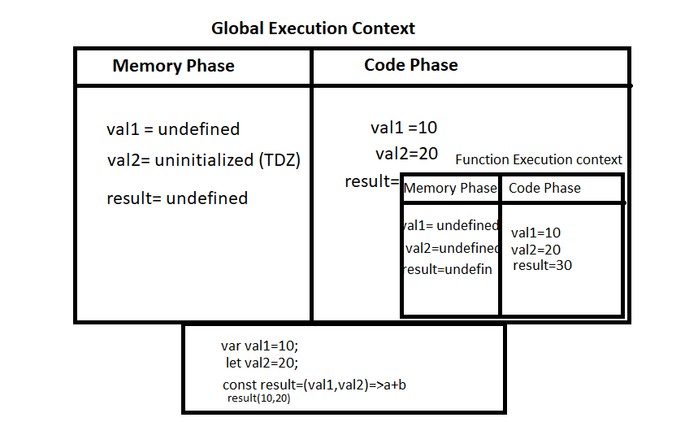
---

### Q3: JavaScript vs ECMAScript

- **JavaScript** → the language used in browsers.
- **ECMAScript** → the standard/spec that JS follows.

---

### Q4: What is Hoisting?

Variable and function declarations are moved to the top of their scope before code execution. Hoisting does not work the same way for `let`/`const` — accessing them before declaration throws a `ReferenceError` (see TDZ in Q32). Inside a function, `var` can be used anywhere because `var` attaches itself to the (global/function) object.

```js
{
  console.log(a); // undefined → var is hoisted
  var a = 5;
}
{
  console.log(b); // ReferenceError → let in TDZ
  let b = 10;
}
```
```js
foo(); // Works → function is fully hoisted
function foo() {
  console.log(a); // undefined → var hoisted inside function
  var a = 10;
}
```
```js
function test() {
  for (var i = 1; i <= 3; i++) {}
  console.log(i); // 4 → var is NOT block scoped
}
test();
```

---

### Q5: What is Closure? How do closures maintain memory? Disadvantages of Closures?

A closure is a function that gives you access to an outer function's scope from an inner function. It's like your mother packing your bag in the morning — even though she is no longer there, you still have the tiffin, shirt, and water bottle she packed.

Used for: module design pattern, currying, memoization.

**Advantages:**
1. Data privacy
2. State preservation

**Disadvantages:**
1. More memory consumption and performance overhead
2. Might create a memory leak

```js
function x(b) {
    var a = 5;
    function y() {
        console.log(a,b);  // 5 10
    }
    return y
}
let clo = x(10);
clo();

// exp 2
function outer() {
  let count = 0;
  return function inner() {
    count++;
    console.log(count);
  }
}
const closure = outer();
closure(); // 1
closure(); // 2
console.dir(closure); // Shows closure with "count" in console
const closure2 = outer();
closure2(); // 1
```
```js
function heavy() {
  let bigData = new Array(1000000);
  return () => bigData.length;   // bigData stays in memory as long as this closure exists
}
```

---

### Q6: What is an Expression? What is an Identifier? JS Variables? Difference: var, let, const. What is Variable Shadowing?

An **expression** is any reference to a variable value or a set of variable values.
```js
10 + 20
x * 5
```
An **identifier** is the name of a variable.
```js
let name = "Sam"; // name is the identifier
```

JavaScript variables are containers for data.
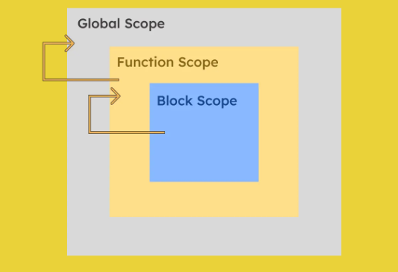
**`var`:** scoped to the function it's defined within (function/global scope). Stored on the browser `window` object.
```js
var x = 10;
var x = 20;
console.log(x); // 20

function foo(){
  var x = 'sam'  // local/function scope
}

var x = "sam"    // global scope
if (true) { y = "sou"; }   // global scope (implicit global)
while (cond) { var z = "sam"; }  // global scope
switch (true) { var test = 'hello'; } // global scope
```

**`let`, `const`:** scoped to the block defined by curly braces — **lexical variable scope**. Not stored on `window`. `const` can only be declared and assigned once — it cannot be updated or redeclared.
```js
{
  let x = 'hello'; // block scope
}

function demo() {
  if (true) {
    var x = 10;
    let y = 20;
    const z = 30;
  }
  console.log(x); // ✅ works (var → function scope)
  console.log(y); // ❌ error (let → block scope)
  console.log(z); // ❌ error (const → block scope)
}
demo();
```
```js
for (let i = 0; i < 3; i++) {
  setTimeout(() => console.log(i)); // 0 1 2 — each iteration gets its own `i`
}
for (var i = 0; i < 3; i++) {
  setTimeout(() => console.log(i)); // 3 3 3 — shared `i`
}
```

**Variable Naming Rules:**
1. Cannot start with a number
2. Must start with a letter, `_`, or `$`
3. Don't use reserved keywords or spaces
```js
let name, $price, _id;
```

**Variable Shadowing** happens when a variable inside a local scope has the same name as one in an outer scope, and the inner one temporarily hides (shadows) the outer variable within that block/function.
```js
var a = 10;
{
  var a = 100; // shadows outer 'a'
  console.log(a); // 100
}
console.log(a); // 100 (because var is function-scoped, not block-scoped)
```

---

### Q7: What is the Event Loop? Explain event loop phases (macrotasks, microtasks)

The Event Loop lets JS handle asynchronous operations (setTimeout, promises, APIs) despite being single-threaded.

1. **Call Stack** — JS executes code line by line; sync code runs here.
2. **Web APIs** — when you call `setTimeout`, `fetch`, event listeners, the browser handles them.
3. **Callback/Task Queue** — once a Web API finishes, it pushes the callback here.
4. **Microtask Queue (higher priority)** — Promises' `.then()`, `queueMicrotask()`, `MutationObserver`.
5. **Event Loop** — keeps checking: if the call stack is empty, push tasks from the microtask queue first, then the callback (macrotask) queue.
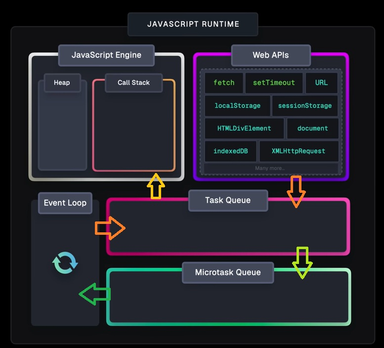

```js
console.log("a");
setTimeout(() => {
  console.log("b");
  setTimeout(() => { console.log("c"); }, 1000);
}, 1000);
console.log("d");
// Output: a d b c
```
```js
console.log("A");
setTimeout(() => console.log("B"), 0);
Promise.resolve().then(() => console.log("C"));
console.log("D");
// A D C B
```

---

### Q8: Sync vs Async

- **Sync** → executes one by one, blocking.
- **Async** → doesn't block the next line; continues elsewhere while waiting.

---

### Q9: What is the `this` keyword?

Refers to the current execution context. Its value depends on **how** a function is called. Arrow functions don't define their own `this` — they inherit it from the parent (lexical) scope. A constructor binds `this` to the new instance.

```js
// global scope
var a = 10;
console.log(window.a); // 10
console.log(a);        // 10
console.log(this.a);   // 10

// inside object method
const obj = { name: "Sam", show() { console.log(this.name); } }; // Sam
obj.show();

// inside regular function
function fn() { console.log(this); }
fn(); // window

const obj = { a:1, b:2, sum() { return this.a + this.b } };
console.log(obj.sum()); // 3

// inside arrow function
const obj2 = { name: "Sam", show: () => console.log(this.name) }; // undefined (arrow has no own `this`)
obj2.show();

// inside constructor
function Person(name) { this.name = name; }
const p = new Person("Sam");
console.log(p.name); // Sam
```

---

### Q10: Arrow function vs normal function vs IIFE vs Anonymous function

**Normal Function**
```js
function add(a, b) { // declaration + definition
  return a + b;
}
```

**Arrow Function / Lambda Expression** — ES6+. Arrow functions don't support function *declarations*, only function *expressions*. No own `this` binding, and not suitable for `call`/`apply`/`bind`.
```js
const arrow = () => { console.log('hi') };
arrow(); // hi
const foo = name => name;
console.log(foo("sam")); // sam
const fruit = () => ['mango', 'banana'];
console.log(fruit()); // ['mango','banana']
const x = (a, b, ...c) => [a, b, c];
console.log(x('sam','mik','sou','rik')); // ['sam','mik',['sou','rik']]
const add = (a, b) => a + b;
console.log(add(10,20)); // 30
```

**IIFE (Immediately Invoked Function Expression)** — used to avoid polluting the global scope.
```js
// problem
var $ = 'i am sam';
var $ = 'i am sou'; // overwrites!

// solution
(function f1(){ var $ = 'i am sam'; console.log($); })();
(function f2(){ var $ = 'i am sou'; console.log($); })();
```
```js
(function ask(question = "prompt", yes = alert, no = alert) {
  if (confirm(question)) yes("You agreed.");
  else no("You canceled the execution.");
})();
```

**Anonymous Function** — a function without a name.
```js
let f = function(){ console.log('javascript') };
// or
(function(){ console.log('javascript') })();
```

🧪 **FAQ:**
```js
function a(){return 'a'} function b(){return 'b'} function c(){return 'c'}
console.log((a(),b(),c())); // c — comma operator returns the LAST value
console.log((c(),a(),b())); // b
```
```js
function hello(){ console.log('hello'); } // hello
new hello
```
```js
function test(a,a){ console.log(a); } // undefined — 2nd `a` shadows the 1st
test(3)
```

---

### Q11: Shallow vs Deep Copy

**Shallow Copy:** copies only top-level values — nested objects are still shared by reference. Changing nested values affects both copies.
**Deep Copy:** creates a completely independent copy at all levels — changing nested values doesn't affect the original.

```js
let originalObj = { name: "Sam", address: { city: "Asansol" } };

let shallowCopy = { ...originalObj };
let deepCopy = JSON.parse(JSON.stringify(originalObj));
originalObj.address.city = "electronic";

console.log(shallowCopy.address.city); // electronic (shared reference)
console.log(deepCopy.address.city);    // Asansol (independent)
```

> 💡 **Extra detail:** `JSON.parse(JSON.stringify())` loses functions, `undefined`, `Symbol`, `Date` objects (converted to strings), and can't handle circular references — see the modern `structuredClone()` alternative in Additional Questions.

---

### Q12: What are Promises? Why is a Promise faster than setTimeout? Build your own Promise for a Microtask? What happens internally when a Promise resolves?

A **Promise** is an object representing the eventual completion or failure of an asynchronous operation and its resulting value. It has **3 states**: pending, rejected, fulfilled — introduced in ES6. Use `.then()` for successful completion and `.catch()` for failure.

```js
let promise = new Promise((res, rej) => {
    let flag = true;
    if (flag) res(5); else rej("error");
}).then(console.log).catch(console.log);
```
```js
function getData() {
    return new Promise((res) => res("✅ Initial Data"));
}
getData().then(() => "🥭").then().then().catch().then((data) => console.log(data)); // 🥭
```
```js
function createOrder() {
  return new Promise(resolve => setTimeout(() => { console.log("Creating an order..."); resolve(); }, 1000));
}
function chargePayment() {
  return new Promise(resolve => setTimeout(() => { const pay=1000; console.log("Charging..."); resolve(pay); }, 2000));
}
function sendInvoice(pay) { console.log("Sending invoice...", pay); }

createOrder().then(() => chargePayment()).then((pay) => sendInvoice(pay));
```

**Why is a Promise faster than setInterval?** Promises run in the **microtask queue**, which has higher priority than `setInterval`'s **macrotask queue**. Microtasks execute earlier in JS's event loop.
```js
console.log("Start");                                                       // 1
setInterval(() => console.log("Interval"), 0);                              // 4
Promise.resolve().then(() => console.log("Promise1")).then(() => console.log("Promise2")); // 3rd/4th
console.log("End");                                                          // 2
```

**Build your own promise:**
```js
function girlfriend(){
    return new Promise((propose,reject)=>{
        setTimeout(()=>{
            const iLoveYou = true;
            if (iLoveYou) { console.log('after buying a rose, propose'); propose(); }
            else { reject('sorry not fulfilled'); }
        }, 2000);
    });
}
girlfriend().then(()=>console.log('sam proposes his gf')).catch(()=>console.log('next time good luck'));
```

**Internally when a Promise resolves:** it quietly changes state from `'pending'` to `'fulfilled'`, but nothing runs immediately. The `.then()` callback is placed into the **microtask queue**. JS finishes whatever is currently on the call stack, then the event loop picks up the microtask and executes the `.then()` callback.

---

### Q13: Promise.all vs Promise.race

**`Promise.all()`** → runs promises in parallel, waits until **all** finish. If any one fails, the whole result fails.
```js
Promise.all([p1, p2, p3]).then(result => console.log(result));
// ["🍎 Apple", "🍌 Banana", "🍇 Grapes"]
```

**`Promise.allSettled()`** → runs promises in parallel, waits until **all** complete (success or fail) — never short-circuits on error; returns status + value/reason for each.

**`Promise.race()`** → returns the result of whichever promise finishes **first** (success or fail).
```js
Promise.race([sam, rik]).then(user => console.log(user)); // "I am fast"
```
```js
const p1 = new Promise(res => setTimeout(() => res("p1 done"), 1000));
const p2 = new Promise(res => setTimeout(() => res("p2 done"), 500));
Promise.all([p1,p2]).then(res => console.log("All", res));   // ["p1 done","p2 done"] (after 1000ms)
Promise.race([p1,p2]).then(res => console.log("Race", res)); // "p2 done" (after 500ms)
```

---

### Q14: How to fetch API/AJAX using Promise? How to restrict fetch data?

AJAX = **A**synchronous **J**avaScript **A**nd **X**ML.
```js
const cache = new Map();

async function fetchData(id) {
  try {
    if (cache.has(id)) {
      console.log("Returning cached data");
      return cache.get(id);
    }

    console.log("Fetching from API");

    const response = await fetch(
      `https://jsonplaceholder.typicode.com/todos/${id}`
    );

    if (!response.ok) {
      throw new Error(`HTTP Error: ${response.status}`);
    }

    const data = await response.json();

    cache.set(id, data);

    return data;
  } catch (err) {
    console.error("Fetch failed:", err.message);
    return [];
  }
}

fetchData(1).then(console.log);
```

**Restricting fetched data** — by authentication token or role, to prevent unauthorized users from fetching data.
```js
useEffect(() => {
  const token = localStorage.getItem("authToken");
  if (!token) return;
  if (user.role !== "admin") return;

  fetch("/api/data", { headers: { Authorization: `Bearer ${token}` } })
    .then(res => res.json())
    .then(data => console.log(data));
}, []);
```

**Why use the Authorization header & Bearer token?** For secure APIs, the server must know who's making the request. A JWT is sent as `Authorization: Bearer <token>`, and every request is validated by the token's signature.

---

### Q15: Create a Promise and resolve on Button click

```jsx
import { useState } from "react";

export default function App() {
  function createClickPromise() {
    return new Promise((resolve) => resolve("Button clicked!"));
  }
  function handleClick() {
    createClickPromise().then((msg) => console.log(msg));
  }
  return <button onClick={handleClick}>Click Me</button>;
}
```

---

### Q16: Fetch data with a Promise — if the fetch fails, automatically retry after a given delay, up to a maximum number of attempts

```js
function retryFetch(url, maxSteps, delay) {
  let attempt = 0;
  return new Promise((resolve, reject) => {
    function tryAgain() {
      fetch(url)
        .then(res => res.json())
        .then(data => resolve(data))
        .catch(err => {
          attempt++;
          if (attempt < maxSteps) { setTimeout(tryAgain, delay); }
          else { reject("Failed"); }
        });
    }
    tryAgain();
  });
}

retryFetch("https://dummyjson.com/posts/1", 3, 1000)
  .then(data => console.log(data))
  .catch(err => console.error(err));
```

**How to handle errors in a Promise?** Use `.catch()` or `try...catch` inside `async`/`await`.
```js
fetch(url).catch(err => console.error(err));
```

---

### Q17: Async/Await? Why is it better than Promise chains?

`async`/`await` is a cleaner way to work with Promises — write async code that *looks* synchronous, easier to read and debug. **If you create an `async` function, it automatically returns a Promise.**

```js
async function getSmile(){ return '😋'; }
const smile1 = getSmile();
const smile2 = await getSmile();
console.log(smile1, smile2); // Promise{'😋'}  😋
```
```js
async function run(){
    try { return 1; }
    finally { return 2; }
}
run().then(console.log); // 2 — finally's return overrides try's return
```

**What problem it solves:** avoids callback hell and complex `.then()` chaining; handles errors gracefully with a single `try...catch`.

**Variations of try-catch:**
```ts
try { } catch (error) { }
try { } finally { }
try { } catch (error) { } finally { }
try { try { } catch (error) { } } catch (error) { }
```

---

### Q18: What is Debounce & Throttle?

**Debounce:** delay execution until the user stops triggering the event for a set time. Useful for: search bars, input validation, API calls.
**Use Debounce for:**

- Search input API calls
- Auto-suggestion/typeahead
- Client-side filtering
- Form validation
- Username/email availability checks
- Auto-save drafts
- Address/location search

```jsx
useEffect(() => {
  const timer = setTimeout(() => console.log("Searching for:", text), 500);
  return () => clearTimeout(timer);
}, [text]);
```

**Throttle:** limit execution to once per interval, even if triggered multiple times. Useful for: scroll, resize, mousemove events.


**Use Throttle for:**

- Scroll events
- Window resize
- Mouse movement tracking
- Drag and drop
- Infinite scrolling
- Scroll progress indicators
- Analytics/event tracking
- Preventing rapid button clicks

```jsx
function handleChange(e) {
  if (throttleRef.current) return;
  throttleRef.current = true;
  console.log("Throttled Value:", e.target.value);
  setTimeout(() => { throttleRef.current = false; }, 2000);
}
```
```txt
Debounce (send last)                     Throttle (send once per interval)
---------------------------------------------------------------
User:   A → A → A → A                     User:   A → A → A → A → A → A
              ↘  ↘  ↘                                      ↓           ↓
Wait:     [reset][reset][wait]            Delay:   |---delay---| |---delay---|
Server:                     A              Server:  A---------------------A
```

---

### Q19: Polyfill Example (map / filter / flat)

```js
// map polyfill
Array.prototype.myMap = function(callback) {
  let result = [];
  for (let i = 0; i < this.length; i++) result.push(callback(this[i], i, this));
  return result;
};

// filter polyfill
Array.prototype.myFilter = function(callback) {
  let result = [];
  for (let i = 0; i < this.length; i++) if (callback(this[i], i, this)) result.push(this[i]);
  return result;
};

// flat polyfill
Array.prototype.myFlat = function (depth = 1) {
  let result = [];
  this.forEach(item => {
    if (Array.isArray(item) && depth > 0) result = result.concat(item.myFlat(depth - 1));
    else result.push(item);
  });
  return result;
};
let arr = [1, [2, [3], 4]];
console.log(arr.myFlat(2)); // [1, 2, 3, 4]
```

---

### Q20: Call, Apply, Bind

`call()` invokes a function immediately with a specific `this` value and individual arguments.
`apply()` does the same as `call()` but takes arguments as an **array**.
`bind()` returns a **new function** with a permanently bound `this` value (doesn't invoke immediately).

```js
const person = { name: "Sam", age: 25 };
function intro(greeting, emoji) {
  console.log(`${greeting}, I'm ${this.name} and I'm ${this.age} ${emoji}`);
}
intro.call(person, "Hi", "😊");         // Hi, I'm Sam and I'm 25 😊
intro.apply(person, ["Hello", "👋"]);   // Hello, I'm Sam and I'm 25 👋
const introSam = intro.bind(person);
introSam("Hey", "😎");                   // Hey, I'm Sam and I'm 25 😎
```

---

### Q21: What is Currying?

Transforming a function that takes multiple arguments into a sequence of functions, each taking a single argument. Like ordering a pizza step by step: choose size → choose toppings → get the final pizza order.
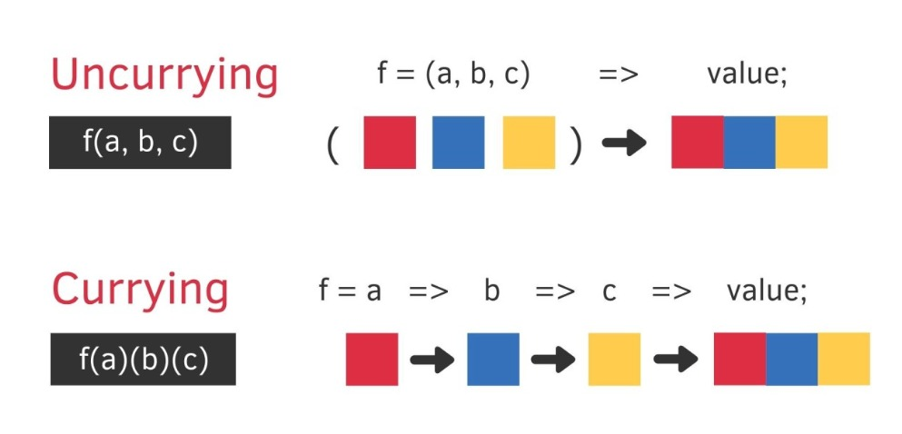
```js
function add(a) { return function(b) { return a + b; }; }
const add5 = add(5);
console.log(add5(3)); // 8

// or
const add = a => b => a + b;
console.log(add(5)(3)); // 8
```

---
### Q21.1: What is Pipe function?

A pipe function allows you to pass the output of one function as the input to the next function, creating a chain of left to right sequence of operations.

```js
function double(x){
    return x*2;
}
function square(x){
    return x*x
}
function add(x){
    return x+1
}

function Pipe(...fns) {
    return function(value) {
        return fns.reduce((acc, fn) => fn(acc), value);
    };
}

const fn=Pipe(double,square,add)
console.log(fn(3))
```

### Q22: What is Prototype?

`prototype` is an object automatically attached to functions (specifically constructor functions) — it becomes the parent template. `__proto__` is a reference inside every object pointing to the prototype it inherits from.
```js
const obj = { a: 10 };
console.log(obj.__proto__); // Object.prototype

function Person() { this.name = "Sam"; }
Person.prototype.sayHello = function () { console.log("Hello!"); };
const p = new Person();
p.sayHello(); // Hello!
```

---

### Q23: Difference: undefined vs null

- **`undefined`** → declared but not assigned.
```js
let a;
console.log(a); // undefined
```
- **`null`** → intentional empty value.
```js
let b = null;
console.log(b); // null
```

---

### Q24: Event Delegation

Handle events efficiently by adding a **single** listener on a parent element instead of one per child.
**Benefits:** improves performance (fewer listeners in the DOM).
```js
ul.addEventListener('click', (e) => {
  if (e.target.tagName === 'LI') console.log(e.target.textContent);
});
```
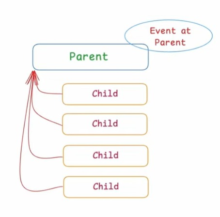

---

### Q25: LocalStorage vs SessionStorage (with example)

**localStorage** → persists after reload, permanent until cleared. Use for theme/token; shared scope across tabs.
```js
localStorage.setItem("name", "Sam");
console.log(localStorage.getItem("name")); // Sam
```
**sessionStorage** → clears when the tab closes. Use for banking/forms; scoped per tab.
```js
sessionStorage.setItem("sessionName", "SamSession");
console.log(sessionStorage.getItem("sessionName")); // SamSession
```
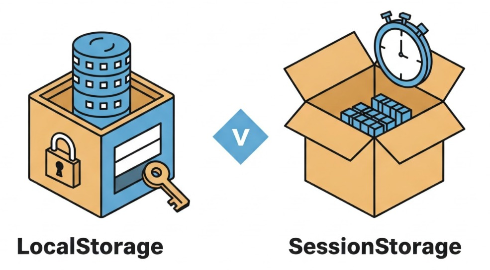
---

### Q26: Spread vs Rest

**Spread** — ES6 feature; used with arrays/objects to expand/combine content.
```js
let x = ["java"], y = ["js"];
let combine = [...x, ...y];
const nums = [1,2,3];
const newNums = [...nums, 4, 5]; // [1,2,3,4,5]
```

**Rest** — collects an infinite number of arguments into an array; must always be the **last** parameter.
```js
function course(a, ...rest) { return rest; }
console.log(course('js','java','python')); // ['java','python']

function sum(...numbers) { return numbers.map(x => x + 5); }
console.log(sum(4,5,6,7)); // [9,10,11,12]

function foo(x,y,z) { console.log(x,y,z); }
foo(...[1,2,3]); // 1 2 3
```

---

### Q27: Deep Clone Object

```js
function deepClone(obj) {
    if (obj === null || typeof obj !== 'object') return obj;
    return JSON.parse(JSON.stringify(obj));
}
```
🎯 `JSON.stringify()` converts a JS object to a string (but `JSON.stringify('JS') !== 'JS'`); `JSON.parse()` converts a string back to a JS object.

🎯 JSON (JavaScript Object Notation) is a key-value data format for storing/transferring data between systems.

---

### Q28: Optional Chaining

Safely access nested properties without throwing if an intermediate value is `null`/`undefined`.
```js
user?.address?.city
user?.getName?.()
users?.[0]?.name
fn?.("props")
document.querySelector(".box")?.textContent
```

---

### Q29: Difference Between == and ===

`==` (loose equality) — compares value only, with type coercion.
```js
console.log(5 == "5"); // true
```
`===` (strict equality) — compares value **and** type.
```js
console.log(5 === "5"); // false
```

---

### Q30: Difference Between slice, splice, split

**`slice()`** — copies a portion of an array, returns a **new array**, doesn't mutate the original.
```js
const fruits = ['apple','orange','lemon'];
console.log(fruits.slice(0,1)); // ['apple']
```
**`splice()`** — adds/removes/modifies elements **in place**, mutates the original.
```js
const fruits = ['apple','orange','lemon'];
fruits.splice(0,1,'banana');
console.log(fruits); // ['banana','orange','lemon']
```
**`split()`** — converts a string → array.
```js
"a,b,c".split(",") // ['a','b','c']
```

---

### Q31: Event Bubbling (default) vs Capturing

**Bubbling:** inner → outer — event moves from child up to parent.
```html
<div id="parent"><button id="child">Click Me</button></div>
<script>
  parent.addEventListener("click", () => alert("Parent clicked"));
  child.addEventListener("click", () => alert("Child clicked")); // fires first
</script>
```

**Capturing:** outer → inner — event moves from parent down to child (opposite order).
```js
parent.addEventListener("click", () => alert("Parent clicked"), true); // capturing phase
child.addEventListener("click", () => alert("Child clicked"), true);
```

**`stopPropagation()`** — stops an event from bubbling further to parent elements.
```html
<div onclick="alert('Parent clicked')">
  <button onclick="event.stopPropagation()">Click Me</button>
</div>
```
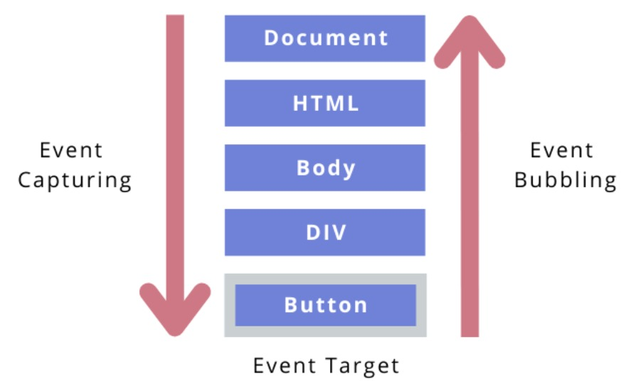 
---

### Q32: What is Temporal Dead Zone (TDZ)?

The zone where a variable exists but cannot be accessed before its initialization (applies to `let`/`const`).
```js
console.log(a); // ReferenceError (if `a` is let/const, not var)
let a = 'sam';
```

---

### Q33: Garbage Collection

JS automatically removes unused memory (unreferenced objects).

---

### Q34: Webpack

A **module bundler** that combines JavaScript, CSS, images, and other assets into an optimized build (usually a single `bundle.js`).
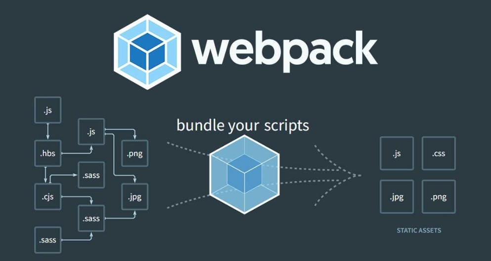
---

### Q35: What are higher-order functions?

A function that takes another function as an argument OR returns a function (e.g. `map`, `filter`, `reduce`). Like Amazon's recommendation system: you give it a "preference" (your click), and it uses that logic to show similar products — that's an HOF running your callback.
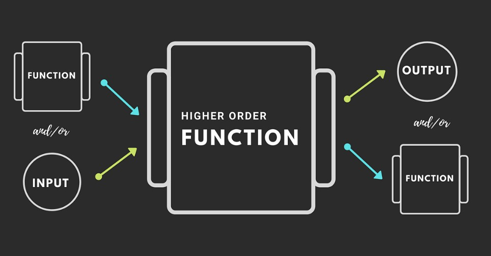

**Why use it?** Reusability, code modularity.
```js
function add(a,b){ return a+b; }
function multiply(a,b){ return a*b; }
function calc(n1,n2,op){ return op(n1,n2); } // HOF
console.log(calc(10,10,add));
console.log(calc(10,10,multiply));
```
```js
function onceHOF(fn) {
  let called = false;
  return function (...args) {
    if (!called) { called = true; return fn(...args); }
  };
}
const greetOnce = onceHOF(() => console.log("Hello!"));
greetOnce(); // Hello!
greetOnce(); // (nothing)
```

---

### Q36: How to check Performance

```js
console.time('loop');
for (let i = 0; i < 10; i++) { console.log(i); }
console.timeEnd('loop');
```

---

### Q37: What are modules in JavaScript?

Break code into reusable files using `export`/`import`. Two module systems: **CommonJS** (Node.js) and **ES6 modules** (modern apps).

**Named export** (name is fixed on import):
```js
export const x = 1;
import { x } from './file.js';
```
**Default export** (can be renamed on import):
```js
export default function add(a,b){ return a+b; }
import myAdd from "./util.js";
```

---

### Q38: Use of Content-Type

Tells the browser what type of data is being sent.
- `application/json` → JSON data
- `text/html` → HTML
- `multipart/form-data` → file uploads

---

### Q39: What is destructuring?

Extracting/unpacking values from arrays or objects into separate variables — cleaner, more readable code.
```js
const [a, b] = [1, 2];
const {name, age} = person;

let x = ["java","js","node"];
let [ ,y ,z] = x;
console.log(y,z); // js node

let x, y;
[x=10, y=20] = [,200];
console.log(x, y); // 10 200

function details({userId,userName,pass}) { return userId + userName + pass; }
console.log(details({userId:'101',userName:'sam',pass:'123'})); // 101sam123

const user = { name:"Sam", age:30, address: { location: { state:'bengal', landmarks: [{title:'Burnpur'},{title:'Asansol'}] } } };
const {name, age, address:{location:{state, landmarks: [ , { title: a } ]}}} = user;
console.log(name, a); // Sam Asansol
```

---

### Q40: What is a generator function?

Can pause and resume execution using `yield`. Defined with `function*` syntax — useful for lazy evaluation or async flows.
```js
function* gen() { yield 1; yield 2; yield 3; }
const g = gen();
console.log(g.next().value); // 1
console.log(g.next().value); // 2
```
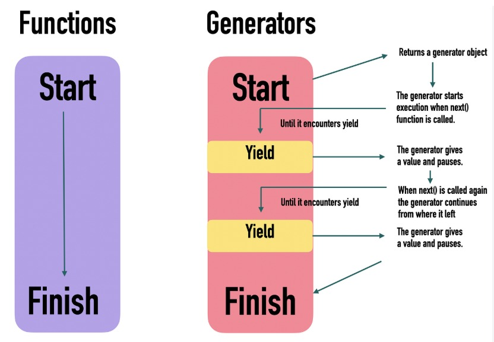
---

### Q41: Explain the concept of immutability

Data shouldn't be modified directly — instead, create new copies. Important for React state and predictable behavior.

---

### Q42: All attributes of the script tag

`src`, `type`, `async`, `defer`, `crossorigin`

---

### Q43: What is a first-class function?

A function you can store as a value (assign to variables, pass as arguments, return from other functions).
```js
let a = function(){};
```

---

### Q44: Use of "use strict"? What problems does it solve? "use strict" vs TypeScript

Makes JS more secure: prevents undeclared variables, catches silent errors.
```js
"use strict";
x = 5; // ReferenceError
```
```js
function sum(n1,n2){
    'use strict';
    n1 = 20; n2 = 20;
    return arguments[0] + arguments[1]; // 20 — arguments object NOT linked to params in strict mode
}
console.log(sum(10,10)); // 20 (would be 40 without 'use strict')
```

**Advantages:** prevents accidental globals, catches silent errors, more secure code.

**"use strict" vs TypeScript:**
1. `"use strict"` catches errors at **runtime**; TypeScript catches errors at **compile time**.
2. `"use strict"` doesn't provide type safety; TypeScript does.

---

### Q45: Data Types in JS (Primitive vs Non-Primitive)

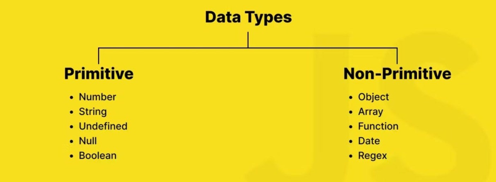

**Primitive:** single, immutable values — `String`, `Number`, `Boolean`, `null`, `undefined`, `Symbol`, `BigInt`.
```js
Boolean(undefined) → false
Boolean(null) → false
Boolean('') → false
Boolean(0) → false
Boolean(-1) → true
```
**Non-Primitive:** mutable data structures storing multiple values — `Object`, `Array`, `Function`, `Date`, `Math`. When copied, only the **reference** is copied.
```js
let a = [1,2,3];
let b = a;
a.pop();
console.log(a, b); // [1,2] [1,2] — both changed
```

🎯 Primitives are pass-by-value; objects are pass-by-reference.

---

### Q46: Null vs Undefined

**`null`** → empty value set by the user; represents the absence of an object value; not a global property.
```js
var x = null;
console.log(typeof x); // "object"
```
**`undefined`** → declared but not assigned; is a global property of the global object.
```js
var x;
console.log(typeof x); // "undefined"
```

---

### Q47: Types of operators & associativity

**Arithmetic:** `+ - * / % ++ --`
**Assignment:** `= += -= *= /=`
**Comparison:** `== === != !== > < >= <=`
**Logical:** `&& || !`
**Ternary:** `variable = (condition) ? value1 : value2`

| Category | Associativity |
|---|---|
| Arithmetic (`+ - * / %`) | Left → Right |
| `++`/`--` (prefix) | Right → Left |
| Assignment (`= += *=` etc.) | Right → Left |
| Comparison (`== >=` etc.) | Left → Right |
| Logical (`&&`) | Right → Left |
| Logical NOT (`!`) | Right → Left |

**Post vs Pre increment:**
```js
let num = 10;
const increaseNumber = () => num++; // returns OLD value, then increases
console.log(increaseNumber()); // 10

let num2 = 10;
const increaseNumber2 = () => ++num2; // increases first, then returns
console.log(increaseNumber2()); // 11
```

---

### Q48: Parameter vs Argument

**Parameter** = variable in the function definition.
**Argument** = actual value passed at call time.
```js
function add(a,b){ } // parameters
add(2,3); // arguments
```

---

### Q49: Callback Function

A function passed into another function as a parameter, to run after a task completes.
```js
setTimeout(() => console.log("Arrow function"), 1000);

function greet(name, cb) { cb(`Hello ${name}`); }
greet("Sam", console.log); // Hello Sam
```
```js
function createOrder(callback) {
    setTimeout(() => { console.log('Creating an order...'); callback(); }, 1000);
}
function chargePayment(callback) {
    setTimeout(() => { let err=null, chargePay=1000; callback(err,chargePay); }, 2000);
}
function sendInvoice(pay) { console.log('Sending invoice $', pay); }

function main() {
    createOrder(() => {
        chargePayment((err, chargePay) => {
            if (err) { console.error(err); return; }
            sendInvoice(chargePay);
        });
    });
}
main();
```

---

### Q50: Pyramid of Doom (Callback Hell)

Many callbacks nested inside each other — code becomes deep, messy, hard to read.
```js
getData(() => {
  processData(() => {
    saveData(() => {
      sendEmail(() => { console.log("Done"); });
    });
  });
});
```

---

### Q51: Callback hell solved by Promise Chain

More readable, handles errors more easily.
```js
getData()
  .then(processData)
  .then(saveData)
  .then(sendEmail)
  .then(() => console.log("Done"))
  .catch(err => console.log("Error:", err));
```

---

### Q52: Constructor

Used to create multiple similar objects.
```js
function User(n){ this.name = n; }
let u = new User("Sam");
let v = User("jake"); // called WITHOUT `new` — `this` is not bound to a new object
console.log(u?.name, v?.name); // Sam undefined
```

---

### Q53: Why use Constructor Function? What is Prototype Inheritance?

To create multiple objects with the same structure without manually writing each one.
```js
function User(name,age) { this.name = name; this.age = age; }
let u = new User('Sam',30);
console.log(u.name, u.age); // Sam 30

const u3 = User("Jose", 30); // no `new` → returns undefined, `this` = global/undefined
console.log(u3?.name); // undefined
```

**Prototype Inheritance** — objects can inherit properties/methods from another object through the prototype chain.
```js
function User(name) { this.name = name; }
User.prototype.sayHello = function () { console.log("Hello, " + this.name); };
let u1 = new User("Sam");
u1.sayHello(); // Hello, Sam
```

---

### Q54: Strings are Immutable

A string is a sequence of characters — once created, it can't be changed; a new copy is made on any "edit."
```js
const s = "A string primitive";
const s2 = new String("A String object");
```
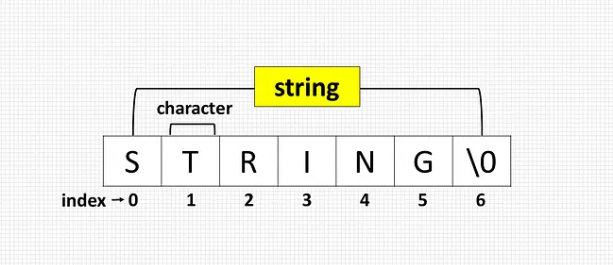
---

### Q55: new Array() vs []

`new Array(3)` creates **empty slots**; `[]` creates an actual array literal. Prefer `[]`.
```js
const fruits = ['Apple','Banana','Orange'];   // preferred
const fruits2 = new Array('Apple','Banana','Orange'); // works, but less idiomatic
```

---

### Q56: Create an object without using `new`

```js
const obj1 = {};
const obj2 = Object.create(null);
const obj3 = { name: "Sam" };
const obj4 = Object.assign({}, {a:1});
function makeObj(){ return {id:1}; }
const obj5 = makeObj();
```

---

### Q57: Web APIs (browser features)

`fetch()`, `setTimeout()`, `setInterval()`, `localStorage`, `sessionStorage`, `document`, `navigator`, `geolocation`, `history`, `console`, `alert()`.

---

### Q58: for...of vs for...in, and if-else vs switch

| Loop Type | Best For | Works On | Returns | When to Use |
|---|---|---|---|---|
| **for** | General-purpose loop | Arrays, Strings | Index-based iteration | Need index or full control |
| **for...of** | Iterating values | Arrays, Strings, Maps, Sets | Values of iterables | Only need values |
| **for...in** | Iterating properties | Objects (also arrays, not recommended) | Keys/indexes | Looping object properties |

**if-else** — for range or complex conditions.
```js
let age = 20;
if (age < 18) console.log("Minor");
else if (age < 60) console.log("Adult");
else console.log("Senior Citizen");
```

**switch** — for multiple matches of the same value.
```js
let day = 6;
switch (day) {
  case 1: case 2: case 3: case 4: case 5: console.log("Weekday"); break;
  case 6: case 7: console.log("Weekend"); break;
  default: console.log("Invalid day");
}
```

---

### Q59: map vs forEach

**`forEach()`** just loops — returns `undefined`; doesn't support method chaining.
```js
let a = ["a","b","c"];
let b = a.forEach((val) => val);
console.log(b); // undefined
```
**`map()`** returns a **new array** — use when you want a transformed copy.
```js
let b2 = a.map((val) => val);
console.log(b2); // ["a","b","c"]
```

---

### Q60: instanceof

Checks if an object was created from a class/constructor.
```js
obj instanceof MyClass;
```

---

### Q61: Tree Shaking

Removes unused JS code during bundling (only works reliably with ES modules `import`/`export`, not CommonJS).

---

### Q62: What is DOM and BOM, and their advantages/disadvantages?

**DOM (Document Object Model):** when a page loads, the browser constructs the DOM — a tree-like structure of HTML. `Document` is the root object; a **node** is any item (element, text, comment, attribute); an **element** is a node type representing HTML tags; a **NodeList** is an array-like collection of nodes.

**BOM (Browser Object Model):** controls browser features (`window`, `navigator`, `location`, `history`, `screen`).

**Advantages:** JS can dynamically change HTML/CSS; easy to traverse and modify elements.
**Disadvantages:** direct DOM manipulation is slow, impacts performance; complex/hard to track in large apps.

**Where do we use BOM in React?** Inside `useEffect` for: redirect via `window.location`, local/session storage, window-size listeners, scroll position.

---

### Q63: Useful DOM Properties

`.innerHTML` — insert HTML content (e.g. cards, table rows).
`.innerText` — text only, ignores HTML tags.
`.textContent` — similar to innerText but includes hidden text and doesn't trigger reflow.
`.style` — inline CSS.
`.classList` — add/remove/toggle a class safely: `.add()`, `.remove()`, `.toggle()`, `.replace()`.
`.value` — get/set form input values.
`.children` / `.firstElementChild` / `.lastElementChild` / `.parentElement`
`.appendChild()` — adds an element inside another.
`.disabled` — enable/disable form controls.
`.remove()` — removes the element from the DOM.
`.setAttribute()` / `.removeAttribute()` / `.hasAttribute()`

---

### Q64: DOMContentLoaded

Fires when HTML is fully loaded and parsed, **before** images/CSS/other assets finish — helps run JS early.
```js
document.addEventListener("DOMContentLoaded", function () {
  console.log("DOM is ready!");
});
```

---

### Q65: Access DOM (5 ways)

- **`getElementById()`** — single element by unique `id` (fastest, most direct).
- **`getElementsByClassName()`** — multiple elements sharing a class; returns a live HTMLCollection.
- **`getElementsByTagName()`** — returns an HTMLCollection of matching tags.
- **`querySelector()`** — first element matching a CSS selector; supports complex selectors.
- **`querySelectorAll()`** — all matching elements, returns a static NodeList.

🎯 Note: for a **single** element use `querySelector()`; for **multiple** elements use `querySelectorAll()` and loop with `forEach`.

---

### Q66: Optimize DOM Traversal

Use a `DocumentFragment` — a lightweight DOM node that is never part of the main DOM tree, so you can build up multiple elements off-screen and insert them all in **one** DOM update.
```js
const box = document.getElementById("box");
const fragment = document.createDocumentFragment();
const p = document.createElement("p"); p.textContent = "Hello";
const btn = document.createElement("button"); btn.textContent = "Click Me";
fragment.appendChild(p);
fragment.appendChild(btn);
box.appendChild(fragment); // single reflow/repaint
```

---

### Q67: What is DOMTokenList (classList)?

`element.classList` returns a `DOMTokenList` with methods to manage CSS classes dynamically.
```js
box.classList.add('red');
box.classList.remove('blue');
box.classList.toggle('active');
console.log(box.classList.contains('red'));
```

---

### Q68: isNaN() and Number()

`isNaN()` checks if a value is **not** a number.
```js
isNaN('true') → true
isNaN(undefined) → true
isNaN(true) → false
```
`Number()` converts anything to a number.
```js
Number(false) → 0
Number(null) → 0
Number('') → 0
Number({}) → NaN
Number(undefined) → NaN
```

**Type Coercion** — JS automatically converting one type to another during an operation.
1. **Implicit (automatic):** `"9" + 5 → "95"`, `9 + "5" → "95"`
2. **Explicit (manual):** `Number()`, `String()`, `Boolean()`

---

### Q69: Array and Array Methods

An array is a linear data structure storing multiple elements at contiguous memory locations. Size and type are dynamic; `typeof` an array is `"object"`. Arrays are mutable. Check with `Array.isArray()`.

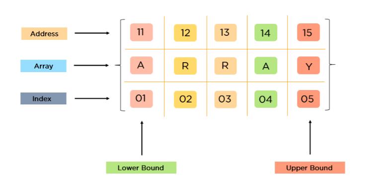

| Method | Description | Example |
|---|---|---|
| `push()` | adds to end | `[1,2].push(3) → [1,2,3]` |
| `pop()` | removes from end | `[1,2,3].pop() → [1,2]` |
| `unshift()` | adds to start | `[2,3].unshift(1) → [1,2,3]` |
| `shift()` | removes from start | `[1,2,3].shift() → [2,3]` |
| `concat()` | joins arrays | `[1].concat([2,3]) → [1,2,3]` |
| `slice()` | extracts (no mutation) | `[1,2,3,4].slice(1,3) → [2,3]` |
| `splice()` | add/remove in place | `[1,2,3].splice(1,1,9) → [1,9,3]` |
| `indexOf()` | first index of value | `[1,2,3].indexOf(2) → 1` |
| `includes()` | check existence | `[1,2,3].includes(2) → true` |
| `join()` | array → string | `[1,2,3].join('-') → "1-2-3"` |
| `reverse()` | reverses order | `[1,2,3].reverse() → [3,2,1]` |
| `sort()` | sorts (default ascending, lexicographic) | `[3,1,2].sort() → [1,2,3]` |
| `map()` | new array via function | `[1,2].map(x=>x*2) → [2,4]` |
| `filter()` | new array of matches | `[1,2,3].filter(x=>x>1) → [2,3]` |
| `reduce()` | combines to single value (left→right) | `[1,2,3].reduce((a,b)=>a+b,0) → 6` |
| `reduceRight()` | combines right→left | see example below |
| `forEach()` | runs fn per element | `[1,2].forEach(x=>console.log(x))` |
| `find()` | first matching element | `[1,2,3].find(x=>x>1) → 2` |
| `findIndex()` | index of first match | `[1,2,3].findIndex(x=>x>1) → 1` |
| `every()` | all pass test? | `[2,4].every(x=>x%2===0) → true` |
| `some()` | any pass test? | `[1,2].some(x=>x>1) → true` |
| `flat()` | flattens nested arrays (default depth 1) | `[1,[2,3]].flat() → [1,2,3]` |
| `fill()` | fills with a value | `[1,2,3].fill(0) → [0,0,0]` |
| `from()` | array-like/iterable → array | `Array.from('abc') → ['a','b','c']` |

```js
const arr = ["1","2","3","4","5"];
let total = arr.reduceRight((prev, cur) => prev + cur);
console.log(total); // "54321"
```

---

### Q70: String Methods

| Method | Description | Example |
|---|---|---|
| `charAt()` | char at index | `"Hello".charAt(1) → "e"` |
| `charCodeAt()` | ASCII of char | `"A".charCodeAt(0) → 65` |
| `concat()` | joins strings | `"Hello".concat(" World")` |
| `includes()` | substring exists? | `"Hello".includes("lo") → true` |
| `indexOf()` | first index (-1 if absent) | `"Hello".indexOf("l") → 2` |
| `lastIndexOf()` | last index | `"Hello".lastIndexOf("l") → 3` |
| `slice()` | extract (supports negative index) | `"Hello".slice(-2) → "lo"` |
| `substring()` | extract (no negative index) | `"Hello".substring(1,4) → "ell"` |
| `replace()` | replaces part | `"Hello".replace("H","J") → "Jello"` |
| `split()` | string → array | `"a,b,c".split(",") → ["a","b","c"]` |
| `trim()` | removes surrounding spaces | `" hi ".trim() → "hi"` |
| `toUpperCase()`/`toLowerCase()` | case conversion | `"hi".toUpperCase() → "HI"` |
| `startsWith()`/`endsWith()` | prefix/suffix check | `"Hello".startsWith("He") → true` |
| `repeat()` | repeats string N times | `"Hi".repeat(3) → "HiHiHi"` |

🎯 Note: `substring()` doesn't support negative index, but `slice()` does — `slice()` is the modern preference.

---

### Q71: Object Methods

| Method | Description | Example |
|---|---|---|
| `Object.keys()` | property names | `{a:1,b:2} → ["a","b"]` |
| `Object.values()` | property values | `{a:1,b:2} → [1,2]` |
| `Object.entries()` | [key,value] pairs | `{a:1} → [["a",1]]` |
| `Object.assign()` | copies values | `Object.assign({}, {a:1})` |
| `hasOwnProperty()` | key exists? | `({a:1}).hasOwnProperty("a") → true` |
| `delete` | removes a property | `delete obj.a` |
| `Object.freeze()` | makes immutable | can't change values |
| `Object.seal()` | prevents add/remove keys | can still modify existing |
| `Object.create()` | new object with given prototype | `Object.create(Array.prototype)` |
| `toString()` | string form | `({a:1}).toString() → "[object Object]"` |

---

### Q72: Pass by value vs Pass by reference

**Pass by Value** → a copy of the value is passed (primitives).
```js
let a = 10;
function change(x) { x = 20; }
change(a);
console.log(a); // 10
```
**Pass by Reference** → the reference (address) is passed (objects/arrays); mutating properties affects the original.
```js
let obj = { name: "Sam" };
function change(o) { o.name = "John"; }
change(obj);
console.log(obj.name); // John
```

---

### Q73: Pure Function and Impure Function

**Pure function** → same input always gives same output, no side effects.
```js
function add(a, b) { return a + b; }
```
**Impure Function** → depends on/modifies external state.
```js
let count = 0;
function increment() { count++; return count; } // impure — mutates external variable
```

---

### Q74: Cross-Browser Scripting

Writing JS that works consistently across all browsers (handling compatibility differences).

---

### Q75: ES6 Features

`let`/`const`, arrow functions, template literals, classes, modules, promises, destructuring.

**ES5 Class Concept** — no `class` keyword; used constructor functions + prototypes.
```js
function Person(name) { this.name = name; }
Person.prototype.greet = function() { return "Hi " + this.name; };
const p = new Person("Sam");
console.log(p.greet()); // Hi Sam
```

---

### Q76: CORS

Cross-Origin Resource Sharing — allows API access from a different domain than the one serving the page.

---

### Q77: Mouse Events

- **`click`** — press + release.
- **`dblclick`** — double-click.
- **`mousedown`** — button pressed (before release).
- **`mouseup`** — button released.
- **`mousemove`** — pointer moves over element.
- **`mouseenter`** — pointer enters element boundary (does NOT bubble, unlike `mouseover`).
- **`mouseleave`** — pointer leaves element boundary (does NOT bubble, unlike `mouseout`).

---

### Q78: Event Emitter

An object that listens (`on`) and triggers (`emit`) events.
```js
const EventEmitter = require('events');
const event = new EventEmitter();
event.on('hi', () => console.log('Hello!'));
event.emit('hi');
```

---

### Q79: clientX vs scrollX

- **`clientX`** → mouse position relative to the visible viewport (ignores scrolling).
- **`scrollX`** → total horizontal scroll offset of the page.

```js
document.addEventListener("click", (e) => console.log(e.clientX)); // relative to viewport
console.log(window.scrollX); // total horizontal scroll
```

**Relationship:** `pageX = clientX + scrollX`

---

### Q80: Bundling vs Chunking

**Bundling** — combining many JS/CSS/asset files into one or a few optimized files.
**Chunking** — splitting large bundled code into smaller pieces loadable on demand.

---

### Q81: ESM vs ES6

- **ES6** → a language version (classes, `let`/`const`, arrow functions, etc.).
- **ESM** → the module system using `import`/`export`.

---

### Q82: Task Scheduler & LRU Cache

A **Task Scheduler** executes tasks in a planned order, usually with delay/priority. Use cases: sequential API calls, retry logic, scheduled jobs, animations, pausing long loops.

**LRU Cache** — stores a limited number of items, discards the **least recently used** item when full.
```js
function LRUCache(capacity) {
  const cache = new Map();
  function get(key) {
    if (!cache.has(key)) return -1;
    const value = cache.get(key);
    cache.delete(key); cache.set(key, value); // move to "most recent"
    return value;
  }
  function put(key, value) {
    if (cache.has(key)) cache.delete(key);
    if (cache.size === capacity) cache.delete(cache.keys().next().value); // evict oldest
    cache.set(key, value);
  }
  return { get, put, cache };
}
const cache = LRUCache(2);
cache.put(1,10); cache.put(2,20); cache.put(3,30);
console.log(cache.get(1)); // -1 (evicted)
```

---

### Q83: How to Test Code Using Jest in JS

```bash
npm install --save-dev jest
# package.json: "scripts": { "test": "jest" }
```
```js
// sum.js
export function sum(a, b) { return a + b; }

// sum.test.js
import { sum } from './sum';
test("adds numbers", () => { expect(sum(2, 3)).toBe(5); });
```

---

### Q84: What is an invariant?

A condition that always remains true during a program's execution or every iteration of a loop.
```js
let sum = 0;
for (let i = 0; i < arr.length; i++) {
  // Invariant: i is always between 0 and arr.length
  sum += arr[i];
}
```

---

### Q85: What is WebSocket?

A communication protocol creating a persistent, two-way (full-duplex) connection between client and server. Use cases: chat apps, multiplayer games, live score/stock updates.

---

### Q86: What is RegExp? How to create dynamic Regex in JavaScript?

A pattern used to match, search, or replace text in strings.
```js
const email = "test@mail.com";
const pattern = /^[\w.-]+@[\w.-]+\.\w+$/;
console.log(pattern.test(email)); // true
```
**Dynamic regex** via the `RegExp()` constructor:
```js
const word = "hello";
const reg = new RegExp(word, "i");
console.log(reg.test("Hello World")); // true
```

---

### Q87: Types of console methods

`console.log()` — general messages
`console.error()` — error messages
`console.warn()` — warnings
`console.info()` — informational
`console.table()` — display array/object as a table
`console.time()` / `console.timeEnd()` — measure elapsed time

---

### Q88: What is BigInt? Example

Used to store integers larger than `Number.MAX_SAFE_INTEGER`.
```js
let x = 12345678910n;            // n suffix
const y = BigInt(12345678910);   // BigInt() constructor
```

---

### Q89: What is implicit return?

A function returning a value without using the `return` keyword — arrow function shorthand.
```js
let x = (username, password) => username + password;
console.log(x("sam","1234"));
let y = _ => console.log("sam",'1234');
y();
let z = (...rest) => rest;
console.log(z('sam','muk'));
```

---

### Q90: What is Method Chaining?

Calling multiple methods on the same object/return value in a single line — each method returns something chainable.
```js
let arr = [1,2,3,4];
let result = arr.map(x=>x*2).filter(x=>x>4).reduce((a,b)=>a+b);
console.log(result);
```

---

### Q91: How to Create and Use a Date Object

```js
const date = new Date();
const day = date.getDate();
const month = date.getMonth() + 1; // 0-indexed, so +1
const year = date.getFullYear();
console.log(`Today's date: ${day}-${month}-${year}`);
```

---

### Q92: Cookies

A small piece of data stored in the browser by the server or JavaScript. Size usually ~4KB. Used for authentication, tracking user activity, session maintenance.
```js
document.cookie = "token=abc123; theme=dark; max-age=3600; secure; path=/; samesite=strict";
```

---

### Q93: How to give an object protection

`Object.freeze()` — cannot modify or add values.
`Object.seal()` — can modify existing values, but cannot add/remove keys.

---

### Q94: Math.ceil(), Math.floor(), Math.abs(), Infinity

```js
Math.ceil(0.6);   // 1  — rounds UP
Math.floor(0.6);  // 0  — rounds DOWN
Math.abs(-1.2);   // 1.2 — absolute value
Number.POSITIVE_INFINITY; // Infinity
Number.NEGATIVE_INFINITY; // -Infinity
```

---

### Q95: What is Symbol and WeakMap?

**Symbol** — a unique, primitive value used mainly as an object key to avoid property name conflicts; used to create hidden/private-ish object properties.
```js
const id = Symbol("id");
const user = { name: "Sam", [id]: 101 };
console.log(user[id]);          // 101
console.log(Object.keys(user)); // ['name'] — symbol key is hidden from normal enumeration
```

**WeakMap** — keys must be objects, weakly referenced; if the key object is garbage-collected, the entry is automatically removed. Used to store private data associated with objects.
```js
const wm = new WeakMap();
let obj = { name: "Sam" };
wm.set(obj, "private data");
console.log(wm.get(obj)); // "private data"
obj = null; // entry is now eligible for garbage collection too
```

---

## JavaScript — Additional Questions 🆕

### Q96: What are `Set` and `Map` (ES6)?

**`Set`** — stores **unique** values of any type (no duplicates).
```js
const set = new Set([1, 2, 2, 3]);
console.log(set); // Set(3) {1, 2, 3}
set.add(4);
console.log(set.has(2)); // true
console.log([...set]); // [1,2,3,4]
```
**`Map`** — key-value pairs where keys can be **any type** (unlike plain objects, which coerce keys to strings).
```js
const map = new Map();
map.set('name', 'Sam');
map.set(1, 'one');
console.log(map.get('name')); // Sam
console.log(map.size); // 2
for (const [key, value] of map) console.log(key, value);
```

| Object | Map |
|---|---|
| Keys must be strings/symbols | Keys can be any type |
| No built-in size property | `.size` property |
| Not directly iterable | Directly iterable |

---

### Q97: What is the nullish coalescing operator (`??`) vs `||`?

`??` returns the right-hand value **only** if the left is `null` or `undefined` — unlike `||`, which also treats `0`, `''`, `false`, `NaN` as falsy.
```js
let count = 0;
console.log(count || 10); // 10 — wrong! 0 is falsy
console.log(count ?? 10); // 0  — correct! 0 is not null/undefined
```

**Logical assignment operators** (ES2021): `||=`, `&&=`, `??=`
```js
let a = null;
a ??= 5;  // a = 5 (only assigns if a was null/undefined)
```

---

### Q98: What is `structuredClone()`?

A modern, built-in deep-clone API — handles `Date`, `Map`, `Set`, circular references, and more (unlike `JSON.parse(JSON.stringify())`, which breaks on these).
```js
const original = { date: new Date(), nested: { a: 1 } };
const clone = structuredClone(original);
```
⚠️ Still can't clone functions or DOM nodes.

---

### Q99: What is `Proxy` and `Reflect`?

**`Proxy`** wraps an object to intercept and customize fundamental operations (get, set, delete, etc.) — used for validation, logging, reactive frameworks (e.g. Vue 3's reactivity).
```js
const user = { name: "Sam" };
const handler = {
  get(target, prop) { console.log(`Reading ${prop}`); return target[prop]; },
  set(target, prop, value) { if (prop === 'age' && value < 0) throw new Error("Invalid age"); target[prop] = value; return true; }
};
const proxyUser = new Proxy(user, handler);
console.log(proxyUser.name); // logs "Reading name", then "Sam"
```
**`Reflect`** provides methods mirroring the same operations Proxy intercepts — used together to forward default behavior.

---

### Q100: What are getters and setters?

Special methods that let you define computed properties, run logic on read/write access.
```js
const person = {
  firstName: "Sam",
  lastName: "M",
  get fullName() { return `${this.firstName} ${this.lastName}`; },
  set fullName(value) { [this.firstName, this.lastName] = value.split(' '); }
};
console.log(person.fullName); // "Sam M"
person.fullName = "John Doe";
console.log(person.firstName); // "John"
```

---

### Q101: How does `setTimeout`/`setInterval` with `clearTimeout`/`clearInterval` work?

```js
const timeoutId = setTimeout(() => console.log("runs once after 1s"), 1000);
clearTimeout(timeoutId); // cancels it before it fires

const intervalId = setInterval(() => console.log("runs every 1s"), 1000);
clearInterval(intervalId); // stops repeating
```
> Both return an ID you can use to cancel the scheduled callback before it executes (or to stop further repeats).

---

### Q102: What is `requestAnimationFrame`?

Schedules a callback to run right before the browser's next repaint — smoother and more efficient than `setTimeout` for animations, since it's synced to the display's refresh rate and pauses in background tabs.
```js
function animate() {
  // update animation state
  requestAnimationFrame(animate);
}
requestAnimationFrame(animate);
```

---

### Q103: What are custom Error classes / how do you handle errors properly?

```js
class ValidationError extends Error {
  constructor(message) {
    super(message);
    this.name = "ValidationError";
  }
}

function validateAge(age) {
  if (age < 0) throw new ValidationError("Age cannot be negative");
}

try {
  validateAge(-5);
} catch (e) {
  if (e instanceof ValidationError) console.log("Validation failed:", e.message);
  else throw e; // re-throw unknown errors
}
```

---

### Q104: What is memoization?

Caching a function's results based on its input arguments, so repeated calls with the same input skip recomputation — a common use case built with **closures**.
```js
function memoize(fn) {
  const cache = new Map();
  return function (...args) {
    const key = JSON.stringify(args);
    if (cache.has(key)) return cache.get(key);
    const result = fn(...args);
    cache.set(key, result);
    return result;
  };
}
const slowSquare = n => { for (let i=0;i<1e8;i++); return n*n; };
const fastSquare = memoize(slowSquare);
fastSquare(5); // slow first time
fastSquare(5); // instant — cached
```

---

### Q105: What is an iterable vs an array-like object?

**Iterable** — implements `Symbol.iterator`, works with `for...of` and spread (`...`). Examples: Array, String, Map, Set.
**Array-like** — has a `.length` and indexed properties, but is **not** iterable directly (e.g. `arguments` object, `NodeList` in some older contexts).
```js
function example() {
  console.log(arguments.length); // works — array-like
  // [...arguments] converts it to a real, iterable array
}
```

---

# TypeScript Notes

### Q1: What is TypeScript?

A superset of JavaScript adding static typing + compiler checks.
```txt
+---------------------+
|      TypeScript     |
|  +---------------+  |
|  |  JavaScript   |  |
|  +---------------+  |
+---------------------+
```

---

### Q2: Why use it over JavaScript?

- Early error detection
- Better IntelliSense (autocomplete)
- Type safety in large apps

---

### Q3: Basic Types

`string`, `number`, `boolean`, `any`, `void`, `unknown`, `null`, `undefined`

---

### Q4: Interface

| Feature | Class | Interface |
|---|---|---|
| **Definition** | A blueprint for creating objects | A contract defining the shape (method/property signatures) |
| **Implementation** | Can contain both implementation + declarations | Only declarations (no implementation) |
| **Instantiation** | Can be instantiated using `new` | Cannot be instantiated |
| **Inheritance** | Supports `extends` | Supports multiple `implements` |
| **Usage** | Used to create actual objects | Used to define structure/type consistency |

```ts
interface User {
  name: string;
  age: number;
}
```

---

### Q5: Type Alias and Type Inference

**Type Alias** — giving a custom name to a type; simplifies complex types and allows reuse.
```ts
// simple alias
type UserName = string;
let name: UserName = "Sam";

// alias of object
type User = { id: number; name: string; };
const u1: User = { id: 1, name: "John" };

// alias of union
type Status = "success" | "error" | "loading";
let state: Status = "success";
```

**Type Inference** — TypeScript automatically guesses the type even when you don't explicitly declare it.
```ts
let count = 10;   // inferred as: number

function add(a: number, b: number) { return a + b; } // inferred return type: number
```

---

### Q6: Optional and Readonly Properties

```ts
interface User {
  name: string;
  age?: number;       // optional
  readonly id: number; // cannot be reassigned after creation
}
```

---

### Q7: Generics

Generics allow you to create reusable, flexible functions and types that work with any data type while still preserving type safety — avoids duplication, prevents runtime errors, keeps code strongly typed.

```ts
function identity<T>(arg: T): T {
  return arg;
}
let str = identity<string>("Hello"); // T = string
let num = identity<number>(42);      // T = number
```

---

### Q8: Union and Intersection Types

**Union (`|`)** — a variable can hold one of multiple types.
```ts
let val: string | number;
val = 5;
val = "Hi";
```
**Intersection (`&`)** — combines multiple types into one; the value must satisfy **all** of them.
```ts
type A = { x: number };
type B = { y: string };
type C = A & B;
const obj: C = { x: 10, y: "hello" };
```

---

### Q9: Enum

Defines named constants.
```ts
enum Color { Red, Green, Blue }
enum Direction { Up, Down, Left, Right }
```

---

### Q10: Difference between Interface and Type

**Interface** — best for object structure, especially when it needs to grow/extend.
```ts
interface User { name: string; age: number; }
interface Admin extends User { role: string; }
```
**Type** — best for complex type transformations, unions & advanced compositions.
```ts
type Status = "success" | "error";           // Union
type Point = { x: number } & { y: number };    // Intersection
```

---

### Q11: Utility Types

**`Partial<T>`** — makes all properties of a type optional.
```ts
interface User { name: string; age: number; }
const updateUser: Partial<User> = { name: "Alice" }; // age is optional now
```

**`Pick<T, K>`** — selects a subset of properties from a type.
```ts
interface User { name: string; age: number; email: string; }
const userContact: Pick<User, "name" | "email"> = { name: "Bob", email: "bob@example.com" };
```

**`Omit<T, K>`** — removes specified properties from a type (e.g. hiding `password` in an API response).
```ts
interface User { name: string; age: number; password: string; }
const publicUser: Omit<User, "password"> = { name: "Charlie", age: 25 };
```

**`Readonly<T>`** — makes all properties of a type read-only.
```ts
interface User { name: string; age: number; }
const user: Readonly<User> = { name: "Dave", age: 30 };
user.age = 31; // ❌ error
```

---

### Q12: Type Assertion

```ts
let val: any = "hello";
let len = (val as string).length;
```

---

### Q13: Difference between any, unknown, and never

- **`any`** — unsafe, opts out of type checking entirely.
- **`unknown`** — needs a type check/narrowing before use (safer than `any`).
- **`never`** — represents a value that never occurs (e.g. a function that always throws, or an exhaustive switch's unreachable branch).

---

### Q14: What are Decorators?

An (experimental) feature for modifying classes — special syntax to add metadata or alter classes/methods/properties.
```ts
@Logger
class User {}
```

---

### Q15: Difference between TypeScript and JavaScript

- **TS** → a compiled (transpiled) language.
- **JS** → interpreted.
- TS adds static types; JS doesn't.

---

### Q16: What is type narrowing?

The process of refining a variable's type based on runtime conditions (e.g. `typeof`, `instanceof`, truthy checks).
```ts
function printLength(x: string | number) {
  if (typeof x === 'string') {
    x.toUpperCase(); // TS now knows x is a string here
  }
}
```

---

### Q17: What are type guards?

Functions or checks that help narrow down types at runtime — a **custom type guard** uses the `x is Type` return signature.
```ts
function isString(x: unknown): x is string {
  return typeof x === 'string';
}
```

---

## TypeScript — Additional Questions 🆕

### Q18: What is `tsconfig.json`?

The configuration file controlling how the TypeScript compiler (`tsc`) behaves — target JS version, strictness, module system, output directory, etc.
```json
{
  "compilerOptions": {
    "target": "ES2020",
    "module": "ESNext",
    "strict": true,
    "outDir": "./dist",
    "rootDir": "./src",
    "esModuleInterop": true
  },
  "include": ["src/**/*"]
}
```
`"strict": true` enables a bundle of strict checks at once (`strictNullChecks`, `noImplicitAny`, etc.) — recommended for all real projects.

---

### Q19: What are Tuple types?

A fixed-length array where each position has a **specific, known type** (unlike a regular array, which is typically one type repeated).
```ts
let user: [string, number] = ["Sam", 25]; // [name, age]
// user = [25, "Sam"]; // ❌ error — wrong order/types

// Named tuple (more readable)
let point: [x: number, y: number] = [10, 20];
```

---

### Q20: Function types and function overloading

**Function type** — describing the shape of a function as a type.
```ts
type MathOp = (a: number, b: number) => number;
const add: MathOp = (a, b) => a + b;
```

**Function overloading** — multiple call signatures for the same function name, resolved by argument types.
```ts
function greet(name: string): string;
function greet(names: string[]): string[];
function greet(value: string | string[]): string | string[] {
  if (Array.isArray(value)) return value.map(n => `Hello, ${n}`);
  return `Hello, ${value}`;
}
```

---

### Q21: Abstract classes in TypeScript

Like abstract classes in Java/C# — cannot be instantiated directly, may contain both abstract (unimplemented) and concrete methods; subclasses must implement the abstract members.
```ts
abstract class Shape {
  abstract area(): number;         // must be implemented by subclasses
  describe(): string {              // concrete — inherited as-is
    return `Area: ${this.area()}`;
  }
}
class Circle extends Shape {
  constructor(private radius: number) { super(); }
  area(): number { return Math.PI * this.radius ** 2; }
}
```

| Abstract Class | Interface |
|---|---|
| Can have implementation | Cannot have implementation |
| Can have constructors | Cannot have constructors |
| A class can extend only **one** abstract class | A class can implement **multiple** interfaces |

---

### Q22: Generic constraints (`extends` keyword in generics)

Restricts what types can be passed to a generic — ensures the generic type has certain properties/methods.
```ts
interface HasLength { length: number; }

function logLength<T extends HasLength>(item: T): T {
  console.log(item.length); // safe — TS knows T has `.length`
  return item;
}
logLength("hello");      // ✅ strings have .length
logLength([1,2,3]);      // ✅ arrays have .length
// logLength(42);        // ❌ numbers don't have .length
```

---

### Q23: What is the `keyof` operator?

Produces a **union of the property names** (keys) of a given type — useful for writing generic, type-safe accessor functions.
```ts
interface User { name: string; age: number; }
type UserKeys = keyof User; // "name" | "age"

function getProperty<T, K extends keyof T>(obj: T, key: K): T[K] {
  return obj[key];
}
const user = { name: "Sam", age: 25 };
getProperty(user, "name"); // ✅ "Sam"
// getProperty(user, "email"); // ❌ error — "email" is not a key of user
```

---

### Q24: What are mapped types and conditional types?

**Mapped types** — build a new type by transforming each property of an existing type.
```ts
type Optional<T> = { [K in keyof T]?: T[K] };
interface User { name: string; age: number; }
type PartialUser = Optional<User>; // equivalent to Partial<User>
```

**Conditional types** — choose a type based on a condition, similar to a ternary but for types.
```ts
type IsString<T> = T extends string ? "yes" : "no";
type A = IsString<string>; // "yes"
type B = IsString<number>; // "no"
```

---

### Q25: What are index signatures?

Let you type an object whose exact property names aren't known ahead of time, but whose value type is consistent.
```ts
interface StringDictionary {
  [key: string]: string;
}
const colors: StringDictionary = { primary: "blue", secondary: "green" };
```

---

### Q26: Namespaces vs Modules in TypeScript

**Modules** (`import`/`export`, file-based) are the modern, standard approach — each file is its own scope. **Namespaces** (`namespace Foo { ... }`) are an older TypeScript-only construct for grouping code, mostly seen in legacy codebases or global-script (non-module) scenarios.

| Namespace | Module |
|---|---|
| TypeScript-specific, older pattern | Standard ES module system |
| Grouped via `namespace` keyword | File-based (`import`/`export`) |
| Rarely used in modern projects | Recommended, standard approach |

---

### Q27: What are ambient declarations / `.d.ts` files?

Type-only files (`.d.ts`) that describe the shape of existing JavaScript code (e.g. a JS library with no built-in types) without providing an implementation — lets TypeScript type-check code that uses plain JS.
```ts
// my-lib.d.ts
declare module "my-untyped-lib" {
  export function doSomething(value: string): number;
}
```