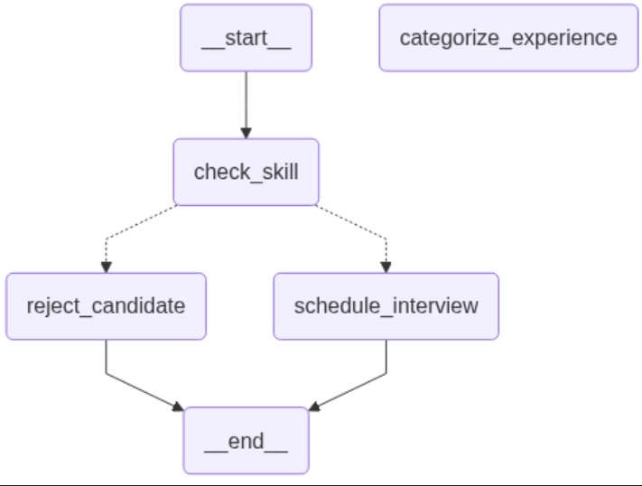
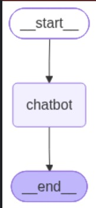

# 🦜🔗 LangChain Notes

---

## Q1. What is LangChain?

**Answer**

📝 LangChain is a free, open-source framework that makes it easier to build applications using Large Language Models (LLMs). While an LLM can generate text from a prompt, real-world AI applications often need more than just text generation — they may need to access documents, search databases, remember previous conversations, call external APIs, or perform multi-step reasoning. LangChain provides a structured way to combine all these capabilities with an LLM.

📝 Example: if you want a chatbot that answers questions from company documents, the LLM alone cannot access those documents. LangChain can retrieve the relevant information and provide it to the model before generating a response.

```python
 !pip install langchain_groq
 
from langchain_groq import ChatGroq

llm = ChatGroq(
    model="llama-3.3-70b-versatile",
    api_key="YOUR_GROQ_API_KEY"
)

response = llm.invoke("What is AI?")
print(response.content)
```

---

## Q2. What is an LLM in LangChain?

**Answer**

📝 LLM (Large Language Model) is the core component that generates text responses.
A Large Language Model (LLM) is an Artificial Intelligence model trained on massive amounts of text data to understand, generate, summarize, translate, and answer questions in natural language.

LLMs use Deep Learning and Transformer Architecture to process language.

**Examples**

- ChatGPT (OpenAI)
- Gemini (Google)
- Claude (Anthropic)
- Grok (xAI)

What Does an LLM Do?

✅ Answer questions

✅ Generate text

✅ Summarize content

✅ Translate languages

✅ Write code

✅ Analyze documents

```python
# from langchain_openai import OpenAI
from langchain_groq import ChatGroq

llm = ChatGroq(
    model="llama-3.3-70b-versatile",
    api_key="YOUR_GROQ_API_KEY"
)


# llm = OpenAI()
print(llm.invoke("Tell me a joke"))
```

**how to reduces llm hallucination in langchain?**

```python
from langchain_groq import ChatGroq
from langchain_core.prompts import ChatPromptTemplate

llm = ChatGroq(
    model="llama-3.3-70b-versatile",
    api_key="YOUR_KEY"
)

context = """
React is a JavaScript library created by Meta.
"""

prompt = ChatPromptTemplate.from_template("""
Answer ONLY from the provided context.

Context:
{context}

Question:
{question}
""")

chain = prompt | llm

response = chain.invoke({
    "context": context,
    "question": "Who created React?"
})

print(response.content)
```
---

## Q3. What is pip?

📝 `pip` is Python's traditional package manager.

```bash
pip install langchain
```

## Q4. What is uv?

📝 `uv` is a modern Python package manager developed by Astral — faster than `pip`.

```bash
uv add langchain
```

---

## Q5. what is models? LLM vs Chat model ? What is a Chat Model?

**Answer**

📝 A Model is the AI engine that generates responses.

```python
model = ChatOpenAI(
    model='gpt-4',
    temperature=1.5,
    max_completion_tokens=10
)

result = model.invoke("Write a 3 line poem on home")
```

| Feature            | LLM             | Chat Model       |
| ------------------ | --------------- | ---------------- |
| Input              | String          | Messages         |
| Output             | String          | AI Message       |
| Conversation Aware | ❌               | ✅                |
| Roles              | ❌               | ✅                |
| Chat History       | ❌               | ✅                |
| Best For           | Text completion | Chatbots, Agents |

📝 Chat models work with messages such as `Human`, `AI`, and `System` messages.

```python
!pip install -q langchain langchain-core langchain-groq python-dotenv

from kaggle_secrets import UserSecretsClient
from langchain_groq import ChatGroq
from langchain_core.messages import (
    SystemMessage,
    HumanMessage,
    AIMessage
)
import os

# Load secret
user_secrets = UserSecretsClient()
os.environ["GROQ_API_KEY"] = user_secrets.get_secret("GROQ_API_KEY")

# Verify
print("API Key loaded?", os.getenv("GROQ_API_KEY") is not None)

# Create model
model = ChatGroq(
    model="llama-3.3-70b-versatile",
    temperature=0.7
)

# Message history
messages = [
    SystemMessage(
        content="You are a helpful AI assistant and expert mathematician."
    ),
    
    HumanMessage(
        content="What is 100 divided by 5?"
    ),

    AIMessage(
        content="100 divided by 5 is 20."
    ),

    HumanMessage(
        content="Now multiply that result by 10."
    )
]

# Invoke model
response = model.invoke(messages)

print("AI:", response.content)
```

---

## Q6. What is `load_dotenv()`?

**Answer**

📝 `load_dotenv()` loads environment variables from a `.env` file into the application's environment.

```python
from dotenv import load_dotenv
import os

load_dotenv()

api_key = os.getenv("OPENAI_API_KEY")
```

---

## Q7. Understanding Message Roles

**System Role** — defines the assistant's behavior
```json
{
    "role": "system",
    "content": "You are an Eastern poet."
}
```

**User Role** — contains instructions or questions from the user
```json
{
    "role": "user",
    "content": "Write me a poem about the moon."
}
```

**Multi-message conversation example**
```python
messages = [
    {"role": "system", "content": "You are a helpful assistant."},
    {"role": "user", "content": "What is the capital of France?"},
    {"role": "assistant", "content": "The capital of France is Paris."},
    {"role": "user", "content": "Can you also tell me the population of Paris?"}
]
```

**Creative prompt example**
```python
messages = [
    {
        "role": "system",
        "content": "You are an Eastern poet."
    },
    {
        "role": "user",
        "content": """
        Write me a short poem about the moon.
        Write it in the style of a haiku.
        Include the title at the top.
        """
    }
]
```

---

## Q8. What is `PromptTemplate`?

**Answer**

📝 `PromptTemplate` is a LangChain class used to create dynamic prompts using placeholders. Instead of hardcoding prompts, you create a reusable template and pass different values when needed.

**Example 1**
```python
!pip install -q langchain

from langchain_core.prompts import PromptTemplate

prompt = PromptTemplate(
    input_variables=["topic"],
    template="Explain {topic} in simple words."
)

result = prompt.format(topic="Machine Learning")

print(result)
```

**Example 2**
```python

from langchain_core.prompts import PromptTemplate
from langchain_groq import ChatGroq

model = ChatGroq(
    model="llama-3.3-70b-versatile",
    temperature=0
)

prompt = PromptTemplate(
    input_variables=["country"],
    template="What is the capital of {country}?"
)

final_prompt = prompt.format(country="France")

response = model.invoke(final_prompt)

print(response.content)
```

### Advantages of PromptTemplate
- Reusable prompts
- Dynamic input handling
- Cleaner code
- Better maintainability
- Reduced duplication

---

## Q9. Prompt Template for Language Translation

📝 A `PromptTemplate` can be used to build a translation prompt that translates text from one language to another using an LLM.

```python
from kaggle_secrets import UserSecretsClient
from langchain_groq import ChatGroq
from langchain_core.prompts import PromptTemplate
import os

# Load Groq API key from Kaggle Secrets
user_secrets = UserSecretsClient()
os.environ["GROQ_API_KEY"] = user_secrets.get_secret("GROQ_API_KEY")

# Initialize Groq model
llm = ChatGroq(
    model="llama-3.3-70b-versatile",
    temperature=0
)

# Create Prompt Template
prompt = PromptTemplate.from_template("""
You are a helpful translator.

Translate the following text
from {input_language}
to {output_language}:

Text: {text}
""")

# Format prompt
formatted_prompt = prompt.format(
    input_language="English",
    output_language="French",
    text="Hello, how are you?"
)

print("Formatted Prompt:")
print(formatted_prompt)

# Invoke model
response = llm.invoke(formatted_prompt)

print("\nAI Response:")
print(response.content)
```

---

## Q10. Types of Prompt Templates in LangChain

**1. PromptTemplate** — used for single text prompts
```python
prompt = PromptTemplate(
    input_variables=["country"],
    template="What is the capital of {country}?"
)
```

**2. ChatPromptTemplate** — used for chat-based applications involving multiple roles

**3. MessagesPlaceholder** — maintains conversation history dynamically

**4. FewShotPromptTemplate** — provides examples before the actual query. Few-shot prompting improves output quality and consistency by showing the model examples first.

```python
from dotenv import load_dotenv
from langchain_openai import ChatOpenAI
from langchain_core.prompts import PromptTemplate, FewShotPromptTemplate

load_dotenv()

llm = ChatOpenAI(model="gpt-4o-mini")

# Examples
examples = [
    {"english": "Hello", "french": "Bonjour"},
    {"english": "How are you?", "french": "Comment ça va ?"}
]

# Example format
example_prompt = PromptTemplate(
    input_variables=["english", "french"],
    template="""
English: {english}
French: {french}
"""
)

# Few-shot template
few_shot_prompt = FewShotPromptTemplate(
    examples=examples,
    example_prompt=example_prompt,
    input_variables=["input_text"],
    prefix="Translate the following English text to French:",
    suffix="English: {input_text}\nFrench:"
)

formatted_prompt = few_shot_prompt.format(input_text="Good Morning")
print(formatted_prompt)

response = llm.invoke(formatted_prompt)
print("\nTranslation:")
print(response.content)
```

**5. FewShotChatMessagePromptTemplate** — few-shot prompting specifically designed for chat models

---

## Q11. What is a Chain? What problem resolved by Chain?

**Answer**

📝 A chain connects multiple LangChain components together (Prompt → LLM → Output Parser) to create a complete workflow.Instead of calling the LLM directly, chains allow you to build a step-by-step pipeline.

```txt
User Input
      ↓
Prompt Template
      ↓
LLM (Groq/OpenAI/etc.)
      ↓
Output Parser
      ↓
Final Result
```

```python
from langchain_core.prompts import PromptTemplate
from langchain_core.output_parsers import StrOutputParser

prompt = PromptTemplate(
    input_variables=["topic"],
    template="Explain {topic} in simple words."
)

chain = prompt | llm | StrOutputParser()

result = chain.invoke({
    "topic": "Generative AI"
})

print(result)
```
📝 A Chain solves the problem of manually managing multiple steps in an LLM workflow by connecting components such as Prompt → Model → Output Parser → Next Step into a single pipeline.

```python
!pip install langchain langchain-openai python-dotenv
from dotenv import load_dotenv
from langchain_groq import ChatGroq
from langchain_core.messages import (
    SystemMessage,
    HumanMessage,
    AIMessage
)

load_dotenv()

model = ChatGroq(
    model="llama-3.3-70b-versatile",
    api_key="your_groq_api_key"
)

chat_history = [
    SystemMessage(content="You are a helpful AI assistant")
]

while True:
    user_input = input("You: ")

    if user_input.lower() == "exit":
        break

    chat_history.append(
        HumanMessage(content=user_input)
    )

    result = model.invoke(chat_history)

    chat_history.append(
        AIMessage(content=result.content)
    )

    print("AI:", result.content)

print(chat_history)
```
---

## Q12. What is a Simple Chain?

📝 The pipe operator (|) is used to connect components together into a chain.
The pipe operator (|) indicates that the output from the left side of the pipe is automatically fed as the input to the component on the right side of the pipe.
```
Input → Prompt → LLM → Output
```

```python
from langchain_core.prompts import ChatPromptTemplate
from langchain_groq import ChatGroq

# Create prompt
prompt = ChatPromptTemplate.from_template(
    "Create a catchy title for the following article:\n\n{article}"
)

# Initialize Groq model
llm = ChatGroq(
    model="llama-3.3-70b-versatile",
    api_key="your_api_key"
)

# Create chain
chain = prompt | llm

# Execute
result = chain.invoke(
    {
        "article": "Artificial Intelligence is transforming healthcare through predictive analytics and automation."
    }
)

print(result.content)
```

---

## Q13. What is a Sequential Chain?

📝 A Sequential Chain consists of multiple chains connected together.

```python
from langchain_groq import ChatGroq
from langchain_core.prompts import PromptTemplate
from langchain_core.output_parsers import StrOutputParser

# Model
llm = ChatGroq(
    model="llama-3.3-70b-versatile",
    temperature=0.7
)

# Prompt 1
prompt1 = PromptTemplate.from_template(
    "Explain the topic: {topic} in 100 words."
)

# Prompt 2
prompt2 = PromptTemplate.from_template(
    "Summarize the following explanation in 20 words:\n\n{text}"
)

# Parser
parser = StrOutputParser()

# Chain 1
chain1 = prompt1 | llm | parser

# Get explanation
explanation = chain1.invoke({
    "topic": "Artificial Intelligence"
})

print("Explanation:\n")
print(explanation)

# Chain 2
chain2 = prompt2 | llm | parser

summary = chain2.invoke({
    "text": explanation
})

print("\nSummary:\n")
print(summary)
```

---
## Q13.1. What is Parallel Chain?

A Parallel Chain executes multiple chains at the same time on the same input and returns all results together.

```txt
          Input
            |
    ----------------
    |              |
 Prompt1      Prompt2
    |              |
   LLM           LLM
    |              |
 Output1      Output2
    ----------------
            |
      Combined Result
```
```python
	  
from langchain_groq import ChatGroq
from langchain_core.prompts import PromptTemplate
from langchain_core.output_parsers import StrOutputParser
from langchain_core.runnables import RunnableParallel

# Model
llm = ChatGroq(
    model="llama-3.3-70b-versatile",
    temperature=0.7,
	api_key="gsk_your_actual_groq_api_key"
)

parser = StrOutputParser()

# Prompt 1
summary_prompt = PromptTemplate.from_template(
    "Provide a short summary of {topic}"
)

# Prompt 2
keywords_prompt = PromptTemplate.from_template(
    "Give 5 keywords related to {topic}"
)

# Chains
summary_chain = summary_prompt | llm | parser
keywords_chain = keywords_prompt | llm | parser

# Parallel Chain
parallel_chain = RunnableParallel(
    summary=summary_chain,
    keywords=keywords_chain
)

result = parallel_chain.invoke({
    "topic": "Artificial Intelligence"
})

print(result)
```
---
## Q13.2. What is Conditional Chain?

A Conditional Chain executes different chains based on a condition.
```txt
Input
  |
Condition Check
  |
---------------------
|                   |
Positive         Negative
|                   |
Chain A          Chain B
|                   |
Output           Output
```
```python
from langchain_groq import ChatGroq
from langchain_core.prompts import PromptTemplate
from langchain_core.output_parsers import StrOutputParser
from langchain_core.runnables import RunnableLambda

llm = ChatGroq(
    model="llama-3.3-70b-versatile",
    temperature=0.7
)

parser = StrOutputParser()

# Technical prompt
tech_prompt = PromptTemplate.from_template(
    "Answer this technical question: {question}"
)

# General prompt
general_prompt = PromptTemplate.from_template(
    "Answer this general question: {question}"
)

tech_chain = tech_prompt | llm | parser
general_chain = general_prompt | llm | parser

# Router Function
def route(info):
    question = info["question"]

    if "python" in question.lower():
        return tech_chain.invoke(info)

    return general_chain.invoke(info)

conditional_chain = RunnableLambda(route)

result = conditional_chain.invoke({
    "question": "What is Python list comprehension?"
})

print(result)
```
---

## Q14. What is Memory?

**Answer**

📝 Memory stores previous conversations.

```python
#exp 1
from langchain.memory import ConversationBufferMemory

memory = ConversationBufferMemory()

memory.save_context(
    {"input": "Hi"},
    {"output": "Hello"}
)

print(memory.load_memory_variables({}))

#exp2
from langchain_groq import ChatGroq
from langchain.agents import create_agent
from langgraph.checkpoint.memory import InMemorySaver

# LLM
llm = ChatGroq(
    model="llama-3.3-70b-versatile",
    api_key="YOUR_GROQ_API_KEY"
)

# Memory
memory = InMemorySaver()

# Agent
agent = create_agent(
    model=llm,
    checkpointer=memory
)

# Conversation Thread
config = {
    "configurable": {
        "thread_id": "sougata_chat"
    }
}

# Message 1
agent.invoke(
    {
        "messages": [
            {
                "role": "user",
                "content": "My name is Sougata and I am a React Developer."
            }
        ]
    },
    config=config
)

# Message 2
response = agent.invoke(
    {
        "messages": [
            {
                "role": "user",
                "content": "What is my name and profession?"
            }
        ]
    },
    config=config
)

print(response["messages"][-1].content)
```

---

## Q15. Why Use Chat History?

**Answer**

📝 To maintain context across multiple interactions.

```python
from langchain_core.chat_history import InMemoryChatMessageHistory

history = InMemoryChatMessageHistory()

history.add_user_message("Hi")
history.add_ai_message("Hello")
```

**Simple chat completion request**
```python
response = client.chat.completions.create(
    model="gpt-4o-mini",
    messages=[
        {"role": "user", "content": "What is the capital of France?"}
    ]
)
```

---

## Q16. What is an Agent?

**Answer**

📝 An agent chooses tools dynamically to solve tasks.

```python
from langchain.agents import create_agent
from langchain_groq import ChatGroq
from langchain.tools import tool

@tool
def add(a: int, b: int) -> int:
    """Add two numbers."""
    return a + b

llm = ChatGroq(
    model="llama-3.3-70b-versatile"
)

agent = create_agent(
    model=llm,
    tools=[add],
    system_prompt="You are a math assistant."
)

result = agent.invoke(
    {"messages": [{"role": "user", "content": "Add 100 and 250"}]}
)

print(result)
```

## What Are Tools?

Tools are Python functions that allow the AI to interact with external systems.
Tools can be integrated with LLM models to interact with external systems. External systems can be APIs, third-party tools, or custom tools.
When a user asks a question, the model decides whether to use a tool based on the user's request. The tool returns an output that matches its defined schema.

```python
from langchain_groq import ChatGroq
from langchain_core.tools import tool
from langchain_core.messages import HumanMessage

@tool
def add(x: float, y: float) -> float:
    """Add x and y."""
    return x + y

@tool
def subtract(x: float, y: float) -> float:
    """Subtract x from y."""
    return y - x

@tool
def multiply(x: float, y: float) -> float:
    """Multiply x and y."""
    return x * y

@tool
def exponentiate(x: float, y: float) -> float:
    """Raise x to the power of y."""
    return x ** y

# Groq LLM
llm = ChatGroq(
    model="llama-3.3-70b-versatile",
    temperature=0,
    api_key="YOUR_GROQ_API_KEY"
)

# Bind tools
llm_with_tools = llm.bind_tools(
    [add, subtract, multiply, exponentiate]
)

# Invoke model
response = llm_with_tools.invoke(
    [
        HumanMessage(
            content="What is 15 multiplied by 8?"
        )
    ]
)

print(response)
print(response.tool_calls)
```
---

## Q17.What is vector store? Why Use a Vector DB?

A Vector Store is a system designed to store and retrieve data represented as numerical vectors (embeddings).

`A vector store helps:`

✅ Store embeddings

✅ Perform similarity search

✅ Retrieve relevant chunks

✅ Support RAG applications

**Answer**

📝 Stores embeddings for semantic search.

```python
from langchain_chroma import Chroma

vectorstore = Chroma.from_texts(
    ["LangChain Framework"],
    embedding
)
```
| Feature               | Traditional DB  | Vector DB         |
| --------------------- | --------------- | ----------------- |
| Search Type           | Exact Match     | Semantic Search   |
| Data Stored           | Rows/Columns    | Embeddings        |
| Use Case              | Transactions    | AI Search         |
| Query                 | SQL             | Similarity Search |
| Meaning Understanding | No              | Yes               |
| Best For              | Banking, Orders | RAG, Chatbots     |

---
## Q17.1. What is Chroma?

ChromaDB is an open-source vector store/database used to store embeddings and perform similarity searches.

It is one of the most commonly used and easy vector stores in LangChain.

```python
from langchain_chroma import Chroma
from langchain_openai import OpenAIEmbeddings
from langchain_core.documents import Document

docs = [
    Document(
        page_content="LangChain is used for LLM applications."
    ),
    Document(
        page_content="Chroma is a vector store."
    )
]

vectorstore = Chroma.from_documents(
    documents=docs,
    embedding=OpenAIEmbeddings(),
    persist_directory="./chroma_db"
)
```
---

## Q18. What is a Document Loader?

**Answer**

📝 A Document Loader is a LangChain component used to load data from different sources (TXT, PDF, CSV, Websites, Word documents, etc.) and convert it into LangChain's standard Document object format.

```python
 Document(
    page_content="Actual text content",
    metadata={"source": "sample.txt"}
)
```
**Types of Document Loaders**

1. `TextLoader:`
TextLoader is used to load content from a text file (.txt).
```python
from langchain_community.document_loaders import TextLoader

loader = TextLoader(
    "sample.txt",
    encoding="utf-8"
)

docs = loader.load()

print(docs[0])
print(docs[0].page_content)
```
2. `PyPDFLoader`

PyPDFLoader is a document loader in LangChain used to load content from PDF files and convert each page into a Document object.
```python
from langchain_community.document_loaders import PyPDFLoader

loader = PyPDFLoader("sample.pdf")

docs = loader.load()
```

3. `CSVLoader:`
Loads CSV files.
```python
from langchain_community.document_loaders import CSVLoader

loader = CSVLoader(
    file_path="employees.csv"
)

docs = loader.load()

print(docs)
```
4. `WebBaseLoader`

WebBaseLoader is a document loader used to load and extract text content from web pages (URLs).
`Use Case`
- Web scraping
- Website chatbot
- Knowledge-base creation
```python
from langchain_community.document_loaders import WebBaseLoader

loader = WebBaseLoader(
    "https://python.langchain.com"
)

docs = loader.load()

print(docs[0].page_content)
```
5. `DirectoryLoader`

Loads all files inside a folder.
`Use Case`
- Multiple files
- Bulk document ingestion
```python
from langchain_community.document_loaders import DirectoryLoader

loader = DirectoryLoader(
    "documents/",
    glob="*.txt"
)

docs = loader.load()

print(docs)
```

| Feature          | load()        | lazy\_load() |
| ---------------- | ------------- | ------------ |
| Loading Type     | Eager         | Lazy         |
| Returns          | List          | Generator    |
| Memory Usage     | High          | Low          |
| Large Files      | ❌             | ✅            |
| Small Files      | ✅             | ✅            |
| Processing Speed | Faster Access | Stream Based |

### 📦 Project: PDF Summarizer

**Setup**
```bash
uv add streamlit langchain langchain-groq langchain-community pypdf python-dotenv
```

```
project/
│
├── app.py
├── .env
```

```bash
# .env
GROQ_API_KEY=your_groq_api_key
```

**app.py**
```python
import streamlit as st
import os

from dotenv import load_dotenv
from langchain_groq import ChatGroq
from langchain_community.document_loaders import PyPDFLoader
from langchain.prompts import PromptTemplate
from langchain.chains import LLMChain

load_dotenv()

st.title("📄 PDF Summarizer")

uploaded_file = st.file_uploader("Upload PDF", type=["pdf"])

if uploaded_file:
    file_path = uploaded_file.name

    with open(file_path, "wb") as f:
        f.write(uploaded_file.getbuffer())

    # Load PDF
    loader = PyPDFLoader(file_path)
    pages = loader.load()

    # Extract text
    text = ""
    for page in pages:
        text += page.page_content

    st.success("PDF Loaded Successfully!")

    # LLM
    llm = ChatGroq(model="llama-3.3-70b-versatile")

    # Prompt
    prompt = PromptTemplate(
        input_variables=["content"],
        template="""
        Summarize the following PDF in 5 bullet points.

        {content}

        Summary:
        """
    )

    chain = LLMChain(llm=llm, prompt=prompt)

    summary = chain.invoke({"content": text})

    st.subheader("📌 Summary")
    st.write(summary["text"])
```

---

## Q19. Why Use a Text Splitter?

**Answer**

📝 Text Splitting is the process of breaking large text (PDFs, books, articles, websites, documents) into smaller chunks that an LLM can process efficiently.
`Benefits of Text Splitting`

1. Better Embeddings:
Smaller chunks create more accurate vector embeddings.
2. Better Semantic Search
3. Better Summarization

```txt
Document
   │
   ▼
Document Loader
   │
   ▼
Text Splitter
   │
   ▼
+---------+
| Chunk 1 |
+---------+

+---------+
| Chunk 2 |
+---------+

+---------+
| Chunk 3 |
+---------+

   │
   ▼
Embeddings
   │
   ▼
Vector Database
   │
   ▼
Retriever
   │
   ▼
LLM Answer
```
```python
from langchain_text_splitters import RecursiveCharacterTextSplitter

text = """
Artificial Intelligence (AI) is a field of computer science
that focuses on creating systems capable of performing tasks
that normally require human intelligence.
""" * 20

splitter = RecursiveCharacterTextSplitter(
    chunk_size=100,
    chunk_overlap=20,
    separator=''
)

chunks = splitter.split_text(text)

print("Number of chunks:", len(chunks))

print(chunks[0].page_content)
```

---

## Q20. What is Structured Output?

**Answer**

📝 Structured Output means forcing an LLM to return data in a predefined format instead of free-form text.

**benifit**

- API Friendly
- Perfect for FastAPI, Streamlit, databases, and agents.
- Better Reliability
- Response follows the schema even if the model is creative.

**TypedDict vs dataclass vs Pydantic**

| Feature               | TypedDict | Dataclass | Pydantic |
| --------------------- | --------- | --------- | -------- |
| Type Hinting          | ✅         | ✅         | ✅        |
| Validation            | ❌         | Limited   | ✅        |
| Object Creation       | ❌         | ✅         | ✅        |
| LangGraph State       | ✅ Best    | ⚠️        | ⚠️       |
| LLM Structured Output | ❌         | ⚠️        | ✅ Best   |

```python
# exp1
from langchain_groq import ChatGroq
from pydantic import BaseModel

class LLMSchema(BaseModel):
    setup: str
    punchline: str

llm = ChatGroq(
    model="llama-3.3-70b-versatile",
    api_key="gsk_your_api_key"
)

structured_llm = llm.with_structured_output(LLMSchema)

result = structured_llm.invoke(
    "Tell me a joke about Python programming."
)

print(result)
print(result.setup)
print(result.punchline)

# exp2 more compact context

from dotenv import load_dotenv
from typing_extensions import TypedDict, Annotated

from langchain_groq import ChatGroq

load_dotenv()

class OutputSummary(TypedDict):
    summary: Annotated[
        str,
        "Write a concise summary in 1-2 sentences"
    ]
    
    sentiment: Annotated[
        str,
        "Sentiment of the text: positive, negative, or neutral"
    ]

model = ChatGroq(
    model="llama-3.3-70b-versatile"
)

model = model.with_structured_output(OutputSummary)

result = model.invoke(
    """
    LangChain is a powerful framework for building LLM applications.
    It simplifies prompt management, RAG pipelines, and agent creation.
    Developers love it because it accelerates AI application development.
    """
)

print(result)
print(result["summary"])
print(result["sentiment"])
```

---

## Q21. Using the OpenAI API with Python

📝 Initializes the OpenAI client using an API key stored in an environment variable, and sends a prompt to the model.

```python
from openai import OpenAI
import os

# Initialize the OpenAI client with your API key
client = OpenAI(api_key=os.getenv("OPENAI_API_KEY"))

response = client.chat.completions.create(
    model="gpt-4o-mini",
    messages=[
        {"role": "user", "content": "What is the capital of France?"}
    ]
)

print("Response from OpenAI API:")
print(response.choices[0].message.content)
```

---

## Q22. What is Batch Processing?

**Answer**

📝 A technique where multiple independent prompts are sent to the model in a single request instead of several individual requests.
batch() is a LangChain method that sends multiple inputs to a model at once and returns multiple outputs in a single call pattern.
instead of 
```
llm.invoke("What is React?")
llm.invoke("What is Python?")
llm.invoke("What is Java?")
```
you can do:
```
llm.batch([
    "What is React?",
    "What is Python?",
    "What is Java?"
])
```
This is useful when processing many prompts together.

**Without batch processing**
```
Request 1 → API → Response 1
Request 2 → API → Response 2
Request 3 → API → Response 3
```

**With batch processing**
```
           Batch Request
                 |
                 v
              OpenAI
                 |
      -------------------------
      |          |            |
      v          v            v
  Response1  Response2   Response3
```

**Drawbacks of NOT using batch processing (i.e. individual calls)**
- Multiple API calls
- Increased latency
- More network overhead
- More code complexity

**example**
```python
from langchain_groq import ChatGroq

llm = ChatGroq(
    model="llama-3.3-70b-versatile",
    api_key="YOUR_GROQ_API_KEY"
)

responses = llm.batch([
    "What is React?",
    "What is Python?",
    "What is Docker?"
])

for r in responses:
    print(r.content)
```
---
## 📦 Project: search bot

```python

import os

from langchain_groq import ChatGroq
from langchain.tools import Tool
from langchain_community.tools.tavily_search import TavilySearchResults
from langchain.agents import AgentExecutor, create_react_agent
from langchain import hub

from numexpr import evaluate

# API Keys
os.environ["GROQ_API_KEY"] = "YOUR_GROQ_API_KEY"
os.environ["TAVILY_API_KEY"] = "YOUR_TAVILY_API_KEY"

# LLM
llm = ChatGroq(
    model="llama-3.3-70b-versatile"
)

# Search Tool
search_tool = TavilySearchResults(max_results=2)

# Calculator Tool
calculator = Tool(
    name="Calculator",
    func=lambda x: str(evaluate(x)),
    description="Useful for solving math calculations."
)

tools = [search_tool, calculator]

# ReAct Prompt
prompt = hub.pull("hwchase17/react")

# Agent
agent = create_react_agent(
    llm=llm,
    tools=tools,
    prompt=prompt
)

# Executor
agent_executor = AgentExecutor(
    agent=agent,
    tools=tools,
    verbose=True
)

# Run
response = agent_executor.invoke(
    {
        "input": """
        What is the current approx React Developer salary in India?
        Also calculate 20% joining bonus.
        """
    }
)

print(response["output"])
```
---

## 📦 Project: Chatbot

```python
from dotenv import load_dotenv
from langchain_core.messages import AIMessage, HumanMessage, SystemMessage
from langchain_groq import ChatGroq   
import os

# Load env variables
load_dotenv()
model = ChatGroq(model="llama-3.3-70b-versatile", temperature=0.7)  
print("API Key loaded?", os.getenv("GROQ_API_KEY") is not None)

# Initialize chat history
chat_history = []

# user message 
message = [
    SystemMessage(content="Solve the following math problem"),
    HumanMessage(content="what is 100 divide by 5?")
]
result = model.invoke(message)
print(f"answer from AI: {result.content}")

# ai message 
message = [
    SystemMessage(content="Solve the following math problem"),
    HumanMessage(content="what is 100 divide by 5?"),
    AIMessage(content="81 divide by 9 is 9"),
    HumanMessage(content="what is 10 times 5?")
]
result = model.invoke(message)
print(f"answer from AI: {result.content}")

# add system role
system_message = SystemMessage(content="you are a helpful AI assistant")
chat_history.append(system_message)

# chat loop
while True:
    query = input("You: ")
    if query.lower() == "exit":
        break
    chat_history.append(HumanMessage(content=query))

    result = model.invoke(chat_history)
    response = result.content
    chat_history.append(AIMessage(content=response))
    print(f"AI: {response}")

print("-------message history------")
print(chat_history)
```
## 📦 Project: fetch weather report

```python
!pip install langchain langchain-groq requests python-dotenv

import requests
from dotenv import load_dotenv

from langchain.tools import tool
from langchain.agents import create_agent
from langchain_groq import ChatGroq

# Load environment variables
load_dotenv()


# Tool Definition
@tool
def get_weather(city: str) -> str:
    """
    Return current weather information for a city.
    """
    response = requests.get(
        f"https://wttr.in/{city}?format=j1"
    )

    data = response.json()

    current = data["current_condition"][0]

    return (
        f"City: {city}\n"
        f"Temperature: {current['temp_C']}°C\n"
        f"Humidity: {current['humidity']}%\n"
        f"Weather: {current['weatherDesc'][0]['value']}"
    )


# Groq Model
model = ChatGroq(
    model="llama-3.3-70b-versatile",
    temperature=0,
	api_key='YOUR_GROQ_API_KEY'
)


# Create Agent
agent = create_agent(
    model=model,
    tools=[get_weather],
    system_prompt="""
    You are a helpful weather assistant.
    Use the weather tool whenever weather information is requested.
    """
)

# Invoke Agent
response = agent.invoke(
    {
        "messages": [
            {
                "role": "user",
                "content": "What is the weather in Delhi?"
            }
        ]
    }
)

print(response)
```

## 📦 Bonus Project: CSV Data Analysis App (Pandas + Streamlit)

```python
import streamlit as st
import pandas as pd
import altair as alt

st.title("📊 Data Analysis with CSV File")

# File uploader
file = st.file_uploader("Upload your CSV file", type=["csv"])

@st.cache_data
def load_data(uploaded_file):
    return pd.read_csv(uploaded_file)

if file:
    # Load CSV
    df = load_data(file)

    # Show preview
    st.subheader("🔎 Data Preview")
    st.dataframe(df.head())

    # City filter
    if "City" in df.columns:
        cities = df["City"].unique()
        selected_city = st.selectbox("Filter by City", cities)
        filtered_data = df[df["City"] == selected_city]

        st.subheader(f"🏙️ Data for {selected_city}")
        st.dataframe(filtered_data)

        # Sales Rate Graph
        if "Sales" in df.columns:
            st.subheader(f"📊 Sales Rate in {selected_city}")
            chart = (
                alt.Chart(filtered_data)
                .mark_bar()
                .encode(
                    x="Product:N",
                    y="Sales:Q",
                    tooltip=["Product", "Sales"]
                )
            )
            st.altair_chart(chart, use_container_width=True)

        # Download report
        csv_report = filtered_data.to_csv(index=False).encode("utf-8")
        st.download_button(
            label="📥 Download Report (CSV)",
            data=csv_report,
            file_name=f"{selected_city}_report.csv",
            mime="text/csv",
        )
    else:
        st.warning("⚠️ CSV file must contain a 'City' column.")
```

---
---


## Q23. What is LCEL (LangChain Expression Language)?

**Answer**

📝 LCEL is the `|` (pipe) syntax used to compose LangChain components (prompt, LLM, parser, retriever, etc.) into a single runnable chain. It's what powers `chain = prompt | llm | parser`.

```python
chain = prompt | llm | StrOutputParser()
result = chain.invoke({"topic": "AI"})
```

---

## Q24. What is a Retriever?

**Answer**

📝 A retriever fetches the most relevant documents/chunks from a vector store based on a query — the core piece of RAG (Retrieval-Augmented Generation).A Retriever is a component in LangChain that fetches relevant documents from a data source in response to a user's query.

**architecture**
```txt
              Query
                │
                ▼
           Retriever
           /       \
          /         \
Vector Store      Database
          \         /
           \       /
            ▼     ▼

       Relevant Documents
                │
                ▼
               LLM
```
Common Types of Retrievers
1. `VectorStoreRetriever (Most Used)`

Searches documents from a vector store using similarity search.

2. `Similarity Retriever`

Returns documents with highest similarity score.

3. `MMR Retriever (Maximum Marginal Relevance)`

Returns relevant and diverse documents.

4. `MultiQueryRetriever`

Generates multiple versions of a query using an LLM.

| Feature           | Vector Store           | Retriever            |
| ----------------- | ---------------------- | -------------------- |
| Purpose           | Stores embeddings      | Retrieves documents  |
| Stores Data       | ✅ Yes                  | ❌ No                 |
| Similarity Search | ✅ Yes                  | Uses Vector Store    |
| Returns Documents | ❌ Directly not focused | ✅ Yes                |
| Used In           | Storage Layer          | Retrieval Layer      |
| Example           | Chroma, FAISS          | VectorStoreRetriever |

```python
retriever = vectorstore.as_retriever(search_kwargs={"k": 3})
docs = retriever.invoke("What is LangChain?")
```

---

## Q25. What is RAG (Retrieval-Augmented Generation)?

**Answer**

📝 RAG combines a retriever with an LLM: relevant documents are fetched first, then passed into the prompt so the LLM answers using that context instead of relying only on its training data.

```

User Query
     │
     ▼
┌──────────────┐
│  Retriever   │
└──────┬───────┘
       │
       ▼
┌──────────────┐
│  Vector DB   │
└──────┬───────┘
       │ Relevant Context
       ▼
┌─────────────────────┐
│ Context + Question  │
└──────────┬──────────┘
           ▼
     ┌──────────┐
     │   LLM    │
     └────┬─────┘
          ▼
      Final Answer


RAG
 ├── Document Loaders
 ├── Text Splitters
 ├── Vector Databases
 └── Retrievers
```

---

## Q26. What is an Embedding Model?

**Answer**

📝 Converts text into a numeric vector representation, used to measure semantic similarity between pieces of text (used for storing/searching in a vector DB).

```python
from langchain_openai import OpenAIEmbeddings

embedding = OpenAIEmbeddings()
vector = embedding.embed_query("LangChain framework")
```

---

## Q27. What are Output Parsers?

**Answer**

📝 Output Parsers in LangChain are used to convert the raw LLM response into a structured format that your application can easily process.

*They help in:*

- Formatting responses consistently
- Returning JSON, lists, objects, etc.
- Reducing manual parsing
- Making AI outputs reliable for automation

1. `StrOutputParser:`StrOutputParser is the simplest output parser.It converts the LLM response into a plain string.

```python
from langchain_groq import ChatGroq
from langchain_core.output_parsers import StrOutputParser
from langchain_core.prompts import ChatPromptTemplate

llm = ChatGroq(
    model="llama-3.3-70b-versatile",
    api_key="YOUR_GROQ_API_KEY"
)

prompt = ChatPromptTemplate.from_template(
    "Explain LangChain in one sentence."
)

chain = prompt | llm | StrOutputParser()

response = chain.invoke({})

print(response)
```
2. `JsonOutputParser:`
JsonOutputParser forces the LLM to return output in JSON format.

```python
from langchain_groq import ChatGroq
from langchain_core.output_parsers import JsonOutputParser
from langchain_core.prompts import PromptTemplate

parser = JsonOutputParser()

prompt = PromptTemplate(
    template="""
    Give details about a programming language.

    {format_instructions}

    Language: {language}
    """,
    input_variables=["language"],
    partial_variables={
        "format_instructions": parser.get_format_instructions()
    }
)

llm = ChatGroq(
    model="llama-3.3-70b-versatile",
    api_key="YOUR_GROQ_API_KEY"
)

chain = prompt | llm | parser

response = chain.invoke({
    "language": "Python"
})

print(response)
```

3. `StructuredOutputParser:` StructuredOutputParser is used when you want the LLM to return data in a predefined structure with specific fields.

Unlike JsonOutputParser, where the model decides the JSON schema, StructuredOutputParser lets you define exactly what fields should be returned.

```python
from langchain_groq import ChatGroq
from langchain.output_parsers import ResponseSchema, StructuredOutputParser
from langchain_core.prompts import PromptTemplate

# Define output structure
schemas = [
    ResponseSchema(name="name", description="Person name"),
    ResponseSchema(name="city", description="Person city")
]

parser = StructuredOutputParser.from_response_schemas(schemas)

prompt = PromptTemplate(
    template="""
    Extract information from the text.

    {format_instructions}

    Text: {text}
    """,
    input_variables=["text"],
    partial_variables={
        "format_instructions": parser.get_format_instructions()
    }
)

llm = ChatGroq(
    model="llama-3.3-70b-versatile",
    api_key="YOUR_GROQ_API_KEY"
)

chain = prompt | llm

response = chain.invoke({
    "text": "Rahul lives in Mumbai."
})

result = parser.parse(response.content)

print(result)
```
---

## Q28. What is `ChatPromptTemplate`? (Example)

**Answer**

📝 Used to build multi-role chat prompts (system/human/AI) with placeholders, instead of a single plain-text prompt.

```python
from langchain_core.prompts import ChatPromptTemplate

prompt = ChatPromptTemplate.from_messages([
    ("system", "You are a helpful assistant."),
    ("human", "Tell me about {topic}")
])

formatted = prompt.format_messages(topic="LangChain")
```

---

## Q29. What is `MessagesPlaceholder`? (Example)

**Answer**

📝 A placeholder inside a `ChatPromptTemplate` that injects the full conversation history at runtime.

```python
from langchain_core.prompts import ChatPromptTemplate, MessagesPlaceholder

prompt = ChatPromptTemplate.from_messages([
    ("system", "You are a helpful assistant."),
    MessagesPlaceholder(variable_name="chat_history"),
    ("human", "{input}")
])
```

---

## Q30. What are the Different Types of Memory in LangChain?

**Answer**

- **ConversationBufferMemory** — stores the full raw conversation
- **ConversationBufferWindowMemory** — stores only the last N messages
- **ConversationSummaryMemory** — stores a summarized version of the conversation (saves tokens)

| Memory Type                     | Stores Everything | Stores Recent Messages | Stores Summary | Token Usage | Production Ready Usage                                 | Speed                                        |
| ------------------------------- | ----------------- | ---------------------- | -------------- | ----------- | ------------------------------------------------------ | -------------------------------------------- |
| ConversationBufferMemory        | ✅                 | ✅                      | ❌              | High        | ❌ Low (mainly for demos, POCs, short chats)            | 🟢 Fast initially, 🔴 slows as history grows |
| ConversationBufferWindowMemory  | ❌                 | ✅                      | ❌              | Low         | ✅ Good for production when only recent context matters | 🟢 Very Fast                                 |
| ConversationSummaryMemory       | ❌                 | ❌                      | ✅              | Very Low    | ✅ Good for long-running conversations                  | 🟡 Medium (extra LLM call for summarization) |
| ConversationSummaryBufferMemory | ❌                 | ✅                      | ✅              | Medium      | ⭐ Excellent for enterprise and production systems      | 🟡 Medium to Fast                            |

```python
from langchain.memory import ConversationBufferWindowMemory

memory = ConversationBufferWindowMemory(k=3)  # keeps last 3 exchanges
```

---

## Q31. What is a Tool in LangChain?

**Answer**

📝 A tool is a function an agent can call to perform an action (e.g. search the web, run a calculation, query a database).A Tool is a Python function (or API) that is packaged in a way an LLM can understand and call when needed.

```txt

LLM
 ↓
Think
 ↓
Tool
 ↓
Take Action
```
**What is @tool Decorator?**

@tool converts a normal Python function into a LangChain Tool.
```python
#exp 1
from langchain_core.tools import tool

@tool
def multiply(a:int,b:int)->int:
    """Multiply two numbers"""

    return a*b
result = multiply.invoke({
    "a":10,
    "b":20
})

print(result)

#exp 2
from langchain_core.tools import tool

@tool
def add(a: int, b: int) -> int:
    """
    Add a and b

    Args:
        a (int): first number
        b (int): second number

    Returns:
        int: the sum
    """
    return a + b

print(add.invoke({
    "a": 10,
    "b": 5
}))

#exp 3
from langchain_core.tools import tool

@tool
def employee_info(name: str, age: int) -> str:
    """Return employee information"""
    return f"{name} is {age} years old"

result = employee_info.invoke({
    "name": "Sougata",
    "age": 30
})

print(result)

```
Now LangChain can expose it to the LLM.

`Ways to Create Custom Tools`

- Using @tool decorator ✅ (Most Common)
- Using StructuredTool
- Using BaseTool (Advanced)

| Feature             | Tool                                         | Agent                                               |
| ------------------- | -------------------------------------------- | --------------------------------------------------- |
| Definition          | A function/API that performs a specific task | An AI system that can reason, decide, and use tools |
| Purpose             | Execute an action                            | Decide what action to take                          |
| Can Think?          | ❌ No                                         | ✅ Yes                                               |
| Can Take Action?    | ✅ Yes                                        | ✅ Yes                                               |
| Decision Making     | ❌ No                                         | ✅ Yes                                               |
| Tool Selection      | ❌ Cannot select tools                        | ✅ Chooses tools dynamically                         |
| Works Independently | ❌ No                                         | ✅ Yes                                               |
| Uses LLM Reasoning  | ❌ No                                         | ✅ Yes                                               |
| Input               | Direct function arguments                    | User query                                          |
| Output              | Task result                                  | Final answer after reasoning                        |
| Examples            | Weather API, Calculator, Ticket Booking      | ChatGPT Agent, Travel Agent, RAG Agent              |

**How Does an Agent Fetch Answers from Tools in LangChain?**

An Agent does not know the answer directly. Instead, it:

- Understands the user's question
- Decides which tool is needed
- Calls the tool
- Gets the tool's result
- Uses the result to generate the final answer

---

## Q32. What is the `temperature` Parameter?

**Answer**

📝 Controls the randomness/creativity of the model's output.
- **Low temperature (e.g. 0)** → more deterministic, focused answers
- **High temperature (e.g. 0.8–1)** → more creative, varied answers

```python
llm = ChatOpenAI(model="gpt-4o-mini", temperature=0.7)
```

---

## Q33. What is Streaming in LangChain?

📝 Streaming returns the model's output token-by-token as it's generated, instead of waiting for the full response — useful for chat UIs.
What is Streaming?

In LLMs, streaming means the model starts sending tokens (words) as soon as they are generated, instead of waiting for the entire response to be completed before returning it.

**Why Streaming?**

- Faster response time resulting in lower drop-off rates.
- Mimics human-like conversation, which builds trust, feels more natural, and keeps users engaged.
- Important for multi-modal UIs where different types of outputs may be displayed progressively.
- Better user experience for long outputs, such as code generation or lengthy explanations.
- Users can cancel the response midway, saving tokens and reducing costs.
Allows real-time UI updates, such as displaying "thinking...", showing tool execution results, or updating progress dynamically.

| Feature         | Streaming                              | Async                                   |
| --------------- | -------------------------------------- | --------------------------------------- |
| Purpose         | Return results gradually               | Run tasks without blocking              |
| Focus           | Output delivery                        | Task execution                          |
| User Experience | See data immediately                   | Don't wait for other tasks              |
| Example         | ChatGPT typing response token by token | Multiple API calls running concurrently |
| Keyword         | `stream()`                             | `async/await`                           |
| Benefit         | Faster perceived response              | Better throughput and scalability       |


In LangGraph, instead of using graph.invoke(), we can use graph.stream() to receive the output incrementally. The stream() method takes the initial state and configuration (such as thread_id) as input and returns a generator object. As the graph executes, the generator yields updates based on the specified stream_mode (for example, "messages" for token-by-token message streaming). We can iterate over this generator using a for loop to process and display outputs in real time. Streaming improves responsiveness because users can see results as they are generated rather than waiting for the entire graph execution to complete.
from langchain_groq import ChatGroq
```python
llm = ChatGroq(
    model="llama-3.3-70b-versatile",
    temperature=0.7,
    api_key="YOUR_GROQ_API_KEY"
)

for chunk in llm.stream(
    "Write a 20-line paragraph about Artificial Intelligence.",
    config={
        "run_name": "ai_paragraph_stream",
        "tags": ["demo", "streaming"],
        "metadata": {
            "source": "groq"
        }
    }
):
    print(chunk.content, end="", flush=True)
```
A common approach is to create the thread_id when the user starts a chat session and store it in the frontend session storage


**Tokenization (BPE, WordPiece) and Why It Matters for Cost**

Tokenization is the process of breaking text into smaller units called tokens before sending it to an LLM.

LLMs do not understand text directly. They process tokens.

`Types of Tokenization`

1. Character-Level Tokenization

Breaks text into individual characters.
```python
Python->["P", "y", "t", "h", "o", "n"]
```
2. Word-Level Tokenization

Breaks text into words.
```python
I love Python->["I", "love", "Python"]
```
3. Subword Tokenization

Breaks words into meaningful pieces.

This is what modern LLMs use.
```python
unhappiness->["un", "happi", "ness"]
```

---

## Q34.What is Fine-Tuning?

Fine-Tuning is the process of training a pre-trained Large Language Model (LLM) on your own custom dataset so that it learns specific knowledge, style, behavior, or domain expertise.
Fine-tuning means training a pre-trained LLM on your own data so it learns new patterns, styles, or domain knowledge.

`Types of Fine-Tuning`

#### Full Fine-Tuning

All model parameters are updated.
7 Billion Parameters
      ↓
All Updated

#### Instruction Fine-Tuning (SFT)

Most common in GenAI projects.
train model using
```
{
  "instruction": "Summarize text",
  "input": "LangChain provides...",
  "output": "LangChain is a framework..."
}
```
#### LoRA (Low Rank Adaptation)

---

## LangChain vs LangGraph: When to Use Which?

LangChain is generally used when you want to build AI applications quickly using ready-made components such as models, prompts, memory, retrievers, vector stores, and tools. It works very well for use cases like chatbots, text summarization, RAG applications, conversational assistants, tool-calling agents, and simple multi-step workflows where the execution follows a predefined linear path. For most beginner to intermediate AI applications, LangChain provides enough abstraction and flexibility without adding much complexity.

As applications grow, limitations start appearing in LangChain. Complex workflows often require decisions at runtime, conditional branching, multiple execution paths, and the ability to pause a workflow for human review or approval. Managing these scenarios using only LangChain can become difficult because the framework was originally designed around chains and sequential execution patterns rather than advanced workflow orchestration.

LangGraph was introduced to address these challenges by providing a graph-based approach to workflow design. Instead of moving through a fixed chain of steps, the application can dynamically decide which node to execute next based on the current state. This makes it much more suitable for non-linear workflows where different conditions may lead to different actions, and where execution needs to adapt as new information becomes available.

Another major advantage of LangGraph is its built-in state management. The workflow can maintain and update state throughout the entire execution lifecycle, making it easier to track progress, share information between nodes, and build sophisticated multi-agent systems. It also supports event-driven execution, fault tolerance, and human-in-the-loop patterns where a process can pause, wait for approval, and then continue from the same point.

For enterprise-scale AI applications, LangGraph provides better maintainability because large workflows can be broken into smaller reusable subgraphs. These nested workflows improve code organization, reusability, debugging, and scalability. In simple terms, LangChain is ideal for building AI capabilities, while LangGraph is ideal for orchestrating complex, stateful, and production-grade AI workflows involving branching logic, multiple agents, and human intervention.

---

## What is LangGraph?

LangGraph is an open-source framework built on top of LangChain for creating intelligent,stateful and multistep llm applications.

It helps build:

- Stateful workflows
- Multi-step processes
- AI agents
- Multi-agent systems
- LangChain provides:LLMs, Prompts, Tools, Memory
---

## what problem of langchain has ben covered by langgraph?

LangChain is great for prompts, tools, and basic agents, but it struggles when workflows become complex.

LangGraph solves these problems:

✅ State Management: Share data across multiple steps.

✅ Memory: Remember previous interactions using checkpoints.

✅ Conditional Routing: Easy branching (if/else flows).

✅ Multi-Agent Workflows: Multiple agents work together.

✅ Checkpointing: Resume from failures instead of restarting.

✅ Human-in-the-Loop: Pause for approval and continue later.

---

## Features Added by LangGraph

`1. Stateful Workflows`

The application can remember information as it moves through the workflow.

`2. Cyclic Graphs (Loops)`

LangGraph can repeat steps.

`3. Agent Orchestration`

Multiple agents can collaborate.

---

## Core Concepts of LangGraph

1. `Graph`: A Graph is the complete workflow.
it contains nodes and edges

2. `State`: State is shared memory.

Each node can:
- Read data
- Update data
```
state = {
    "question": "What is AI?",
    "answer": ""
}
```
 **How to preserve state between invocations?**

You need Memory / Checkpointing.

A checkpoint is a snapshot of the graph's state at a specific point during execution. Instead of saving only the final output, LangGraph saves state values at intermediate steps, allowing the workflow to resume from the last saved checkpoint if a failure occurs.

 **InMemorySaver vs SqliteSaver vs PostgresSaver**

`InMemorySaver` stores checkpoints in the application's memory (RAM). It is fast and simple, making it ideal for learning, testing, and local development. However, all checkpoints are lost when the application stops or restarts.

`SqliteSaver` stores checkpoints in a local SQLite database file. Unlike InMemorySaver, the data persists across application restarts. It is suitable for local development, prototypes, and small-scale applications where a lightweight persistent database is sufficient.

`PostgresSaver` stores checkpoints in a PostgreSQL database and is the recommended option for production environments. It provides durable storage, supports concurrent users, scales well, and ensures checkpoint data remains available even after application restarts or server failures.

3. Nodes: Nodes are the actual work units.every node have a name and a function associate with them

4. Edges: Edges connect nodes.
Entry Point (START)

The starting point of a graph.
Finish Point (END)		  
		  
APIs Used for Creating a Linear Workflow
1. TypedDict: TypedDict defines the structure of the shared state.

The state is passed between all nodes.
```python
from typing import TypedDict

class EmployeeState(TypedDict):
    name: str
    salary: float
```
	
2. StateGraph: StateGraph is the main builder class used to create LangGraph workflows.
```python
builder = StateGraph(EmployeeState)
```
3. START: START is a special constant that marks where execution begins.
```python
builder.add_edge(
    START,
    "node1"
)
```
4. END

END marks the completion of the workflow.
```python
builder.add_edge(
    "node3",
    END
)
```

Required Functions and Methods in LangGraph
1. Node

A Node is a Python function that performs a single task.

A node:
- Receives the current state
- Processes data
- Returns updated state
```python
def node1(state):
    return {
        "name": state["name"] + " Kumar"
    }
```
2. add_node(): Used to register a node in the graph.
```python
builder.add_node(
    "node1",
    node1
)
```
3. add_edge(): Used to connect nodes.
```python
builder.add_edge(
    "node1",
    "node2"
)
```
4. compile(): Converts the graph definition into an executable workflow.
Without compile(), the graph cannot run.
```python
graph = builder.compile()
```
5. invoke(): Executes the graph.

It takes the initial state and returns the final state.
```python
result = graph.invoke(
    initial_state
)
```
---

## linear state graph with sequential workflow

from IPython.display import Image, display
from typing import TypedDict
from langgraph.graph import StateGraph, START, END

```python
# Shared State
class EmployeeState(TypedDict):
    name: str
    salary: int
    bonus: int

# Node 1
def add_bonus(state):
    state["bonus"] = 5000
    return state

# Node 2
def calculate_salary(state):
    state["salary"] += state["bonus"]
    return state

# Create Graph
builder = StateGraph(EmployeeState)

builder.add_node("bonus", add_bonus)
builder.add_node("salary", calculate_salary)

builder.add_edge(START, "bonus")
builder.add_edge("bonus", "salary")
builder.add_edge("salary", END)
builder.compile()

# Compile Graph
graph = builder.compile()

# Execute Graph
result = graph.invoke(
    {
        "name": "SAM",
        "salary": 50000,
        "bonus": 0
    }
)

print(result)
```
---

## langgraph conditional state graph workflow

A Conditional Workflow in LangGraph dynamically selects the next node based on a condition or the current workflow state. This enables smart decision-making, ensures only relevant nodes are executed, and supports business rules efficiently.

Benefits:

- Dynamic routing based on conditions
- Avoids unnecessary processing
- Supports business logic and rules
- Handles multiple execution paths in a single workflow

Examples:

- Employee promotion approvals
- Tax calculation based on income
- Customer discount eligibility

This makes workflows more flexible, efficient, and scalable.
Parameters of add_conditional_edges()

`Source Node`

The node after which conditional routing is performed.

`Routing Function`

Receives the current workflow state and returns a routing key based on the defined condition.

`Mapping Dictionary`

Maps each routing key returned by the routing function to the corresponding next node (or END) in the workflow


## project : multi-agent recruitment workflow


```python  
from typing import TypedDict
from langgraph.graph import StateGraph,START, END

# State
class State(TypedDict):
    experience: int
    skill_match: str
    result: str

# Agent/node 1: Categorize Experience
def categorize_experience(state: State):
    level = "Experienced" if state["experience"] >= 3 else "Fresher"
    print("Experience:", level)
    return {}

# Agent/node 2: Check Skill
def check_skill(state: State):
    print("Skill Match:", state["skill_match"])
    return {}

# Agent/node 3: Schedule Interview
def schedule_interview(state: State):
    print("Interview Scheduled")
    return {"result": "Selected"}

# Agent/node 4: Reject Candidate
def reject_candidate(state: State):
    print("Candidate Rejected")
    return {"result": "Rejected"}

# Router function
def route(state: State):
    if state["skill_match"] == "Match":
        return "schedule_interview"
    return "reject_candidate"

# Graph
graph = StateGraph(State)

graph.add_node("categorize_experience", categorize_experience)
graph.add_node("check_skill", check_skill)
graph.add_node("schedule_interview", schedule_interview)
graph.add_node("reject_candidate", reject_candidate)

graph.add_edge(START, "check_skill")

graph.add_conditional_edges(
    "check_skill",
    route,
    {
        "schedule_interview": "schedule_interview",
        "reject_candidate": "reject_candidate",
    },
)

graph.add_edge("schedule_interview", END)
graph.add_edge("reject_candidate", END)

app = graph.compile()

#visualize the graph
display(Image(graph.get_graph().draw_mermaid_png()))

# Run
result = app.invoke({
    "experience": 5,
    "skill_match": "Match"
})

print(result)
```
---

## message graph

A MessageGraph is a LangGraph workflow where the entire state consists of messages.



```python
from dotenv import load_dotenv
from IPython.display import Image, display
import os

from langchain_groq import ChatGroq
from langchain_core.messages import HumanMessage, AIMessage
from langgraph.graph import MessageGraph

# Load environment variables
load_dotenv()

# Create Groq LLM
llm = ChatGroq(
    model="llama-3.3-70b-versatile",
    api_key="your_api_key"
)

# Node Function
def chatbot(messages):
    response = llm.invoke(messages)
    return response

# Create MessageGraph
graph = MessageGraph()

# Add node
graph.add_node("chatbot", chatbot)

# Set entry and finish points
graph.set_entry_point("chatbot")
graph.set_finish_point("chatbot")

# Compile graph
app = graph.compile()

# Conversation History
messages = [
    AIMessage(content="Hello! How can I assist you today?"),
    HumanMessage(content="I want to learn coding"),
    AIMessage(content="That's great! What programming language are you interested in learning?"),
    HumanMessage(content="I want to learn Python")
]

# Run Graph
result = app.invoke(messages)
display(Image(app.get_graph().draw_mermaid_png()))

# Print Messages
for msg in result:
    msg.pretty_print()
```
---

## chatbot project


```python
from typing import TypedDict, Annotated
from langgraph.graph import StateGraph, START, END
from langgraph.graph.message import add_messages

from langchain_core.messages import BaseMessage, HumanMessage
from langchain_groq import ChatGroq

# -----------------------------
# Define State
# -----------------------------
class ChatState(TypedDict):
    messages: Annotated[list[BaseMessage], add_messages]

# -----------------------------
# Create Groq LLM
# -----------------------------
llm = ChatGroq(
    model="llama-3.3-70b-versatile",
    api_key="your_api_key"
)

# -----------------------------
# Define Node
# -----------------------------
def chat_node(state: ChatState):
    messages = state["messages"]

    response = llm.invoke(messages)

    return {
        "messages": [response]
    }

# -----------------------------
# Build Graph
# -----------------------------
graph = StateGraph(ChatState)

graph.add_node("chat_node", chat_node)

graph.add_edge(START, "chat_node")
graph.add_edge("chat_node", END)

chatbot = graph.compile()

# -----------------------------
# Draw Graph
# -----------------------------
from IPython.display import Image, display

display(Image(chatbot.get_graph().draw_mermaid_png()))

# -----------------------------
# Initial Invocation
# -----------------------------
initial_state = {
    "messages": [
        HumanMessage(
            content="What is the national fruit of India?"
        )
    ]
}

response = chatbot.invoke(initial_state)

print("AI:", response["messages"][-1].content)

# -----------------------------
# Chat Loop
# -----------------------------
while True:

    user_message = input("Type here: ")

    if user_message.lower() in [
        "exit",
        "quit",
        "stop"
    ]:
        print("Chat ended.")
        break

    response = chatbot.invoke(
        {
            "messages": [
                HumanMessage(content=user_message)
            ]
        }
    )

    print(
        "AI:",
        response["messages"][-1].content
    )
```

---

## memory

**Is  memory and Persistence are same?**

Not exactly, but they are closely related in LangGraph.

`Persistence is the broader concept:` saving state/data so it survives across graph executions, interruptions, or application restarts.
its refer to ability to save and restore the state of a workflow over time.
Persistence in LangGraph is the mechanism used to save graph state across executions. Instead of storing only the final state, it saves snapshots of the state at intermediate steps called checkpoints. These checkpoints are typically stored in a database and are associated with a unique thread ID, which helps differentiate the state of individual workflow executions. Because the state is continuously checkpointed, LangGraph can recover from failures and resume execution from the last saved checkpoint, making applications fault tolerant. Persistence also enables features such as short-term memory, conversation continuity, Human-in-the-Loop (HITL) workflows, and time travel. In LangGraph, persistence is implemented through a Checkpointer, which manages thread-level state and checkpoints, while long-term memory across multiple threads can be maintained using a Store.


`Memory` is a use case built on top of persistence: allowing the agent to remember conversation history, user preferences, facts, and context.

**Is Conversational Chain the Same as Memory?**

Not exactly, but they are closely related.

Memory stores conversation history or important information from previous interactions.

Conversational Chain uses that memory (along with tools and the LLM) to provide context-aware responses.

**What is a Conversational Chain?**

A Conversational Chain is a sequence of steps that enables an AI application to maintain context across multiple interactions and generate intelligent responses.

Unlike a simple chain, it remembers previous messages and can interact with external tools.
   
## reAct

Definition of State Schema in LangGraph

A State Schema in LangGraph is the blueprint or structure that defines the shared data flowing through all nodes in a workflow. It specifies the fields in the state, their data types, and the information that nodes can read and update during execution.

The State Schema acts as a single source of truth, ensuring consistent data sharing, type safety, and smooth communication between workflow nodes.
from typing import TypedDict

```python
class EmployeeState(TypedDict):
    employee_name: str
    experience: int
    performance_rating: float
    result: str
```

In this example, the State Schema defines the data fields (employee_name, experience, performance_rating, and result) that can be accessed and updated throughout the workflow.

Ways to Create a State Schema in LangGraph

A State Schema defines the structure of the data shared across all nodes in a LangGraph workflow. LangGraph supports multiple ways to define the state schema.

1. Using TypedDict (✅ Recommended)

TypedDict is the most commonly used and preferred approach in LangGraph. It is lightweight, easy to define, and provides type checking without additional overhead.
```python
from typing import TypedDict

class EmployeeState(TypedDict):
    employee_name: str
    experience: int
    result: str
```
**Advantages:**

- Simple and lightweight
- Easy to read and maintain
- Good type safety
- Best choice for most LangGraph workflows
	
2. Using dataclass: A dataclass can be used when you want an object-oriented structure with default values and methods.
from dataclasses import dataclass

```python
@dataclass
class EmployeeState:
    employee_name: str
    experience: int
    result: str = ""
```

3. Using Pydantic BaseModel

Pydantic provides built-in data validation and type enforcement, making it suitable for applications requiring strict validation.
```python
from pydantic import BaseModel

class EmployeeState(BaseModel):
    employee_name: str
    experience: int
    result: str = ""
```
Advantages:
- Automatic validation
- Detailed error handling
- Strong type enforcement
---

## What is Annotated?

Annotated is a type hint introduced in Python that allows you to attach additional metadata to a type without changing the actual type itself.

The metadata can be used by frameworks such as LangGraph, FastAPI, and Pydantic to provide additional behavior or instructions.

### Why Does LangGraph Use Annotated?

In LangGraph, Annotated is mainly used to define how state values should be merged or updated when multiple nodes return values for the same field.

For example, if several nodes update a messages field, LangGraph needs to know whether to:

- Replace the existing value
- Append new values
- Merge values together

```python
from typing import TypedDict, Annotated
from operator import add
from langgraph.graph import StateGraph, START, END

class State(TypedDict):
    messages: Annotated[list[str], add]

def node1(state):
    return {"messages": ["Hello"]}

def node2(state):
    return {"messages": ["Welcome"]}

graph = StateGraph(State)

graph.add_node("node1", node1)
graph.add_node("node2", node2)

graph.add_edge(START, "node1")
graph.add_edge("node1", "node2")
graph.add_edge("node2", END)

app = graph.compile()

result = app.invoke({"messages": []})

print(result)
{
    "messages": ["Hello", "Welcome"]
}
```
---

## What is State?

A State is the shared memory used by a LangGraph workflow. It contains the data that flows between nodes during graph execution.

In LangGraph, the state is mutable and is typically defined as a TypedDict. Before creating the graph, define the state schema and initialize it with key-value pairs (data points). The nodes can then read from and update the shared state throughout the graph execution.

`Each node can:`

- Read the current state
- Update the state
- Pass the updated state to the next node

The state acts as a single source of truth for the entire workflow.
```python
from typing import TypedDict

class ChatState(TypedDict):
    messages: list
```
---

## What is a Reducer?

A Reducer defines how LangGraph updates a state field when multiple nodes return values for the same field.

By default, LangGraph replaces the old value with the new value. A reducer allows you to customize this behavior, such as appending or merging values.

```python
from typing import TypedDict, Annotated
from langgraph.graph.message import add_messages

class ChatState(TypedDict):
    messages: Annotated[list, add_messages]
	
from typing import TypedDict, Annotated
from operator import add

class State(TypedDict):
    tasks: Annotated[list[str], add]

from typing import TypedDict, Annotated
from operator import add

class State(TypedDict):
    total_sales: Annotated[int, add]
```


---
## What is ToolNode?

ToolNode is a built-in LangGraph node responsible for executing tool calls generated by an LLM (Large Language Model).

When the LLM decides that a tool is needed, it creates a tool call. The ToolNode receives that request, executes the corresponding tool, and returns the result to the workflow.
```python
{
    "tool_calls": [
        {
            "name": "get_leave_balance",
            "args": {
                "employee_id": "EMP101"
            }
        }
    ]
}
```

---

## What is tools_condition?

tools_condition is a prebuilt routing function in LangGraph that checks whether the latest AI response contains any tool calls.

Based on the result, it decides whether the workflow should continue to the ToolNode or end.
it checks
`YES → Route/go to ToolNode , NO → End the workflow`
```
AI Response
      ↓
tools_condition
      ↓
 ┌─────────────┐
 │ Tool Calls? │
 └─────────────┘
      ↓
  Yes     No
   ↓       ↓
ToolNode   END
```
```python
graph.add_conditional_edges(
    "chatbot",
    tools_condition
)
```
---
## What is LangSmith?

LangSmith is an observability, debugging, monitoring, and evaluation platform for LLM applications. It helps developers understand how their LLM applications behave by capturing and visualizing the complete execution flow of agents, chains, tools, and models. LangSmith is used to debug issues, monitor performance, analyze costs and latency, evaluate application quality, and improve AI systems in production.

**What Does LangSmith Trace?**

LangSmith traces every step of an LLM application's execution. A trace records the sequence of operations performed for a single user request, including LLM calls, tool invocations, retrieval operations, prompt formatting steps, agent decisions, inputs, outputs, execution time, costs, errors, and metadata. This allows developers to inspect exactly what happened during execution and identify the root cause of failures or unexpected responses

## Output refinement in LangGraph

Method 1: Return Only Final Answer
```python
{
  "messages": [...],
  "documents": [...],
  "retrieved_chunks": [...],
  "tool_calls": [...],
  "metadata": {...},
  "final_answer": "The capital of France is Paris."
}

def format_response(state):
    return {
        "response": state["final_answer"]
    }
```
Method 2: Use a Dedicated Formatting Node
```python
def formatter(state):
    return {
        "output": state["messages"][-1].content
    }
```
Method 3: Structured Output
```python
{
  "name": "John",
  "age": 25,
  "skills": ["Python", "React"]
}
return {
    "name": result["name"],
    "skills": result["skills"]
}
```
---

## What are AI Agents?

AI agents are intelligent software systems that can understand a goal, make decisions, use tools, perform actions, and complete tasks with minimal human intervention.

Unlike a traditional LLM that mainly generates text, an AI agent can reason, plan, interact with external systems, and execute tasks to achieve a goal.
`Components of an AI Agent`

1. LLM (Brain): Understands the user's request.
Reasons about the problem.
Decides what action to take next.
Generates responses and tool calls.
2. Memory: Stores previous interactions and conversation history.
Maintains context across multiple user requests.
Helps the agent remember important information.
3. Tools: Provide access to external capabilities.
4. Planning: Breaks a complex task into smaller steps.
Determines the sequence of actions needed to achieve a goal.
Chooses the appropriate tools for each step.
5. Execution: Performs actions using selected tools.
Executes API calls, database queries, searches, calculations, etc.
Returns results to the LLM for generating the final response.


| Feature                  | Tavily      | DuckDuckGo   |
| ------------------------ | ----------- | ------------ |
| Web Search               | ✅           | ✅            |
| Designed for AI Agents   | ✅ Yes       | ❌ No         |
| Optimized Search Results | ✅           | ❌            |
| Content Extraction       | ✅           | Limited      |
| AI-Friendly JSON Output  | ✅           | Limited      |
| Citations/Sources        | ✅           | ✅            |
| Requires API Key         | ✅           | ❌ Usually No |
| LangGraph Agent Usage    | Very Common | Common       |

---

## What is a ReAct Agent?

ReAct stands for Reason + Act.
A ReAct Agent is an AI agent that alternates between reasoning about a problem and taking actions (using tools) until it reaches the final answer.
Instead of Immediately Answering, the Agent:
Thinks about what to do.
Uses a tool if needed.
Observes the tool's output.
Reasons again.
Repeats until it can provide the final answer.

`Why is it Called ReAct?`
- Reason
Decide the next step.
Analyze the user's request.
Determine whether a tool is needed.
- Act
Execute a tool or perform an action.
Query a database, API, calculator, search engine, etc.
Observe
Review the tool's output.
Collect information returned by the tool.
Repeat
Continue the cycle until the task is complete.

**Advantages of ReAct Agents**

- Better handling of complex, multi-step tasks.
- Can combine information from multiple tools.
- More reliable because decisions are based on tool outputs.
- Reduces hallucinations by using external data.

```python
def get_conversation_history(conversation_id: str) -> list[dict]:
    conn = get_connection()
    rows = conn.execute(
        "SELECT role, content, created_at FROM messages WHERE conversation_id = ? ORDER BY id",
        (conversation_id,),
    ).fetchall()
    conn.close()
    return [{"role": r["role"], "content": r["content"], "created_at": r["created_at"]} for r in rows]
```
---