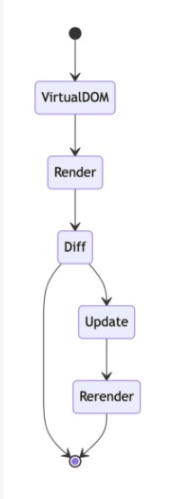
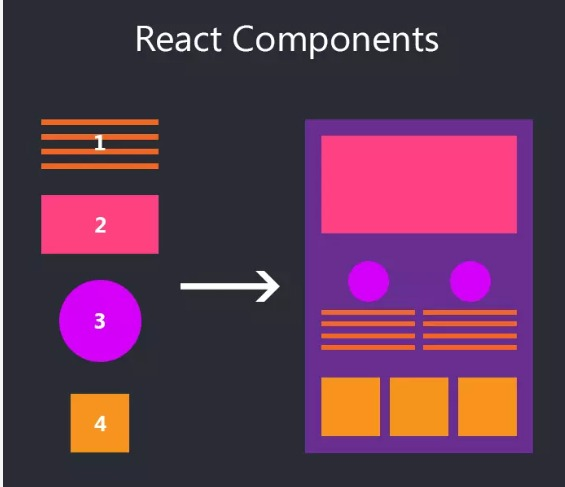
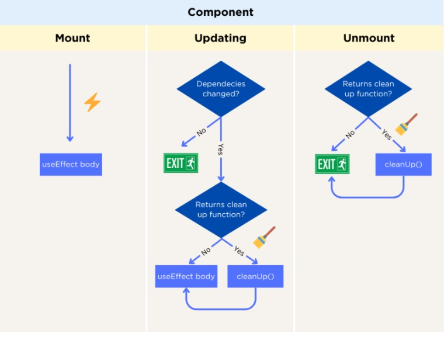
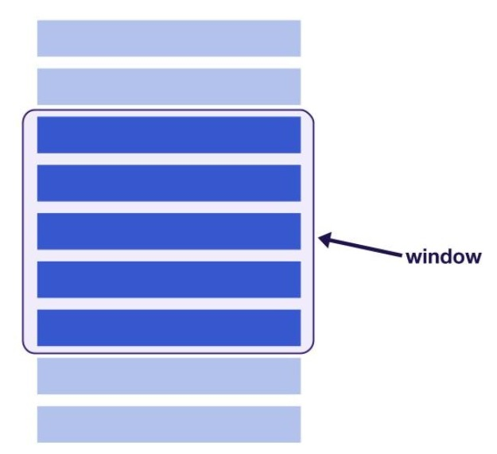
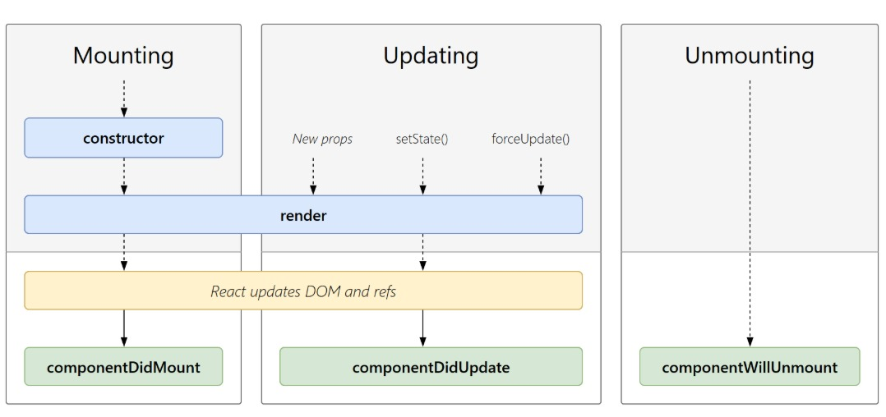
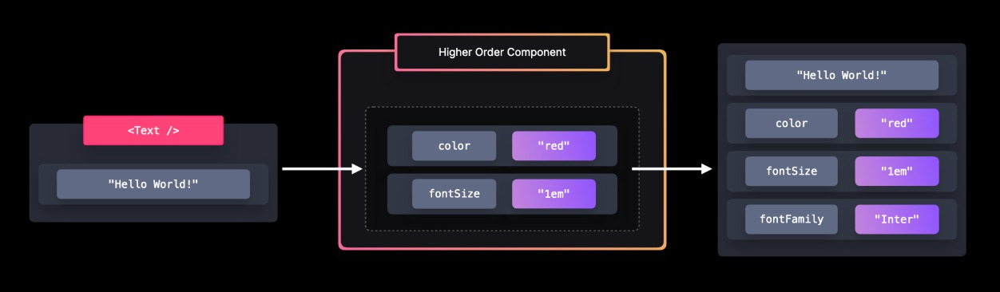
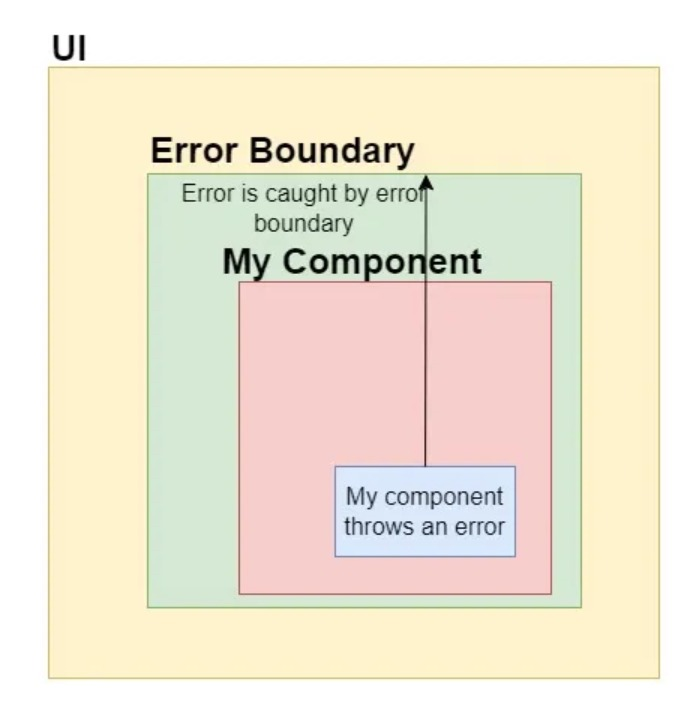
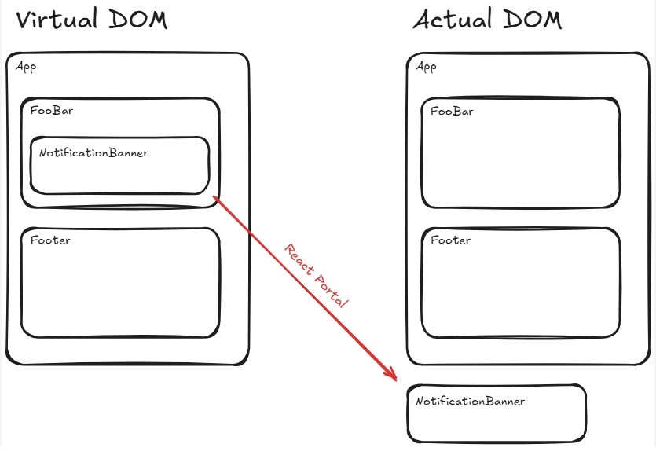
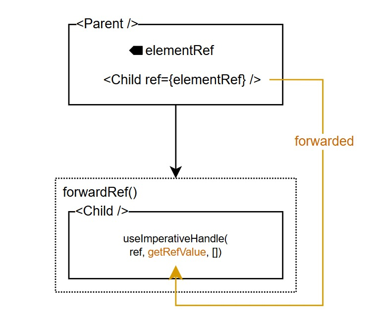

REACT NOTES 
==============================
**Q1. What is React ? who developed ? is react imperative or declarative programming language?**  

React is a JavaScript library used for building fast and interactive user interfaces, especially single-page applications (SPAs). It uses a component-based architecture.  

React was developed by Facebook created by Jordan Walke released by 2013.Latest React version is 19 

React is declarative because you describe what the UI should look like, and React takes care of how to update the DOM.
Instead of manually manipulating DOM steps (imperative style), you declare a component’s state and UI, and React automatically updates the view when the state changes.

**Q1.1: What is Virtual DOM?How React Manages Virtual DOM?**  

Virtual DOM is a lightweight JavaScript copy of the Real DOM.
On the initial render, React builds the Virtual DOM and then creates the Real DOM from it.  

When state or props change, React updates the Virtual DOM—not the Real DOM directly.
React compares the new Virtual DOM with the previous one using a process called diffing.  



Only the parts that changed are updated in the Real DOM, not the entire UI.
React batches multiple state updates together to reduce re-renders and improve performance.
This approach makes UI updates faster, efficient, and more optimized than direct DOM manipulation.
```txt
          User Action (e.g., button click) 
                        ↓
               React creates New Virtual DOM
                        ↓
         Compare with Old Virtual DOM (Diffing)
                        ↓
       Update only changed part in Real DOM (Fast)
```

**Q2: What is Reconciliation?**  

 The diffing process where React compares old and new virtual DOM trees and updates only changed parts.

How diffing algorithm works in Virtual DOM
 React compares old and new virtual DOM trees, updates only changed nodes (O(n) optimization).
 ```txt
(State/Props Change)
                         |
                         v
                 +----------------+
                 | New Virtual DOM|
                 +----------------+
                          |
                          v
          +--------------------------------+
          | React compares both Virtual DOM|
          |     (Diffing Algorithm)        |
          +--------------------------------+
                      /       \
                     /         \
                    v           v
        +----------------+   +----------------+
        | Same Parts     |   | Changed Parts  |
        | (No Update)    |   | (Mark for DOM  |
        |                |   |    Update)     |
        +----------------+   +----------------+
                                   |
                                   v
                         +---------------------+
                         |   Update Real DOM   |
                         | (Only changed nodes)|
                         +---------------------+
  ```
**Q3: Components? What triggers a re-render? Functional vs Class Components**  

Components are reusable building blocks of react application,its like a function that return HTML element. Through render() a component render to the dom.  
A React component re-renders whenever the data it depends on changes. If the component’s own state updates, it must redraw. If its parent gives it new props, React must check again. If context values change, every consumer reacts to the new value. Even if nothing changes but a parent re-renders, the child might re-render too unless optimized.  




- Functional components/ State-less components are simple JavaScript functions that return JSX. They are lightweight, easier to read.  

They were originally called stateless because they couldn’t manage state, but now with Hooks, they can handle state and lifecycle logic
```js
import { useState } from "react";

function Counter() {
  const [count, setCount] = useState(0);

  return (
    <div>
      <p>Count: {count}</p>
      <button onClick={() => setCount(count + 1)}>+</button>
    </div>
  );
}

export default Counter;

```
- Class components/State-ful are ES6 classes that extend React.Component and use this to manage state and lifecycle methods. involve more boilerplate, make code harder to reuse

***Why in Class Component We Use this?***  

Class methods do not automatically bind to the instance.this represents the current component instance.thats why we use this.state,this.props, this.method()
```js
import React, { Component } from "react";

class Counter extends Component {
  constructor() {
    super();
    this.state = { count: 0 };
  }

  render() {
    return (
      <div>
        <p>Count: {this.state.count}</p>
        <button onClick={() => this.setState({ count: this.state.count + 1 })}>
          +
        </button>
      </div>
    );
  }
}

export default Counter;

```
**Q4: What are Hooks in React? Can we use a Hook inside another Hook?**  

 Functions that let you use React features without classes (e.g. useState, useEffect, useMemo, useRef, useCallback, useContext).
 hooks are new feature introduce in react 16.8 version.it allows you to use state and other react feature without writing a class.its only work in function based components.  
 
 yes we can use hook inside custom hook else no

**Q5: Explain useState. How React preserves state across renders?**  

Manages local state in functional components.  
React behaves as if your component function is being called again and again, but the state remains safe because it is not stored inside the function at all. Behind the scenes, React attaches each component to a fiber node, and all states, refs, and effects live inside those nodes. Each time the UI updates, React reuses the same fiber, so the same state values are available even though the component function ran again.
Syntax:
```js
const array=useState(initialState!)
array[0]=current state
array[1]=function to modify the state
```
Example:
```js
const [name, setName] = useState("");
const [age, setAge] = useState(0);
const [isActive, setIsActive] = useState(true);
const [form, setForm] = useState({ name: "", email: "" });
const [user,setUser] = useState(null);
const [items, setItems] = useState([]);
```
❌ No we can't update state directly — it won't trigger re-render & mutates data  
```js
setCount(count + 1); // ✅ correct
count = count + 1;   // ❌ wrong

```
❌ Without previous state we cant increment twice because React batches updates using the same stale value of count.
```js
setCount(count + 1);
setCount(count + 1);
setCheck(!check);
//if you want to update twice
setCount(prev=> prev + 1);
setCount(prev=> prev + 1);
setCheck(prev => !prev);

```
❌ State must be treated as immutable,if you want to store mutable variable use ref(like timer id, scroll position)

❌ Do not derive state from another state unnecessarily

✔ use Lazy initialization for expensive calculation

```js
const [data] = useState(()=>bigCalculation());
```

**Q6: Explain useEffect and useLayoutEffect**  

useEffect runs after the component renders on the screen. It is used for side effects like API calls, subscriptions, event listeners, timers, and cleanup. It does not block the UI paint, so the user sees the UI first and then the effect runs. Use it for normal async tasks, data fetching, logging, and non-visual updates.
Example:
```js
useEffect(() => { console.log('runs after render only once'); }, []);
useEffect(() => { console.log('Run on State/Prop Change'); }, [count]);//only state value change it will run ,if you assign any variable it will not change
useEffect(() => { console.log('Run on Every Render'); });
useEffect(() => { async function fetchData(){console.log('run async data')}fetchData() }, []);
useEffect(() => { const timer = setInterval(() => console.log("Running after 1 sec"), 1000);return () => {
    clearInterval(timer); // cleanup
  }; },[]);
  ```
❌Note: We cannot use useEffect inside loops or conditions
```js
if (someCondition) useEffect(() => {});
for(let i=0;i<5;i++){
  useEffect(()=>{})
}

```
❌Note: We cannot use async directly in useEffect because Because useEffect expects a cleanup function, not a Promise.Instead, create an inner async function and call it.
```js
useEffect( async() => {},[])
```
❌Note: We cannot use normal variable change in useEffect,below changes of the value of variable useEffect will not run
```js
let score=10
useEffect(() => {
  console.log(score)
},[score]);

```
❌ Dependency comparison is shallow,objects and arrays are create issues because runs on every render because object reference change,better wrap object with useMemo
```js
const user=useMemo(()=>({name:"John"}),[])
useEffect(()=>{
  console.log('run')
},[user])
```
❌ infinite loop danger
```js
useEffect(()=>{
  setCount(count+1)
},[count])
```
for correction we can use
```js
useEffect(()=>{
  if(count<5){
    setCount(prev=>prev+1)
  }
},[count])
```

useLayoutEffect runs synchronously after render but before the browser paints the UI. It blocks the paint until the code inside finishes. Use it only when you need to measure DOM size, position, scroll, or apply immediate UI updates to avoid flicker. Best suited for reading/writing DOM layout, animations, synchronizing UI, or correcting layout before the user sees it.

```js
useLayoutEffect(() => {
  console.log("Runs before UI paint");
});
```

- Use useEffect for API calls, async operations, events, timers, data fetching & cleanup.
- Use useLayoutEffect for DOM measurements, fixing UI layout before paint, animations, and avoiding flicker.

**Q6: Lifecycle using useEffect**  


```js
useEffect(()=>{console.log("Mount")},[]); // Mount
useEffect(()=>{console.log("Update")},[val]); // Update
useEffect(()=>()=>console.log("Unmount"),[]); // Unmount
```
**Q7: useMemo vs useCallback and how they are optimize performance**  

useMemo → memoizes computed value
exp 1.
```js
import { useState, useMemo } from "react";

function App() {
  const [count, setCount] = useState(0);

  const expensiveTask = (input) => {
    for (let i = 0; i < 100000; i++) {}
    return input * 2;
  };

  // const doubleValue = () => expensiveTask(count);//UI is hanging after 2-3 times click on button
  const doubleValue = useMemo(() => expensiveTask(count), [count]);

  return (
    <div className="App">
      <p>Expensive Calculation: {doubleValue}</p>
      <p>Count: {count}</p>
      <button onClick={() => setCount(count + 1)}>Increase Count</button>
    </div>
  );
}

export default App;

```
exp 2:
```js
import { useState, useMemo } from "react";

export default function App() {
  const [count, setCount] = useState(0);

  const cachedValue = useMemo(() => {
    console.log("useMemo executed");
    return count * 2;
  }, [count]);

  return (
    <div>
      <h3>{cachedValue}</h3>
      <button onClick={() => setCount(count + 1)}>+</button>
    </div>
  );
}

```
useCallback → memoizes/caches function reference
```js
// App.jsx
import { useState, useCallback } from "react";
import Child from "./Child";

function App() {
  const [count, setCount] = useState(0);
  const handleClick = useCallback(() => {
    setCount((count) => count + 1);
  }, []);
//if you not give call back unnecessary child render happen because we pass handleclick function 
  return (
    <div>
      <h1>Count: {count}</h1>
      <button onClick={handleClick}>Increase Count</button>

      <Child onClick={handleClick} />
    </div>
  );
}

export default App;

// Child.jsx
import { memo } from "react";
function Child({ onClick }) {
  console.log("child rerender");
  return <button onClick={onClick}>child count</button>;
}
export default memo(Child);


```

**Q8: what is Props? What is Prop Drilling?**  

  Props are special keywords in react which stands for communication between two components or data passing one components to another components .you can spread props like {...props}
  Passing props deeply through multiple components so components become harder to read and maintain and many components depend on props they don't use.
 Solved using Context API.
 ```txt
 [Parent Component]
        |
        v
[Child Component]
        |
        v
[Grandchild Component]
```

**Q9: What is Context API?**  

Provides global state without prop drilling and solution for props drilling.it is a way to pass data through the component tree without having to pass props down. createContext create a context object
Example:
```js
const UserContext = createContext();
const UserContext = createContext(null);
const UserContext = createContext({});
const UserContext = createContext(0);
```

**Q10: What is React.memo?**  

 Prevents unnecessary re-renders of functional components when props don't change.
 #### Child will NOT re-render if:
 - Parent re-renders but props are same (primitive values)
 #### Child WILL re-render if:
 - Props changed
 - Props are objects/functions unless memoized using useCallback & useMemo
 ```js
import { useState } from "react";
import Child from "./Child";

export default function Parent() {
  const [count, setCount] = useState(0);
  const [text, setText] = useState("");

  console.log("Parent re-rendered");

  return (
    <div>
      <h1>Parent Count: {count}</h1>
      <button onClick={() => setCount(count + 1)}>Increase Count</button>

      <input
        placeholder="Type here..."
        onChange={(e) => setText(e.target.value)}
      />
      // CASE 1
      <Child count={count} />
      // CASE 2
      // If you pass objects/functions → Child WILL re-render even with same values, Because objects/functions get new references each re-render. by preventing this wrap functions/objects in useCallback / useMemo like const memoObj = useMemo(() => ({ num: count }), [count]);
      <Child data={{ num: count }}>
    </div>
  );
}

import React from "react";
const Child = React.memo(function Child({ count }) {
  console.log("Child re-rendered");
  return <h2>Child Count: {count}</h2>;
});

export default Child;

```

**Q11: Controlled vs Uncontrolled Components**  

Controlled - state managed by React.
```js
const [name, setName] = useState("");
<input value={name} onChange={e => setName(e.target.value)} />
```
Uncontrolled - managed by DOM via refs.
```js
const inputRef = useRef();
function handleSubmit() {
  alert(inputRef.current.value);
}
<input ref={inputRef} />
<button onClick={handleSubmit}>Submit</button>
```

**Q12: What is useRef?**  

Ref means reference of react.you are referring through dom elements if directly used it was costly.do not overused ref its causing react performance.it is use for managing focus,text selection or media playback,triggering animation  

useRef is Used to access DOM elements or persist mutable values without re-render.its a part of react hook, it can take maximum one parameter

useRef persist a value between render without causing a rerender when value change
```js
const countRef=useRef(0)
countRef.current+=1
```
Example:
```js
//exp 1
import { useRef } from "react";

export default function FocusInput() {
  const inputRef = useRef(null);

  function handleFocus() {
    inputRef.current.focus();
  }

  return (
    <div>
      <input ref={inputRef} placeholder="Click button to focus" />
      <button onClick={handleFocus}>Focus Input</button>
    </div>
  );
}
//exp 2
import { useRef, useState } from "react";

export default function PasswordToggle() {
  const inputRef = useRef(null);
  const [show, setShow] = useState(false);

  function togglePassword() {
    setShow(!show);
    inputRef.current.type = show ? "password" : "text";
  }

  return (
    <div>
      <input
        ref={inputRef}
        type="password"
        placeholder="Enter password"
      />

      <button onClick={togglePassword}>
        {show ? "Hide" : "Show"}
      </button>
    </div>
  );
}


```
- When do you need to use refs?
To directly access DOM elements or React elements.
Use case: focus input, play video, integrate 3rd-party lib.

**Q13: Explain React Fiber. How React schedules low-priority vs high-priority updates?**  

 React Fiber is the internal engine of React responsible for scheduling rendering tasks efficiently.
 It allows React to pause, resume, and prioritize updates, making UI rendering smoother.
 ```txt
 Render Request
      |
   Fiber Engine
  /      |      \
High   Medium   Low Prio
rity
Task   Task      Task
  \      |      /
   UI Update
```
React behaves like a smart personal assistant who prioritizes tasks based on urgency. If the user is typing, those updates are high priority — they must feel instant. But if background data is loading or some non-critical UI animation needs to run, React assigns them a lower priority. Using the fiber architecture and time slicing, React breaks work into tiny chunks  

**Q14: keys in React list? what is List virtualization**  

A list in React is a collection of data that we display by looping through it, usually using map(). While rendering lists, each item should have a unique key so React can identify which item has changed, been added, or removed. A unique key helps React avoid unnecessary re-renders because it tracks each element efficiently. Without a proper key, React may re-render the entire list even if only one item changed, which affects performance.

***Why is key important Problems using index as key?***
key helps React identify which list item changed, added, or removed.else use uuid or Date.now()
 ```js
 const users = [
  { id: 1, name: "Sam" },
  { id: 2, name: "John" }
];

{users.map(user => (
  <li key={user.id}>{user.name}</li>
))}
```
List virtualization is a smart technique used to optimize the rendering of large lists by only displaying the items that are currently visible on the screen. Instead of rendering all the items at once


```js
import { FixedSizeList as List } from "react-window";

const items = [];
for (let i = 0; i < 10000; i++) {
  items.push(`Item ${i + 1}`);
}


export default function VirtualizedList() {
  return (
    <List
      height={300}        // Viewport height
      itemCount={items.length}
      itemSize={35}       // Height of each row
      width={300}
    >
      {({ index, style }) => (
        <div style={style}>
          {items[index]}
        </div>
      )}
    </List>
  );
}
```

**Q15: Lifecycle methods in class component**  

***Mounting*** → when an instance of a Component is created and added to the UI/DOM ,it runs once after initial render. its best for api calls,setting timers  example constructor,getDeriveStateFromProps,render,componentDidMount()

***Updating*** → Component re-renders when state/props change, it runs after every update
          Used to react to state/prop changes (e.g., data refresh)  example getDeriveStateFromProps,shouldComponentUpdate,getSnapshotBeforeUpdate,componentDidUpdate

***Unmounting*** → Component is removed from the UI/DOM, runs before component is destroyed its use for cleanup(clear timers, remove event listeners)example componentDidCatch


```txt
        ┌──────────────┐
        │ constructor  │
        └──────┬───────┘
               ↓
┌─────────────────────────────┐
│ getDerivedStateFromProps()  │
└───────────┬────────────────┘
            ↓
        ┌────────┐
        │ render │
        └────┬───┘
             ↓
   ┌───────────────────┐
   │ componentDidMount │
   └───────────────────┘
             ↓
         Component Ready

 ```
 for update phase
 ```js
  Props / State Change
          ↓
┌─────────────────────────────┐
│ getDerivedStateFromProps()  │
└───────────┬────────────────┘
            ↓
┌─────────────────────────────┐
│ shouldComponentUpdate()     │
└───────────┬────────────────┘
        true ↓        false → STOP
        ┌────────┐
        │ render │
        └────┬───┘
             ↓
   ┌───────────────────┐
   │ componentDidUpdate│
   └───────────────────┘

 ```

**componentDidMount vs useEffect**

| Feature                     | `componentDidMount()` (Class Component)           | `useEffect(() => {}, [])` (Functional Component)                  |
| --------------------------- | ------------------------------------------------- | ----------------------------------------------------------------- |
| Component Type              | Class Components                                  | Functional Components                                             |
| Purpose                     | Runs after the component is mounted               | Runs after the component is mounted                               |
| Execution Count             | Runs only once after initial render               | Runs once when dependency array is empty (`[]`)                   |
| Syntax                      | `componentDidMount() { ... }`                     | `useEffect(() => { ... }, [])`                                    |
| Multiple Side Effects       | Only one lifecycle method, logic must be combined | Multiple `useEffect` hooks can be used for different side effects |
| Dependency Control          | No built-in dependency control                    | Dependency array controls when the effect runs                    |
| Cleanup Support             | Requires `componentWillUnmount()` for cleanup     | Cleanup can be returned directly from `useEffect`                 |
| Modern React Recommendation | Legacy approach                                   | Recommended approach in modern React                              |

**Q16: What is HOC (Higher Order Component)? why we use?**  

 A Higher-Order Component (HOC) is a function that takes a component as input and returns a new enhanced component with extra features (without modifying the original component).
 To reuse logic across multiple components (e.g., authentication check, logging, theme, APIs).
 ```txt
 HOC = Component → Enhanced Component
 ```
 

 ```js
function withAuth(WrappedComponent) {
  return function ({ isLoggedIn, ...props }) {
    if (!isLoggedIn) {
      return <p>🚫 Please login to access this page.</p>;
    }
    return <WrappedComponent {...props} />;
  };
}
 ```

**Q17: What is React Fragment? why fragment better than divs**  

<></> wrapper to avoid adding extra DOM nodes.it is alternate of any parent.

```js
<> <Comp1/><Comp2/> </>
or
<React.Fragment><Comp1/><Comp2/></React.Fragment>

```
fragments are bit faster and take less memory than div

**Q18: Error boundaries and limitation**  

Error Boundaries are special React components that catch runtime errors in child components and show a fallback UI instead of breaking the whole app.
They catch UI rendering errors, but not event handler errors and errors in asynchronous code(like setTimeout,fetch)

**Q19. how to handle error in react?**  
 

```js
// ErrorBoundary.jsx
import React, { Component } from "react";

class ErrorBoundary extends Component {
  constructor(props) {
    super(props);
    this.state = { hasError: false };
  }

  static getDerivedStateFromError(error) {
    // Update state to show fallback UI
    return { hasError: true };
  }

  componentDidCatch(error, info) {
    console.error("Error caught in ErrorBoundary:", error, info);
  }

  render() {
    if (this.state.hasError) {
      return <h2>Something went wrong!</h2>;
    }
    return this.props.children;
  }
}

export default ErrorBoundary;

```
and use like 
```js
import ErrorBoundary from "./ErrorBoundary";
import MyComponent from "./MyComponent";

function App() {
  return (
    <ErrorBoundary>
      <MyComponent />
    </ErrorBoundary>
  );
}
```


**Q19: Difference between state and props**  

- State - internal, mutable(can modify because it belongs to the component itself), use for dynamic data.
- Props - external, immutable(because they are passed from parent to child and should not be changed by the child component means a parent can send any props value to child but child cannot modify received props), use for passing data to child components.
```txt
Parent Component (holds props/state)
        |
        |  passes data (props)
        ▼
 Child Component (receives props only)
 ```


**Q20: How does React handle events?**  

Through synthetic events, which wrap native events for cross-browser compatibility.
- Virtual DOM → In-memory copy of real DOM for faster UI diff & updates.
- SPA (Single Page App) → One HTML loaded once; updates view via JS routing.
- Babel → JS compiler that converts modern JS/JSX → browser-compatible code.
- HOC (Higher-Order Component) → Function that takes a component and returns a new one with extra features.

Code-split / Lazy-load → Load parts of app only when needed for better performance
```js
import("./math").then(math => {
  console.log(math.add(16, 20)); 
});
```

**Q21. Route & Protected Route**  

- Route: Defines which page or component should render for a specific URL path.
- Protected Route: A route that only allows access if the user is authenticated (e.g., logged-in).
If not logged in → redirect to login page
```txt
User → Clicks /dashboard
         │
         ▼
   Is user logged in?
     /           \
    No            Yes
    ▼             ▼
 Redirect → /login   Show Dashboard Page
```

**Q22. Render Props**  

Share logic by passing a function as a prop that returns JSX.  

Why use: To share logic between components without repeating code.
Render Props is used when multiple components need the same logic, but want different UI. example A component checks authentication, but pages decide what to render
```js
//AuthProvider.js
function AuthProvider({ render }) {
  const user = { name: "Sam" }; // pretend user is logged in
  return render(user);
}

export default AuthProvider;
//Dashboard.js
export default function Dashboard() {
  return <h2>Welcome to Dashboard</h2>;
}
//Login.js
export default function Login() {
  return <h2>Please Login</h2>;
}
//app.js
import AuthProvider from "./AuthProvider";
import Dashboard from "./Dashboard";
import Login from "./Login";

export default function App() {
  return (
    <AuthProvider
      render={(user) => (user ? <Dashboard /> : <Login />)}
    />
  );
}


```

**Q23. What is useReducer?**  
useReducer is an alternative to useState for complex state logic.
It manages state transitions using a reducer function.
```js
import React, { useReducer } from "react";

function reducer(state, action) {
  switch (action.type) {
    case "INC":
      return { count: state.count + 1 };
    case "DEC":
      return { count: state.count - 1 };
    default:
      return state;
  }
}

export default function App() {
  const [state, dispatch] = useReducer(reducer, { count: 0 });

  return (
    <div style={{ textAlign: "center", marginTop: "50px" }}>
      <h1>Count: {state.count}</h1>

      <button onClick={() => dispatch({ type: "INC" })}>
        Increment
      </button>

      <button
        onClick={() => dispatch({ type: "DEC" })}
        style={{ marginLeft: "10px" }}
      >
        Decrement
      </button>
    </div>
  );
}


```

**Q24. Event-driven Architecture**  

Event-Driven Architecture is a design pattern where different parts of a system communicate by producing and consuming events instead of calling each other directly.
This improves scalability, flexibility

**Q25.Types of API Calls**  

GET (read), POST (create), PUT/PATCH (update), DELETE (remove).
Note: Replaces the entire resource but patch Updates only the specific fields you send.
```js
{
  "name": "Sam",
  "age": 25,
  "city": "Bangalore"
}

fetch("/api/user/1", {
  method: "PUT",
  body: JSON.stringify({
    name: "Sam",
    age: 26,
    city: "Bangalore"
  })
});

```

**Q26.Type Checking with PropTypes**  

Why use: To validate props passed to a component and catch bugs early.
```js
import PropTypes from 'prop-types';

function Comp({ name }) {
  return <h1>Hello, {name}</h1>;
}

Comp.propTypes = {
  name: PropTypes.string.isRequired
};
```

**Q27. React 18 Features**  

  1. Automatic Batching:Combines multiple state updates into one render.
  ```js
  fetch('/api').then(()=>{
 setA(1); setB(2); setC(3); // only 1 re-render
});
```
  2. Transitions:Used for non-urgent updates
  ```js
  import { startTransition } from 'react';
startTransition(() => setPage('home'));
```

**Q28.What is props.children?**  
props.children allows a component to display whatever is written between its opening and closing tags.
```js
function Card({ children }) {
  return <div className="card">{children}</div>;
}

<Card><p>Hello inside Card!</p></Card>

```

**Q29: Axios**  

Axios is a promise-based HTTP client used to make API calls from browser
It helps send GET, POST, PUT, DELETE requests easily.
```js
axios.get('/users');
axios.post('/users',{name:'Sam'});
axios.put('/user/1',{name:'A'});
axios.delete('/user/1');
```
```txt
Client (React / Next.js / Node)
        |
        |  Axios Request
        v
---------------------------------
|           Server API          |
|  (Handles DB, Auth, Logic)    |
---------------------------------
        ^
        |  Response (JSON)
        |
   Back to Client UI
```

**Q30: Library vs Framework**  

Library: you control flow (React)
Framework: it controls flow (Angular)

**Q31: React vs React DOM**  

| Feature        | React                                                                                                 | ReactDOM                                                                   |
| -------------- | ----------------------------------------------------------------------------------------------------- | -------------------------------------------------------------------------- |
| Definition     | React is the core library responsible for creating components, managing state, and handling UI logic. | ReactDOM is responsible for rendering React components to the browser DOM. |
| Purpose        | Builds and manages the UI structure.                                                                  | Connects React with the browser and updates the DOM.                       |
| Handles        | Components, Hooks, State, Props, Lifecycle Logic.                                                     | DOM Rendering and DOM Updates.                                             |
| Environment    | Platform-independent.                                                                                 | Browser-specific.                                                          |
| Installation   | `react` package                                                                                       | `react-dom` package                                                        |
| Example Import | `import React from "react";`                                                                          | `import ReactDOM from "react-dom/client";`                                 |
| Usage Example  | Creates component logic.                                                                              | Renders component to the page.                                             |

**Q32: JSX? does react use HTML?why browser cant understand JSX?**  

jsx stand for javascript XML.it allow us to write HTML in react.

`JXS=JS + HTML`
```js
const el = <h1>Hello {name}</h1>;
```
No react only use JSX.  
Because JSX is not valid JavaScript — browsers can only understand regular JavaScript, so JSX must be compiled (transpiled) into JavaScript first.

**Q33:How do you print falsy values in JSX?**  

 Wrap in {String(value)} or conditional render.{String(false)}  // prints "false"

**Q34.what is Transformation? Is it possible to use React without JSX?**  
Transforming means changing code structure without changing language version.
Example: JSX → React.createElement() is a transformation.  

Yes.createElement: Creates a new element.
```js
function Greeting({ name }) {
  return React.createElement(
    'h1',
    { className: 'greeting' },
    'Hello'
  );
}
```
 ```js
 
 const btn = React.createElement(
  'button',
  { onClick: () => alert("Clicked!") },
  'Click Me'
);

 ```
 Note: cloneElement: Copies an element and adds new props/children.  

 Note: Yes, you can use React.createElement inside JSX — but there’s almost no reason to
 ```js
 const element = <div>{React.createElement("span", null, "Hi")}</div>;

 ```

**Q35:How JSX prevents Injection Attacks?**  

 JSX automatically escapes any embedded values (like variables, user input, or expressions) before rendering them.
 ```js
 <div>{userInput}</div> // safe
 ```

**Q36: Props vs State**  

| Feature      | Props                                                     | State                                                                    |
| ------------ | --------------------------------------------------------- | ------------------------------------------------------------------------ |
| Definition   | Data passed from a parent component to a child component. | Internal data managed within a component.                                |
| Mutability   | ✅ Read-only (Immutable)                                   | ✅ Mutable (Can be updated)                                               |
| Ownership    | Controlled by the parent component.                       | Controlled by the component itself.                                      |
| Purpose      | Used to pass data and behaviour between components.       | Used to manage dynamic data that changes over time.                      |
| Modification | Cannot be modified by the receiving component.            | Can be modified using state updater functions (`setState` / `useState`). |
| Re-render    | Component re-renders when props change.                   | Component re-renders when state changes.                                 |
| Scope        | Available to child components through props.              | Local to the component unless shared.                                    |
| Nature       | External Data                                             | Internal Data                                                            |
| Example      | `userName="Sougata"`                                      | `const [count, setCount] = useState(0)`                                  |
| Updates      | Controlled by parent component.                           | Controlled by the component itself.                                      |
| Behaviour    | Synchronous data flow from parent to child.               | State updates are asynchronous and may be batched.                       |

**Q37: types of conditional rendering**  
```js
// Ternary Operator
isLogged ? <Home /> : <Login />

// Nested Ternary
(cond1 && cond2) ? st1 : cond2 ? st2 : st3

// AND Operator
status && <Loader />

// OR Operator (Fallback Value)
msg || "No message"

// If Statement
if (isLogged) return <Home />;
return <Login />;

// If-Else Statement
if (role === "admin") {
  return <Admin />;
} else {
  return <User />;
}

// Else If
if (score >= 90) {
  return "A";
} else if (score >= 80) {
  return "B";
} else {
  return "C";
}

// Switch Case
switch (role) {
  case "admin":
    return <Admin />;
  case "user":
    return <User />;
  default:
    return <Guest />;
}

// Element Variable
let content = isLogged ? <Home /> : <Login />;
return content;

// Return Null
isVisible ? <Card /> : null

// Early Return
if (!user) return <Loader />;

// Array Length Check
users.length > 0 && <UserList />

// Optional Chaining
user?.name

// Optional Chaining with Fallback
user?.name || "Guest"

// IIFE
{
  (() => {
    if (isLogged) return <Home />;
    return <Login />;
  })();
}

// Render Function
const renderContent = () => {
  if (loading) return <Loader />;
  return <Dashboard />;
};

return renderContent();

// Multiple AND Conditions
isLogged && isAdmin && <AdminPanel />

// Multiple Conditions with OR
(isAdmin || isManager) && <Dashboard />

// Nullish Coalescing
msg ?? "No message"

// Logical Assignment Style
const title = user?.title ?? "N/A";

// Object Mapping
const componentMap = {
  admin: <Admin />,
  user: <User />,
  guest: <Guest />
};

return componentMap[role];

// Dynamic Component
const Component = isLogged ? Home : Login;
return <Component />;
```

**Q38: Folder Structure**
```txt
project/
├─ public/                    // static public files
│   ├─ images/                // static images
│   ├─ favicon.ico
│   └─ index.html
├─ src/
│   ├─ assets/                // fonts, icons, svgs, local images
│   ├─ components/            // reusable UI components
│   ├─ pages/                 // Route pages (React Router)
│   ├─ context/               // React Context providers
│   ├─ hooks/                 // custom hooks
│   ├─ utils/                 // helper functions
│   ├─ constants/             // app constants (URLs, configs)
│   ├─ types/                 // TypeScript types & interfaces
│   ├─ services/              // API services (axios/fetch)
│   ├─ styles/                // global.css, tailwind, variables.css
│   ├─ router/                // route config
│   ├─ App.tsx
│   └─ main.tsx
├─ .env                       // environment variables
├─ package.json
└─ dist/ or build/            // production build output

```


**Q39: Purpose of forwardRef?**  

forwardRef allows you to pass a ref from a parent component down to a child component.
When parent needs to control child's DOM element (focus, scroll, value).
```js
import React, { useRef } from "react";

const Input = React.forwardRef((props, ref) => {
  return <input ref={ref} placeholder="Type here..." />;
});

export default function Parent() {
  const inputRef = useRef();
  function focusInput() {
    inputRef.current.focus(); // parent accessing child input
  }
  return (
    <>
      <Input ref={inputRef} />
      <button onClick={focusInput}>Focus Input</button>
    </>
  );
}
```

**Q40. What is Suspense component? how lazy loading work internally**  

 Used to show fallback UI while loading async content (like lazy components).
 
 ```js
import React, { Suspense, lazy } from "react";

const MyComp = lazy(() => import("./HeavyComp")); 

export default function App() {
  return (
    <Suspense fallback={<p>Loading...</p>}>
      <MyComp />
    </Suspense>
  );
}

```
***how lazy load work?***
- Browser loads main bundle
- Lazy component code is split during build
- When component is needed:
- Browser requests chunk
- JS engine parses it
- React renders component
```txt
User Requests Page
        |
        v
Main JS Bundle Loaded
        |
        v
Component Needed?
        |
       Yes
        |
        v
Request Lazy Chunk (Network)
        |
        v
Chunk Loaded & Parsed
        |
        v
Component Rendered

```
***If a Website Takes Long Time to Load, How to Identify the Problem?***  
1. open network tab to check api slow or not or too many request.
2. open performance tab for execution time and memory leak.
3. open lighthouse tab for checking unused js and css
4. open react devtool components rerender too often or Heavy components,cache missing

**Q41. How to prevent component from rendering?**  

Return null inside render.
```js
if(!isVisible) return null;
```

**Q42. What are portals in React?**  

Render children outside parent DOM hierarchy.
- children props used to pass nested JSX.
 

```js
// index.html
<div id="root"></div>
<div id="modal-root"></div>
// Modal.js
import { createPortal } from "react-dom";

export default function Modal({ children }) {
  return createPortal(
    <div className="modal">{children}</div>,
    document.getElementById("modal-root")
  );
}
// App.js
export default function App() {
  return (
    <>
      <h1>Parent Component</h1>
      <Modal>Hello from Portal!</Modal>
    </>
  );
}
```

**Q43. Why not call setState in componentWillUnmount()? can we call setState inside componentsWillMount**  

When a component is unmounting, React is removing it from the DOM, so updating state at that moment is pointless — the component will never re-render again.

if you call it will cause an extra render and its consider unsafe


**Q44. Is constructor mandatory in React class component?**  

No. Only needed when using this.state or binding methods.

**Q45. How do you pass arguments to event handler?**  

 Use arrow function.
 ```js
 onClick={() => handleClick(id)}
 ```
**Q46. Profiling**  
 
Profiling: Measure which components re-render, how long rendering took, and optimize.

**Q47.Render Phase vs Commit Phase in React**  

The Render Phase is when React evaluates components, compares the virtual DOM with the previous one, and decides what needs to change in the UI. It can run multiple times.  

The Commit Phase is when React applies those changes to the actual DOM. This phase updates the UI in the browser, runs layout effects and useEffect, and finalizes the update.

**Q48. variation of inline style in jsx**  

```js
<p style={{ color: "red", background: "yellow" }}>Hello</p>
```
- 
```js
const baseStyle = { color: "blue", fontSize: "16px" };

<p style={{ ...baseStyle, background: "pink" }}>Hello</p>

```
- 
```js
<p
  style={
    isDark
      ? { ...baseStyle, background: "black", color: "white" }
      : { ...baseStyle, background: "white" }
  }
>
  Text
</p>

```
- 
```js
<p
  style={{
    ...baseStyle,
    ...(isDark
      ? { background: "black", color: "white" }
      : { background: "white" })
  }}
>
  Text
</p>

```
- 
```js
const text = { fontSize: "14px" };
const restStyle = { padding: "10px" };
const custom = { margin: "5px" };

const combined = {
  ...text,
  ...(true ? restStyle : custom),
  ...getAppStyle(),
};

<p style={combined}>Hello</p>

```
- 
```js
<p
  style={{
    ...baseStyle,
    background: isActive ? "green" : undefined, // only adds if truthy
    ...(hasError && { border: "1px solid red" }) // conditional property
  }}
>
  Button
</p>

```
**Q49:Strict Mode**  
Highlights potential problems in dev mode (like extra re-render check).
```js
<React.StrictMode>
  <App />
</React.StrictMode>

```
**Q50: how to prevent memory leak**  
A memory leak happens when components keep holding data in memory even after they unmount, causing unnecessary memory usage  
1. Clean up side effects in useEffect
When using timers, subscriptions, or event listeners, always clean them up in the return function.
```js
useEffect(() => {
  const timer = setInterval(() => {
    console.log("Running...");
  }, 1000);

  return () => clearInterval(timer); // cleanup
}, []);

```
2. Cancel API requests if component unmounts
```js
useEffect(() => {
  const controller = new AbortController();

  fetch(url, { signal: controller.signal });

  return () => controller.abort();
}, []);

```
3. Remove event listeners
```js
useEffect(() => {
  function handleResize() {
    console.log("resizing");
  }

  window.addEventListener("resize", handleResize);

  return () => window.removeEventListener("resize", handleResize);
}, []);

```
4. Use useRef for values that should not trigger re-renders
```js
const valueRef = useRef(null);

```
**Q51. Interpolation (Template Literals)?**  

template literal provide an easy way to interpolate variables and expressions into strings using ${}.it is secure because values are automatically escaped (encapsulated)
```js
const name = "Sam";
console.log(`Hello, ${name}!`);

fetch(`https://api.example.com/users/${userId}`);

```
**Q52. What is a Pure Component?**   

A Pure Component is a class component that implements shallow comparison on its props and state.  

It only re-renders when there is an actual change in props or state, preventing unnecessary re-renders and improving performance
```js
class MyComp extends React.PureComponent {}
or
memo(Component);
```
**Q53. Explain React router**  

React Router is a client-side routing library for React that allows you to navigate between pages or views without reloading the browser.
```js
import { BrowserRouter, Routes, Route, Link } from "react-router-dom";

function App() {
  return (
    <BrowserRouter>
      <nav>
        <Link to="/">Home</Link> |
        <Link to="/about">About</Link> |
        <Link to="/blog">Blog</Link>
      </nav>

      <Routes>
        <Route path="/" element={<Home />} />
        <Route path="/about" element={<About />} />

        {/* Blog main route */}
        <Route path="/blog" element={<Blog />}>
          <Route path="post1" element={<Post1 />} />
          <Route path="post2" element={<Post2 />} />
        </Route>
      </Routes>
    </BrowserRouter>
  );
}

```
**Q54.what is useImperativeHandle?**  
useImperativeHandle is a hook in React that allows you to customize the ref object that a parent component can access.Normally, refs give access to DOM nodes only.
But sometimes parent needs to trigger child functions like: focus the child,reset form,start/stop animation
 

```js
//parent
function Parent() {
  const childRef = useRef();

  return (
    <>
      <ChildInput ref={childRef} />
      <button onClick={() => childRef.current.focusMe()}>Focus</button>
      <button onClick={() => childRef.current.clearText()}>Clear</button>
    </>
  );
}
//child
import { useRef, useImperativeHandle, forwardRef } from "react";

const ChildInput = forwardRef((props, ref) => {
  const inputRef = useRef();

  useImperativeHandle(ref, () => ({
    focusMe() {
      inputRef.current.focus();
    },
    clearText() {
      inputRef.current.value = "";
    }
  }));

  return <input ref={inputRef} />;
});

export default ChildInput;

```
**Q55.AbortController in React?**  
AbortController is used to cancel fetch requests in React To prevent memory leaks and To avoid updating state after component unmount.
```js
import { useEffect, useState } from "react";

function UserList() {
  const [users, setUsers] = useState([]);

  useEffect(() => {
    const controller = new AbortController();

    async function fetchUsers() {
      try {
        const res = await fetch("https://api.example.com/users", {
          signal: controller.signal,
        });
        const data = await res.json();
        setUsers(data);
      } catch (err) {
        if (err.name === "AbortError") {
          console.log("Request cancelled");
        }
      }
    }

    fetchUsers();

    return () => controller.abort();
  }, []);

  return <div>{users.length} users</div>;
}

export default UserList;

```
**Q56. Urgent vs Non-urgent state update**  
Urgent must update immediately because the user expects instant feedback(e.g., typing, clicking a button, opening a modal)React uses useState for urgent updates.  

Non-urgent can wait—they are slow, heavy, or not visible instantly(e.g., filtering 10,000 items, expensive calculations).React uses useTransition to mark them as low priority.
```js
const [searchTerm, setSearchTerm] = useState("");
const [isPending, startTransition] = useTransition();
//urgent update
setSearchTerm(e.target.value)
//non -urgent update
startTransition(() => {
  setSearchTerm(e.target.value)
});
```

NEXT.JS NOTES 
=============

**Q1: What is Next.js? Drawbacks of React in Large-Scale Applications**  

 React is not feasible to create a fully-featured application for production.
 Next js is a React framework for routing, server-side rendering(optimize rendering), static site generation, and optimized performance and SEO friendly.  
 drawback of react:
 1. Frequent re-render issues
 2. Requires extra libraries (routing, state mgmt)
 3. SEO and performance like code splitting, image handle ,caching
 4. Without code-splitting and lazy loading bundle size get large and app became slow
 5. Not having full stack capability and future proof

**Q2: CSR vs SSR vs SSG**  


#### 1. Static Site Generation (SSG)

* **Process:** The page is **pre-rendered at build time**.
* **Analogy:** Like a restaurant chef preparing a few commonly ordered dishes ahead of time.
* **Pros/Cons:** Offers **best performance** and speed, as content is immediately ready to serve. However, it is **not suitable for highly dynamic content**.

#### 2. Server-Side Rendering (SSR)

* **Process:** The page is **rendered on the server** for every user request.
* **Analogy:** The chef prepares a different meal **fresh, on the spot** for every customer who orders.
* **Pros/Cons:** Ensures the user always receives the **most up-to-date content**, but this process can hurt performance and slow down load times.

#### 3. Incremental Static Regeneration (ISR)

* **Process:** A hybrid approach (used by frameworks like Next.js) that **pre-builds the page (like SSG)** but then **re-generates it on the server after a set time interval** (e.g., every 60 seconds).
* **Analogy:** The prepared dishes are **refreshed every *X* minutes**. Customers will be served the old version until the new, fresh version is ready.
* **Goal:** To **balance the speed of SSG with the freshness of SSR**.

#### 4. Client-Side Rendering (CSR)

* **Process:** The entire JavaScript bundle is **loaded in the browser**, and the page rendering happens directly on the user's machine.
* **Analogy:** Instead of giving you a dish, the restaurant serves you **all the raw ingredients, and you have to cook it yourself** at the table.
* **Pros/Cons:** The initial page load can be slower because the browser has to download, parse, and execute all the JavaScript before displaying content.

**Q3: Explain getStaticProps**  

getStaticProps is used for Static Site Generation (SSG) in Next.js.
It runs only at build time and generates static HTML, making the page fast.
Use it when data rarely changes (e.g., blogs, docs, product list)
```txt
Build Time → Fetch Data → Pre-render Page → Static HTML Served
```
```js
export async function getStaticProps() {
  const res = await fetch('https://jsonplaceholder.typicode.com/users');
  const users = await res.json();
  return {
    props: { users }, // passed to the component
  };
}

export default function Users({ users }) {
  return (
    <div>
      <h2>User List</h2>
      {users.map(u => (
        <p key={u.id}>{u.name}</p>
      ))}
    </div>
  );
}
```
📌 Note:  

❌ getStaticProps are NOT used in the Next.js App Router (/app),These methods belong only to the old Pages Router (/pages)  

✅ In the App Router, we use: fetch(..., { cache: 'force-cache' })

**Q4: Explain getServerSideProps**  

getServerSideProps runs on the server for every request, fetches data, and sends it to the page before rendering.
When to use:
Data must be fresh on each page load (e.g., dashboard, user profile, stock price, weather, admin pages).  

benefit:
No client-side fetch needed
Runs on every request (not cached)
SEO-friendly because content comes ready from server
```js
export async function getServerSideProps() {
  const res = await fetch("https://api.example.com/data");
  const data = await res.json();

  return { props: { data } };
}

export default function Page({ data }) {
  return <pre>{JSON.stringify(data, null, 2)}</pre>;
}

```
📌 Note:  

❌ getServerSideProps are NOT used in the Next.js App Router (/app),These methods belong only to the old Pages Router (/pages)  

✅ In the App Router, we use: fetch(..., { cache: 'no-store' })

**Q5: Explain getStaticPaths**  

getStaticPaths is used in Next.js with dynamic routes to tell Next.js which dynamic pages to pre-build at build time.
Used together with getStaticProps for Static Site Generation (SSG).  

why:
When a page has a dynamic route like /posts/[id]
We want only some specific pages to generate at build time
Improves performance by serving pre-rendered HTML
```js
export async function getStaticPaths() {
  return {
    paths: [
      { params: { id: "1" } },
      { params: { id: "2" } }
    ],
    fallback: false
  };
}

export async function getStaticProps({ params }) {
  return {
    props: {
      id: params.id
    }
  };
}

export default function Post({ id }) {
  return <h2>Post Number: {id}</h2>;
}
```
📌 Note:  

❌ getStaticPaths are NOT used in the Next.js App Router (/app),These methods belong only to the old Pages Router (/pages)  

✅ In the App Router, we use: generateStaticParams

**Q6: Difference between pages and app router? Why App Router is preferred over Pages Router?**  

- Pages router: Each route corresponds to a single page file in the pages/ directory.it is older version.
- App router: introduced in Next.js 13, Uses the app/ directory with nested layouts and server components.

App router is preferred because App router provides better flexibility with nested layouts, server components, and improved routing.
and Encourages modular architecture and reusability of UI components using layout and template

***routing rules:***  

- all route must live inside the app folder
- route file must be name either page.js or page.tsx
- each folder represent a segment of the url path

**Q7: What are Server Components?**  

Components rendered on the server — faster, smaller bundles, no client JS needed.
```txt
(Client)
   |
   |  Receives HTML only
   v
(Server) --- renders component ---> sends ready HTML to browser
```

**Q8: What are Client Components?**  

Components rendered in the browser using "use client" directive.
```txt
(Server) ---> sends JS + component code ---> (Client Browser runs it)
                                  |
                                  v
                          JS executes in browser
```

**Q9: How to create API routes in Next.js?**  

API Routes allow you to create backend endpoints within your Next.js app.inside app/api folder
Example:
```js
import { NextResponse } from "next/server";

export default function GET() { 
  NextResponse.json(todos)
}
```

**Q10: Difference between next/link and a tag**  

 next/link does client-side routing (faster, no reload), a tag reloads the page.

**Q11: What is Image Optimization in Next.js?**  

 <Image /> automatically optimizes image size and format for performance.
 it Resizes large images to the size needed by the device,Lazy-loads images,Built-in blur placeholder for better UX.  
 Automatically compresses images to reduce file size without losing quality.  
 Converts images to modern WebP format for faster loading.  
 Serves optimized images via Next.js built-in global CDN for low latency.

 ```js
 import Image from "next/image";
 <Image
        src="/images/profile.jpg"
        alt="Profile"
        width={300}
        height={300}
        style={{}}                  
        className=""
        layout="fixed" | "responsive" | "fill"
        quality={80}
        loading="lazy" | "eager"
        objectFit="cover" | "contain" | "fill"
        placeholder="blur"
        priority
      />
```

**Q12: What is Middleware in Next.js?**  

Middleware runs before a request is completed. It can check the request and decide to allow, block, redirect, or rewrite the user before reaching a page or API.  

why?  

Authentication / Protect routes
Redirect users based on role or login
Request → Middleware → (Allow / Redirect / Rewrite / Block) → Page/API Route
in middleware.ts file write logic in next js
```js
import { authMiddleware } from "@clerk/nextjs";

export default authMiddleware({
  publicRoutes: ["/"], // home is public, rest protected
});
```

**Q13: How to handle environment variables in Next.js?**  

 Environment variables in Next.js are used to store configuration values or secrets outside your code, such as API keys, database URLs
 ```js
 //.env.local
  NEXT_PUBLIC_API_URL=https://api.example.com
  SECRET_API_KEY=123456

 ```

**Q14: What is ISR (Incremental Static Regeneration)?**  

 Allows static pages to update at runtime after a set interval (revalidate).
 Why use:
To keep content fresh (like blogs or product pages) while still using fast static generation.
```js
// app/page.js
export default async function Home() {
  const res = await fetch("https://jsonplaceholder.typicode.com/todos/1", {
    // re-build this page every 10s
    next: { revalidate: 10 },
  });

  const data = await res.json();

  return (
    <div>
      <h1>ISR Example</h1>
      <p>Todo Title: {data.title}</p>
      <p>Page regenerated every 10 seconds</p>
    </div>
  );
}

```
**Q15: What is next/head used for?**  

 To modify head tags dynamically (title, meta tags).it improve SEO and Custom scripts like Google Analytics
 ```js
 import Head from "next/head";
export default function CustomHead({ title, description }) {
  return (
    <Head>
      <title>{title}</title>
      <meta name="description" content={description} />
      <meta property="og:title" content={title} />
    </Head>
  );
}
```
**Q16: What is next/script?**  

 Used to control script loading strategy (lazyOnload, beforeInteractive, etc.).it will load script only when needed to improve performance.
 ```js
<Script
        src="https://www.googletagmanager.com/gtag/js?id=GA_TRACKING_ID"
        strategy="afterInteractive"
      />
  ```

**Q17: How to handle API fetching in Next.js 13 app router?**  

 Use async server components with fetch directly inside component.

**Q18: What is Dynamic Routing in Next.js?**  

 File-based routing with parameters using [id].js files.
 ```js
// pages/users/[id].js
import { useRouter } from "next/router";

export default function User() {
  const router = useRouter();
  const { id } = router.query; // get dynamic value from URL
  return <h1>User ID: {id}</h1>;
}
```
**Q19: What are Layouts and Templates in Next.js 13?**  

A layout is a React component that wraps one or more pages and persists across route changes.Used for shared UI elements like headers, footers, navbars, or sidebars.inside layout.js write code 

A template is like a layout but resets its state on each navigation.Used when you want fresh UI state for each route, e.g., pages with separate forms or dynamic content.inside template.js write code
```js
export default function HomeLayout({ children }) {
  return (
    <div className="structure">
      <Header />
      <main>{children}</main>
      <Footer />
    </div>
  );
}
```
**Q20: all route and folder Next.js app?**  

dynamic route [segment] → For routes like /user/[id], dynamic by parameter.

catch-all route [...segment] → Captures 1 or more URL segments.
File: app/blog/[...slug]/page.jsx
URL supported:
```txt
✔ /blog/a
✔ /blog/a/1
✔ /blog/a/1/react
```
optional catch all route [ [ ...segment ] ] → Captures 0 or more URL segments.(work with or without params)
File: app/blog/[[...slug]]/page.jsx
URL supported:
```txt
✔ /blog       (empty slug allowed)
✔ /blog/a
✔ /blog/a/1/nextjs
```
private folder / Route group (folder) → Grouping folder not part of route path.Route groups organize routes without affecting URL path.
```txt
app/(auth)/login/page.jsx
app/(auth)/register/page.jsx
```
but in url it will detect
```txt
/login
/register
/dashboard
```
underscore _folder / Private Folder → Conventionally means internal folder (ignored by Next).Any folder starting with _ won’t be treated as a route.
To avoid accidental routing & keep clean structure we use.
```js
app/_components/Button.jsx   ✅ no route
app/profile/page.jsx         ✅ route: /profile
```

**Q21: Styled JSX in Next.js**  

Built-in CSS-in-JS for component-level styling using <style jsx> tag.Styles apply only to this component (scoped).
it will prevents global css conflict and allows using JS variables directly inside CSS
```js
<div className="card">
  <style jsx>{`
        .card {
          border-radius: 5px;
        }
        h3 {
          color: brown;
        }
      `}</style>
</div>
```
**Q22: How to improve SEO**  

Use SSR/SSG, meta tags, sitemap, semantic HTML, image alt, clean URLs.

**Q23: Optimized data fetching (getStaticProps)**  

Yes getStaticProps pre-renders pages at build time for faster load.

**Q24: Types of styling in Next.js**  

CSS Modules, Styled JSX, Tailwind CSS, Global CSS, Styled-components

**Q25: Dynamic imports in Next.js**  

Using next/dynamic for lazy loading components, it will not load on initial render, load when its need 
```js
import dynamic from "next/dynamic";

const ClientBox = dynamic(() => import("./ClientBox"), { ssr: false });

export default function Home() {
  return (
    <div>
      <h1>Home Page</h1>
      <ClientBox />
    </div>
  );
}
//app/ClientBox.jsx
"use client";

export default function ClientBox() {
  return <p>This component loads only on the client.</p>;
}

```
**Q26: Environment variables in Next.js**  

Use .env.local, access with process.env.NEXT_PUBLIC_... for client-side.

**Q27: Optimize performance**  

Use Image component, code-splitting, caching, getStaticProps, lazy loading, CDN.

**Q28: suspense and fallback**  

React Suspense allows components to wait for async data
and show a fallback UI (like a loader) while waiting.
```js
import { Suspense } from "react";
import Users from "./Users";
export default function Page() {
  return (
    <div>
      <h2>Dashboard</h2>
      <Suspense fallback={<p>Loading users...</p>}>
        <Users />
      </Suspense>
    </div>
  );
}
```
**Q29: app folder structure**
```txt
app/
 ├─ layout.jsx                        // Root layout for all pages
 ├─ page.jsx                          // Home page
 ├─ loading.jsx                       // Default loading
 ├─ error.jsx                         // Global error boundary
 ├─ not-found.jsx                     // Custom 404 page
 │
 ├─ (auth)/                            // Authentication related pages
 │   ├─ register/
 │   │   ├─ page.jsx                  // /register
 │   │   └─ _components/              // Private components for register
 │   │       └─ RegisterForm.jsx
 │   ├─ login/
 │   │   ├─ page.jsx                  // /login
 │   │   └─ _components/              // Private components for login
 │   │       └─ LoginForm.jsx
 │
 ├─ users/
 │   ├─ page.jsx                      // /users
 │   ├─ [id]/page.jsx                 // /users/1
 │   ├─ loading.jsx                   // loader
 │   ├─ error.jsx                     // error handler
 │
 ├─ blog/
 │   ├─ page.jsx                      // /blog
 │   └─ [...slug]/page.jsx            // Catch-all route: /blog/a/1
 │
 ├─ _components/                      // Shared/reusable private components
 │   ├─ Header.jsx
 │   ├─ Footer.jsx
 │   ├─ Breadcrumb.jsx
 │   ├─ UI/                           // UI reusable components like button, modal…
 │   │   ├─ Button.jsx
 │   │   └─ Card.jsx
 │   └─ ExamplePrivateComponent.jsx
 │
 ├─ context/                          // Context API state
 │   ├─ ThemeContext.jsx
 │   └─ UserContext.jsx
 │
 ├─ store/                            // Redux store (Redux Toolkit)
 │   ├─ index.js                      // Setup store
 │   ├─ slices/
 │   │   ├─ userSlice.js
 │   │   └─ themeSlice.js
 │   └─ hooks.js                      // useAppDispatch, useAppSelector
 │
 ├─ api/                              // App Router API endpoints
 │   ├─ users/route.js                // GET, POST for users
 │   └─ auth/route.js                 // Auth login/logout
 │
 ├─ lib/                              // Server helpers, DB, API handlers
 │   ├─ fetchData.js
 │   └─ axiosClient.js
 │
 ├─ utils/                            // Utility/helper functions
 │   ├─ formatDate.js
 │   ├─ validateEmail.js
 │   └─ calculateAge.js
 │
 ├─ types/                            // TypeScript types or JS JSDoc
 │   ├─ userTypes.js
 │   ├─ apiResponseTypes.js
 │   └─ index.js
 │
 ├─ constants/                        // App constants
 │   ├─ apiEndpoints.js
 │   ├─ roles.js
 │   └─ messages.js
 │
 ├─ styles/
 │   ├─ globals.css
 │   ├─ mixin.module.scss
 │   └─ variables.scss
 │
 └─ middleware.js                     // Middlewares (Auth, redirects, etc.)
```

**Q30:All Route Handlers (Next.js App Router)**  

Used inside app/api/route.js (or [route]/route.js)
- GET read and fetch data
- POST create data
- PUT  Update full data
- PATCH update partial data
- DELETE  remove data

**Q31: When to use no-store and when force-cache?**  

no-store: Use when data changes very frequently and must always be fresh.
Example: fetching live stock price, user dashboard data.
```js
fetch('/api/data', { cache: 'no-store' })
```
force-cache: Use when data does not change often. Browser/server stores it and reuses for future requests.
Example: product list, blog list, FAQs.
```js
fetch('/api/products', { cache: 'force-cache' })
```

**Q32: How to authenticated with clerk?**  

Install Clerk → wrap app with ClerkProvider
Use components like SignIn , UserButton
Use auth() in server components or API to get logged-in user.
```js
import { auth } from "@clerk/nextjs/server";

export default async function Dashboard() {
  const { userId } = auth();
  if (!userId) return <div>Please login</div>;
  return <div>Welcome User {userId}</div>;
}
```
**Q33: What are Cookies & How They Help in Next.js?**  

Cookies store small data in the browser and persist between page loads.Cookies in Next.js are useful for storing and sharing data between client & server
Useful for: authentication, theme, cart, tokens.
Next.js provides helpers like:
```js
// app/api/login/route.js
import { cookies } from "next/headers";

export async function POST() {
  cookies().set("token", "abc123", { httpOnly: true });
  return Response.json({ message: "Logged in" });
}

// app/dashboard/page.js
import { cookies } from "next/headers";

export default function Dashboard() {
  const token = cookies().get("token")?.value;
  return <div>Token: {token}</div>;
}

```

**Q34: What are Web Vitals & Why Used in Analytics?**  

Web Vitals are key performance metrics used to measure user experience on the web.
They help track: loading, interactivity, layout stability.

**Q35: What is JSON-LD?**  

JSON-LD is a structured data format used for SEO to help Google understand your content.
It is added inside <script type="application/ld+json">
```js
// app/page.js
export default function Home() {
  const jsonLd = {
    "@context": "https://schema.org",
    "@type": "Person",
    name: "John Doe",
    jobTitle: "Frontend Developer",
    url: "https://example.com",
  };

  return (
    <>
      <h1>Home Page</h1>

      <script 
        type="application/ld+json"
        dangerouslySetInnerHTML={{ __html: JSON.stringify(jsonLd) }}
      />
    </>
  );
}

```

**Q36:What is Routing Metadata? What is Dynamic Metadata?**  

Metadata controls page title, description, icons.
```js
// app/about/page.js

export const metadata = {
  title: "About Us",
  description: "Learn more about our company",
  keywords: ["about", "company", "info"],
};

export default function About() {
  return <h1>About Page</h1>;
}

```
Dynamic metadata means metadata changes at runtime based on:
Route
User
Content fetched from API
Product / blog / profile page
in react use react-helmet
```js
return {
    title: product.name,
    description: product.description
  };
```


**Q37: What is Prefetching?**  

Next.js automatically downloads next page code + data before user clicks, improving navigation speed.
Example: <Link prefetch={true}> loads data in background.

**Q38:Server-Side Rendering (SSR) vs Client-Side Rendering (CSR)**  

SSR: HTML generated on server for each request. Good for SEO and fast first page load.Server send fully render page to client.(NEXTJS)
CSR: Page loads blank and React renders on client. Good for dynamic apps but slower first load.
SSG: React generate static HTML files at build time(ASTRO)

**Q39: When do we use use server and its use case?**  

"use server" is written in a function to run it on the server.
Used for server actions like DB write, sending emails, file upload, secure operations.
```js
"use server";
export async function saveUser(data) { /* DB write code */ }
```

**Q40: How to Handle Errors with Error Boundary?**  

Create an error.jsx in a route to catch UI errors.It catches runtime rendering errors and avoids page crash.
```js
"use client";
export default function Error({ error, reset }) {
  return <button onClick={() => reset()}>Try Again</button>;
}
```

**Q41: Are { params } Promise-based? Why we use them?**  

params are not a promise. They are plain object values passed by Next.js based on the URL.
We use them to access dynamic URL values like product ID, blog slug
```js
export default function Page({ params })
 { console.log(params.id) }
 ```

**Q42: How searchParams is different from params?**  

params → comes from dynamic URL structure (path).
```txt
/product/10 → params.id = 10
```
searchParams → comes from query string.
```txt
/product/10?sort=asc → searchParams.sort = asc
```
**Q43: How Nested Route is Different from Dynamic Route?**  

Nested route: folder inside folder → creates UI hierarchy.
```txt
app/dashboard/settings/page.jsx → /dashboard/settings
```
Dynamic route: [id] captures dynamic value.
```txt
app/product/[id]/page.jsx → /product/45
```
**Q44:Use Case of next.config.js and tsconfig.json**  

next.config.js: Configure Next.js behavior like images, redirects, env variables, experimental flags.
tsconfig.json: Configure TypeScript compiler rules like path aliases, strict mode, include/exclude files.

**Q45: Default Export vs Named Export (Component Level)**  

Default export: when a file returns one main component.
```js
export default function Header() {}
```
Named export: when file has multiple components/hooks/helpers to export.
```js
export function Button() {}
export function Card() {}
```

**Q46:What is Hydration**  

Hydration is the process where browser takes static HTML from server and attaches React event listeners to make it interactive.
Diagram:
```txt
Server renders HTML → Client receives → React attaches JS to make clickable
```
**Q47:Static Render vs Dynamic Render**  

Static Render: HTML generated at build time. Fast & cached. Good for blogs, docs.
Dynamic Render: HTML generated per request. Needed for auth pages, dashboards, personalized data.

**Q48:Parallel Routes**  

Parallel Routes in Next.js allow you to render multiple pages at the same time in the same layout, side-by-side or layered, without replacing the main content.
They are created using folders that start with @ (example: @modal, @chat, @feed, etc.).
Parallel Routes let you load additional UI sections independently — like a image gallery popup, sidebar without losing the current page state.
```txt
app/
├─ dashboard/
│  ├─ layout.jsx            // Layout that defines left and right slots
│  ├─ page.jsx              // Default dashboard main page
│  ├─ @left/                // Parallel route #1 (Left panel)
│  │   └─ page.jsx
│  ├─ @right/               // Parallel route #2 (Right panel)
│  │   └─ page.jsx

```
**Q49:router.back vs router.push vs redirect()**
- router.back()
Works like browser Back button
Takes user to previous page in history
If no history, sometimes stays on same page

- router.push('/dashboard')
Button click → go to another page and navigate to a new route programmatically
Adds a new entry to browser history like After submitting a form and going to success page

- redirect('/login)
Server-side navigation, use in protected private page and If user not authenticated
Stops code execution immediately and redirects
Does NOT add to browser history (user cannot go back)

**Q50: give all useful hooks use in nextjs**  

useRouter – Provides navigation and route information in Next.js.
```js
import { useRouter } from 'next/navigation';
export default function RouterExample() {
  const router = useRouter();
  return <button onClick={() => router.push('/about')}>Go to About</button>;
}
```
usePathname – Returns the current URL pathname in App Router.
```js
import { usePathname } from 'next/navigation';
export default function PathnameExample() {
  const pathname = usePathname();
  return <div>Current Path: {pathname}</div>;
}
```
useSearchParams – Read and update query parameters in the URL.
```js
import { useSearchParams } from 'next/navigation';
export default function SearchParamsExample() {
  const searchParams = useSearchParams();
  const name = searchParams.get('name');
  return <div>Name: {name}</div>;
}
```
useParams - Access dynamic route parameters.
```js
import { useParams } from 'next/navigation';
export default function ParamsExample() {
  const params = useParams();
  return <div>Post ID: {params.id}</div>; // for route like /post/[id]
}
```
useTransition → Track and manage navigation/loading state in app router.useTransition runs after the initial render, then the state update inside startTransition is processed asynchronously after the render.
```js
'use client';
import { useTransition } from 'react';
import { useRouter } from 'next/navigation';
export default function TransitionExample() {
  const router = useRouter();
  const [isPending, startTransition] = useTransition();
  return (
    <button
      onClick={() => startTransition(() => router.push('/dashboard'))}
    >
      {isPending ? 'Loading...' : 'Go to Dashboard'}
    </button>
  );
}
```
**Q51: Streaming & Performance. How Next.js handles streaming & partial rendering?**  

Streaming sends HTML/data to the browser in chunks, not waiting for full response → page renders faster, better perceived performance, especially with SSR.  
Next.js sends the page to the browser in small HTML chunks instead of waiting for the full page to finish rendering. It first streams the layout or shell so the user immediately sees something, and then slower components arrive piece by piece as they finish on the server.

**Q52:Edge Function in Next.js**  

Serverless functions deployed at edge locations (CDN edge).Runs at the Edge Network, not on Node.js server. use in auth and caching
```js
export const runtime = "edge"; // runs this API on Edge
export async function GET() {
  return new Response("Hello from Edge!", {
    status: 200,
  });
}

```

**Q53: What is Hydration Error in Next.js?**  

A Hydration Error (specifically in Next.js or React SSR frameworks) occurs when the React tree rendered on the server (the initial HTML) does not match the React tree rendered on the client.
The most common cause is accessing browser-specific APIs (like window or localStorage)
we can resolve by inside a useEffect hook or by checking 
```js
typeof window !== 'undefined'
```
**Q54:How to optimize fonts in Next.js?**
Use next/font for automatic optimization
```js
import { Roboto } from "next/font/google";
const roboto = Roboto({
  subsets: ["latin"],
  weight: ["400", "700"],
});
```


