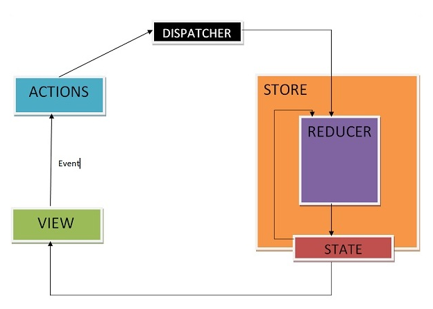
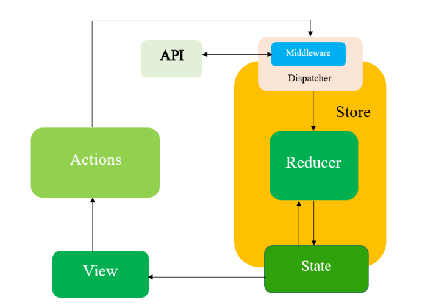
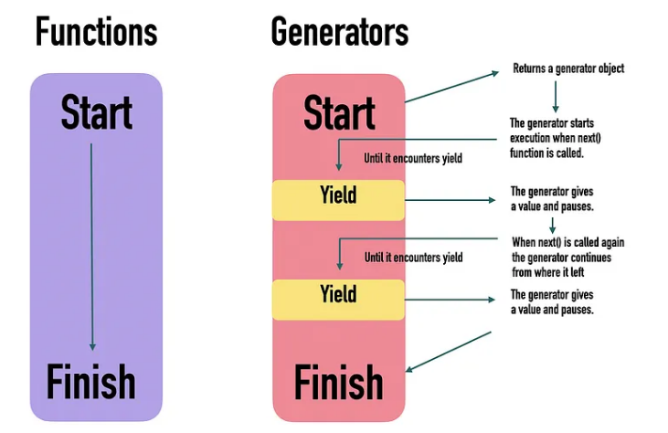

# React-Redux with Redux-Saga Complete Guide (TypeScript)

## Table of Contents
1. [Introduction to Redux](#introduction-to-redux)
2. [Introduction to Redux-Saga](#introduction-to-redux-saga)
3. [Generator Functions](#generator-functions)
4. [Redux Saga Effects](#redux-saga-effects)
5. [Basic Project Structure](#basic-project-structure)
6. [Core Concepts](#core-concepts)
7. [Project 1: E-commerce Product CRUD](#project-1-e-commerce-product-crud)
8. [Project 2: Image Gallery with Infinite Scroll](#project-2-image-gallery-with-infinite-scroll)
9. [Debugging Techniques](#debugging-techniques)
10. [Common Mistakes](#common-mistakes)
11. [Best Practices](#best-practices)

---

## Introduction to Redux

### What is Redux?

**Redux** is a state management library that stores application data in one central store, making state predictable, shared, and easier to manage across components.

### Key Principles
1. **Single Source of Truth** - One centralized store for entire app state
2. **State is Read-Only** - Only way to change state is by dispatching actions
3. **Changes with Pure Functions** - Reducers are pure functions that return new state



### When to Use Redux

✅ **Use Redux When:**
- Large and complex state shared across many components
  - E-commerce applications
  - Dashboards
  - Chat applications
  - Admin panels
- Frequent state updates (user actions, forms, filters, shopping carts)
- Multiple data sources (API calls, caching, async logic)
- Need scalable architecture (actions, reducers, store)

❌ **Don't Use Redux When:**
- Small applications with minimal state
- State is only used in a few components
- Simple parent-child component communication
- Using React Context is sufficient

---

## Introduction to Redux-Saga

### What is Redux-Saga?

**Redux-Saga** is a middleware library that handles side effects (API calls, async operations, Debouncing, Caching) in Redux applications using **generator functions**.


### Why Use Redux-Saga?

✅ **Advantages:**
- Cleaner async logic (compared to Redux Thunk)
- Easier to test (pure generator functions)
- Better error handling
- Cancellable operations
- Debouncing and throttling built-in
- Sequential and parallel async operations

### How Redux-Saga Works

```
User Action → Saga Middleware → Generator Function → API Call → Action Dispatch → Reducer → Store Update
```

---

## Generator Functions

### What are Generator Functions?

**Description:** Generator functions are special functions that can pause execution and resume later, allowing multiple return values.



### Basic Generator Example

**generator-example.ts**
```typescript
// Regular function - can only return once
function sayHi(): string {
  return 'hello';
  return 'world'; // Never executed
}

// Generator function - can yield multiple times
function* sayHiGen(): Generator<string, void, unknown> {
  yield 'hello';
  yield 'world';
  yield 'how are you?';
}

// Usage
const obj = sayHiGen();
console.log(obj.next()); // { value: 'hello', done: false }
console.log(obj.next()); // { value: 'world', done: false }
console.log(obj.next()); // { value: 'how are you?', done: false }
console.log(obj.next()); // { value: undefined, done: true }
```
---
### Basic Generator  Example 2

```typescript
function* twoWayCommunication(): Generator<string, void, string> {
  const firstName = yield 'What is your first name?';
  console.log(`First name: ${firstName}`);
  
  const lastName = yield 'What is your last name?';
  console.log(`Last name: ${lastName}`);
  
  console.log(`Full name: ${firstName} ${lastName}`);
}

// Usage
const gen = twoWayCommunication();

console.log(gen.next().value);        // "What is your first name?"
console.log(gen.next('John').value);  // Logs "First name: John"
                                       // Returns "What is your last name?"
gen.next('Doe');                       // Logs "Last name: Doe"
                                       // Logs "Full name: John Doe"
```
---

### Basic Generator Example 3:

```typescript
function* numberGenerator(): Generator<number> {
  yield 1;
  yield 2;
  yield 3;
}

function* letterGenerator(): Generator<string> {
  yield 'A';
  yield 'B';
  yield 'C';
}

function* combinedGenerator(): Generator<number | string> {
  yield* numberGenerator(); // Delegate to numbers
  yield* letterGenerator(); // Delegate to letters
  yield* [10, 20, 30];      // Delegate to array
}

// Usage
const gen = combinedGenerator();
console.log([...gen]); // [1, 2, 3, 'A', 'B', 'C', 10, 20, 30]
```
### Basic Generator  Example 4
```typescript
function* genfun(){
    yield "happy"
    const newvar = yield "coding"
    return newvar;
}

const result = genfun()

console.log(result.next())//{ value: "happy", done: false }
console.log(result.next())//{ value: "coding", done: false }
console.log(result.next("this is me"))//{ value: "this is me", done: true }
```
### Basic Generator  Example 5
```typescript
function* one(){
    yield '1'
}
function foo(test){
    return test
}
function* two(){
    const param = yield "waiting for input";
    yield foo(param);
}
function* root(){
    yield [one(),two()]
}
const gen=root();
const generators = gen.next().value;
console.log(generators[1].next())
console.log(generators[1].next("hi"))
console.log(generators[0].next())
```
---

### Generator with Parameters

**generator-params.ts**
```typescript
function* counterGen(start: number): Generator<number, void, unknown> {
  let count = start;
  while (true) {
    yield count++;
  }
}

const counter = counterGen(1);
console.log(counter.next().value); // 1
console.log(counter.next().value); // 2
console.log(counter.next().value); // 3
```

---

### Generator for Async Operations

**generator-async.ts**
```typescript
function* fetchUserGen(userId: number): Generator<Promise<any>, void, any> {
  console.log('Fetching user...');
  
  const response = yield fetch(`/api/users/${userId}`);
  const data = yield response.json();
  
  console.log('User data:', data);
  return data;
}

// How Saga uses generators
const gen = fetchUserGen(1);
gen.next(); // Start execution
gen.next(); // Continue to next yield
```

---

### All Generator Variations

**generator-variations.ts**
```typescript
// 1. Basic generator
function* basicGen(): Generator<number> {
  yield 1;
  yield 2;
  yield 3;
}

// 2. Generator with return
function* genWithReturn(): Generator<number, string, unknown> {
  yield 1;
  yield 2;
  return 'done';
}

// 3. Generator with parameters
function* genWithParams(name: string): Generator<string> {
  yield `Hello, ${name}`;
  yield `Goodbye, ${name}`;
}

// 4. Generator delegating to another generator
function* delegatingGen(): Generator<number | string> {
  yield* [1, 2, 3]; // Delegate to array
  yield* genWithParams('Alice'); // Delegate to another generator
}

// 5. Infinite generator
function* infiniteGen(): Generator<number> {
  let i = 0;
  while (true) {
    yield i++;
  }
}

// 6. Generator with error handling
function* errorHandlingGen(): Generator<string, void, unknown> {
  try {
    yield 'trying...';
    throw new Error('Something went wrong');
  } catch (error) {
    yield `caught error: ${error}`;
  }
}
```
---
## Redux Saga Effects

### take:
Waits for a specific action (blocking) until specific action will be dispatched .its a watcher function execute based on action changes and it runs only once
Use case: When you need to wait for a specific action before proceeding.
```typescript
import { take } from "redux-saga/effects";
function* watchLoginSaga() {
  // Pause until LOGIN action is dispatched
  const action = yield take('LOGIN');
  console.log('User credentials:', action.payload);
}

```
### takeLatest:
Takes only the latest action of a specific type
Use case: For operations like search where only the latest request matters.
```typescript
import { takeLatest } from "redux-saga/effects";
function* watchSearchSaga() {
  // Only handle the most recent SEARCH action
  yield takeLatest('FETCH_USER', performSearchSaga);
}

function* performSearchSaga(action) {
  const results = yield call(api.search, action.payload);
  yield put({ type: 'SEARCH_RESULTS', payload: results });
}
```
### put:
Dispatches an action to the Redux store, its Equivalent to dispatch()
Use case: When your saga needs to dispatch Redux actions or to trigger reducers after async work we need this.
```typescript
import { put } from "redux-saga/effects";
function* loginSaga(credentials) {
  // Dispatch action to update loading state
  yield put({ type: 'LOGIN_LOADING' });
  
  // After login logic completes
  yield put({ 
    type: 'LOGIN_SUCCESS', 
    payload: userData 
  });
}

```
### call
Calls a function (usually async) and waits for result (blocking)
Use case: For calling API (especially promises) and waiting for their result.
```typescript
import { call } from "redux-saga/effects";
function* fetchUserSaga(userId) {
  // Call API and wait for response
  const user = yield call(api.fetchUser, userId);
  console.log('User data:', user);
}
```
### select 
Extracts data from Redux state
Use case: When you need to access current Redux state.
```typescript
function* userProfileSaga() {
  // Get current user ID from Redux state
  const userId = yield select(state => state.auth.userId);
  
  // Use the ID to fetch profile
  const profile = yield call(api.fetchProfile, userId);
}
```
### all:
Runs multiple effects in parallel
Use case: When you need to run multiple operations concurrently.

```typescript
import { all, call } from "redux-saga/effects";
function* initializeAppSaga() {
  // Run all these sagas in parallel
  yield all([
    call(fetchUserSaga),
    call(fetchSettingsSaga),
    call(fetchNotificationsSaga)
  ]);
  
  yield put({ type: 'APP_INITIALIZED' });
}

```
### fork: 
Runs a saga in the background (non-blocking) it replace call 
Use case: For starting "watcher" sagas that run independently.
```typescript
import { fork } from "redux-saga/effects";
function* mainSaga() {
  // Start watchLoginSaga in background it will not block untill response come
  yield fork(watchLoginSaga);
  
  // This code runs immediately, doesn't wait for watchLoginSaga
  console.log('Main saga continues...');
}
```
### delay:
Pauses execution for a specified time
Use case: When you need to add timing to your saga flow.
```typescript
import { delay } from "redux-saga/effects";
function* notificationSaga() {
  yield put({ type: 'SHOW_NOTIFICATION', message: 'Success!' });
  
  // Wait 3 seconds
  yield delay(3000);
  
  yield put({ type: 'HIDE_NOTIFICATION' });
}

```
### race:
Runs effects in a race, cancels losers
Use case: For implementing timeouts or handling competing conditions.
```typescript
function* fetchWithTimeoutSaga() {
  const { data, timeout } = yield race({
    data: call(api.fetchData),
    timeout: delay(5000)
  });
  
  if (data) {
    yield put({ type: 'FETCH_SUCCESS', data });
  } else {
    yield put({ type: 'FETCH_TIMEOUT' });
  }
}

```
---

## Basic Project Structure

### Complete flow visualize

```
1. User Interaction
   │
   ▼
2. React Component receives the event
   │
   ▼
3. Component calls a prop function from Container
   │
   ▼
4. Container's mapDispatchToProps creates and dispatches an action
   │
   ▼
5. Action object flows to Redux Store
   │
   │
   ├─────► 6a. Reducer receives the action
   │       │
   │       ▼
   │      7a. Reducer checks action type in switch statement
   │       │
   │       ▼
   │      8a. Reducer creates new state (if relevant action)
   │       │
   │       ▼
   │      9a. Store updates with new state
   │
   │
   └─────► 6b. Saga Middleware intercepts the action
           │
           ▼
          7b. Watcher saga checks if it should respond to this action
           │
           ▼
          8b. Worker saga executes to handle the action
           │
           ▼
          9b. Saga calls Service for external data (API, etc.)
           │
           ▼
         10b. Service makes external request and returns data/promise
           │
           ▼
         11b. Saga receives data and dispatches success/failure action
           │
           ▼
         12b. New action goes back to step 5 (to be handled by Reducer)
           │
           │
           └─────► Back to 6a for state update
                   │
                   ▼
                  13. Store notifies connected components of state change
                   │
                   ▼
                  14. Container's mapStateToProps runs with new state
                   │
                   ▼
                  15. Selectors extract and format specific data from state
                   │
                   ▼
                  16. Container passes new props to Component
                   │
                   ▼
                  17. Component re-renders with new data

```
```typescript
//npm install redux redux-saga
//node main.js

//reducers.js
export default function counter(state = 0, action) {
  switch (action.type) {
    case 'INCREMENT':
      return state + 1;
    case 'INCREMENT_IF_ODD':
      return (state % 2 !== 0) ? state + 1 : state;
    case 'DECREMENT':
      return state - 1;
    default:
      return state;
  }
}


//sagas.js
import { put, takeEvery, takeLatest, delay } from 'redux-saga/effects';

// Helper function for creating delays
// const delay = (ms) => new Promise(res => setTimeout(res, ms));

// worker saga
export function* incrementAsync() {
  yield delay(3000);
  yield put({ type: 'INCREMENT' });
}

// watcher saga
export function* watchIncrementAsync() {
  yield takeLatest('INCREMENT_ASYNC', incrementAsync);
}

// You could add more sagas here
export function* watchDecrementAsync() {
  yield takeEvery('DECREMENT_ASYNC', function* () {
    yield delay(1000);
    yield put({ type: 'DECREMENT' });
  });
}

// Root saga a watcher function execute first
export function* rootSaga() {
  yield* [
    watchIncrementAsync(),
    watchDecrementAsync()
  ];
}


//main.js
import { createStore, applyMiddleware } from 'redux';
import createSagaMiddleware from 'redux-saga';
import counter from './reducers';
import { rootSaga } from './sagas';

// Create the saga middleware
const sagaMiddleware = createSagaMiddleware();

// Create store with the reducer and saga middleware
const store = createStore(
  counter,
  applyMiddleware(sagaMiddleware)
);

// Run the root saga
sagaMiddleware.run(rootSaga);

// Log initial state
console.log('Initial state:', store.getState());

// Subscribe to state changes
store.subscribe(() => {
  console.log('Current state:', store.getState());
});

// Dispatch actions to test
console.log('Dispatching INCREMENT');
store.dispatch({ type: 'INCREMENT' });

console.log('Dispatching DECREMENT');
store.dispatch({ type: 'DECREMENT' });

console.log('Dispatching INCREMENT_IF_ODD');
store.dispatch({ type: 'INCREMENT_IF_ODD' });

console.log('Dispatching INCREMENT_ASYNC (will increment after 3 seconds)');
store.dispatch({ type: 'INCREMENT_ASYNC' });

console.log('Dispatching DECREMENT_ASYNC (will decrement after 1 second)');
store.dispatch({ type: 'DECREMENT_ASYNC' });

```

---

## Core Concepts

### 1. Actions

**Description:** Actions are plain JavaScript objects that sends data from React to Redux. They must have a `type` property and can carry data as payload.

**Rules:**
- Must be a plain object
- Must contain a type field
- Can carry data via payload

**features/products/types/product.types.ts**
```typescript
export interface Product {
  id: number;
  name: string;
  price: number;
  description: string;
  image: string;
  category: string;
}

export interface ProductState {
  products: Product[];
  loading: boolean;
  error: string | null;
  selectedProduct: Product | null;
}
```

**features/products/actions/actionTypes.ts**
```typescript
// Action Types
export const PRODUCT_LIST = 'PRODUCT_LIST';
export const PRODUCT_LIST_SUCCESS = 'PRODUCT_LIST_SUCCESS';
export const PRODUCT_LIST_FAILURE = 'PRODUCT_LIST_FAILURE';

export const SEARCH_PRODUCT = 'SEARCH_PRODUCT';
export const SET_PRODUCT_LIST = 'SET_PRODUCT_LIST';

export const ADD_PRODUCT = 'ADD_PRODUCT';
export const ADD_PRODUCT_SUCCESS = 'ADD_PRODUCT_SUCCESS';
export const ADD_PRODUCT_FAILURE = 'ADD_PRODUCT_FAILURE';

export const UPDATE_PRODUCT = 'UPDATE_PRODUCT';
export const UPDATE_PRODUCT_SUCCESS = 'UPDATE_PRODUCT_SUCCESS';
export const UPDATE_PRODUCT_FAILURE = 'UPDATE_PRODUCT_FAILURE';

export const DELETE_PRODUCT = 'DELETE_PRODUCT';
export const DELETE_PRODUCT_SUCCESS = 'DELETE_PRODUCT_SUCCESS';
export const DELETE_PRODUCT_FAILURE = 'DELETE_PRODUCT_FAILURE';
```

**features/products/actions/productActions.ts**
```typescript
import * as types from './actionTypes';
import { Product } from '../types/product.types';

// Action Creators
export const getProductList = () => ({
  type: types.PRODUCT_LIST,
});

export const getProductListSuccess = (data: Product[]) => ({
  type: types.PRODUCT_LIST_SUCCESS,
  payload: data,
});

export const getProductListFailure = (error: string) => ({
  type: types.PRODUCT_LIST_FAILURE,
  payload: error,
});

export const searchProduct = (searchTerm: string) => ({
  type: types.SEARCH_PRODUCT,
  payload: searchTerm,
});

export const setProductList = (data: Product[]) => ({
  type: types.SET_PRODUCT_LIST,
  payload: data,
});

export const addProduct = (product: Omit<Product, 'id'>) => ({
  type: types.ADD_PRODUCT,
  payload: product,
});

export const addProductSuccess = (product: Product) => ({
  type: types.ADD_PRODUCT_SUCCESS,
  payload: product,
});

export const updateProduct = (id: number, product: Partial<Product>) => ({
  type: types.UPDATE_PRODUCT,
  payload: { id, product },
});

export const updateProductSuccess = (product: Product) => ({
  type: types.UPDATE_PRODUCT_SUCCESS,
  payload: product,
});

export const deleteProduct = (id: number) => ({
  type: types.DELETE_PRODUCT,
  payload: id,
});

export const deleteProductSuccess = (id: number) => ({
  type: types.DELETE_PRODUCT_SUCCESS,
  payload: id,
});
```

---

### 2. Reducers

**Description:** Reducers are pure functions that take the current state and an action, then return a new state. They must not mutate state.

**Rules**

- Must be a pure function
- Must not mutate state
- Must always return a value

**features/products/reducers/productReducer.ts**
```typescript
import * as types from '../actions/actionTypes';
import { ProductState, Product } from '../types/product.types';

const initialState: ProductState = {
  products: [],
  loading: false,
  error: null,
  selectedProduct: null,
};

// Reducer with Switch Statement (Most Common)
const productReducer = (
  state = initialState,
  action: any
): ProductState => {
  switch (action.type) {
    case types.PRODUCT_LIST:
      return {
        ...state,
        loading: true,
        error: null,
      };

    case types.PRODUCT_LIST_SUCCESS:
    case types.SET_PRODUCT_LIST:
      return {
        ...state,
        products: action.payload,
        loading: false,
        error: null,
      };

    case types.PRODUCT_LIST_FAILURE:
      return {
        ...state,
        loading: false,
        error: action.payload,
      };

    case types.ADD_PRODUCT:
    case types.UPDATE_PRODUCT:
    case types.DELETE_PRODUCT:
      return {
        ...state,
        loading: true,
      };

    case types.ADD_PRODUCT_SUCCESS:
      return {
        ...state,
        products: [...state.products, action.payload],
        loading: false,
      };

    case types.UPDATE_PRODUCT_SUCCESS:
      return {
        ...state,
        products: state.products.map((product) =>
          product.id === action.payload.id ? action.payload : product
        ),
        loading: false,
      };

    case types.DELETE_PRODUCT_SUCCESS:
      return {
        ...state,
        products: state.products.filter(
          (product) => product.id !== action.payload
        ),
        loading: false,
      };

    default:
      return state;
  }
};

export default productReducer;
```

---

### Reducer Variations

**reducer-variations.ts**
```typescript
// 1. Using Object Lookup (Alternative to Switch)
const actionHandlers = {
  [types.PRODUCT_LIST]: (state: ProductState) => ({
    ...state,
    loading: true,
  }),
  [types.PRODUCT_LIST_SUCCESS]: (state: ProductState, action: any) => ({
    ...state,
    products: action.payload,
    loading: false,
  }),
};

const productReducerWithLookup = (
  state = initialState,
  action: any
): ProductState => {
  const handler = actionHandlers[action.type];
  return handler ? handler(state, action) : state;
};

// 2. Using if-else
const productReducerWithIf = (
  state = initialState,
  action: any
): ProductState => {
  if (action.type === types.PRODUCT_LIST) {
    return { ...state, loading: true };
  } else if (action.type === types.PRODUCT_LIST_SUCCESS) {
    return { ...state, products: action.payload, loading: false };
  }
  return state;
};

// 3. Using Redux Toolkit (Modern Approach)
import { createSlice } from '@reduxjs/toolkit';

const productSlice = createSlice({
  name: 'products',
  initialState,
  reducers: {
    setLoading: (state) => {
      state.loading = true; // Redux Toolkit uses Immer
    },
    setProducts: (state, action) => {
      state.products = action.payload;
      state.loading = false;
    },
  },
});
```

---

### 3. Combine Reducers

**Description:** Combine multiple reducers into a single root reducer for the store.allowing you to split state management by domain or feature.

**store/rootReducer.ts**
```typescript
import { combineReducers } from 'redux';
import productReducer from '../features/products/reducers/productReducer';
import imageReducer from '../features/images/reducers/imageReducer';
import userReducer from '../features/users/reducers/userReducer';

const rootReducer = combineReducers({
  products: productReducer,
  images: imageReducer,
  users: userReducer,
});

export type RootState = ReturnType<typeof rootReducer>;
export default rootReducer;
```

---

### 4. Store Configuration

**Description:** Create and configure the Redux store with saga middleware.

**store/index.ts**
```typescript
import { createStore, applyMiddleware, compose } from 'redux';
import createSagaMiddleware from 'redux-saga';
import rootReducer from './rootReducer';
import rootSaga from './rootSaga';

// Create saga middleware
const sagaMiddleware = createSagaMiddleware();

// Redux DevTools Extension
const composeEnhancers =
  (window as any).__REDUX_DEVTOOLS_EXTENSION_COMPOSE__ || compose;

// Create store with middleware
const store = createStore(
  rootReducer,
  composeEnhancers(applyMiddleware(sagaMiddleware))
);

// Run saga middleware
sagaMiddleware.run(rootSaga);

export default store;
export type RootState = ReturnType<typeof rootReducer>;
export type AppDispatch = typeof store.dispatch;
```

**store/rootSaga.ts**
```typescript
import { all } from 'redux-saga/effects';
import productSaga from '../features/products/sagas/productSaga';
import imageSaga from '../features/images/sagas/imageSaga';

export default function* rootSaga() {
  yield all([
    productSaga(),
    imageSaga(),
  ]);
}
```

---

### 5. Selectors

**Description:** Selectors extract and compute derived data from the Redux store. Use `reselect` for memoization.

**features/products/selectors/productSelectors.ts**
```typescript
import { createSelector } from 'reselect';
import { RootState } from '../../../store';
import { Product } from '../types/product.types';

// Basic selectors
export const selectProductState = (state: RootState) => state.products;

export const selectProducts = (state: RootState) =>
  state.products.products;

export const selectLoading = (state: RootState) =>
  state.products.loading;

export const selectError = (state: RootState) =>
  state.products.error;

// Memoized selectors with reselect
export const selectProductById = (productId: number) =>
  createSelector(
    [selectProducts],
    (products) => products.find((p) => p.id === productId)
  );

export const selectProductsByCategory = (category: string) =>
  createSelector(
    [selectProducts],
    (products) => products.filter((p) => p.category === category)
  );

export const selectProductCount = createSelector(
  [selectProducts],
  (products) => products.length
);

export const selectTotalPrice = createSelector(
  [selectProducts],
  (products) => products.reduce((sum, product) => sum + product.price, 0)
);

export const selectExpensiveProducts = createSelector(
  [selectProducts],
  (products) => products.filter((p) => p.price > 100)
);
```

---

## Project 1: E-commerce Product CRUD

### Description
Create a JSON Server API for e-commerce products with full CRUD operations using Redux-Saga.

### Step 1: Setup JSON Server

**db.json**
```json
{
  "products": [
    {
      "id": 1,
      "name": "Laptop",
      "price": 999,
      "description": "High-performance laptop",
      "image": "https://via.placeholder.com/150",
      "category": "Electronics"
    },
    {
      "id": 2,
      "name": "Headphones",
      "price": 199,
      "description": "Noise-cancelling headphones",
      "image": "https://via.placeholder.com/150",
      "category": "Electronics"
    },
    {
      "id": 3,
      "name": "Coffee Maker",
      "price": 79,
      "description": "Automatic coffee maker",
      "image": "https://via.placeholder.com/150",
      "category": "Home"
    }
  ]
}
```

**package.json (add script)**
```json
{
  "scripts": {
    "json-server": "json-server --watch db.json --port 3001"
  }
}
```

Run: `npm run json-server`

---

### Step 2: Service Layer

**Description:** API service functions that make HTTP requests.

**features/products/services/productService.ts**
```typescript
import { Product } from '../types/product.types';

const API_URL = 'http://localhost:3001/products';

export const productService = {
  // GET all products
  getProducts: async (): Promise<Product[]> => {
    const response = await fetch(API_URL);
    if (!response.ok) {
      throw new Error('Failed to fetch products');
    }
    return response.json();
  },

  // SEARCH products
  searchProducts: async (searchTerm: string): Promise<Product[]> => {
    const response = await fetch(`${API_URL}?q=${searchTerm}`);
    if (!response.ok) {
      throw new Error('Search failed');
    }
    return response.json();
  },

  // GET single product
  getProductById: async (id: number): Promise<Product> => {
    const response = await fetch(`${API_URL}/${id}`);
    if (!response.ok) {
      throw new Error('Product not found');
    }
    return response.json();
  },

  // CREATE product
  createProduct: async (product: Omit<Product, 'id'>): Promise<Product> => {
    const response = await fetch(API_URL, {
      method: 'POST',
      headers: {
        'Content-Type': 'application/json',
      },
      body: JSON.stringify(product),
    });
    if (!response.ok) {
      throw new Error('Failed to create product');
    }
    return response.json();
  },

  // UPDATE product
  updateProduct: async (id: number, product: Partial<Product>): Promise<Product> => {
    const response = await fetch(`${API_URL}/${id}`, {
      method: 'PATCH',
      headers: {
        'Content-Type': 'application/json',
      },
      body: JSON.stringify(product),
    });
    if (!response.ok) {
      throw new Error('Failed to update product');
    }
    return response.json();
  },

  // DELETE product
  deleteProduct: async (id: number): Promise<void> => {
    const response = await fetch(`${API_URL}/${id}`, {
      method: 'DELETE',
    });
    if (!response.ok) {
      throw new Error('Failed to delete product');
    }
  },
};
```

---

### Step 3: Redux-Saga

**Description:** Saga effects handle side effects like API calls. Use `call` for functions, `put` for dispatching actions.

**features/products/sagas/productSaga.ts**
```typescript
import { call, put, takeEvery, takeLatest, select } from 'redux-saga/effects';
import * as types from '../actions/actionTypes';
import * as actions from '../actions/productActions';
import { productService } from '../services/productService';
import { Product } from '../types/product.types';

// Worker Saga: Fetch all products
function* getProducts(): Generator<any, void, any> {
  try {
    // Call API
    const data: Product[] = yield call(productService.getProducts);
    
    // Dispatch success action
    yield put(actions.getProductListSuccess(data));
  } catch (error: any) {
    // Dispatch failure action
    yield put(actions.getProductListFailure(error.message));
  }
}

// Worker Saga: Search products
function* searchProduct(action: ReturnType<typeof actions.searchProduct>): Generator<any, void, any> {
  try {
    const searchTerm = action.payload;
    
    // Call API with search term
    const result: Product[] = yield call(productService.searchProducts, searchTerm);
    
    // Dispatch action to set products
    yield put(actions.setProductList(result));
  } catch (error: any) {
    yield put(actions.getProductListFailure(error.message));
  }
}

// Worker Saga: Add product
function* addProduct(action: ReturnType<typeof actions.addProduct>): Generator<any, void, any> {
  try {
    const newProduct: Product = yield call(productService.createProduct, action.payload);
    yield put(actions.addProductSuccess(newProduct));
  } catch (error: any) {
    yield put(actions.getProductListFailure(error.message));
  }
}

// Worker Saga: Update product
function* updateProduct(action: ReturnType<typeof actions.updateProduct>): Generator<any, void, any> {
  try {
    const { id, product } = action.payload;
    const updatedProduct: Product = yield call(productService.updateProduct, id, product);
    yield put(actions.updateProductSuccess(updatedProduct));
  } catch (error: any) {
    yield put(actions.getProductListFailure(error.message));
  }
}

// Worker Saga: Delete product
function* deleteProduct(action: ReturnType<typeof actions.deleteProduct>): Generator<any, void, any> {
  try {
    const id = action.payload;
    yield call(productService.deleteProduct, id);
    yield put(actions.deleteProductSuccess(id));
  } catch (error: any) {
    yield put(actions.getProductListFailure(error.message));
  }
}

// Watcher Saga: Watch for actions
export default function* productSaga() {
  yield takeEvery(types.PRODUCT_LIST, getProducts);
  yield takeLatest(types.SEARCH_PRODUCT, searchProduct); // takeLatest cancels previous
  yield takeEvery(types.ADD_PRODUCT, addProduct);
  yield takeEvery(types.UPDATE_PRODUCT, updateProduct);
  yield takeEvery(types.DELETE_PRODUCT, deleteProduct);
}
```

---

### Step 4: React Component

**Description:** Connect React component to Redux store using `connect` HOC or hooks.
**Key Functions**
	`mapStateToProps` 

	- Takes Redux state as parameter
	- Returns object of props derived from state
	- Runs whenever state changes
	- Can access component's own props via second parameter

	`mapDispatchToProps`

	- Takes dispatch function as parameter
	- Returns object of action creator functions
	- Acts similar to useDispatch in hooks
	- Automatically wraps action creators in dispatch()

**Connect Variations & Use Cases**
1. Both State and Dispatch Mapping
Use case: When component needs both state data and to dispatch actions Example: User profile showing user data and allowing updates
```typescript
export default connect(mapStateToProps, mapDispatchToProps)(UserProfile)
```
2. State Mapping Only
Use case: Read-only components that display data but don't update it Example: Dashboard displaying statistics from Redux store
```typescript
export default connect(mapStateToProps)(Dashboard)
```
3. Dispatch Mapping Only
Use case: Components that trigger actions but don't need state Example: Form submit button that dispatches data
```typescript
export default connect(null, mapDispatchToProps)(SubmitButton)
```
4. Inline Component with Connect
Use case: Quick connection of simple components without creating separate files Example: One-off buttons or small UI elements that need Redux actions
```typescript
export default connect(null, mapDispatchToProps)((props) => <Button {...props} />)
```
5. Object Shorthand for Actions
Use case: When using pre-defined action creators Example: Counter component using standard increment/decrement actions
```typescript
export default connect(mapStateToProps, {increment, decrement})(Counter)
```
6. With Component's Own Props
Use case: When Redux data selection depends on component props Example: Todo item that needs to find its data based on ID prop
```typescript
const mapStateToProps = (state, ownProps) => ({
  todo: state.todos.find(todo => todo.id === ownProps.id)
})
export default connect(mapStateToProps)(TodoItem)
```
**components/ProductList/ProductList.tsx**
```typescript
import React, { useEffect, useState } from 'react';
import { connect } from 'react-redux';
import { RootState } from '../../store';
import {
  getProductList,
  searchProduct,
  addProduct,
  updateProduct,
  deleteProduct,
} from '../../features/products/actions/productActions';
import {
  selectProducts,
  selectLoading,
  selectError,
} from '../../features/products/selectors/productSelectors';
import { Product } from '../../features/products/types/product.types';

interface ProductListProps {
  products: Product[];
  loading: boolean;
  error: string | null;
  getProductList: () => void;
  searchProduct: (searchTerm: string) => void;
  addProduct: (product: Omit<Product, 'id'>) => void;
  updateProduct: (id: number, product: Partial<Product>) => void;
  deleteProduct: (id: number) => void;
}

const ProductList: React.FC<ProductListProps> = ({
  products,
  loading,
  error,
  getProductList,
  searchProduct,
  addProduct,
  updateProduct,
  deleteProduct,
}) => {
  const [searchTerm, setSearchTerm] = useState('');

  useEffect(() => {
    getProductList();
  }, [getProductList]);

  const handleSearch = (e: React.FormEvent) => {
    e.preventDefault();
    searchProduct(searchTerm);
  };

  const handleDelete = (id: number) => {
    if (window.confirm('Are you sure you want to delete this product?')) {
      deleteProduct(id);
    }
  };

  const handleUpdate = (product: Product) => {
    const newPrice = prompt('Enter new price:', product.price.toString());
    if (newPrice) {
      updateProduct(product.id, { price: parseFloat(newPrice) });
    }
  };

  const handleAdd = () => {
    const newProduct = {
      name: 'New Product',
      price: 99,
      description: 'Description',
      image: 'https://via.placeholder.com/150',
      category: 'General',
    };
    addProduct(newProduct);
  };

  if (loading) {
    return <div>Loading products...</div>;
  }

  if (error) {
    return <div>Error: {error}</div>;
  }

  return (
    <div className="product-list">
      <h1>Products</h1>

      {/* Search Form */}
      <form onSubmit={handleSearch}>
        <input
          type="text"
          placeholder="Search products..."
          value={searchTerm}
          onChange={(e) => setSearchTerm(e.target.value)}
        />
        <button type="submit">Search</button>
        <button type="button" onClick={() => { setSearchTerm(''); getProductList(); }}>
          Clear
        </button>
      </form>

      {/* Add Product Button */}
      <button onClick={handleAdd}>Add Product</button>

      {/* Product Grid */}
      <div className="product-grid">
        {products.map((product) => (
          <div key={product.id} className="product-card">
            
            <h3>{product.name}</h3>
            <p>{product.description}</p>
            <p className="price">${product.price}</p>
            <p className="category">{product.category}</p>
            <div className="actions">
              <button onClick={() => handleUpdate(product)}>Update Price</button>
              <button onClick={() => handleDelete(product.id)}>Delete</button>
            </div>
          </div>
        ))}
      </div>
    </div>
  );
};

// Map state to props
const mapStateToProps = (state: RootState) => ({
  products: selectProducts(state),
  loading: selectLoading(state),
  error: selectError(state),
});

// Map dispatch to props
const mapDispatchToProps = {
  getProductList,
  searchProduct,
  addProduct,
  updateProduct,
  deleteProduct,
};

export default connect(mapStateToProps, mapDispatchToProps)(ProductList);
```

---

### Alternative: Using Hooks (Modern Approach)

**ProductList-Hooks.tsx**
```typescript
import React, { useEffect, useState } from 'react';
import { useSelector, useDispatch } from 'react-redux';
import { RootState } from '../../store';
import {
  getProductList,
  searchProduct,
  deleteProduct,
} from '../../features/products/actions/productActions';
import {
  selectProducts,
  selectLoading,
  selectError,
} from '../../features/products/selectors/productSelectors';

const ProductListHooks: React.FC = () => {
  const dispatch = useDispatch();
  const products = useSelector(selectProducts);
  const loading = useSelector(selectLoading);
  const error = useSelector(selectError);
  
  const [searchTerm, setSearchTerm] = useState('');

  useEffect(() => {
    dispatch(getProductList());
  }, [dispatch]);

  const handleSearch = (e: React.FormEvent) => {
    e.preventDefault();
    dispatch(searchProduct(searchTerm));
  };

  const handleDelete = (id: number) => {
    if (window.confirm('Delete this product?')) {
      dispatch(deleteProduct(id));
    }
  };

  // ... rest of the component
  
  return (
    <div className="product-list">
      {/* Same JSX as above */}
    </div>
  );
};

export default ProductListHooks;
```

---

## Project 2: Image Gallery with Infinite Scroll

### Description
Fetch images from an API (Unsplash/Pixabay) and display in a grid with search and infinite scroll functionality.

### Step 1: Types and Actions

**features/images/types/image.types.ts**
```typescript
export interface Image {
  id: string;
  url: string;
  title: string;
  author: string;
  thumbnailUrl: string;
}

export interface ImageState {
  images: Image[];
  loading: boolean;
  error: string | null;
  page: number;
  hasMore: boolean;
  searchQuery: string;
}
```

**features/images/actions/actionTypes.ts**
```typescript
export const IMG_LOAD = 'IMG_LOAD';
export const IMG_LOAD_SUCCESS = 'IMG_LOAD_SUCCESS';
export const IMG_LOAD_FAILURE = 'IMG_LOAD_FAILURE';
export const IMG_SEARCH = 'IMG_SEARCH';
export const IMG_RESET = 'IMG_RESET';
export const IMG_SET_PAGE = 'IMG_SET_PAGE';
```

**features/images/actions/imageActions.ts**
```typescript
import * as types from './actionTypes';
import { Image } from '../types/image.types';

export const loadImages = () => ({
  type: types.IMG_LOAD,
});

export const loadImagesSuccess = (images: Image[], hasMore: boolean) => ({
  type: types.IMG_LOAD_SUCCESS,
  payload: { images, hasMore },
});

export const loadImagesFailure = (error: string) => ({
  type: types.IMG_LOAD_FAILURE,
  payload: error,
});

export const searchImages = (query: string) => ({
  type: types.IMG_SEARCH,
  payload: query,
});

export const resetImages = () => ({
  type: types.IMG_RESET,
});

export const setPage = (page: number) => ({
  type: types.IMG_SET_PAGE,
  payload: page,
});
```

---

### Step 2: Reducer

**features/images/reducers/imageReducer.ts**
```typescript
import * as types from '../actions/actionTypes';
import { ImageState, Image } from '../types/image.types';

const initialState: ImageState = {
  images: [],
  loading: false,
  error: null,
  page: 1,
  hasMore: true,
  searchQuery: '',
};

const imageReducer = (state = initialState, action: any): ImageState => {
  switch (action.type) {
    case types.IMG_LOAD:
      return {
        ...state,
        loading: true,
        error: null,
      };

    case types.IMG_LOAD_SUCCESS:
      return {
        ...state,
        images: [...state.images, ...action.payload.images],
        hasMore: action.payload.hasMore,
        loading: false,
        page: state.page + 1,
      };

    case types.IMG_LOAD_FAILURE:
      return {
        ...state,
        loading: false,
        error: action.payload,
      };

    case types.IMG_SEARCH:
      return {
        ...state,
        searchQuery: action.payload,
        images: [],
        page: 1,
        hasMore: true,
      };

    case types.IMG_RESET:
      return initialState;

    case types.IMG_SET_PAGE:
      return {
        ...state,
        page: action.payload,
      };

    default:
      return state;
  }
};

export default imageReducer;
```

---

### Step 3: Selectors

**features/images/selectors/imageSelectors.ts**
```typescript
import { createSelector } from 'reselect';
import { RootState } from '../../../store';

export const selectImageState = (state: RootState) => state.images;

export const selectImages = (state: RootState) => state.images.images;

export const selectLoading = (state: RootState) => state.images.loading;

export const selectError = (state: RootState) => state.images.error;

export const getPage = (state: RootState) => state.images.page;

export const selectHasMore = (state: RootState) => state.images.hasMore;

export const selectSearchQuery = (state: RootState) => state.images.searchQuery;

// Memoized selector for image count
export const selectImageCount = createSelector(
  [selectImages],
  (images) => images.length
);
```

---

### Step 4: Service

**features/images/services/imageService.ts**
```typescript
import { Image } from '../types/image.types';

const UNSPLASH_ACCESS_KEY = 'YOUR_UNSPLASH_ACCESS_KEY';
const API_URL = 'https://api.unsplash.com';

export const imageService = {
  fetchImages: async (page: number, perPage: number = 20): Promise<Image[]> => {
    const response = await fetch(
      `${API_URL}/photos?page=${page}&per_page=${perPage}&client_id=${UNSPLASH_ACCESS_KEY}`
    );

    if (!response.ok) {
      throw new Error('Failed to fetch images');
    }

    const data = await response.json();

    return data.map((item: any) => ({
      id: item.id,
      url: item.urls.regular,
      thumbnailUrl: item.urls.thumb,
      title: item.alt_description || 'Untitled',
      author: item.user.name,
    }));
  },

  searchImages: async (
    query: string,
    page: number,
    perPage: number = 20
  ): Promise<Image[]> => {
    const response = await fetch(
      `${API_URL}/search/photos?query=${query}&page=${page}&per_page=${perPage}&client_id=${UNSPLASH_ACCESS_KEY}`
    );

    if (!response.ok) {
      throw new Error('Search failed');
    }

    const data = await response.json();

    return data.results.map((item: any) => ({
      id: item.id,
      url: item.urls.regular,
      thumbnailUrl: item.urls.thumb,
      title: item.alt_description || query,
      author: item.user.name,
    }));
  },
};
```

---

### Step 5: Saga

**features/images/sagas/imageSaga.ts**
```typescript
import { call, put, select, takeLatest } from 'redux-saga/effects';
import * as types from '../actions/actionTypes';
import * as actions from '../actions/imageActions';
import { imageService } from '../services/imageService';
import { getPage, selectSearchQuery } from '../selectors/imageSelectors';
import { Image } from '../types/image.types';

// Worker Saga: Handle image loading
function* handleImageLoad(): Generator<any, void, any> {
  try {
    // Get current page from state
    const page: number = yield select(getPage);
    const searchQuery: string = yield select(selectSearchQuery);

    let images: Image[];
    const perPage = 20;

    if (searchQuery) {
      // Search images if query exists
      images = yield call(imageService.searchImages, searchQuery, page, perPage);
    } else {
      // Fetch regular images
      images = yield call(imageService.fetchImages, page, perPage);
    }

    // Check if there are more images
    const hasMore = images.length === perPage;

    // Dispatch success action
    yield put(actions.loadImagesSuccess(images, hasMore));
  } catch (error: any) {
    // Dispatch failure action
    yield put(actions.loadImagesFailure(error.toString()));
  }
}

// Worker Saga: Handle search
function* handleSearch(action: ReturnType<typeof actions.searchImages>): Generator<any, void, any> {
  try {
    const searchQuery = action.payload;
    const page = 1;
    const perPage = 20;

    // Call search API
    const images: Image[] = yield call(imageService.searchImages, searchQuery, page, perPage);
    
    const hasMore = images.length === perPage;

    // Dispatch success action
    yield put(actions.loadImagesSuccess(images, hasMore));
  } catch (error: any) {
    yield put(actions.loadImagesFailure(error.toString()));
  }
}

// Watcher Saga
export default function* watchImageLoad() {
  yield takeLatest(types.IMG_LOAD, handleImageLoad);
  yield takeLatest(types.IMG_SEARCH, handleSearch);
}
```

---

### Step 6: React Component with Infinite Scroll

**components/ImageGallery/ImageGallery.tsx**
```typescript
import React, { useEffect, useRef, useCallback, useState } from 'react';
import { useSelector, useDispatch } from 'react-redux';
import {
  selectImages,
  selectLoading,
  selectError,
  selectHasMore,
  selectImageCount,
} from '../../features/images/selectors/imageSelectors';
import {
  loadImages,
  searchImages,
  resetImages,
} from '../../features/images/actions/imageActions';
import './ImageGallery.css';

const ImageGallery: React.FC = () => {
  const dispatch = useDispatch();
  const images = useSelector(selectImages);
  const loading = useSelector(selectLoading);
  const error = useSelector(selectError);
  const hasMore = useSelector(selectHasMore);
  const imageCount = useSelector(selectImageCount);

  const [searchTerm, setSearchTerm] = useState('');
  const observer = useRef<IntersectionObserver | null>(null);

  // Load initial images
  useEffect(() => {
    dispatch(loadImages());
  }, [dispatch]);

  // Infinite scroll - last element ref
  const lastImageRef = useCallback(
    (node: HTMLDivElement | null) => {
      if (loading) return;
      if (observer.current) observer.current.disconnect();

      observer.current = new IntersectionObserver((entries) => {
        if (entries[0].isIntersecting && hasMore) {
          dispatch(loadImages());
        }
      });

      if (node) observer.current.observe(node);
    },
    [loading, hasMore, dispatch]
  );

  // Handle search
  const handleSearch = (e: React.FormEvent) => {
    e.preventDefault();
    if (searchTerm.trim()) {
      dispatch(searchImages(searchTerm));
    }
  };

  // Handle reset
  const handleReset = () => {
    setSearchTerm('');
    dispatch(resetImages());
    dispatch(loadImages());
  };

  if (error) {
    return (
      <div className="error">
        <p>Error: {error}</p>
        <button onClick={handleReset}>Try Again</button>
      </div>
    );
  }

  return (
    <div className="image-gallery">
      <h1>Image Gallery</h1>

      {/* Search Box */}
      <form onSubmit={handleSearch} className="search-form">
        <input
          type="text"
          placeholder="Search images..."
          value={searchTerm}
          onChange={(e) => setSearchTerm(e.target.value)}
          className="search-input"
        />
        <button type="submit" className="search-button">
          Search
        </button>
        <button type="button" onClick={handleReset} className="reset-button">
          Reset
        </button>
      </form>

      <p className="image-count">Total Images: {imageCount}</p>

      {/* Image Grid */}
      <div className="image-grid">
        {images.map((image, index) => {
          // Attach ref to last image
          if (images.length === index + 1) {
            return (
              <div
                key={image.id}
                ref={lastImageRef}
                className="image-card"
              >
                
                <div className="image-info">
                  <h4>{image.title}</h4>
                  <p>By {image.author}</p>
                </div>
              </div>
            );
          } else {
            return (
              <div key={image.id} className="image-card">
                
                <div className="image-info">
                  <h4>{image.title}</h4>
                  <p>By {image.author}</p>
                </div>
              </div>
            );
          }
        })}
      </div>

      {/* Loading indicator */}
      {loading && (
        <div className="loading">
          <p>Loading more images...</p>
        </div>
      )}

      {/* No more images */}
      {!hasMore && !loading && (
        <div className="no-more">
          <p>No more images to load</p>
        </div>
      )}
    </div>
  );
};

export default ImageGallery;
```

**ImageGallery.css**
```css
.image-gallery {
  max-width: 1200px;
  margin: 0 auto;
  padding: 20px;
}

.search-form {
  display: flex;
  gap: 10px;
  margin-bottom: 20px;
}

.search-input {
  flex: 1;
  padding: 10px;
  font-size: 16px;
  border: 2px solid #ddd;
  border-radius: 4px;
}

.search-button,
.reset-button {
  padding: 10px 20px;
  font-size: 16px;
  cursor: pointer;
  border: none;
  border-radius: 4px;
}

.search-button {
  background: #007bff;
  color: white;
}

.reset-button {
  background: #6c757d;
  color: white;
}

.image-count {
  margin-bottom: 20px;
  font-weight: bold;
}

.image-grid {
  display: grid;
  grid-template-columns: repeat(auto-fill, minmax(250px, 1fr));
  gap: 20px;
}

.image-card {
  border: 1px solid #ddd;
  border-radius: 8px;
  overflow: hidden;
  transition: transform 0.3s;
}

.image-card:hover {
  transform: translateY(-5px);
  box-shadow: 0 4px 12px rgba(0, 0, 0, 0.15);
}

.image-card img {
  width: 100%;
  height: 200px;
  object-fit: cover;
}

.image-info {
  padding: 10px;
}

.image-info h4 {
  margin: 0 0 5px 0;
  font-size: 14px;
}

.image-info p {
  margin: 0;
  font-size: 12px;
  color: #666;
}

.loading,
.no-more,
.error {
  text-align: center;
  padding: 20px;
  margin: 20px 0;
}

.error {
  color: red;
}
```

---

## Debugging Techniques

### 1. Redux DevTools

**Description:** Browser extension that shows state changes, actions, and time-travel debugging.

```typescript
// store/index.ts
const composeEnhancers =
  (window as any).__REDUX_DEVTOOLS_EXTENSION_COMPOSE__ || compose;

const store = createStore(
  rootReducer,
  composeEnhancers(applyMiddleware(sagaMiddleware))
);
```

**Usage:**
1. Install Redux DevTools Extension
2. Open browser DevTools
3. Navigate to Redux tab
4. See: Actions, State Diff, State Tree

---

### 2. Console Logging in Sagas

**Description:** Add console.log statements to track saga execution.

```typescript
function* getProducts(): Generator<any, void, any> {
  console.log('🔍 Saga: Starting getProducts');
  
  try {
    console.log('📡 Saga: Calling API');
    const data: Product[] = yield call(productService.getProducts);
    console.log('✅ Saga: API Response:', data);
    
    yield put(actions.getProductListSuccess(data));
    console.log('✅ Saga: Dispatched success action');
  } catch (error: any) {
    console.error('❌ Saga: Error:', error);
    yield put(actions.getProductListFailure(error.message));
  }
}
```

---

### 3. Redux Logger Middleware

**Description:** Logs every action and state change.

```bash
npm install redux-logger
npm install --save-dev @types/redux-logger
```

```typescript
import { createLogger } from 'redux-logger';

const logger = createLogger({
  collapsed: true,
  diff: true,
});

const store = createStore(
  rootReducer,
  composeEnhancers(applyMiddleware(sagaMiddleware, logger))
);
```

---

### 4. Saga Monitor

**Description:** Monitor saga effects execution.

```typescript
import createSagaMiddleware from 'redux-saga';

const sagaMiddleware = createSagaMiddleware({
  onError: (error, { sagaStack }) => {
    console.error('Saga Error:', error);
    console.log('Saga Stack:', sagaStack);
  },
});
```

---

### 5. React DevTools with Redux

**Description:** Use React DevTools to inspect component props from Redux.

```typescript
// In component
console.log('Props from Redux:', {
  products,
  loading,
  error,
});
```

---

### 6. Testing Sagas

**Description:** Use `redux-saga-test-plan` to test sagas.

```bash
npm install --save-dev redux-saga-test-plan
```

```typescript
import { expectSaga } from 'redux-saga-test-plan';
import * as matchers from 'redux-saga-test-plan/matchers';
import { getProducts } from './productSaga';
import { productService } from '../services/productService';

describe('productSaga', () => {
  it('fetches products successfully', () => {
    const mockProducts = [{ id: 1, name: 'Test' }];

    return expectSaga(getProducts)
      .provide([
        [matchers.call.fn(productService.getProducts), mockProducts],
      ])
      .put(actions.getProductListSuccess(mockProducts))
      .run();
  });
});
```

---

## Common Mistakes

### 1. ❌ Not Using `call` for Function Calls

**Problem:**
```typescript
// ❌ BAD - Direct function call
function* getProducts() {
  const data = yield productService.getProducts(); // Hard to test
  yield put(actions.getProductListSuccess(data));
}
```

**Solution:**
```typescript
// ✅ GOOD - Using call effect
function* getProducts() {
  const data = yield call(productService.getProducts); // Testable
  yield put(actions.getProductListSuccess(data));
}
```

---

### 2. ❌ Mutating State in Reducers

**Problem:**
```typescript
// ❌ BAD - Mutating state
const productReducer = (state = initialState, action: any) => {
  switch (action.type) {
    case types.ADD_PRODUCT:
      state.products.push(action.payload); // Mutation!
      return state;
    default:
      return state;
  }
};
```

**Solution:**
```typescript
// ✅ GOOD - Return new state
const productReducer = (state = initialState, action: any) => {
  switch (action.type) {
    case types.ADD_PRODUCT:
      return {
        ...state,
        products: [...state.products, action.payload],
      };
    default:
      return state;
  }
};
```

---

### 3. ❌ Forgetting to Export Sagas in rootSaga

**Problem:**
```typescript
// ❌ BAD - Saga not included
export default function* rootSaga() {
  yield all([
    productSaga(),
    // imageSaga() is missing!
  ]);
}
```

**Solution:**
```typescript
// ✅ GOOD - All sagas included
export default function* rootSaga() {
  yield all([
    productSaga(),
    imageSaga(),
    userSaga(),
  ]);
}
```

---

### 4. ❌ Not Awaiting Generator Functions

**Problem:**
```typescript
// ❌ BAD - Not using yield
function* getProducts() {
  const data = fetch('/api/products'); // Returns Promise, not data
  yield put(actions.getProductListSuccess(data));
}
```

**Solution:**
```typescript
// ✅ GOOD - Using yield with call
function* getProducts() {
  const response = yield call(fetch, '/api/products');
  const data = yield call([response, 'json']);
  yield put(actions.getProductListSuccess(data));
}
```

---

### 5. ❌ Using `takeEvery` for Search (Should Use `takeLatest`)

**Problem:**
```typescript
// ❌ BAD - All search requests execute
function* productSaga() {
  yield takeEvery(SEARCH_PRODUCT, searchProduct);
  // Multiple rapid searches cause multiple API calls
}
```

**Solution:**
```typescript
// ✅ GOOD - Cancel previous search
function* productSaga() {
  yield takeLatest(SEARCH_PRODUCT, searchProduct);
  // Only latest search executes
}
```

---

### 6. ❌ Not Handling Errors in Sagas

**Problem:**
```typescript
// ❌ BAD - No error handling
function* getProducts() {
  const data = yield call(productService.getProducts);
  yield put(actions.getProductListSuccess(data));
  // What if API fails?
}
```

**Solution:**
```typescript
// ✅ GOOD - Try-catch error handling
function* getProducts() {
  try {
    const data = yield call(productService.getProducts);
    yield put(actions.getProductListSuccess(data));
  } catch (error: any) {
    yield put(actions.getProductListFailure(error.message));
  }
}
```

---

### 7. ❌ Missing Action Types in Reducer

**Problem:**
```typescript
// ❌ BAD - No default case
const productReducer = (state = initialState, action: any) => {
  switch (action.type) {
    case types.PRODUCT_LIST_SUCCESS:
      return { ...state, products: action.payload };
    // No default case - returns undefined for unknown actions
  }
};
```

**Solution:**
```typescript
// ✅ GOOD - Always return state in default
const productReducer = (state = initialState, action: any) => {
  switch (action.type) {
    case types.PRODUCT_LIST_SUCCESS:
      return { ...state, products: action.payload };
    default:
      return state; // Return current state
  }
};
```

---

### 8. ❌ Not Running Saga Middleware

**Problem:**
```typescript
// ❌ BAD - Saga middleware created but not run
const sagaMiddleware = createSagaMiddleware();
const store = createStore(rootReducer, applyMiddleware(sagaMiddleware));
// Missing: sagaMiddleware.run(rootSaga)
```

**Solution:**
```typescript
// ✅ GOOD - Run saga middleware
const sagaMiddleware = createSagaMiddleware();
const store = createStore(rootReducer, applyMiddleware(sagaMiddleware));
sagaMiddleware.run(rootSaga); // Run sagas!
```

---

### 9. ❌ Incorrect Selector Usage

**Problem:**
```typescript
// ❌ BAD - Accessing state directly
const products = useSelector((state: RootState) => state.products.products);
```

**Solution:**
```typescript
// ✅ GOOD - Using selectors
import { selectProducts } from '../selectors/productSelectors';
const products = useSelector(selectProducts);
```

---

### 10. ❌ Not Typing Action Creators

**Problem:**
```typescript
// ❌ BAD - No types
export const searchProduct = (searchTerm) => ({
  type: types.SEARCH_PRODUCT,
  payload: searchTerm,
});
```

**Solution:**
```typescript
// ✅ GOOD - Properly typed
export const searchProduct = (searchTerm: string) => ({
  type: types.SEARCH_PRODUCT as typeof types.SEARCH_PRODUCT,
  payload: searchTerm,
});
```

---

### 11. ❌ Not Cleaning Up Saga Effects

**Problem:**
```typescript
// ❌ BAD - Long-running saga without cleanup
function* watchScroll() {
  while (true) {
    yield take('SCROLL');
    // Runs forever, no way to cancel
  }
}
```

**Solution:**
```typescript
// ✅ GOOD - Cancellable task
import { take, race, call } from 'redux-saga/effects';

function* watchScroll() {
  while (true) {
    yield race({
      scroll: take('SCROLL'),
      cancel: take('CANCEL_SCROLL'),
    });
  }
}
```

---

### 12. ❌ Dispatching Actions Directly in Components

**Problem:**
```typescript
// ❌ BAD - Dispatching raw actions
dispatch({ type: 'PRODUCT_LIST' });
```

**Solution:**
```typescript
// ✅ GOOD - Using action creators
import { getProductList } from '../actions/productActions';
dispatch(getProductList());
```

---

## Best Practices

### 1. ✅ Use TypeScript for Type Safety

```typescript
// Define types for everything
interface Product {
  id: number;
  name: string;
  price: number;
}

interface ProductState {
  products: Product[];
  loading: boolean;
  error: string | null;
}

// Type action creators
export const getProductList = (): { type: string } => ({
  type: types.PRODUCT_LIST,
});
```

---

### 2. ✅ Organize by Feature, Not by Type

```
✅ GOOD:
features/
  products/
    actions/
    reducers/
    sagas/
    selectors/
    services/

❌ BAD:
actions/
  productActions.ts
  imageActions.ts
reducers/
  productReducer.ts
  imageReducer.ts
```

---

### 3. ✅ Use `takeLatest` for Search/Autocomplete

```typescript
// ✅ Cancels previous searches
yield takeLatest(SEARCH_PRODUCT, searchProduct);

// Instead of:
yield takeEvery(SEARCH_PRODUCT, searchProduct);
```

---

### 4. ✅ Use Selectors with Reselect for Memoization

```typescript
import { createSelector } from 'reselect';

// Memoized selector - only recomputes when products change
export const selectExpensiveProducts = createSelector(
  [selectProducts],
  (products) => products.filter((p) => p.price > 100)
);
```

---

### 5. ✅ Always Handle Errors in Sagas

```typescript
function* fetchData() {
  try {
    const data = yield call(api.fetch);
    yield put(fetchSuccess(data));
  } catch (error: any) {
    yield put(fetchFailure(error.message));
    // Optional: Log to error tracking service
    console.error('Fetch error:', error);
  }
}
```

---

### 6. ✅ Use Constants for Action Types

```typescript
// actionTypes.ts
export const FETCH_DATA = 'FETCH_DATA';
export const FETCH_SUCCESS = 'FETCH_SUCCESS';
export const FETCH_FAILURE = 'FETCH_FAILURE';

// Prevents typos and enables autocomplete
```

---

### 7. ✅ Keep Reducers Pure

```typescript
// ✅ GOOD - Pure reducer
const reducer = (state, action) => {
  return { ...state, value: action.payload };
};

// ❌ BAD - Side effects in reducer
const reducer = (state, action) => {
  fetch('/api/data'); // NO!
  return { ...state, value: action.payload };
};
```

---

### 8. ✅ Use `call` for All Function Calls in Sagas

```typescript
// ✅ Makes testing easy
const data = yield call(api.fetchData, userId);

// ❌ Hard to test
const data = yield api.fetchData(userId);
```

---

### 9. ✅ Separate Business Logic from UI

```typescript
// ✅ GOOD - Logic in saga
function* handleCheckout(action) {
  const cart = yield select(selectCart);
  const total = calculateTotal(cart);
  yield call(api.processPayment, total);
}

// ❌ BAD - Logic in component
const handleCheckout = () => {
  const total = cart.reduce((sum, item) => sum + item.price, 0);
  processPayment(total);
};
```

---

### 10. ✅ Use Redux DevTools

```typescript
const composeEnhancers =
  (window as any).__REDUX_DEVTOOLS_EXTENSION_COMPOSE__ || compose;

const store = createStore(
  rootReducer,
  composeEnhancers(applyMiddleware(sagaMiddleware))
);
```

---

