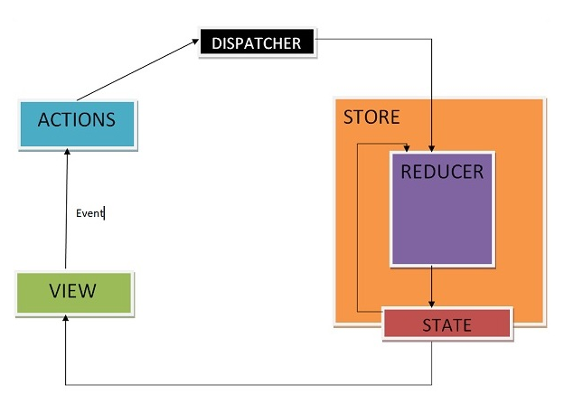
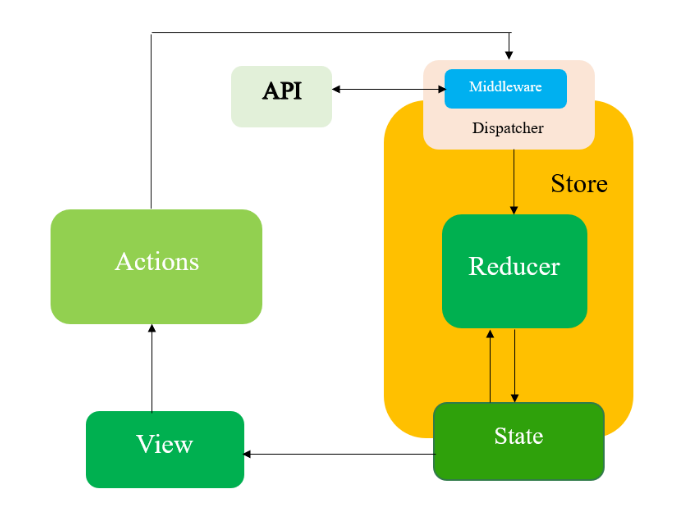
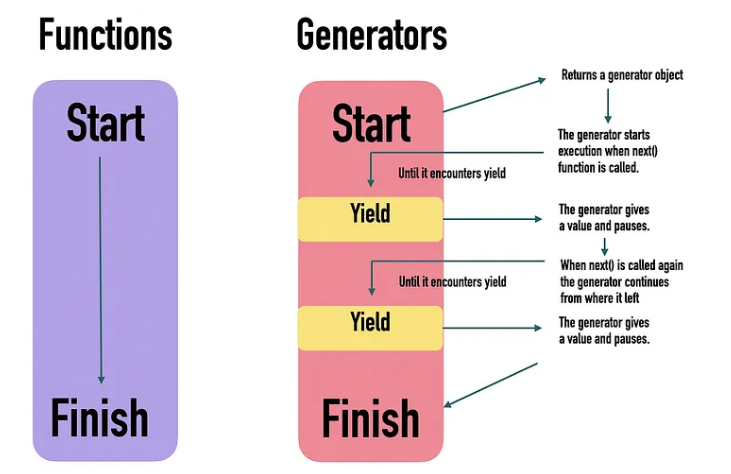

# React-Redux with Redux-Saga Complete Guide (TypeScript)

## Table of Contents
1. [Introduction to Redux](#introduction-to-redux)
2. [Introduction to Redux-Saga](#introduction-to-redux-saga)
3. [Generator Functions](#generator-functions)
4. [Redux Saga Effects](#redux-saga-effects)
5. [Basic Project Structure](#basic-project-structure)
6. [Core Concepts](#core-concepts)
7. [Project 1: E-commerce Product CRUD](#project-1-e-commerce-product-crud)
8. [Project 2: Image Gallery with Infinite Scroll](#project-2-image-gallery-with-infinite-scroll)
9. [Debugging Techniques](#debugging-techniques)
10. [Common Mistakes](#common-mistakes)
11. [Best Practices](#best-practices)

---

## Introduction to Redux

### What is Redux?

**Redux** is a state management library that stores application data in one central store, making state predictable, shared, and easier to manage across components.

### Key Principles
1. **Single Source of Truth** - One centralized store for entire app state
2. **State is Read-Only** - Only way to change state is by dispatching actions
3. **Changes with Pure Functions** - Reducers are pure functions that return new state



### When to Use Redux

✅ **Use Redux When:**
- Large and complex state shared across many components
  - E-commerce applications
  - Dashboards
  - Chat applications
  - Admin panels
- Frequent state updates (user actions, forms, filters, shopping carts)
- Multiple data sources (API calls, caching, async logic)
- Need scalable architecture (actions, reducers, store)

❌ **Don't Use Redux When:**
- Small applications with minimal state
- State is only used in a few components
- Simple parent-child component communication
- Using React Context is sufficient

---

## Introduction to Redux-Saga

### What is Redux-Saga?

**Redux-Saga** is a middleware library that handles side effects (API calls, async operations, Debouncing, Caching) in Redux applications using **generator functions**.


### Why Use Redux-Saga?

✅ **Advantages:**
- Cleaner async logic (compared to Redux Thunk)
- Easier to test (pure generator functions)
- Better error handling
- Cancellable operations
- Debouncing and throttling built-in
- Sequential and parallel async operations

### How Redux-Saga Works

```
User Action → Saga Middleware → Generator Function → API Call → Action Dispatch → Reducer → Store Update
```

---

## Generator Functions

### What are Generator Functions?

**Description:** Generator functions are special functions that can pause execution and resume later, allowing multiple return values.



### Basic Generator Example

**generator-example.ts**
```typescript
// Regular function - can only return once
function sayHi(): string {
  return 'hello';
  return 'world'; // Never executed
}

// Generator function - can yield multiple times
function* sayHiGen(): Generator<string, void, unknown> {
  yield 'hello';
  yield 'world';
  yield 'how are you?';
}

// Usage
const obj = sayHiGen();
console.log(obj.next()); // { value: 'hello', done: false }
console.log(obj.next()); // { value: 'world', done: false }
console.log(obj.next()); // { value: 'how are you?', done: false }
console.log(obj.next()); // { value: undefined, done: true }
```
---
### Basic Generator  Example 2

```typescript
function* twoWayCommunication(): Generator<string, void, string> {
  const firstName = yield 'What is your first name?';
  console.log(`First name: ${firstName}`);
  
  const lastName = yield 'What is your last name?';
  console.log(`Last name: ${lastName}`);
  
  console.log(`Full name: ${firstName} ${lastName}`);
}

// Usage
const gen = twoWayCommunication();

console.log(gen.next().value);        // "What is your first name?"
console.log(gen.next('John').value);  // Logs "First name: John"
                                       // Returns "What is your last name?"
gen.next('Doe');                       // Logs "Last name: Doe"
                                       // Logs "Full name: John Doe"
```
---

### Basic Generator Example 3:

```typescript
function* numberGenerator(): Generator<number> {
  yield 1;
  yield 2;
  yield 3;
}

function* letterGenerator(): Generator<string> {
  yield 'A';
  yield 'B';
  yield 'C';
}

function* combinedGenerator(): Generator<number | string> {
  yield* numberGenerator(); // Delegate to numbers
  yield* letterGenerator(); // Delegate to letters
  yield* [10, 20, 30];      // Delegate to array
}

// Usage
const gen = combinedGenerator();
console.log([...gen]); // [1, 2, 3, 'A', 'B', 'C', 10, 20, 30]
```
### Basic Generator  Example 4
```typescript
function* genfun(){
    yield "happy"
    const newvar = yield "coding"
    return newvar;
}

const result = genfun()

console.log(result.next())//{ value: "happy", done: false }
console.log(result.next())//{ value: "coding", done: false }
console.log(result.next("this is me"))//{ value: "this is me", done: true }
```
### Basic Generator  Example 5
```typescript
function* one(){
    yield '1'
}
function foo(test){
    return test
}
function* two(){
    const param = yield "waiting for input";
    yield foo(param);
}
function* root(){
    yield [one(),two()]
}
const gen=root();
const generators = gen.next().value;
console.log(generators[1].next())
console.log(generators[1].next("hi"))
console.log(generators[0].next())
```
---

### Generator with Parameters

**generator-params.ts**
```typescript
function* counterGen(start: number): Generator<number, void, unknown> {
  let count = start;
  while (true) {
    yield count++;
  }
}

const counter = counterGen(1);
console.log(counter.next().value); // 1
console.log(counter.next().value); // 2
console.log(counter.next().value); // 3
```

---

### Generator for Async Operations

**generator-async.ts**
```typescript
function* fetchUserGen(userId: number): Generator<Promise<any>, void, any> {
  console.log('Fetching user...');
  
  const response = yield fetch(`/api/users/${userId}`);
  const data = yield response.json();
  
  console.log('User data:', data);
  return data;
}

// How Saga uses generators
const gen = fetchUserGen(1);
gen.next(); // Start execution
gen.next(); // Continue to next yield
```

---

### All Generator Variations

**generator-variations.ts**
```typescript
// 1. Basic generator
function* basicGen(): Generator<number> {
  yield 1;
  yield 2;
  yield 3;
}

// 2. Generator with return
function* genWithReturn(): Generator<number, string, unknown> {
  yield 1;
  yield 2;
  return 'done';
}

// 3. Generator with parameters
function* genWithParams(name: string): Generator<string> {
  yield `Hello, ${name}`;
  yield `Goodbye, ${name}`;
}

// 4. Generator delegating to another generator
function* delegatingGen(): Generator<number | string> {
  yield* [1, 2, 3]; // Delegate to array
  yield* genWithParams('Alice'); // Delegate to another generator
}

// 5. Infinite generator
function* infiniteGen(): Generator<number> {
  let i = 0;
  while (true) {
    yield i++;
  }
}

// 6. Generator with error handling
function* errorHandlingGen(): Generator<string, void, unknown> {
  try {
    yield 'trying...';
    throw new Error('Something went wrong');
  } catch (error) {
    yield `caught error: ${error}`;
  }
}
```
---
## Redux Saga Effects

### take:
Waits for a specific action (blocking) until specific action will be dispatched .its a watcher function execute based on action changes and it runs only once
Use case: When you need to wait for a specific action before proceeding.
```typescript
import { take } from "redux-saga/effects";
function* watchLoginSaga() {
  // Pause until LOGIN action is dispatched
  const action = yield take('LOGIN');
  console.log('User credentials:', action.payload);
}

```
### takeLatest:
Takes only the latest action of a specific type
Use case: For operations like search where only the latest request matters.
```typescript
import { takeLatest } from "redux-saga/effects";
function* watchSearchSaga() {
  // Only handle the most recent SEARCH action
  yield takeLatest('FETCH_USER', performSearchSaga);
}

function* performSearchSaga(action) {
  const results = yield call(api.search, action.payload);
  yield put({ type: 'SEARCH_RESULTS', payload: results });
}
```
### put:
Dispatches an action to the Redux store, its Equivalent to dispatch()
Use case: When your saga needs to dispatch Redux actions or to trigger reducers after async work we need this.
```typescript
import { put } from "redux-saga/effects";
function* loginSaga(credentials) {
  // Dispatch action to update loading state
  yield put({ type: 'LOGIN_LOADING' });
  
  // After login logic completes
  yield put({ 
    type: 'LOGIN_SUCCESS', 
    payload: userData 
  });
}

```
### call
Calls a function (usually async) and waits for result (blocking)
Use case: For calling API (especially promises) and waiting for their result.
```typescript
import { call } from "redux-saga/effects";
function* fetchUserSaga(userId) {
  // Call API and wait for response
  const user = yield call(api.fetchUser, userId);
  console.log('User data:', user);
}
```
### select 
Extracts data from Redux state
Use case: When you need to access current Redux state.
```typescript
function* userProfileSaga() {
  // Get current user ID from Redux state
  const userId = yield select(state => state.auth.userId);
  
  // Use the ID to fetch profile
  const profile = yield call(api.fetchProfile, userId);
}
```
### all:
Runs multiple effects in parallel
Use case: When you need to run multiple operations concurrently.

```typescript
import { all, call } from "redux-saga/effects";
function* initializeAppSaga() {
  // Run all these sagas in parallel
  yield all([
    call(fetchUserSaga),
    call(fetchSettingsSaga),
    call(fetchNotificationsSaga)
  ]);
  
  yield put({ type: 'APP_INITIALIZED' });
}

```
### fork: 
Runs a saga in the background (non-blocking) it replace call 
Use case: For starting "watcher" sagas that run independently.
```typescript
import { fork } from "redux-saga/effects";
function* mainSaga() {
  // Start watchLoginSaga in background it will not block untill response come
  yield fork(watchLoginSaga);
  
  // This code runs immediately, doesn't wait for watchLoginSaga
  console.log('Main saga continues...');
}
```
### delay:
Pauses execution for a specified time
Use case: When you need to add timing to your saga flow.
```typescript
import { delay } from "redux-saga/effects";
function* notificationSaga() {
  yield put({ type: 'SHOW_NOTIFICATION', message: 'Success!' });
  
  // Wait 3 seconds
  yield delay(3000);
  
  yield put({ type: 'HIDE_NOTIFICATION' });
}

```
### race:
Runs effects in a race, cancels losers
Use case: For implementing timeouts or handling competing conditions.
```typescript
function* fetchWithTimeoutSaga() {
  const { data, timeout } = yield race({
    data: call(api.fetchData),
    timeout: delay(5000)
  });
  
  if (data) {
    yield put({ type: 'FETCH_SUCCESS', data });
  } else {
    yield put({ type: 'FETCH_TIMEOUT' });
  }
}

```
---

## Basic Project Structure

### Complete flow visualize

```

	
					 ┌───────────────────────────────┐
                     │        REACT FRONTEND         │
                     │   (Dotted Rectangle Boundary) │                      
                     │                               │
                     │   Storybook                   │
                     │       │                       │
                     │       ▼                       │
                     │   Container /Hook layer       │
					 │   (useSelector / useDispatch) │
                     │       │                       │
                     │       ▼                       │
                     │   Component                   │
                     │    ▲  │                       │
                     │    |  └──── UI Events         │
                     │  selector      │              │
                     │    ▲           ▼              │
                     │    ▼     dispatch(Action)     │
                     │   store        │		         │	
                     │     ▲          │              │
                     │     |          ▼              │
                     │🧤Reducer◄─── Action dispatch	 │
					 (update state)   │    🔴     	 │
					 │      Slice     │              │
                     │         ▲      ▼    🧤        |
                     │         │    RTK Query/       │
					 │         │    Saga (async)     │
                     │         │      │              │
                     │         │      ▼              │
                     │            Service(fetch)     │
                     │      (API call layer)         │
                     │               │               │
                     └───────────────┼───────────────┘
                                     │
                                     │ HTTP / REST API /GET /POST/ PUT
                                     ▼
                     ┌───────────────────────────────┐
                     │        JAVA/NODE.JS BACKEND   │
                     │   (Spring Boot / REST APIs)   │
                     │                               │
                     │       Controller/ routes      │
                     │           │                   │
                     │           ▼                   │
                     │        Service Layer          │
                     │           │                   │
                     │           ▼                   │
                     │        Repository             │
					 │          /ORM:Prisma          │
					 │			 │					 │
					 │			 │					 │
					 │			 ▼					 │
					 │		   Database				 │			  
                     └───────────────────────────────┘

```


---

## Core Concepts

### 1. Actions

**Description:** Actions are plain JavaScript objects that sends data from React to Redux. They must have a `type` property and can carry data as payload.

**Rules:**
- Must be a plain object
- Must contain a type field
- Can carry data via payload


---

### 2. Reducers

**Description:** Reducers are pure functions that take the current state and an action, then return a new state. They must not mutate state.

**Rules**

- Must be a pure function
- Must not mutate state
- Must always return a value


---

### 3. Combine Reducers

**Description:** Combine multiple reducers into a single root reducer for the store.allowing you to split state management by domain or feature.

---

### 4. Store Configuration

**Description:** Create and configure the Redux store with saga middleware.


---

### 5. Selectors

**Description:** Selectors extract and compute derived data from the Redux store. Use `reselect` for memoization.


---

## Project 1: Redux Button Disable With Async Promise Flow

### Description
Create a JSON Server API for e-commerce products with full CRUD operations using Redux-Saga.

**App.jsx**
```typescript
import React from "react";
import { Provider, useDispatch, useSelector } from "react-redux";
import {
  store,
  getFetchRequestAction,
  getIsDisableButton,
  getResponseData,
} from "./redux";

// ─── Inner Component ─────────────────────────────────────────────────────────

const ButtonComponent = () => {
  const dispatch = useDispatch();
  const isDisable = useSelector(getIsDisableButton);
  const data = useSelector(getResponseData);

  const handleClick = () => {
    dispatch(getFetchRequestAction());
  };

  return (
    <div
      style={{
        display: "flex",
        flexDirection: "column",
        alignItems: "center",
        justifyContent: "center",
        height: "100vh",
        gap: "20px",
        fontFamily: "sans-serif",
      }}
    >
      <button
        onClick={handleClick}
        disabled={isDisable}
        style={{
          backgroundColor: isDisable ? "#aaa" : "#4f46e5",
          cursor: isDisable ? "not-allowed" : "pointer",
        }}
      >
        {isDisable ? "Loading..." : "Click Me"}
      </button>

      {data && (
        <div>
          <strong>Response:</strong> {data.message}
        </div>
      )}
    </div>
  );
};

// ─── Root Component ──────────────────────────────────────────────────────────

const App = () => (
  <Provider store={store}>
    <ButtonComponent />
  </Provider>
);

export default App;
```

**redux.ts**

```typescript
import { createStore, applyMiddleware } from "redux";
import { createSelector } from "reselect";
import createSagaMiddleware from "redux-saga";
import { call, put, takeLatest } from "redux-saga/effects";

// ─── Constants ───────────────────────────────────────────────────────────────

export const BASE_STATE = "BASE_STATE";
export const RESET_STATE = "RESET_STATE";
export const LOADING_STATE = "LOADING_STATE";
export const SUCCESS_STATE = "SUCCESS_STATE";
export const FAILURE_STATE = "FAILURE_STATE";
export const FETCH_REQUEST = "FETCH_REQUEST";

// ─── Types ───────────────────────────────────────────────────────────────────

interface ResponseData {
  message: string;
}

interface ResponseState {
  data: ResponseData | null;
  isDisable: boolean;
}

interface BaseAction {
  type: typeof BASE_STATE | typeof RESET_STATE;
}

interface LoadingAction {
  type: typeof LOADING_STATE;
}

interface FetchRequestAction {
  type: typeof FETCH_REQUEST;
}

interface SuccessAction {
  type: typeof SUCCESS_STATE;
  payload: { data: ResponseData };
}

interface FailureAction {
  type: typeof FAILURE_STATE;
  payload: { error: string };
}

type ResponseAction =
  | BaseAction
  | LoadingAction
  | FetchRequestAction
  | SuccessAction
  | FailureAction;

interface RootState {
  response: ResponseState | null;
}

// ─── Action Creators ─────────────────────────────────────────────────────────

export const getBaseAction = (): BaseAction => ({
  type: BASE_STATE,
});

export const getResetAction = (): BaseAction => ({
  type: RESET_STATE,
});

export const getLoadingAction = (): LoadingAction => ({
  type: LOADING_STATE,
});

export const getFetchRequestAction = (): FetchRequestAction => ({
  type: FETCH_REQUEST,
});

export const getSuccessAction = (data: ResponseData): SuccessAction => ({
  type: SUCCESS_STATE,
  payload: { data },
});

export const getFailureAction = (error: string): FailureAction => ({
  type: FAILURE_STATE,
  payload: { error },
});

// ─── Fake API Service ─────────────────────────────────────────────────────────

class ResponseService {
  private static instance: ResponseService;

  static getInstance(): ResponseService {
    if (!ResponseService.instance) {
      ResponseService.instance = new ResponseService();
    }
    return ResponseService.instance;
  }

  fetchData(): Promise<{ data: ResponseData }> {
    return new Promise((resolve) =>
      setTimeout(
        () => resolve({ data: { message: "Hello from console.log!" } }),
        2000
      )
    );
  }
}

// ─── Saga ─────────────────────────────────────────────────────────────────────

export function* fetchResponseSaga(
  action: FetchRequestAction,
  responseService: ResponseService = ResponseService.getInstance()
) {
  try {
    yield put(getLoadingAction());

    const response: { data: ResponseData } = yield call({
      context: responseService,
      fn: responseService.fetchData,
    });

    if (response && response.data) {
      console.log("Response:", response.data);
      yield put(getSuccessAction(response.data));
    }
  } catch {
    yield put(getFailureAction("Something went wrong"));
  }
}

export function* watchFetchResponse() {
  yield takeLatest(FETCH_REQUEST, fetchResponseSaga);
}

// ─── Reducer ─────────────────────────────────────────────────────────────────

export const getResponseReducer = (
  state: ResponseState | null = null,
  action: ResponseAction
): ResponseState | null => {
  switch (action.type) {
    case BASE_STATE:
    case RESET_STATE:
      return null;

    case LOADING_STATE:
      return {
        data: null,
        isDisable: true,
      };

    case SUCCESS_STATE:
      return {
        ...action.payload,
        isDisable: false,
      };

    case FAILURE_STATE:
      return {
        data: null,
        isDisable: false,
      };

    default:
      return state;
  }
};

// ─── Root Reducer ─────────────────────────────────────────────────────────────

const rootReducer = (
  state: RootState = { response: null },
  action: ResponseAction
): RootState => ({
  response: getResponseReducer(state.response, action),
});

// ─── Store ───────────────────────────────────────────────────────────────────

const sagaMiddleware = createSagaMiddleware();

export const store = createStore(rootReducer, applyMiddleware(sagaMiddleware));

sagaMiddleware.run(watchFetchResponse);

// ─── Selectors ───────────────────────────────────────────────────────────────

const selectResponseState = (state: RootState): ResponseState | null =>
  state.response;

const selectIsDisable = (state: RootState): boolean =>
  state.response?.isDisable ?? false;

const selectData = (state: RootState): ResponseData | null =>
  state.response?.data ?? null;

export const getIsDisableButton = createSelector(
  [selectIsDisable],
  (isDisable) => isDisable
);

export const getResponseData = createSelector([selectData], (data) => data);

export const getResponseState = createSelector(
  [selectResponseState],
  (response) => response
);

```

Flow

```txt
Click Button
     │
     ▼
dispatch(getFetchRequestAction())   → FETCH_REQUEST
     │
     ▼
watchFetchResponse (takeLatest)
     │
     ▼
fetchResponseSaga
     │
     ▼
put(getLoadingAction())             → LOADING_STATE → isDisable: true  → Button disabled
     │
     ▼
call(responseService.fetchData)     → Promise delay 2000ms
     │
     ├── resolve → console.log → put(getSuccessAction) → SUCCESS_STATE → isDisable: false
     │
     └── catch  →               put(getFailureAction)  → FAILURE_STATE → isDisable: false
```
---
## Project 2: User List Search Disable State

### Description
Create a JSON Server API for e-commerce products with full CRUD operations using Redux-Saga.

**App.jsx**
```typescript
import React, { useState, useCallback } from "react";
import { Provider, useDispatch, useSelector } from "react-redux";
import {
  store,
  getFetchRequestAction,
  getIsDisableButton,
  getUserList,
  IGetUserListRequest,
  IUser,
} from "./redux";

// ─── Types ───────────────────────────────────────────────────────────────────

interface ISearchProps {
  onPageLoadWithFilters: (request: IGetUserListRequest) => void;
}

// ─── Search Component ─────────────────────────────────────────────────────────

const SearchComponent: React.FC<ISearchProps> = (props) => {
  const [search, setSearch] = useState("");

  const dispatchList = useCallback(
    (searchText: string) => {
      const request: IGetUserListRequest = {
        searchText,
      };
      props.onPageLoadWithFilters(request);
    },
    [props]
  );

  const handleKeyDown = (e: React.KeyboardEvent<HTMLInputElement>) => {
    if (e.key === "Enter" && search.trim()) {
      dispatchList(search);
    }
  };

  const handleSearch = () => {
    if (search.trim()) {
      dispatchList(search);
    }
  };

  return (
    <div style={styles.searchRow}>
      <input
        type="text"
        placeholder="Search by name..."
        value={search}
        onChange={(e) => setSearch(e.target.value)}
        onKeyDown={handleKeyDown}
        style={styles.input}
      />
      <button onClick={handleSearch} style={styles.searchButton}>
        Search
      </button>
    </div>
  );
};

// ─── Main Component ───────────────────────────────────────────────────────────

const UserListComponent: React.FC = () => {
  const dispatch = useDispatch();
  const isDisable = useSelector(getIsDisableButton);
  const userList = useSelector(getUserList);

  const onPageLoadWithFilters = useCallback(
    (request: IGetUserListRequest) => {
      dispatch(getFetchRequestAction(request));
    },
    [dispatch]
  );

  return (
    <div style={styles.container}>
      <h2 style={styles.heading}>Redux Saga Search Filter User List Flow</h2>

      <SearchComponent onPageLoadWithFilters={onPageLoadWithFilters} />

      {isDisable && <p style={styles.loading}>Searching...</p>}

      {userList && userList.length > 0 && (
        <div style={styles.listWrapper}>
          {userList.map((user: IUser) => (
            <div key={user.id} style={styles.card}>
              <p style={styles.name}>{user.name}</p>
              <p style={styles.detail}>@{user.username}</p>
              <p style={styles.detail}>{user.email}</p>
              <p style={styles.detail}>{user.phone}</p>
            </div>
          ))}
        </div>
      )}

      {userList && userList.length === 0 && !isDisable && (
        <p style={styles.noResult}>No users found</p>
      )}
    </div>
  );
};

// ─── Root Component ──────────────────────────────────────────────────────────

const App: React.FC = () => (
  <Provider store={store}>
    <UserListComponent />
  </Provider>
);

export default App;

// ─── Styles ──────────────────────────────────────────────────────────────────

const styles: Record<string, React.CSSProperties> = {
  container: {
    maxWidth: "600px",
    margin: "40px auto",
    fontFamily: "sans-serif",
    padding: "0 16px",
  },
  heading: {
    fontSize: "18px",
    marginBottom: "20px",
    color: "#1e1e2f",
  },
  searchRow: {
    display: "flex",
    gap: "8px",
  },
  input: {
    flex: 1,
    padding: "10px 14px",
    fontSize: "15px",
    border: "1px solid #ccc",
    borderRadius: "8px",
    outline: "none",
  },
  searchButton: {
    padding: "10px 20px",
    fontSize: "15px",
    backgroundColor: "#4f46e5",
    color: "#fff",
    border: "none",
    borderRadius: "8px",
    cursor: "pointer",
  },
  loading: {
    marginTop: "16px",
    color: "#888",
  },
  listWrapper: {
    marginTop: "20px",
    display: "flex",
    flexDirection: "column",
    gap: "12px",
  },
  card: {
    padding: "14px 16px",
    border: "1px solid #e2e8f0",
    borderRadius: "10px",
    background: "#f8fafc",
  },
  name: {
    fontWeight: "bold",
    fontSize: "15px",
    marginBottom: "4px",
    color: "#1e1e2f",
  },
  detail: {
    fontSize: "13px",
    color: "#555",
    margin: "2px 0",
  },
  noResult: {
    marginTop: "20px",
    color: "#e53e3e",
  },
};


```
**redux.ts**
```typescript
import { createStore, applyMiddleware } from "redux";
import { createSelector } from "reselect";
import createSagaMiddleware from "redux-saga";
import { call, put, takeLatest } from "redux-saga/effects";

// ─── Constants ───────────────────────────────────────────────────────────────

export const BASE_STATE = "BASE_STATE";
export const RESET_STATE = "RESET_STATE";
export const LOADING_STATE = "LOADING_STATE";
export const SUCCESS_STATE = "SUCCESS_STATE";
export const FAILURE_STATE = "FAILURE_STATE";
export const FETCH_REQUEST = "FETCH_REQUEST";

// ─── Types ───────────────────────────────────────────────────────────────────

export interface IUser {
  id: number;
  name: string;
  email: string;
  phone: string;
  username: string;
}

export interface IGetUserListRequest {
  searchText: string;
}

interface IFetchRequestAction {
  type: typeof FETCH_REQUEST;
  payload: IGetUserListRequest;
}

interface ILoadingAction {
  type: typeof LOADING_STATE;
}

interface ISuccessAction {
  type: typeof SUCCESS_STATE;
  payload: { data: IUser[] };
}

interface IFailureAction {
  type: typeof FAILURE_STATE;
  payload: { error: string };
}

interface IBaseAction {
  type: typeof BASE_STATE | typeof RESET_STATE;
}

type TResponseAction =
  | IBaseAction
  | ILoadingAction
  | IFetchRequestAction
  | ISuccessAction
  | IFailureAction;

interface IUserListState {
  data: IUser[] | null;
  isDisable: boolean;
}

interface IRootState {
  userList: IUserListState | null;
}

// ─── Action Creators ─────────────────────────────────────────────────────────

export const getBaseAction = (): IBaseAction => ({
  type: BASE_STATE,
});

export const getResetAction = (): IBaseAction => ({
  type: RESET_STATE,
});

export const getLoadingAction = (): ILoadingAction => ({
  type: LOADING_STATE,
});

export const getFetchRequestAction = (
  request: IGetUserListRequest
): IFetchRequestAction => ({
  type: FETCH_REQUEST,
  payload: {
    ...request,
  },
});

export const getSuccessAction = (data: IUser[]): ISuccessAction => ({
  type: SUCCESS_STATE,
  payload: { data },
});

export const getFailureAction = (error: string): IFailureAction => ({
  type: FAILURE_STATE,
  payload: { error },
});

// ─── Service ─────────────────────────────────────────────────────────────────

interface IUserService {
  getList(request: IGetUserListRequest): Promise<{ data: IUser[] }>;
}

class UserService implements IUserService {
  private static instance: UserService;

  static getInstance(): UserService {
    if (!UserService.instance) {
      UserService.instance = new UserService();
    }
    return UserService.instance;
  }

  async getList(request: IGetUserListRequest): Promise<{ data: IUser[] }> {
    const response = await fetch("https://jsonplaceholder.typicode.com/users");
    const users: IUser[] = await response.json();

    const filtered = users.filter((user) =>
      user.name.toLowerCase().includes(request.searchText.toLowerCase())
    );

    return { data: filtered };
  }
}

// ─── Saga ─────────────────────────────────────────────────────────────────────

export function* getUserListSaga(
  action: IFetchRequestAction,
  userService: IUserService = UserService.getInstance()
) {
  try {
    const response: { data: IUser[] } = yield call(
      { context: userService, fn: userService.getList },
      action.payload
    );

    if (response && response.data && response.data.length) {
      console.log("Response:", response.data);
      yield put(getSuccessAction(response.data));
    } else {
      yield put(getSuccessAction([]));
    }
  } catch {
    yield put(getFailureAction("Something went wrong"));
  }
}

export function* watchGetUserList() {
  yield takeLatest(FETCH_REQUEST, getUserListSaga);
}

// ─── Reducer ─────────────────────────────────────────────────────────────────

export const getResponseReducer = (
  state: IUserListState | null = null,
  action: TResponseAction
): IUserListState | null => {
  switch (action.type) {
    case BASE_STATE:
    case LOADING_STATE:
      return null;

    case RESET_STATE:
      return null;

    case SUCCESS_STATE:
      return {
        ...action.payload,
        isDisable: false,
      };

    case FAILURE_STATE:
      return {
        data: null,
        isDisable: false,
      };

    default:
      return state;
  }
};

// ─── Root Reducer ─────────────────────────────────────────────────────────────

const rootReducer = (
  state: IRootState = { userList: null },
  action: TResponseAction
): IRootState => ({
  userList: getResponseReducer(state.userList, action),
});

// ─── Saga Middleware & Store ──────────────────────────────────────────────────

const sagaMiddleware = createSagaMiddleware();

export const store = createStore(rootReducer, applyMiddleware(sagaMiddleware));

sagaMiddleware.run(watchGetUserList);

// ─── Selectors ───────────────────────────────────────────────────────────────

const selectIsDisable = (state: IRootState): boolean =>
  state.userList?.isDisable ?? false;

const selectUserList = (state: IRootState): IUser[] | null =>
  state.userList?.data ?? null;

const selectUserListState = (state: IRootState): IUserListState | null =>
  state.userList;

export const getIsDisableButton = createSelector(
  [selectIsDisable],
  (isDisable) => isDisable
);

export const getUserList = createSelector([selectUserList], (data) => data);

export const getUserListState = createSelector(
  [selectUserListState],
  (userList) => userList
);

```
Flow
```txt
Type in Search Box + Enter  OR  Click Search Button
            │
            ▼
   dispatchList(searchText)
            │
            ▼
   onPageLoadWithFilters(request)
            │
            ▼
   dispatch(getFetchRequestAction(request))  →  FETCH_REQUEST
            │
            ▼
   watchGetUserList (takeLatest)
            │
            ▼
   getUserListSaga
            │
            ▼
   LOADING_STATE  →  isDisable: true  →  "Searching..."
            │
            ▼
   call(userService.getList)  →  fetch jsonplaceholder + filter
            │
            ├── data found  → console.log → SUCCESS_STATE → isDisable: false → show list
            │
            └── catch       →              FAILURE_STATE → isDisable: false → no result
```

---
## Project 3: Form Submit Toast Notification Flow

### Description
Create a JSON Server API for e-commerce products with full CRUD operations using Redux-Saga.

**App.jsx**
```typescript
import React, { useState, useCallback, useEffect } from "react";
import { Provider, useDispatch, useSelector } from "react-redux";
import { toast, ToastContainer } from "react-toastify";
import "react-toastify/dist/ReactToastify.css";
import {
  store,
  getFormSubmitRequestAction,
  getFormLoadingAction,
  getFormResetAction,
  getIsFormSubmitInProgress,
  getIsFormSubmitSuccess,
  getFormSubmitErrorMessage,
  IFormSubmitRequest,
} from "./redux";

// ─── Toast Helper ─────────────────────────────────────────────────────────────

const TOAST_SUCCESS_MESSAGE = "Form submitted successfully!";
const TOAST_FAILURE_MESSAGE = "Form submission failed. Please try again.";

const getFormToastPayload = (
  isSuccess?: boolean,
  errorMessage?: string | null
): void => {
  const status: "success" | "error" | "none" = isSuccess
    ? "success"
    : errorMessage
    ? "error"
    : "none";

  switch (status) {
    case "success":
      toast.success(TOAST_SUCCESS_MESSAGE, {
        delay: 2000,
        autoClose: 3000,
      });
      break;
    case "error":
      toast.warning(TOAST_FAILURE_MESSAGE, {
        delay: 2000,
        autoClose: 3000,
      });
      break;
    default:
      break;
  }
};

// ─── Types ───────────────────────────────────────────────────────────────────

interface IFormProps {
  onFormSubmit: (request: IFormSubmitRequest) => void;
  isDisabled: boolean;
}

// ─── Form Component ───────────────────────────────────────────────────────────

const FormComponent: React.FC<IFormProps> = (props) => {
  const [email, setEmail] = useState("");
  const [password, setPassword] = useState("");

  const dispatchFormSubmit = useCallback(
    (emailVal: string, passwordVal: string) => {
      const request: IFormSubmitRequest = {
        email: emailVal,
        password: passwordVal,
      };
      props.onFormSubmit(request);
    },
    [props]
  );

  const handleSubmit = (e: React.FormEvent) => {
    e.preventDefault();
    if (email.trim() && password.trim()) {
      dispatchFormSubmit(email, password);
    }
  };

  return (
    <form onSubmit={handleSubmit} style={styles.form}>
      <h2 style={styles.heading}>Login Form</h2>

      <div style={styles.fieldGroup}>
        <label style={styles.label}>Email</label>
        <input
          type="email"
          placeholder="Enter email"
          value={email}
          onChange={(e) => setEmail(e.target.value)}
          style={styles.input}
          disabled={props.isDisabled}
        />
      </div>

      <div style={styles.fieldGroup}>
        <label style={styles.label}>Password</label>
        <input
          type="password"
          placeholder="Enter password"
          value={password}
          onChange={(e) => setPassword(e.target.value)}
          style={styles.input}
          disabled={props.isDisabled}
        />
      </div>

      <button
        type="submit"
        disabled={props.isDisabled}
        style={{
          ...styles.button,
          backgroundColor: props.isDisabled ? "#aaa" : "#4f46e5",
          cursor: props.isDisabled ? "not-allowed" : "pointer",
        }}
      >
        {props.isDisabled ? "Submitting..." : "Submit"}
      </button>

      <p style={styles.hint}>
        Use <strong>test@test.com</strong> / <strong>password123</strong> for
        success
      </p>
    </form>
  );
};

// ─── Main Component ───────────────────────────────────────────────────────────

const LoginFormComponent: React.FC = () => {
  const dispatch = useDispatch();
  const isInProgress = useSelector(getIsFormSubmitInProgress);
  const isSuccess = useSelector(getIsFormSubmitSuccess);
  const errorMessage = useSelector(getFormSubmitErrorMessage);

  useEffect(() => {
    if (isSuccess) {
      getFormToastPayload(true, null);
    }
  }, [isSuccess]);

  useEffect(() => {
    if (errorMessage) {
      getFormToastPayload(false, errorMessage);
    }
  }, [errorMessage]);

  const onFormSubmit = useCallback(
    (request: IFormSubmitRequest) => {
      dispatch(getFormLoadingAction());
      dispatch(getFormSubmitRequestAction(request));
    },
    [dispatch]
  );

  return (
    <div style={styles.container}>
      <FormComponent onFormSubmit={onFormSubmit} isDisabled={isInProgress} />
      <ToastContainer position="top-right" />
    </div>
  );
};

// ─── Root Component ──────────────────────────────────────────────────────────

const App: React.FC = () => (
  <Provider store={store}>
    <LoginFormComponent />
  </Provider>
);

export default App;

// ─── Styles ──────────────────────────────────────────────────────────────────

const styles: Record<string, React.CSSProperties> = {
  container: {
    display: "flex",
    justifyContent: "center",
    alignItems: "center",
    height: "100vh",
    background: "#f1f5f9",
  },
  form: {
    background: "#fff",
    padding: "32px",
    borderRadius: "12px",
    boxShadow: "0 4px 20px rgba(0,0,0,0.1)",
    width: "360px",
    display: "flex",
    flexDirection: "column",
    gap: "16px",
  },
  heading: {
    fontSize: "20px",
    fontWeight: "bold",
    color: "#1e1e2f",
    marginBottom: "8px",
    textAlign: "center",
  },
  fieldGroup: {
    display: "flex",
    flexDirection: "column",
    gap: "6px",
  },
  label: {
    fontSize: "13px",
    color: "#555",
  },
  input: {
    padding: "10px 14px",
    fontSize: "14px",
    border: "1px solid #ccc",
    borderRadius: "8px",
    outline: "none",
  },
  button: {
    padding: "12px",
    fontSize: "15px",
    color: "#fff",
    border: "none",
    borderRadius: "8px",
    transition: "background-color 0.3s",
    marginTop: "8px",
  },
  hint: {
    fontSize: "12px",
    color: "#888",
    textAlign: "center",
  },
};

```
**redux.ts**
```typescript
import { createStore, applyMiddleware } from "redux";
import { createSelector } from "reselect";
import createSagaMiddleware from "redux-saga";
import { call, put, takeLatest } from "redux-saga/effects";

// ─── Constants ───────────────────────────────────────────────────────────────

export const FORM_BASE_STATE = "FORM_BASE_STATE";
export const FORM_RESET_STATE = "FORM_RESET_STATE";
export const FORM_LOADING_STATE = "FORM_LOADING_STATE";
export const FORM_SUBMIT_REQUEST = "FORM_SUBMIT_REQUEST";
export const FORM_SUBMIT_SUCCESS = "FORM_SUBMIT_SUCCESS";
export const FORM_SUBMIT_FAILURE = "FORM_SUBMIT_FAILURE";

// ─── Types ───────────────────────────────────────────────────────────────────

export interface IFormSubmitRequest {
  email: string;
  password: string;
}

export interface IFormSubmitResponse {
  token: string;
  message: string;
}

export interface IFormState {
  isFormSubmitInProgress: boolean;
  isFormSubmitSuccess: boolean;
  formSubmitErrorMessage: string | null;
  data: IFormSubmitResponse | null;
}

interface IFormBaseAction {
  type: typeof FORM_BASE_STATE | typeof FORM_RESET_STATE;
}

interface IFormLoadingAction {
  type: typeof FORM_LOADING_STATE;
}

interface IFormSubmitRequestAction {
  type: typeof FORM_SUBMIT_REQUEST;
  payload: IFormSubmitRequest;
}

interface IFormSubmitSuccessAction {
  type: typeof FORM_SUBMIT_SUCCESS;
  payload: { data: IFormSubmitResponse };
}

interface IFormSubmitFailureAction {
  type: typeof FORM_SUBMIT_FAILURE;
  payload: { failureMessage: string };
}

type TFormAction =
  | IFormBaseAction
  | IFormLoadingAction
  | IFormSubmitRequestAction
  | IFormSubmitSuccessAction
  | IFormSubmitFailureAction;

interface IRootState {
  form: IFormState | null;
}

// ─── Action Creators ─────────────────────────────────────────────────────────

export const getFormBaseAction = (): IFormBaseAction => ({
  type: FORM_BASE_STATE,
});

export const getFormResetAction = (): IFormBaseAction => ({
  type: FORM_RESET_STATE,
});

export const getFormLoadingAction = (): IFormLoadingAction => ({
  type: FORM_LOADING_STATE,
});

export const getFormSubmitRequestAction = (
  request: IFormSubmitRequest
): IFormSubmitRequestAction => ({
  type: FORM_SUBMIT_REQUEST,
  payload: {
    ...request,
  },
});

export const getFormSubmitSuccessAction = (
  data: IFormSubmitResponse
): IFormSubmitSuccessAction => ({
  type: FORM_SUBMIT_SUCCESS,
  payload: { data },
});

export const getFormSubmitFailureAction = (
  failureMessage: string
): IFormSubmitFailureAction => ({
  type: FORM_SUBMIT_FAILURE,
  payload: { failureMessage },
});

// ─── Service ─────────────────────────────────────────────────────────────────

interface IFormService {
  submitForm(
    request: IFormSubmitRequest
  ): Promise<{ data: IFormSubmitResponse }>;
}

class FormService implements IFormService {
  private static instance: FormService;

  static getInstance(): FormService {
    if (!FormService.instance) {
      FormService.instance = new FormService();
    }
    return FormService.instance;
  }

  async submitForm(
    request: IFormSubmitRequest
  ): Promise<{ data: IFormSubmitResponse }> {
    return new Promise((resolve, reject) => {
      setTimeout(() => {
        if (
          request.email === "test@test.com" &&
          request.password === "password123"
        ) {
          resolve({
            data: {
              token: "abc123token",
              message: "Login successful!",
            },
          });
        } else {
          reject(new Error("Invalid email or password"));
        }
      }, 2000);
    });
  }
}

// ─── Saga ─────────────────────────────────────────────────────────────────────

export function* formSubmitSaga(
  action: IFormSubmitRequestAction,
  /*istanbul ignore next*/
  formService: IFormService = FormService.getInstance()
) {
  try {
    const response: { data: IFormSubmitResponse } = yield call(
      { context: formService, fn: formService.submitForm },
      action.payload
    );

    if (response && response.data) {
      console.log("Form Submit Response:", response.data);
      yield put(getFormSubmitSuccessAction(response.data));
    }
  } catch (error: any) {
    yield put(
      getFormSubmitFailureAction(error?.message ?? "Something went wrong")
    );
  }
}

export function* watchFormSubmit() {
  yield takeLatest(FORM_SUBMIT_REQUEST, formSubmitSaga);
}

// ─── Reducer ─────────────────────────────────────────────────────────────────

const initialFormState: IFormState = {
  isFormSubmitInProgress: false,
  isFormSubmitSuccess: false,
  formSubmitErrorMessage: null,
  data: null,
};

export const getFormReducer = (
  state: IFormState | null = null,
  action: TFormAction
): IFormState | null => {
  switch (action.type) {
    case FORM_BASE_STATE:
    case FORM_RESET_STATE:
      return null;

    case FORM_LOADING_STATE:
      return {
        ...initialFormState,
        isFormSubmitInProgress: true,
      };

    case FORM_SUBMIT_SUCCESS:
      return {
        ...state,
        isFormSubmitInProgress: false,
        isFormSubmitSuccess: true,
        data: (action as IFormSubmitSuccessAction).payload.data,
      };

    case FORM_SUBMIT_FAILURE:
      return {
        ...state,
        isFormSubmitInProgress: false,
        isFormSubmitSuccess: false,
        formSubmitErrorMessage: (action as IFormSubmitFailureAction).payload
          .failureMessage,
      };

    default:
      return state;
  }
};

// ─── Root Reducer ─────────────────────────────────────────────────────────────

const rootReducer = (
  state: IRootState = { form: null },
  action: TFormAction
): IRootState => ({
  form: getFormReducer(state.form, action),
});

// ─── Saga Middleware & Store ──────────────────────────────────────────────────

const sagaMiddleware = createSagaMiddleware();

export const store = createStore(rootReducer, applyMiddleware(sagaMiddleware));

sagaMiddleware.run(watchFormSubmit);

// ─── Selectors ───────────────────────────────────────────────────────────────

const selectFormState = (state: IRootState): IFormState | null => state.form;

const selectIsFormSubmitInProgress = (state: IRootState): boolean =>
  state.form?.isFormSubmitInProgress ?? false;

const selectIsFormSubmitSuccess = (state: IRootState): boolean =>
  state.form?.isFormSubmitSuccess ?? false;

const selectFormSubmitErrorMessage = (state: IRootState): string | null =>
  state.form?.formSubmitErrorMessage ?? null;

const selectFormData = (state: IRootState): IFormSubmitResponse | null =>
  state.form?.data ?? null;

export const getIsFormSubmitInProgress = createSelector(
  [selectIsFormSubmitInProgress],
  (isFormSubmitInProgress) => isFormSubmitInProgress
);

export const getIsFormSubmitSuccess = createSelector(
  [selectIsFormSubmitSuccess],
  (isFormSubmitSuccess) => isFormSubmitSuccess
);

export const getFormSubmitErrorMessage = createSelector(
  [selectFormSubmitErrorMessage],
  (formSubmitErrorMessage) => formSubmitErrorMessage
);

export const getFormData = createSelector([selectFormData], (data) => data);

export const getFormStateSelector = createSelector(
  [selectFormState],
  (form) => form
);
```
Flow
```txt
Enter Email + Password → Click Submit
            │
            ▼
   dispatchFormSubmit(email, password)
            │
            ▼
   onFormSubmit(request)
            │
            ▼
   dispatch(getFormLoadingAction())       → FORM_LOADING_STATE
   dispatch(getFormSubmitRequestAction()) → FORM_SUBMIT_REQUEST
            │
            ▼
   watchFormSubmit (takeLatest)
            │
            ▼
   formSubmitSaga
            │
            ▼
   isFormSubmitInProgress: true  →  Button disabled + "Submitting..."
            │
            ▼
   call(formService.submitForm)   →  Promise delay 2000ms
            │
            ├── resolve → SUCCESS → isFormSubmitInProgress: false
            │                     → isFormSubmitSuccess: true
            │                     → toast.success after 2s delay
            │
            └── reject  → FAILURE → isFormSubmitInProgress: false
                                   → isFormSubmitSuccess: false
                                   → toast.warning after 2s delay
```

---
## Project 4: Modal Spinner Data Load Flow

### Description
Create a JSON Server API for e-commerce products with full CRUD operations using Redux-Saga.

**App.jsx**
```typescript
import React, { useState, useCallback } from "react";
import { Provider, useDispatch, useSelector } from "react-redux";
import {
  Button,
  Modal,
  Box,
  Typography,
  CircularProgress,
  Chip,
  Divider,
  IconButton,
} from "@mui/material";
import CloseIcon from "@mui/icons-material/Close";
import {
  store,
  getModalFetchRequestAction,
  getModalFetchLoadingAction,
  getModalResetAction,
  getIsModalFetchInProgress,
  getIsModalFetchSuccess,
  getModalData,
  getModalFetchErrorMessage,
  IModalFetchRequest,
  IModalData,
} from "./redux";

// ─── Types ───────────────────────────────────────────────────────────────────

interface IModalContentProps {
  onOpen: (request: IModalFetchRequest) => void;
  onClose: () => void;
}

// ─── Modal Content Component ──────────────────────────────────────────────────

const ModalContentComponent: React.FC<IModalContentProps> = (props) => {
  const [isOpen, setIsOpen] = useState(false);

  const isLoading = useSelector(getIsModalFetchInProgress);
  const isSuccess = useSelector(getIsModalFetchSuccess);
  const modalData = useSelector(getModalData);
  const errorMessage = useSelector(getModalFetchErrorMessage);

  const dispatchModalOpen = useCallback(() => {
    const request: IModalFetchRequest = { id: "1" };
    props.onOpen(request);
    setIsOpen(true);
  }, [props]);

  const handleClose = useCallback(() => {
    setIsOpen(false);
    props.onClose();
  }, [props]);

  return (
    <>
      {/* ── Trigger Button ── */}
      <Button variant="contained" onClick={dispatchModalOpen} sx={buttonStyle}>
        Open Modal
      </Button>

      {/* ── Modal ── */}
      <Modal open={isOpen} onClose={handleClose}>
        <Box sx={modalBoxStyle}>
          {/* ── Close Button ── */}
          <IconButton onClick={handleClose} sx={closeButtonStyle}>
            <CloseIcon />
          </IconButton>

          {/* ── Spinner ── */}
          {isLoading && (
            <Box sx={spinnerWrapperStyle}>
              <CircularProgress size={48} sx={{ color: "#4f46e5" }} />
              <Typography sx={loadingTextStyle}>Loading data...</Typography>
            </Box>
          )}

          {/* ── Success Data ── */}
          {isSuccess && modalData && (
            <Box>
              <Typography variant="h6" sx={modalTitleStyle}>
                {modalData.title}
              </Typography>

              <Divider sx={{ my: 2 }} />

              <Box sx={dataRowStyle}>
                <Typography sx={labelStyle}>ID</Typography>
                <Typography sx={valueStyle}>{modalData.id}</Typography>
              </Box>

              <Box sx={dataRowStyle}>
                <Typography sx={labelStyle}>Description</Typography>
                <Typography sx={valueStyle}>{modalData.description}</Typography>
              </Box>

              <Box sx={dataRowStyle}>
                <Typography sx={labelStyle}>Status</Typography>
                <Chip label={modalData.status} size="small" sx={chipStyle} />
              </Box>
            </Box>
          )}

          {/* ── Error ── */}
          {errorMessage && !isLoading && (
            <Typography sx={errorTextStyle}>{errorMessage}</Typography>
          )}
        </Box>
      </Modal>
    </>
  );
};

// ─── Main Component ───────────────────────────────────────────────────────────

const ModalContainerComponent: React.FC = () => {
  const dispatch = useDispatch();

  const onOpen = useCallback(
    (request: IModalFetchRequest) => {
      dispatch(getModalFetchLoadingAction());
      dispatch(getModalFetchRequestAction(request));
    },
    [dispatch]
  );

  const onClose = useCallback(() => {
    dispatch(getModalResetAction());
  }, [dispatch]);

  return (
    <Box sx={pageStyle}>
      <ModalContentComponent onOpen={onOpen} onClose={onClose} />
    </Box>
  );
};

// ─── Root Component ──────────────────────────────────────────────────────────

const App: React.FC = () => (
  <Provider store={store}>
    <ModalContainerComponent />
  </Provider>
);

export default App;

// ─── Styles ──────────────────────────────────────────────────────────────────

const pageStyle = {
  display: "flex",
  flexDirection: "column",
  alignItems: "center",
  justifyContent: "center",
  height: "100vh",
  gap: "24px",
  background: "#f1f5f9",
};

const headingStyle = {
  fontWeight: "bold",
  color: "#1e1e2f",
  textAlign: "center",
  px: 2,
};

const buttonStyle = {
  backgroundColor: "#4f46e5",
  px: 4,
  py: 1.5,
  borderRadius: "8px",
  textTransform: "none",
  fontSize: "15px",
  "&:hover": { backgroundColor: "#4338ca" },
};

const modalBoxStyle = {
  position: "absolute",
  top: "50%",
  left: "50%",
  transform: "translate(-50%, -50%)",
  width: 420,
  bgcolor: "#fff",
  borderRadius: "12px",
  boxShadow: 24,
  p: 4,
  minHeight: "200px",
  outline: "none",
};

const closeButtonStyle = {
  position: "absolute",
  top: 8,
  right: 8,
  color: "#888",
};

const spinnerWrapperStyle = {
  display: "flex",
  flexDirection: "column",
  alignItems: "center",
  justifyContent: "center",
  minHeight: "160px",
  gap: "16px",
};

const loadingTextStyle = {
  color: "#888",
  fontSize: "14px",
};

const modalTitleStyle = {
  fontWeight: "bold",
  color: "#1e1e2f",
  fontSize: "18px",
};

const dataRowStyle = {
  display: "flex",
  alignItems: "flex-start",
  gap: "12px",
  mb: 1.5,
};

const labelStyle = {
  fontSize: "13px",
  color: "#888",
  minWidth: "100px",
  fontWeight: "500",
};

const valueStyle = {
  fontSize: "14px",
  color: "#1e1e2f",
};

const chipStyle = {
  backgroundColor: "#dcfce7",
  color: "#166534",
  fontWeight: "bold",
  fontSize: "12px",
};

const errorTextStyle = {
  color: "#e53e3e",
  fontSize: "14px",
  textAlign: "center",
  mt: 4,
};
```
**redux.ts**

```typescript
import { createStore, applyMiddleware } from "redux";
import { createSelector } from "reselect";
import createSagaMiddleware from "redux-saga";
import { call, put, takeLatest } from "redux-saga/effects";

// ─── Constants ───────────────────────────────────────────────────────────────

export const MODAL_BASE_STATE = "MODAL_BASE_STATE";
export const MODAL_RESET_STATE = "MODAL_RESET_STATE";
export const MODAL_FETCH_REQUEST = "MODAL_FETCH_REQUEST";
export const MODAL_FETCH_LOADING = "MODAL_FETCH_LOADING";
export const MODAL_FETCH_SUCCESS = "MODAL_FETCH_SUCCESS";
export const MODAL_FETCH_FAILURE = "MODAL_FETCH_FAILURE";

// ─── Types ───────────────────────────────────────────────────────────────────

export interface IModalData {
  id: number;
  title: string;
  description: string;
  status: string;
}

export interface IModalFetchRequest {
  id: string;
}

export interface IModalState {
  isModalFetchInProgress: boolean;
  isModalFetchSuccess: boolean;
  modalFetchErrorMessage: string | null;
  data: IModalData | null;
}

// ─── Action Interfaces ────────────────────────────────────────────────────────

interface IModalBaseAction {
  type: typeof MODAL_BASE_STATE | typeof MODAL_RESET_STATE;
}

interface IModalFetchRequestAction {
  type: typeof MODAL_FETCH_REQUEST;
  payload: IModalFetchRequest;
}

interface IModalFetchLoadingAction {
  type: typeof MODAL_FETCH_LOADING;
}

interface IModalFetchSuccessAction {
  type: typeof MODAL_FETCH_SUCCESS;
  payload: { data: IModalData };
}

interface IModalFetchFailureAction {
  type: typeof MODAL_FETCH_FAILURE;
  payload: { failureMessage: string };
}

type TModalAction =
  | IModalBaseAction
  | IModalFetchRequestAction
  | IModalFetchLoadingAction
  | IModalFetchSuccessAction
  | IModalFetchFailureAction;

interface IRootState {
  modal: IModalState | null;
}

// ─── Action Creators ─────────────────────────────────────────────────────────

export const getModalBaseAction = (): IModalBaseAction => ({
  type: MODAL_BASE_STATE,
});

export const getModalResetAction = (): IModalBaseAction => ({
  type: MODAL_RESET_STATE,
});

export const getModalFetchLoadingAction = (): IModalFetchLoadingAction => ({
  type: MODAL_FETCH_LOADING,
});

export const getModalFetchRequestAction = (
  request: IModalFetchRequest
): IModalFetchRequestAction => ({
  type: MODAL_FETCH_REQUEST,
  payload: {
    ...request,
  },
});

export const getModalFetchSuccessAction = (
  data: IModalData
): IModalFetchSuccessAction => ({
  type: MODAL_FETCH_SUCCESS,
  payload: { data },
});

export const getModalFetchFailureAction = (
  failureMessage: string
): IModalFetchFailureAction => ({
  type: MODAL_FETCH_FAILURE,
  payload: { failureMessage },
});

// ─── Service ─────────────────────────────────────────────────────────────────

interface IModalService {
  getModalData(request: IModalFetchRequest): Promise<{ data: IModalData }>;
}

class ModalService implements IModalService {
  private static instance: ModalService;

  static getInstance(): ModalService {
    if (!ModalService.instance) {
      ModalService.instance = new ModalService();
    }
    return ModalService.instance;
  }

  getModalData(request: IModalFetchRequest): Promise<{ data: IModalData }> {
    return new Promise((resolve) =>
      setTimeout(() => {
        resolve({
          data: {
            id: Number(request.id),
            title: "Modal Title Details",
            description: "This is the modal description loaded from service.",
            status: "Active",
          },
        });
      }, 1000)
    );
  }
}

// ─── Saga ─────────────────────────────────────────────────────────────────────

export function* getModalDataSaga(
  action: IModalFetchRequestAction,
  /*istanbul ignore next*/
  modalService: IModalService = ModalService.getInstance()
) {
  try {
    const response: { data: IModalData } = yield call(
      { context: modalService, fn: modalService.getModalData },
      action.payload
    );

    if (response && response.data) {
      console.log("Modal Data Response:", response.data);
      yield put(getModalFetchSuccessAction(response.data));
    }
  } catch {
    yield put(getModalFetchFailureAction("Failed to load modal data"));
  }
}

export function* watchGetModalData() {
  yield takeLatest(MODAL_FETCH_REQUEST, getModalDataSaga);
}

// ─── Reducer ─────────────────────────────────────────────────────────────────

const initialModalState: IModalState = {
  isModalFetchInProgress: false,
  isModalFetchSuccess: false,
  modalFetchErrorMessage: null,
  data: null,
};

export const getModalReducer = (
  state: IModalState | null = null,
  action: TModalAction
): IModalState | null => {
  switch (action.type) {
    case MODAL_BASE_STATE:
    case MODAL_RESET_STATE:
      return null;

    case MODAL_FETCH_LOADING:
      return {
        ...initialModalState,
        isModalFetchInProgress: true,
      };

    case MODAL_FETCH_SUCCESS:
      return {
        ...state,
        isModalFetchInProgress: false,
        isModalFetchSuccess: true,
        data: (action as IModalFetchSuccessAction).payload.data,
      };

    case MODAL_FETCH_FAILURE:
      return {
        ...state,
        isModalFetchInProgress: false,
        isModalFetchSuccess: false,
        modalFetchErrorMessage: (action as IModalFetchFailureAction).payload
          .failureMessage,
      };

    default:
      return state;
  }
};

// ─── Root Reducer ─────────────────────────────────────────────────────────────

const rootReducer = (
  state: IRootState = { modal: null },
  action: TModalAction
): IRootState => ({
  modal: getModalReducer(state.modal, action),
});

// ─── Saga Middleware & Store ──────────────────────────────────────────────────

const sagaMiddleware = createSagaMiddleware();

export const store = createStore(rootReducer, applyMiddleware(sagaMiddleware));

sagaMiddleware.run(watchGetModalData);

// ─── Selectors ───────────────────────────────────────────────────────────────

const selectModalState = (state: IRootState): IModalState | null => state.modal;

const selectIsModalFetchInProgress = (state: IRootState): boolean =>
  state.modal?.isModalFetchInProgress ?? false;

const selectIsModalFetchSuccess = (state: IRootState): boolean =>
  state.modal?.isModalFetchSuccess ?? false;

const selectModalFetchErrorMessage = (state: IRootState): string | null =>
  state.modal?.modalFetchErrorMessage ?? null;

const selectModalData = (state: IRootState): IModalData | null =>
  state.modal?.data ?? null;

export const getIsModalFetchInProgress = createSelector(
  [selectIsModalFetchInProgress],
  (isModalFetchInProgress) => isModalFetchInProgress
);

export const getIsModalFetchSuccess = createSelector(
  [selectIsModalFetchSuccess],
  (isModalFetchSuccess) => isModalFetchSuccess
);

export const getModalFetchErrorMessage = createSelector(
  [selectModalFetchErrorMessage],
  (modalFetchErrorMessage) => modalFetchErrorMessage
);

export const getModalData = createSelector([selectModalData], (data) => data);

export const getModalStateSelector = createSelector(
  [selectModalState],
  (modal) => modal
);
```
Flow

```txt

Click "Open Modal" Button
         │
         ▼
dispatchModalOpen()
         │
         ▼
onOpen(request)
         │
         ▼
dispatch(getModalFetchLoadingAction())   → MODAL_FETCH_LOADING
dispatch(getModalFetchRequestAction())   → MODAL_FETCH_REQUEST
         │
         ▼
watchGetModalData (takeLatest)
         │
         ▼
getModalDataSaga
         │
         ▼
isModalFetchInProgress: true  →  Modal opens with Spinner
         │
         ▼
call(modalService.getModalData)  →  Promise delay 1000ms
         │
         ├── resolve → MODAL_FETCH_SUCCESS
         │             isModalFetchInProgress: false
         │             isModalFetchSuccess: true
         │             → Spinner hides → Modal Data shown
         │
         └── catch  → MODAL_FETCH_FAILURE
                       isModalFetchInProgress: false
                       → Error message shown

Close Modal → dispatch(getModalResetAction()) → state cleared
```

---
## Project 5: E-Commerce Product CRUD Flow

### Description
Create a JSON Server API for e-commerce products with full CRUD operations using Redux-Saga.

Install:`npm install json-server`
**package.json (add script)**

```json
{
  "scripts": {
    "json-server": "json-server --watch db.json --port 3001"
  }
}
```

```json
{
  "products": [
    {
      "id": 1,
      "name": "Laptop",
      "price": 999,
      "description": "High-performance laptop",
      "image": "https://via.placeholder.com/150",
      "category": "Electronics"
    },
    {
      "id": 2,
      "name": "Headphones",
      "price": 199,
      "description": "Noise-cancelling headphones",
      "image": "https://via.placeholder.com/150",
      "category": "Electronics"
    },
    {
      "id": 3,
      "name": "Coffee Maker",
      "price": 79,
      "description": "Automatic coffee maker",
      "image": "https://via.placeholder.com/150",
      "category": "Home"
    }
  ]
}
```
Run: `npm run json-server`

**App.jsx**
```typescript
import { useEffect, useCallback, useState } from "react";
import { Provider, useDispatch, useSelector } from "react-redux";
import {
  store,
  getProductFetchLoadingAction,
  getProductFetchRequestAction,
  getProductAddLoadingAction,
  getProductAddRequestAction,
  getProductUpdateLoadingAction,
  getProductUpdateRequestAction,
  getProductDeleteLoadingAction,
  getProductDeleteRequestAction,
  getProducts,
  getIsFetchInProgress,
  getIsAddInProgress,
  getIsUpdateInProgress,
  getIsDeleteInProgress,
  IProduct,
  IAddProductRequest,
  IUpdateProductRequest,
  IDeleteProductRequest,
} from "./redux";

// ─── Types ───────────────────────────────────────────────────────────────────

interface IProductListProps {
  onAdd: (request: IAddProductRequest) => void;
  onUpdate: (request: IUpdateProductRequest) => void;
  onDelete: (request: IDeleteProductRequest) => void;
}

// ─── Add Form Component ───────────────────────────────────────────────────────

const AddProductForm: React.FC<{
  onAdd: (r: IAddProductRequest) => void,
  isDisabled: boolean,
}> = ({ onAdd, isDisabled }) => {
  const [form, setForm] = useState({
    name: "",
    price: 0,
    description: "",
    image: "https://via.placeholder.com/150",
    category: "",
  });

  const handleChange = (e: React.ChangeEvent<HTMLInputElement>) => {
    setForm({ ...form, [e.target.name]: e.target.value });
  };

  const handleSubmit = (e: React.FormEvent) => {
    e.preventDefault();
    if (form.name && form.price && form.category) {
      onAdd(form);
      setForm({
        name: "",
        price: 0,
        description: "",
        image: "https://via.placeholder.com/150",
        category: "",
      });
    }
  };

  return (
    <form onSubmit={handleSubmit} style={styles.addForm}>
      <h3 style={styles.formTitle}>Add New Product</h3>
      <div style={styles.formRow}>
        {["name", "price", "description", "category"].map((field) => (
          <input
            key={field}
            name={field}
            placeholder={field.charAt(0).toUpperCase() + field.slice(1)}
            value={form[field]}
            onChange={handleChange}
            style={styles.formInput}
            disabled={isDisabled}
          />
        ))}
        <button
          type="submit"
          disabled={isDisabled}
          style={{
            ...styles.addButton,
            backgroundColor: isDisabled ? "#aaa" : "#4f46e5",
            cursor: isDisabled ? "not-allowed" : "pointer",
          }}
        >
          {isDisabled ? "Adding..." : "Add Product"}
        </button>
      </div>
    </form>
  );
};

// ─── Product List Component ───────────────────────────────────────────────────

const ProductListComponent: React.FC<IProductListProps> = (props) => {
  const products = useSelector(getProducts);
  const isFetchInProgress = useSelector(getIsFetchInProgress);
  const isUpdateInProgress = useSelector(getIsUpdateInProgress);
  const isDeleteInProgress = useSelector(getIsDeleteInProgress);
  const isAddInProgress = useSelector(getIsAddInProgress);

  const dispatchAdd = useCallback(
    (request: IAddProductRequest) => {
      props.onAdd(request);
    },
    [props]
  );

  const dispatchUpdate = useCallback(
    (product: IProduct) => {
      const newPrice = prompt(
        `Update price for ${product.name}`,
        String(product.price)
      );
      if (newPrice && !isNaN(Number(newPrice))) {
        const request: IUpdateProductRequest = {
          id: product.id,
          price: Number(newPrice),
        };
        props.onUpdate(request);
      }
    },
    [props]
  );

  const dispatchDelete = useCallback(
    (id: number) => {
      const request: IDeleteProductRequest = { id };
      props.onDelete(request);
    },
    [props]
  );

  if (isFetchInProgress) {
    return <p style={styles.loading}>Loading products...</p>;
  }

  return (
    <div>
      <AddProductForm onAdd={dispatchAdd} isDisabled={isAddInProgress} />

      <div className="product-grid" style={styles.productGrid}>
        {products.map((product: IProduct) => (
          <div
            key={product.id}
            className="product-card"
            style={styles.productCard}
          >
            
            <h3 style={styles.productName}>{product.name}</h3>
            <p style={styles.productDesc}>{product.description}</p>
            <p className="price" style={styles.price}>
              ${product.price}
            </p>
            <p className="category" style={styles.category}>
              {product.category}
            </p>
            <div className="actions" style={styles.actions}>
              <button
                onClick={() => dispatchUpdate(product)}
                disabled={isUpdateInProgress}
                style={{
                  ...styles.updateButton,
                  opacity: isUpdateInProgress ? 0.6 : 1,
                  cursor: isUpdateInProgress ? "not-allowed" : "pointer",
                }}
              >
                {isUpdateInProgress ? "Updating..." : "Update Price"}
              </button>
              <button
                onClick={() => dispatchDelete(product.id)}
                disabled={isDeleteInProgress}
                style={{
                  ...styles.deleteButton,
                  opacity: isDeleteInProgress ? 0.6 : 1,
                  cursor: isDeleteInProgress ? "not-allowed" : "pointer",
                }}
              >
                {isDeleteInProgress ? "Deleting..." : "Delete"}
              </button>
            </div>
          </div>
        ))}
      </div>
    </div>
  );
};

// ─── Main Component ───────────────────────────────────────────────────────────

const ProductContainerComponent: React.FC = () => {
  const dispatch = useDispatch();

  useEffect(() => {
    dispatch(getProductFetchLoadingAction());
    dispatch(getProductFetchRequestAction());
  }, [dispatch]);

  const onAdd = useCallback(
    (request: IAddProductRequest) => {
      dispatch(getProductAddLoadingAction());
      dispatch(getProductAddRequestAction(request));
    },
    [dispatch]
  );

  const onUpdate = useCallback(
    (request: IUpdateProductRequest) => {
      dispatch(getProductUpdateLoadingAction());
      dispatch(getProductUpdateRequestAction(request));
    },
    [dispatch]
  );

  const onDelete = useCallback(
    (request: IDeleteProductRequest) => {
      dispatch(getProductDeleteLoadingAction());
      dispatch(getProductDeleteRequestAction(request));
    },
    [dispatch]
  );

  return (
    <div style={styles.container}>
      <h2 style={styles.heading}>Redux Saga E-Commerce Product CRUD Flow</h2>
      <ProductListComponent
        onAdd={onAdd}
        onUpdate={onUpdate}
        onDelete={onDelete}
      />
    </div>
  );
};

// ─── Root Component ──────────────────────────────────────────────────────────

const App: React.FC = () => (
  <Provider store={store}>
    <ProductContainerComponent />
  </Provider>
);

export default App;

// ─── Styles ──────────────────────────────────────────────────────────────────

const styles: Record<string, React.CSSProperties> = {
  container: {
    maxWidth: "1100px",
    margin: "0 auto",
    padding: "32px 16px",
    fontFamily: "sans-serif",
  },
  heading: {
    fontSize: "22px",
    fontWeight: "bold",
    color: "#1e1e2f",
    marginBottom: "24px",
    textAlign: "center",
  },
  addForm: {
    background: "#f8fafc",
    border: "1px solid #e2e8f0",
    borderRadius: "12px",
    padding: "20px",
    marginBottom: "32px",
  },
  formTitle: {
    fontSize: "16px",
    fontWeight: "bold",
    color: "#1e1e2f",
    marginBottom: "12px",
  },
  formRow: {
    display: "flex",
    flexWrap: "wrap",
    gap: "10px",
    alignItems: "center",
  },
  formInput: {
    padding: "8px 12px",
    fontSize: "14px",
    border: "1px solid #ccc",
    borderRadius: "8px",
    outline: "none",
    flex: "1 1 150px",
  },
  addButton: {
    padding: "9px 20px",
    fontSize: "14px",
    color: "#fff",
    border: "none",
    borderRadius: "8px",
  },
  productGrid: {
    display: "grid",
    gridTemplateColumns: "repeat(auto-fill, minmax(240px, 1fr))",
    gap: "20px",
  },
  productCard: {
    background: "#fff",
    border: "1px solid #e2e8f0",
    borderRadius: "12px",
    padding: "16px",
    boxShadow: "0 2px 8px rgba(0,0,0,0.06)",
  },
  productImage: {
    width: "100%",
    borderRadius: "8px",
    marginBottom: "10px",
  },
  productName: {
    fontSize: "16px",
    fontWeight: "bold",
    color: "#1e1e2f",
    marginBottom: "4px",
  },
  productDesc: {
    fontSize: "13px",
  },
};

```

**redux.ts**

```typescript
import { createStore, applyMiddleware } from "redux";
import { createSelector } from "reselect";
import createSagaMiddleware from "redux-saga";
import { call, put, takeLatest } from "redux-saga/effects";

// ─── API URL ──────────────────────────────────────────────────────────────────

const API_URL = "http://localhost:3001/products";

// ─── Constants ───────────────────────────────────────────────────────────────

export const PRODUCT_BASE_STATE = "PRODUCT_BASE_STATE";
export const PRODUCT_RESET_STATE = "PRODUCT_RESET_STATE";

export const PRODUCT_FETCH_REQUEST = "PRODUCT_FETCH_REQUEST";
export const PRODUCT_FETCH_LOADING = "PRODUCT_FETCH_LOADING";
export const PRODUCT_FETCH_SUCCESS = "PRODUCT_FETCH_SUCCESS";
export const PRODUCT_FETCH_FAILURE = "PRODUCT_FETCH_FAILURE";

export const PRODUCT_ADD_REQUEST = "PRODUCT_ADD_REQUEST";
export const PRODUCT_ADD_LOADING = "PRODUCT_ADD_LOADING";
export const PRODUCT_ADD_SUCCESS = "PRODUCT_ADD_SUCCESS";
export const PRODUCT_ADD_FAILURE = "PRODUCT_ADD_FAILURE";

export const PRODUCT_UPDATE_REQUEST = "PRODUCT_UPDATE_REQUEST";
export const PRODUCT_UPDATE_LOADING = "PRODUCT_UPDATE_LOADING";
export const PRODUCT_UPDATE_SUCCESS = "PRODUCT_UPDATE_SUCCESS";
export const PRODUCT_UPDATE_FAILURE = "PRODUCT_UPDATE_FAILURE";

export const PRODUCT_DELETE_REQUEST = "PRODUCT_DELETE_REQUEST";
export const PRODUCT_DELETE_LOADING = "PRODUCT_DELETE_LOADING";
export const PRODUCT_DELETE_SUCCESS = "PRODUCT_DELETE_SUCCESS";
export const PRODUCT_DELETE_FAILURE = "PRODUCT_DELETE_FAILURE";

// ─── Types ───────────────────────────────────────────────────────────────────

export interface IProduct {
  id: number;
  name: string;
  price: number;
  description: string;
  image: string;
  category: string;
}

export interface IAddProductRequest {
  name: string;
  price: number;
  description: string;
  image: string;
  category: string;
}

export interface IUpdateProductRequest {
  id: number;
  price: number;
}

export interface IDeleteProductRequest {
  id: number;
}

export interface IProductState {
  isFetchInProgress: boolean;
  isAddInProgress: boolean;
  isUpdateInProgress: boolean;
  isDeleteInProgress: boolean;
  isFetchSuccess: boolean;
  isAddSuccess: boolean;
  isUpdateSuccess: boolean;
  isDeleteSuccess: boolean;
  fetchErrorMessage: string | null;
  addErrorMessage: string | null;
  updateErrorMessage: string | null;
  deleteErrorMessage: string | null;
  products: IProduct[];
}

// ─── Action Interfaces ────────────────────────────────────────────────────────

interface IProductBaseAction {
  type: typeof PRODUCT_BASE_STATE | typeof PRODUCT_RESET_STATE;
}

// Fetch
interface IProductFetchRequestAction {
  type: typeof PRODUCT_FETCH_REQUEST;
}
interface IProductFetchLoadingAction {
  type: typeof PRODUCT_FETCH_LOADING;
}
interface IProductFetchSuccessAction {
  type: typeof PRODUCT_FETCH_SUCCESS;
  payload: { data: IProduct[] };
}
interface IProductFetchFailureAction {
  type: typeof PRODUCT_FETCH_FAILURE;
  payload: { failureMessage: string };
}

// Add
interface IProductAddRequestAction {
  type: typeof PRODUCT_ADD_REQUEST;
  payload: IAddProductRequest;
}
interface IProductAddLoadingAction {
  type: typeof PRODUCT_ADD_LOADING;
}
interface IProductAddSuccessAction {
  type: typeof PRODUCT_ADD_SUCCESS;
  payload: { data: IProduct };
}
interface IProductAddFailureAction {
  type: typeof PRODUCT_ADD_FAILURE;
  payload: { failureMessage: string };
}

// Update
interface IProductUpdateRequestAction {
  type: typeof PRODUCT_UPDATE_REQUEST;
  payload: IUpdateProductRequest;
}
interface IProductUpdateLoadingAction {
  type: typeof PRODUCT_UPDATE_LOADING;
}
interface IProductUpdateSuccessAction {
  type: typeof PRODUCT_UPDATE_SUCCESS;
  payload: { data: IProduct };
}
interface IProductUpdateFailureAction {
  type: typeof PRODUCT_UPDATE_FAILURE;
  payload: { failureMessage: string };
}

// Delete
interface IProductDeleteRequestAction {
  type: typeof PRODUCT_DELETE_REQUEST;
  payload: IDeleteProductRequest;
}
interface IProductDeleteLoadingAction {
  type: typeof PRODUCT_DELETE_LOADING;
}
interface IProductDeleteSuccessAction {
  type: typeof PRODUCT_DELETE_SUCCESS;
  payload: { id: number };
}
interface IProductDeleteFailureAction {
  type: typeof PRODUCT_DELETE_FAILURE;
  payload: { failureMessage: string };
}

type TProductAction =
  | IProductBaseAction
  | IProductFetchRequestAction
  | IProductFetchLoadingAction
  | IProductFetchSuccessAction
  | IProductFetchFailureAction
  | IProductAddRequestAction
  | IProductAddLoadingAction
  | IProductAddSuccessAction
  | IProductAddFailureAction
  | IProductUpdateRequestAction
  | IProductUpdateLoadingAction
  | IProductUpdateSuccessAction
  | IProductUpdateFailureAction
  | IProductDeleteRequestAction
  | IProductDeleteLoadingAction
  | IProductDeleteSuccessAction
  | IProductDeleteFailureAction;

interface IRootState {
  product: IProductState | null;
}

// ─── Action Creators ─────────────────────────────────────────────────────────

export const getProductBaseAction = (): IProductBaseAction => ({
  type: PRODUCT_BASE_STATE,
});

export const getProductResetAction = (): IProductBaseAction => ({
  type: PRODUCT_RESET_STATE,
});

// Fetch
export const getProductFetchLoadingAction = (): IProductFetchLoadingAction => ({
  type: PRODUCT_FETCH_LOADING,
});

export const getProductFetchRequestAction = (): IProductFetchRequestAction => ({
  type: PRODUCT_FETCH_REQUEST,
});

export const getProductFetchSuccessAction = (
  data: IProduct[]
): IProductFetchSuccessAction => ({
  type: PRODUCT_FETCH_SUCCESS,
  payload: { data },
});

export const getProductFetchFailureAction = (
  failureMessage: string
): IProductFetchFailureAction => ({
  type: PRODUCT_FETCH_FAILURE,
  payload: { failureMessage },
});

// Add
export const getProductAddLoadingAction = (): IProductAddLoadingAction => ({
  type: PRODUCT_ADD_LOADING,
});

export const getProductAddRequestAction = (
  request: IAddProductRequest
): IProductAddRequestAction => ({
  type: PRODUCT_ADD_REQUEST,
  payload: { ...request },
});

export const getProductAddSuccessAction = (
  data: IProduct
): IProductAddSuccessAction => ({
  type: PRODUCT_ADD_SUCCESS,
  payload: { data },
});

export const getProductAddFailureAction = (
  failureMessage: string
): IProductAddFailureAction => ({
  type: PRODUCT_ADD_FAILURE,
  payload: { failureMessage },
});

// Update
export const getProductUpdateLoadingAction =
  (): IProductUpdateLoadingAction => ({
    type: PRODUCT_UPDATE_LOADING,
  });

export const getProductUpdateRequestAction = (
  request: IUpdateProductRequest
): IProductUpdateRequestAction => ({
  type: PRODUCT_UPDATE_REQUEST,
  payload: { ...request },
});

export const getProductUpdateSuccessAction = (
  data: IProduct
): IProductUpdateSuccessAction => ({
  type: PRODUCT_UPDATE_SUCCESS,
  payload: { data },
});

export const getProductUpdateFailureAction = (
  failureMessage: string
): IProductUpdateFailureAction => ({
  type: PRODUCT_UPDATE_FAILURE,
  payload: { failureMessage },
});

// Delete
export const getProductDeleteLoadingAction =
  (): IProductDeleteLoadingAction => ({
    type: PRODUCT_DELETE_LOADING,
  });

export const getProductDeleteRequestAction = (
  request: IDeleteProductRequest
): IProductDeleteRequestAction => ({
  type: PRODUCT_DELETE_REQUEST,
  payload: { ...request },
});

export const getProductDeleteSuccessAction = (
  id: number
): IProductDeleteSuccessAction => ({
  type: PRODUCT_DELETE_SUCCESS,
  payload: { id },
});

export const getProductDeleteFailureAction = (
  failureMessage: string
): IProductDeleteFailureAction => ({
  type: PRODUCT_DELETE_FAILURE,
  payload: { failureMessage },
});

// ─── Service ─────────────────────────────────────────────────────────────────

interface IProductService {
  getProducts(): Promise<{ data: IProduct[] }>;
  createProduct(product: IAddProductRequest): Promise<{ data: IProduct }>;
  updateProduct(
    id: number,
    product: Partial<IProduct>
  ): Promise<{ data: IProduct }>;
  deleteProduct(id: number): Promise<void>;
}

class ProductService implements IProductService {
  private static instance: ProductService;

  static getInstance(): ProductService {
    if (!ProductService.instance) {
      ProductService.instance = new ProductService();
    }
    return ProductService.instance;
  }

  async getProducts(): Promise<{ data: IProduct[] }> {
    const response = await fetch(API_URL);
    const data: IProduct[] = await response.json();
    return { data };
  }

  async createProduct(
    product: IAddProductRequest
  ): Promise<{ data: IProduct }> {
    const response = await fetch(API_URL, {
      method: "POST",
      headers: { "Content-Type": "application/json" },
      body: JSON.stringify(product),
    });
    const data: IProduct = await response.json();
    return { data };
  }

  async updateProduct(
    id: number,
    product: Partial<IProduct>
  ): Promise<{ data: IProduct }> {
    const response = await fetch(`${API_URL}/${id}`, {
      method: "PATCH",
      headers: { "Content-Type": "application/json" },
      body: JSON.stringify(product),
    });
    const data: IProduct = await response.json();
    return { data };
  }

  async deleteProduct(id: number): Promise<void> {
    await fetch(`${API_URL}/${id}`, { method: "DELETE" });
  }
}

// ─── Sagas ────────────────────────────────────────────────────────────────────

export function* fetchProductsSaga(
  action: IProductFetchRequestAction,
  /*istanbul ignore next*/
  productService: IProductService = ProductService.getInstance()
) {
  try {
    const response: { data: IProduct[] } = yield call({
      context: productService,
      fn: productService.getProducts,
    });
    if (response && response.data) {
      yield put(getProductFetchSuccessAction(response.data));
    }
  } catch {
    yield put(getProductFetchFailureAction("Failed to fetch products"));
  }
}

export function* addProductSaga(
  action: IProductAddRequestAction,
  /*istanbul ignore next*/
  productService: IProductService = ProductService.getInstance()
) {
  try {
    const response: { data: IProduct } = yield call(
      { context: productService, fn: productService.createProduct },
      action.payload
    );
    if (response && response.data) {
      console.log("Product Added:", response.data);
      yield put(getProductAddSuccessAction(response.data));
    }
  } catch {
    yield put(getProductAddFailureAction("Failed to add product"));
  }
}

export function* updateProductSaga(
  action: IProductUpdateRequestAction,
  /*istanbul ignore next*/
  productService: IProductService = ProductService.getInstance()
) {
  try {
    const response: { data: IProduct } = yield call(
      { context: productService, fn: productService.updateProduct },
      action.payload.id,
      { price: action.payload.price }
    );
    if (response && response.data) {
      console.log("Product Updated:", response.data);
      yield put(getProductUpdateSuccessAction(response.data));
    }
  } catch {
    yield put(getProductUpdateFailureAction("Failed to update product"));
  }
}

export function* deleteProductSaga(
  action: IProductDeleteRequestAction,
  /*istanbul ignore next*/
  productService: IProductService = ProductService.getInstance()
) {
  try {
    yield call(
      { context: productService, fn: productService.deleteProduct },
      action.payload.id
    );
    console.log("Product Deleted:", action.payload.id);
    yield put(getProductDeleteSuccessAction(action.payload.id));
  } catch {
    yield put(getProductDeleteFailureAction("Failed to delete product"));
  }
}

export function* watchProductSagas() {
  yield takeLatest(PRODUCT_FETCH_REQUEST, fetchProductsSaga);
  yield takeLatest(PRODUCT_ADD_REQUEST, addProductSaga);
  yield takeLatest(PRODUCT_UPDATE_REQUEST, updateProductSaga);
  yield takeLatest(PRODUCT_DELETE_REQUEST, deleteProductSaga);
}

// ─── Reducer ─────────────────────────────────────────────────────────────────

const initialProductState: IProductState = {
  isFetchInProgress: false,
  isAddInProgress: false,
  isUpdateInProgress: false,
  isDeleteInProgress: false,
  isFetchSuccess: false,
  isAddSuccess: false,
  isUpdateSuccess: false,
  isDeleteSuccess: false,
  fetchErrorMessage: null,
  addErrorMessage: null,
  updateErrorMessage: null,
  deleteErrorMessage: null,
  products: [],
};

export const getProductReducer = (
  state: IProductState = initialProductState,
  action: TProductAction
): IProductState => {
  switch (action.type) {
    case PRODUCT_BASE_STATE:
    case PRODUCT_RESET_STATE:
      return initialProductState;

    // ── Fetch ──
    case PRODUCT_FETCH_LOADING:
      return {
        ...state,
        isFetchInProgress: true,
        isFetchSuccess: false,
        fetchErrorMessage: null,
      };
    case PRODUCT_FETCH_SUCCESS:
      return {
        ...state,
        isFetchInProgress: false,
        isFetchSuccess: true,
        products: (action as IProductFetchSuccessAction).payload.data,
      };
    case PRODUCT_FETCH_FAILURE:
      return {
        ...state,
        isFetchInProgress: false,
        isFetchSuccess: false,
        fetchErrorMessage: (action as IProductFetchFailureAction).payload
          .failureMessage,
      };

    // ── Add ──
    case PRODUCT_ADD_LOADING:
      return {
        ...state,
        isAddInProgress: true,
        isAddSuccess: false,
        addErrorMessage: null,
      };
    case PRODUCT_ADD_SUCCESS:
      return {
        ...state,
        isAddInProgress: false,
        isAddSuccess: true,
        products: [
          ...state.products,
          (action as IProductAddSuccessAction).payload.data,
        ],
      };
    case PRODUCT_ADD_FAILURE:
      return {
        ...state,
        isAddInProgress: false,
        isAddSuccess: false,
        addErrorMessage: (action as IProductAddFailureAction).payload
          .failureMessage,
      };

    // ── Update ──
    case PRODUCT_UPDATE_LOADING:
      return {
        ...state,
        isUpdateInProgress: true,
        isUpdateSuccess: false,
        updateErrorMessage: null,
      };
    case PRODUCT_UPDATE_SUCCESS:
      return {
        ...state,
        isUpdateInProgress: false,
        isUpdateSuccess: true,
        products: state.products.map((p) =>
          p.id === (action as IProductUpdateSuccessAction).payload.data.id
            ? (action as IProductUpdateSuccessAction).payload.data
            : p
        ),
      };
    case PRODUCT_UPDATE_FAILURE:
      return {
        ...state,
        isUpdateInProgress: false,
        isUpdateSuccess: false,
        updateErrorMessage: (action as IProductUpdateFailureAction).payload
          .failureMessage,
      };

    // ── Delete ──
    case PRODUCT_DELETE_LOADING:
      return {
        ...state,
        isDeleteInProgress: true,
        isDeleteSuccess: false,
        deleteErrorMessage: null,
      };
    case PRODUCT_DELETE_SUCCESS:
      return {
        ...state,
        isDeleteInProgress: false,
        isDeleteSuccess: true,
        products: state.products.filter(
          (p) => p.id !== (action as IProductDeleteSuccessAction).payload.id
        ),
      };
    case PRODUCT_DELETE_FAILURE:
      return {
        ...state,
        isDeleteInProgress: false,
        isDeleteSuccess: false,
        deleteErrorMessage: (action as IProductDeleteFailureAction).payload
          .failureMessage,
      };

    default:
      return state;
  }
};

// ─── Root Reducer ─────────────────────────────────────────────────────────────

const rootReducer = (
  state: IRootState = { product: initialProductState },
  action: TProductAction
): IRootState => ({
  product: getProductReducer(state.product ?? initialProductState, action),
});

// ─── Saga Middleware & Store ──────────────────────────────────────────────────

const sagaMiddleware = createSagaMiddleware();

export const store = createStore(rootReducer, applyMiddleware(sagaMiddleware));

sagaMiddleware.run(watchProductSagas);

// ─── Selectors ───────────────────────────────────────────────────────────────

const selectProductState = (state: IRootState): IProductState | null =>
  state.product;

const selectProducts = (state: IRootState): IProduct[] =>
  state.product?.products ?? [];

const selectIsFetchInProgress = (state: IRootState): boolean =>
  state.product?.isFetchInProgress ?? false;

const selectIsAddInProgress = (state: IRootState): boolean =>
  state.product?.isAddInProgress ?? false;

const selectIsUpdateInProgress = (state: IRootState): boolean =>
  state.product?.isUpdateInProgress ?? false;

const selectIsDeleteInProgress = (state: IRootState): boolean =>
  state.product?.isDeleteInProgress ?? false;

export const getProducts = createSelector(
  [selectProducts],
  (products) => products
);

export const getIsFetchInProgress = createSelector(
  [selectIsFetchInProgress],
  (isFetchInProgress) => isFetchInProgress
);

export const getIsAddInProgress = createSelector(
  [selectIsAddInProgress],
  (isAddInProgress) => isAddInProgress
);

export const getIsUpdateInProgress = createSelector(
  [selectIsUpdateInProgress],
  (isUpdateInProgress) => isUpdateInProgress
);

export const getIsDeleteInProgress = createSelector(
  [selectIsDeleteInProgress],
  (isDeleteInProgress) => isDeleteInProgress
);

export const getProductStateSelector = createSelector(
  [selectProductState],
  (product) => product
);
```
